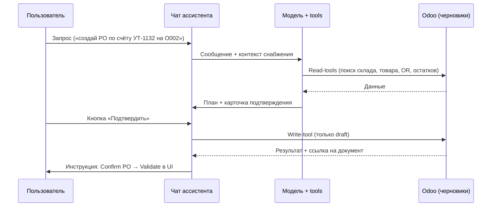
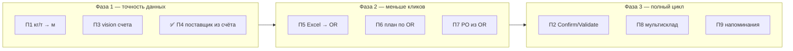

# AI-ассистент Odoo — руководство пользователя (черновик)

**Версия:** 0.3
**Дата:** 2026-08-11
**Аудитория:** конечные пользователи Odoo (прорабы, снабженцы, кладовщики, администраторы)
**Модуль:** `ai_assistant` (Odoo 19)

> Это черновик. Технические детали реализации — в [`roadmap_ai_assistant_v3_actions.md`](roadmap_ai_assistant_v3_actions.md), [`instruction-warehouse-supply-cycle.md`](instruction-warehouse-supply-cycle.md), [`pilot_results_v3.md`](pilot_results_v3.md).

---

## Как открыть ассистента

1. В правом нижнем углу интерфейса Odoo нажмите кнопку чата.
2. Введите вопрос или выберите одну из подсказок (например: «Как пользоваться этим разделом?», «Какие возможности есть в этом модуле?»).
3. История сообщений хранится **только в текущей сессии браузера** — после закрытия вкладки диалог не сохраняется.

**Важно:** для сценариев снабжения (создание документов, загрузка счетов) нужны права группы **«AI Assistant / Снабжение»** и включённый администратором режим **actions**. Без этого ассистент работает только как консультант.

---

# Блок 1. Краткий перечень функций и возможностей

## Режим консультанта (доступен всем пользователям с включённым ассистентом)

- Ответы на вопросы по интерфейсу Odoo 19 на русском языке.
- Пошаговые инструкции: где нажать, что заполнить, какой раздел открыть.
- Учёт открытого экрана: ассистент знает, в каком модуле вы находитесь.
- Анализ экрана по запросу (скриншот): «что я вижу», «помоги с тем, что открыто».
- Навигационные ссылки: кликабельные переходы в нужные разделы Odoo.
- Терминология Odoo 19: «Новое» вместо «Создать», нет кнопок «Сохранить» и «Редактировать».
- Подсказки по модулям: склад, закупки, CRM, контакты, требования прорабов и др.

## Режим снабжения (actions) — для группы «AI Assistant / Снабжение»

### Поиск и анализ (без подтверждения)

- Поиск товаров по наименованию (нормализованный поиск).
- Просмотр карточки товара: единица измерения, «на складе», категория.
- Поиск остатков на складах (`stock.quant`).
- Поиск склада по коду (`O001`, `O002`, `Ос.ск`) или по адресу/названию («Хмельницкого», «Ломоносова»).
- Поиск поставщика по ИНН (приоритет) или названию; при загруженном счёте — всегда по ИНН из счёта.
- Поиск и чтение требований прораба (`object.request`).

### Создание черновиков (только после кнопки подтверждения в чате)

- Черновик требования прораба (OR).
- Черновик заказа поставщику (PO) с привязкой к OR и номеру счёта.
- Черновик внутреннего перемещения (с базы на объект).
- Черновик карточки поставщика из счёта, если ИНН не найден в базе.
- Черновик карточки товара (если позиция из счёта не найдена в номенклатуре).
- Заметка в журнале документа (chatter) о действии ассистента.

### Работа со счётом поставщика

- Загрузка PDF или Excel счёта прямо в чат (кнопка-скрепка).
- Извлечение поставщика, номера счёта, позиций, цен и сумм.
- Пошаговый сценарий: сначала поставщик → затем карточки товаров → затем заказ поставщику.
- Подсказки-кнопки (chips) для быстрых действий в диалоге.

### Пополнение товара через чат

Для пользователя группы «AI Assistant / Снабжение» можно написать, например:

> Пополни отвод Ду50, 100 штук, поставщик Башняк, на основной склад.

Ассистент извлекает из фразы только текстовые параметры, после чего код Odoo
проверяет товар, единицу измерения, остаток, применимые цены поставщиков и склад.
Если найдено несколько вариантов, чат показывает кнопки выбора. Перед созданием
заказа всегда показывается итоговый план с запрошенным и фактическим количеством
в закупочной единице измерения.

После кнопки «Выполнить» создаётся только черновик заказа поставщику. В карточке
результата доступны действия «Отправить запрос», «Подтвердить заказ», «Печать» и
«Отменить». Они работают только для заказа, созданного этой сессией чата, и
повторно проверяют права и состояние заказа на сервере.

### Перемещение товара между складами через чат

Можно сформулировать запрос целиком, например:

> Перемести 20 шт пены противопожарной с Основного склада на O002.

Ассистент последовательно проверит товар, количество и единицу измерения,
склад-источник, доступный незарезервированный остаток и склад назначения. Если
точного совпадения нет, он не угадывает: найденные товары или склады появляются
как кнопки выбора. Источник и назначение не могут совпадать.

Диалог ориентирован на кнопки. В каждом ответе есть краткое пояснение и варианты
следующего шага: выбрать вариант, изменить уже введённое поле или отменить
сценарий. Необязательно подбирать произвольную фразу для исправления — нажмите
«Изменить товар», «Изменить количество», «Другой склад» и затем ответьте на
новый вопрос. Если сообщение не относится к текущему шагу, данные не меняются,
а ассистент повторяет вопрос и доступные кнопки.

Если доступного остатка недостаточно, документ не создаётся: чат показывает
недостачу и предлагает изменить товар, количество или источник. Перед записью
появляется итоговый план. Только кнопка **«Создать перемещение»** создаёт один
черновик внутреннего перемещения; текстовые «да», «создавай» или
«подтверждаю» эту кнопку не заменяют.

После создания доступны кнопки «Зарезервировать», «Открыть», «Печать» и
«Отменить», если текущее состояние документа допускает действие. Чтобы указать
фактическое количество, партии или серийные номера и изменить остатки, откройте
перемещение и нажмите стандартную кнопку **«Провести» (Validate)** в Odoo.

## Чего ассистент не делает (ограничения безопасности)

- Не подтверждает произвольные заказы поставщику. Confirm доступен только по
  явной кнопке результата для PO, созданного текущей сессией пополнения.
- Не проводит приходы и перемещения (**Validate**), кроме явной кнопки
  **«Провести приёмку?»** в сценарии загрузки счёта.
- Не создаёт платежи. Черновик **счёта поставщика** создаётся только если в
  сценарии загрузки счёта нажать **«Привязать счёт?» → Да** и затем **«Выполнить»**.
  Оплата по-прежнему в **1С**.
- Не использует инвентаризацию для «прихода» товара.
- Не меняет пользователей, права доступа и настройки системы.
- Не выполняет действия без явного нажатия кнопки подтверждения в чате.

## Для администратора

- Включение/выключение ассистента и режима actions.
- Настройка моделей OpenRouter (текст / vision).
- Просмотр журнала аудита действий ассистента (admin-only).

---

# Блок 2. Расширенное описание

## 2.1. Режим консультанта

### Назначение

Ассистент помогает разобраться в Odoo 19: объясняет возможности модулей, подсказывает последовательность действий, не изменяя данные в системе.

### Как это работает

1. Вы пишете вопрос в чат.
2. Frontend передаёт на сервер текст, историю диалога и **контекст экрана** (какой модуль/форма открыта).
3. Сервер подбирает фрагменты из базы знаний: официальная документация Odoo 19, контекст ваших кастомных модулей (`object.request`, снабжение), словарь терминов EN→RU.
4. Запрос уходит в языковую модель (OpenRouter). Ответ проходит фильтр безопасности.
5. Вы получаете короткую пошаговую инструкцию.

### Анализ экрана (vision)

Если в вопросе есть фразы вроде «у меня на экране», «смотри на экран», «что я вижу» — ассистент делает скриншот текущей страницы (виджет чата на снимке не попадает) и отправляет изображение в vision-модель. Это удобно, когда сложно описать, на какой кнопке вы застряли.

### Навигационные ссылки

На вопросы «где найти заказы поставщикам?», «как открыть требования прорабов?» ассистент возвращает **рабочую ссылку** на нужный экран Odoo, а не только текстовый путь по меню. Ссылки формируются из внутреннего каталога разделов (22+ тем).

### Связь с Odoo

| Что использует ассистент | Зачем |
|--------------------------|-------|
| Контекст открытой формы | Понять, о каком модуле идёт речь |
| `static/knowledge/docs/*.md` | Официальные инструкции по модулям |
| `term_mapping.json` | Правильные русские названия кнопок и меню |
| `supply_cycle_context.md` | Бизнес-процесс снабжения вашей компании |

### Примеры вопросов

- «Как создать новое требование прораба?»
- «Где посмотреть остатки на складе O002?»
- «Какие возможности есть в этом модуле?» (подсказка в чате)
- «Помоги с тем, что открыто на экране»

---

## 2.2. Режим снабжения (actions)

### Когда включается

Одновременно должны выполняться условия:

1. Администратор включил **«Включить actions»** в настройках AI-консультанта.
2. Ваш пользователь входит в группу **«AI Assistant / Снабжение»** (наследует права закупок и склада, но не права администратора Odoo).

Если actions выключен или нет группы — ассистент отвечает только как консультант.

### Общий алгоритм действия

**Ключевое правило:** ассистент готовит **черновики**. Проведение документов — ваша задача в стандартном интерфейсе Odoo.

### Целевой бизнес-процесс (связь с Odoo)

Компания работает по циклу:

**Требование прораба (OR) → закупка (PO) или перемещение с базы (INT) → проведение прихода → остатки на объекте**

| Этап | Документ Odoo | Кто делает | Роль ассистента |
|------|---------------|------------|-----------------|
| 1. Потребность | `object.request` | Прораб | Может создать черновик OR |
| 2. Разбор | строки OR, остатки | Снабженец | Ищет остатки, подсказывает «с базы / закупка» |
| 3a. С базы | `stock.picking` (internal) | Снабженец | Может создать черновик перемещения |
| 3b. Закупка | `purchase.order` | Снабженец | Может создать черновик PO |
| 4. Подтверждение PO | `purchase.order` | Снабженец в UI | **Только вручную** (Confirm) |
| 5. Приход | `stock.picking` (incoming) | Снабженец в UI | **Только вручную** (Validate) |
| 6. Оплата | — | Бухгалтерия в **1С** | Ассистент не работает с оплатой |

### Склады объектов

| Объект | Код | Для закупки (PO) | Для перемещения с базы |
|--------|-----|------------------|------------------------|
| Ломоносова 164 | `O001` | тип «O001: Поступления» | тип «O001: Внутренние переводы» |
| Б. Хмельницкого, 112 | `O002` | тип «O002: Поступления» | тип «O002: Внутренние переводы» |

Ассистент понимает поиск по коду, адресу и устаревшим псевдонимам (`ОбМ-2` → `O001`, `ОбМ-4` → `O002`). В новых документах используйте коды `O001` / `O002`.

---

## 2.3. Инструменты поиска (read-tools)

Выполняются автоматически, подтверждение не требуется.

| Инструмент | Что ищет в Odoo | Типичный сценарий |
|------------|-----------------|-------------------|
| `search_products` | `product.product` | «Найди трубу ВГП 20×2,8» |
| `find_product_by_id` | карточка товара | Детали после поиска: UoM, «на складе» |
| `search_stock_quants` | `stock.quant` | «Сколько метров на O002?» |
| `find_warehouse` | `stock.warehouse` | «Склад Хмельницкого» → `O002` |
| `find_picking_type` | `stock.picking.type` | Тип прихода или внутреннего перемещения |
| `find_partner` | `res.partner` | Контрагент по ИНН или названию; при активном счёте — автоматически по ИНН из счёта |
| `find_object_request` | `object.request` | OR по номеру или проекту |
| `read_object_request` | OR + строки | Полный разбор требования |
| `get_navigation_link` | каталог разделов | Ссылка «открой заказы поставщикам» |

**Ограничение:** поиск товаров и остатков учитывает **ваши права доступа** — вы видите только то, что разрешено вашей роли в Odoo.

---

## 2.4. Инструменты создания (write-tools)

Всегда требуют **кнопку подтверждения** в чате. Одно сообщение — не более одной write-операции без повторного подтверждения.

| Инструмент | Создаёт | Условия |
|------------|---------|---------|
| `create_object_request_draft` | OR в статусе `draft` | Проект, срок, ≥1 строка |
| `update_object_request_line` | строка OR | OR в `draft` или `in_progress` |
| `create_purchase_order_draft` | PO в `draft` | Поставщик, тип прихода склада, `origin`, `partner_ref`, строки |
| `add_purchase_order_line` | строка PO | PO только в `draft` |
| `create_internal_picking_draft` | внутреннее перемещение | Из базы → на объект |
| `add_picking_move` | строка перемещения | Picking в допустимом статусе |
| `create_partner_draft` | карточку контрагента | Только новый контрагент, ИНН и категория обязательны |
| `update_partner_draft` | существующего контрагента | Заполняет только пустые поля, ИНН не меняет |
| `add_partner_bank_draft` | банковские реквизиты | БИК 9 цифр, счёт 20 цифр, без сырого `bank_ids` |
| `add_partner_contact_draft` | контактное лицо | Дочерний контакт, защита от дубля по имени |
| `create_product_draft` | черновик товара | Для позиций счёта без совпадения в номенклатуре |
| `post_chatter_note` | заметка в chatter | На разрешённых документах |

После создания ассистент записывает в chatter пометку: кто подтвердил, что создано, откуда взяты данные.

### Контрагенты через чат

Для команды «добавь контрагента …» ассистент сначала ищет дубликат по ИНН.
Без ИНН карточка не создаётся. Если категория не указана, чат покажет варианты:
**Поставщик**, **Заказчик**, **Покупатель**, **Подрядчик**.

Если контрагент уже найден, ассистент предложит безопасное обновление:
заполняются только пустые поля, заполненные поля попадают в список
«Пропущено». Банковские реквизиты и контактные лица добавляются отдельными
подтверждаемыми действиями.

### Алгоритм создания PO по счёту (пример УТ-1132)

1. **Найти OR** — `origin` в PO = номер требования.
2. **Найти склад** — `find_warehouse("O002")` или по адресу; взять `in_type_id` (тип «Поступления»).
3. **Найти поставщика** — по ИНН из счёта; проверить, что это поставщик (`supplier_rank > 0`).
4. **Сопоставить товары** — поиск по наименованию; для труб проверить UoM «метр» и `is_storable = true`.
5. **Показать план** — позиции, количества в метрах, итог; карточка подтверждения.
6. **После подтверждения** — `create_purchase_order_draft`: `partner_ref = УТ-1132`, строки в метрах.
7. **Ваши шаги в UI** — открыть PO → **Подтвердить заказ** → принять товар → **Провести** приход.

> Остатки (`stock.quant`) появляются **только после Validate** в интерфейсе Odoo. Прямая смена статуса документа без Validate остатков не создаёт.

### Алгоритм внутреннего перемещения в управляемом диалоге

1. Напишите, какой товар, количество, источник и назначение нужны.
2. Выберите кнопкой любой нечёткий или неоднозначный вариант.
3. Проверьте доступный остаток и итоговый план.
4. Нажмите **«Создать перемещение»** — будет создан только черновик.
5. При необходимости нажмите **«Зарезервировать»**.
6. Откройте picking, укажите факт и tracking-данные и выполните Validate в UI.

Origin создаётся самим workflow в формате «Перемещение (AI): источник →
назначение»; произвольный текст пользователя в это поле не переносится.

---

## 2.5. Сценарий «Счёт → склад»

### Загрузка файла

1. Нажмите **скрепку** в чате.
2. Выберите PDF (до 5 МБ). Excel — в разработке.
3. Ассистент извлекает: поставщик (ИНН, название, адрес, КПП), номер счёта, дату, позиции, цены, итог.
4. Сразу в ответе отображается **статус поставщика** — одно из трёх:

| Статус | Что означает |
|--------|--------------|
| ✅ Поставщик найден в Odoo: «Название» (id N) | ИНН из счёта совпал — карточку создавать не нужно |
| Chip «Создать поставщика: …» | ИНН распознан, но в базе не найден — нужно подтверждение |
| ⚠ ИНН не распознан | Создать автоматически нельзя — введите ИНН вручную |

> **Почему поиск по ИНН, а не по названию:** одно и то же юрлицо может храниться в базе с другим написанием кавычек, сокращений, пробелов. ИНН — однозначный ключ.

### Пошаговый workflow (важно)

Ассистент следует **жёсткому порядку**:

1. **Шаг A — поставщик.** Если поставщик **не найден** (ИНН есть в счёте, но нет в базе) — ассистент показывает chip «Создать поставщика…» и карточку подтверждения `create_partner_draft`. Если поставщик **найден** — этот шаг пропускается автоматически (в summary видно ✅).
2. **Шаг B — товары:** для каждой позиции без совпадения в номенклатуре — карточка `create_product_draft` (с ценой из счёта). Подтверждайте по одной через chips.
3. **Шаг C — заказ:** когда поставщик и все позиции готовы — план PO. Ассистент **уточнит склад/объект** (не подставляет склад по умолчанию).
4. **Шаг D — ваши действия в UI:** Confirm PO → Validate Receipt.

Для поставщика ассистент переносит в карточку только безопасные реквизиты: название, ИНН, адрес и КПП в комментарий. Банковские счета в v1 не создаются.

### Связь с 1С

Оплата и банк ведутся в **1С**. В сценарии загрузки счёта, если ответить **«Да»**
на **«Привязать счёт?»**, ассистент дополнительно создаёт **черновик** vendor bill
в Odoo и прикрепляет PDF:

- **Бухгалтерия → Поставщики → Счета** — открыть bill, PDF во вложениях/чаттере;
- в PO: **«Ссылка поставщика»** (`partner_ref`) = номер счёта;
- факт оплаты в Odoo **не регистрируется**.

### Пересчёт труб (кг / тонны → метры)

Поставщики часто выставляют счета в **кг** или **тоннах**, а склад учитывает **метры**.

Ассистент считает пересчёт по коэффициенту **кг/м**, показывает формулу в плане и записывает в строки только **подтверждённые метры**:

- штуки хлыстов: `шт × длина_хлыста`;
- килограммы: `кг ÷ кг_на_метр`;
- тонны: `т × 1000 ÷ кг_на_метр`.

Пример (счёт УТ-1132): итого **1098 м** по всем позициям труб.

---

## 2.6. Карточки подтверждения и результатов

| Тип карточки | Когда появляется | Действия пользователя |
|--------------|------------------|------------------------|
| **Confirmation** | Перед созданием/изменением документа | «Подтвердить» / «Отменить» |
| **Result** | После успешного создания черновика | Ссылка на документ + подсказка «что делать дальше в UI» |

Текстовое «да» в чате **не заменяет** кнопку подтверждения — это сделано для безопасности.

---

## 2.7. Ограничения и типичные ошибки

| Ситуация | Почему | Что делать |
|----------|--------|------------|
| «Документ done, остатков нет» | Попытка провести без Validate | Открыть picking в UI → **Провести** |
| Товар не «на складе» | `is_storable = false` | Включить «На складе» в карточке товара |
| Закупка на «Офис» вместо объекта | Неверный `picking_type_id` | Указать склад `O001`/`O002` в запросе |
| Ассистент не создаёт PO | Нет группы Supply / actions выключен | Обратиться к администратору |
| Счёт-скан, мало текста | PDF без текстового слоя | Попросить PDF с текстом или ввести данные вручную (vision-fallback — в планах) |
| Слишком много действий подряд | Лимит 5 write-операций в минуту | Подождать или подтверждать пакетами |
| После upload «поставщик не найден», хотя он есть | Поиск шёл по названию с разными кавычками | Начиная с v0.2 поиск идёт по ИНН — проблема устранена |
| ⚠ «ИНН не распознан» | PDF с нестандартной разметкой шапки | Создайте контрагента вручную или проверьте качество PDF |

---

## 2.8. Настройки (для администратора)

Путь: **Настройки → AI-консультант** (или аналогичный раздел модуля).

| Параметр | Назначение |
|----------|------------|
| Включить AI-ассистент | Глобальный выключатель виджета |
| Включить actions | Режим снабжения (по умолчанию выключен) |
| Включить перемещения через чат | Отдельно разрешает moving workflow; по умолчанию выключен |
| OpenRouter API Key | Ключ для языковой модели |
| Модель (текст) | Для обычных вопросов |
| Модель (скриншот/vision) | Для анализа экрана |
| Кастомный системный промпт | Опционально, для тонкой настройки |
| Debug-логирование | Для диагностики (не для prod) |

Журнал **AI Assistant Audit** доступен только администраторам Odoo.

---

# Блок 3. План перспективных функций

План основан на рабочих процессах компании, техническом долге ([`technical-debt.md`](technical-debt.md)) и незакрытых задачах в roadmaps.

## 3.1. Приоритет «высокий» — закрытие цикла снабжения

| # | Функция | Бизнес-ценность | Зависимости |
|---|---------|-----------------|-------------|
| П1 | **Автопересчёт кг/т → метры** в строках PO и прихода | Меньше ошибок на счетах металлопроката; единая UoM для труб | TD-002: унификация «метр»/«m», поле «кг/м» на товаре |
| П2 | **Подтверждение PO и Validate прихода** через контролируемый API | Полный цикл OR→остатки без ручных кликов на каждом шаге | TD-003: `button_confirm` / `button_validate` с проверкой прав; согласование с безопасностью |
| П3 | **Vision-fallback для счетов-сканов** | PDF без текстового слоя (сканы) — извлечение позиций через vision-модель | Уже есть OpenRouter vision; порт промпта из invoice-extractor |

## 3.2. Приоритет «средний» — ускорение работы прораба и снабженца

| # | Функция | Бизнес-ценность | Связь с процессом |
|---|---------|-----------------|-------------------|
| П5 | **Импорт Excel в OR из чата** | Прораб загружает спецификацию (форматы УУТЭ и wizard) без перехода в форму OR | Готовый гибкий парсер в `object.request.import.wizard` (WIZV2) — обёртка для ассистента |
| П6 | **Сводный план по OR: «с базы / закупка»** | Одним запросом: остатки по всем строкам OR + рекомендация PO/INT | `read_object_request` + `search_stock_quants` + отчёт в чате |
| П7 | **Создание PO из OR одной командой** | Кнопка «закупить дефицит по OR/2026/05/0007» | Связка `qty_to_buy`, `preferred_vendor_id`, `project.warehouse_id` |
| П8 | **Мультискладской расчёт остатков** | Сумма остатков по нескольким базам при решении «есть на складе» | Аналог wizard «Рассчитать наличие» в `object_request` |
| П9 | **Напоминания о незавершённых шагах** | «PO создан, но не подтверждён 2 дня» | Chatter + scheduled action или digest в чате |
| П10 | **Расширение каталога навигации** | Ссылки на кастомные экраны: wizard сопоставления, импорт Excel, отчёты OR | `NAVIGATION_CATALOG` + `navigation_map.md` |

## 3.3. Приоритет «низкий / качество жизни»

| # | Функция | Описание |
|---|---------|----------|
| П11 | **История чата в БД** | Сохранение диалогов для аудита и повторного разбора спорных сценариев |
| П12 | **Голосовой ввод** | Для прорабов на объекте (было в «не входит в v1», остаётся перспективой) |
| П13 | **Персональные подсказки по роли** | Прораб видит chips про OR; снабженец — про PO и счета |
| П14 | **Интеграция с 1С (read-only)** | Статус оплаты счёта в подсказке ассистента без дублирования vendor bill в Odoo |
| П15 | **Обучение на типовых счетах поставщиков** | Шаблоны парсинга для «ПроМеталл», «Теплосервис» и др. |
| П16 | **Поиск заголовка Excel не в первой строке** | Устойчивость импорта спецификаций со служебными строками (риск из WIZV2) |

## 3.4. Рекомендуемая очерёдность внедрения

### Критерии готовности «перспективы → продакшен»

Для каждой функции из блока 3 перед включением на prod:

- [ ] Описан сценарий в этом руководстве (блок 1 + 2).
- [ ] Есть тест E2E на реальном кейсе (УТ-1132, НФ-504 или аналог).
- [ ] Проверены права группы Supply и denylist (ассистент не обходит запреты).
- [ ] Обновлены [`instruction-warehouse-supply-cycle.md`](instruction-warehouse-supply-cycle.md) и [`changelog.md`](changelog.md).

---

## Связанные документы

| Документ | Содержание |
|----------|------------|
| [`instruction-warehouse-supply-cycle.md`](instruction-warehouse-supply-cycle.md) | Полный цикл снабжения, роли, матрица MCP/API |
| [`roadmap_ai_assistant_v3_actions.md`](roadmap_ai_assistant_v3_actions.md) | Технический контракт tools |
| [`roadmap_ai_assistant_v3_invoice.md`](roadmap_ai_assistant_v3_invoice.md) | Сценарий счёт → склад |
| [`pilot_results_v3.md`](pilot_results_v3.md) | Результаты приёмочных тестов |
| [`technical-debt.md`](technical-debt.md) | TD-002, TD-003 и др. |

---

---

### История версий

| Версия | Дата | Изменения |
|--------|------|-----------|
| 0.1 | 2026-06-11 | Первый черновик: консультант, actions, счёт → склад, create_partner_draft (CPP v1) |
| 0.2 | 2026-06-13 | Upload summary теперь показывает статус поставщика (✅/chip/⚠); поиск контрагента из счёта — по ИНН; промпт обновлён; П4 закрыт |

*Перед публикацией для пользователей рекомендуется согласование с отделом снабжения и ревью администратором Odoo.*
