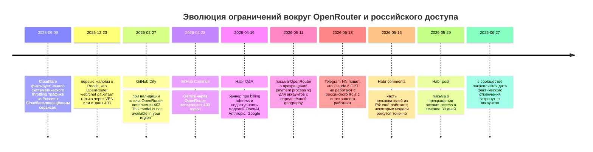

# Почему OpenRouter ограничивает доступ с российских VPS и российских аккаунтов

## Краткое резюме

По совокупности публичных данных наиболее сильная гипотеза выглядит так: проблема связана **не с точечным “выпиливанием” конкретных IP-диапазонов российских VPS-провайдеров как самостоятельной целью**, а с **комбинацией географических ограничений upstream-провайдеров моделей, биллингового комплаенса OpenRouter и передачи/оценки страны происхождения запроса**. Это прямо поддерживается Terms of Service OpenRouter: сервис пишет, что некоторые model providers не авторизуют пользователей из отдельных стран и регионов, OpenRouter не разрешает доступ к таким “Restricted Models” через свой сервис, запрещает обход через VPN/proxy и отдельно оговаривает, что старается передавать моделям страну происхождения API-запроса. В публичных коммитах и changelog’ах OpenRouter, которые прямо говорили бы: “мы блокируем IP российских VPS-провайдеров”, найти не удалось; официальный публичный след гораздо сильнее указывает именно на **географию аккаунта/запроса и модельные ограничения**, а не на списки ASN российских хостеров. citeturn42view0turn42view2turn42view3turn12view1turn17view2

Русскоязычные обсуждения показывают эволюцию ограничений по этапам. В апреле 2026 пользователи уже видели баннер уровня биллинга: “Your billing address is in a region that does not have access to models from OpenAI, Anthropic, and Google.” В мае пошли письма про остановку платежей для аккаунтов, связанных с определённой “geography”, а к концу мая появились письма уже о прекращении самого доступа к OpenRouter в течение 30 дней. На 27 июня 2026 в сообществе циркулировали уведомления о фактическом завершении доступа для затронутых аккаунтов. При этом часть пользователей сообщала о смешанной картине: какие-то модели работали, какие-то давали `403 This model is not available in your region`, а у части аккаунтов из РФ письма и ограничения вообще не появлялись. Это хорошо согласуется с моделью **не тотального блока всего трафика из России**, а **многослойной фильтрации** по аккаунту, биллингу, модели и происхождению запроса. citeturn36view0turn22view0turn22view1turn23view0turn20view0turn20view3

Технические индикаторы тоже указывают на уровень приложения, а не только на сеть. В GitHub-логах сторонних клиентов и плагинов зафиксированы ошибки `403` с текстом `This model is not available in your region.` Для Dify это проявлялось даже на этапе валидации ключа OpenRouter, для Continue — при вызове Gemini через OpenRouter, для других клиентов — при использовании GPT/Gemini даже с VPN. Одновременно есть независимый российский сетевой контекст: Роскомнадзор официально ведёт исключения по IP для VPN/частных сетей, а Cloudflare публично сообщал, что российские провайдеры с июня 2025 систематически режут трафик к Cloudflare-защищённым сервисам примерно до первых 16 KB. Это может усиливать нестабильность доступа из России, но **не объясняет специфические тексты 403 “region” и письма от OpenRouter про geography**. Поэтому сетевой фактор выглядит **вторичным/сопутствующим**, а не основным. citeturn37view0turn37view1turn37view3turn32view0turn38search13turn33search0

Практический вывод для бизнеса и инфраструктуры такой: если у вас есть проекты на OpenRouter, нельзя строить их так, будто российский VPS или российская география — это стабильная, гарантированно поддерживаемая транспортная среда. Нужны резервные маршруты, fallback на альтернативные агрегаторы или прямые провайдеры, отделение критических workflows от геочувствительных моделей и юридическая проверка того, что выбранный способ доступа соответствует Terms of Service и режиму санкционного/экспортного комплаенса. Попытки обхода через “чистый VPN”, новые аккаунты и скрытие географии пользователя встречаются в сообществах, но сам OpenRouter прямо запрещает использовать VPN/proxy для доступа к Restricted Models, а ложная идентичность и обход лимитов тоже запрещены. Это создаёт реальный риск мгновенной блокировки, потери операций и споров по возврату средств. citeturn42view2turn42view3turn23view0turn28search1

## Картина по сообществам

В русскоязычном сообществе картина складывается из нескольких разных фаз. Самая ранняя зафиксированная стадия — это жалобы на то, что веб-чат OpenRouter в декабре 2025 начинает работать только через VPN или отдаёт `403`, причём часть пользователей из соседних регионов России утверждала, что у них всё ещё работает, а часть — что проблема проявляется и с VPN. Это выглядело как первый признак неравномерной, не тотальной фильтрации. citeturn20view1

К апрелю 2026 русскоязычные пользователи уже публично цитировали баннер OpenRouter о том, что биллинговый адрес находится в регионе без доступа к моделям OpenAI, Anthropic и Google, тогда как “all other models remain available”. Это важный маркер: на этом этапе речь шла не о полном бане OpenRouter, а о **частичном отрезании топовых американских моделей** по критерию региона/биллинга. Комментарии к этому баннеру почти единодушно трактовали проблему как биллинговую, а не как чисто сетевую. citeturn36view0

Затем, 11–12 мая 2026, пользователи из РФ стали получать письмо с темой **“Important Update About Your OpenRouter Account Access”**. По пересказу и цитатам письма на Habr, OpenRouter писал, что не поддерживает usage, billing и payment methods, связанные с “your geography”, и поэтому больше не будет обрабатывать платежи для таких аккаунтов. При этом доступ к API с уже купленными кредитами ещё сохранялся, а речь шла прежде всего об остановке пополнения и временном окне для refund. Это было заметное ужесточение, но ещё не окончательное отключение. citeturn22view0turn20view2

Следующий слой — наблюдения, что ограничения затрагивают пользователей неравномерно. В комментариях на Habr пользователи писали, что обходят проблему “чистым VPN”, криптооплатой и отсутствием российских IP при логине, но другие сообщали, что у них пополнение ещё доступно, а ограничены только модели части провайдеров. Есть и особенно важный комментарий от пользователя, который утверждает, что активно использует OpenRouter API из РФ, не получал письма и платил накануне, но при бесплатной Gemma получает сообщение о региональных ограничениях, тогда как платная Gemini у него работает. Это сильный эмпирический аргумент в пользу **селективных, модельно-зависимых ограничений**, а не простого “баним весь трафик с российских VPS”. citeturn23view0

К концу мая 2026 в Habr появился уже другой уровень уведомления: **“OpenRouter does not support account access from your geography. Your access to OpenRouter will end within the next 30 days.”** На Reddit в июне фигурировали сообщения, что друзьям из России/Беларуси приходят письма о прекращении API-доступа после 27 июня “because of geography”. А в русскоязычном Telegram-канале NN 13 мая утверждалось, что при попытке отправить сообщение в Claude Opus и GPT с российского IP пользователи получают ошибку, тогда как с иностранным IP всё работает. В сумме это похоже на переход от ограничения отдельных моделей и платежей к **полноценному отключению части аккаунтов/географий**. citeturn22view1turn20view0turn25view0

### Репрезентативные сообщения сообщества

| Площадка | Дата | Репрезентативная формулировка | Что это показывает | Ссылка |
|---|---|---|---|---|
| Reddit r/openrouter | 23 декабря 2025 | «ошибка… исправляется через VPN» citeturn20view1 | Ранние жалобы на 403/недоступность без VPN; поведение неравномерное | citeturn20view1 |
| Habr Q&A | 16 апреля 2026 | “billing address is in a region…” citeturn36view0 | Ограничение сначала выглядело как биллингово-региональное и касалось OpenAI/Anthropic/Google | citeturn36view0 |
| Habr news | 12 мая 2026 | “does not support usage, billing…” citeturn22view0 | Официальное письмо о прекращении обработки платежей по geography | citeturn22view0 |
| Habr comments | 12–16 мая 2026 | «не заходить с российских IP»; «платная gemini — всё ок» citeturn23view0 | Сообщество видит селективные ограничения; часть моделей и аккаунтов ещё работает | citeturn23view0 |
| Telegram NN | 13 мая 2026 | «с российского IP появляется ошибка» citeturn25view0 | Русскоязычная проверка связывает отказ с российским IP | citeturn25view0 |
| Habr post | 29 мая 2026 | “does not support account access…” citeturn22view1 | Переход от блокировки платежей к предупреждению о прекращении доступа | citeturn22view1 |
| Reddit r/openrouter | июнь 2026 | “api access will stop after june 27 because of geography” citeturn20view0 | В сообществе закрепляется дедлайн 27 июня для затронутых аккаунтов | citeturn20view0 |

По VK публичных индексируемых материалов именно с техническими деталями про OpenRouter и российские VPS в ходе этого исследования не обнаружилось; поэтому для этой площадки корректный статус — **не указано**.

## Официальные сигналы OpenRouter

Самое сильное официальное доказательство находится в Terms of Service OpenRouter. В разделе о model restrictions сервис пишет, что некоторые model providers не авторизуют пользователей из отдельных стран и регионов, что такие модели считаются “Restricted Models”, и что пользователь **“may not access these Restricted Models through our Service”**. Там же прямо сказано, что нельзя использовать сервис для доступа к Restricted Models через VPN и proxies, а обход защит OpenRouter или провайдеров является материальным нарушением Terms. Это уже не косвенный намёк, а прямой контрактный каркас для геоблокировки. citeturn42view0turn42view2

Есть и ещё более важное официальное уточнение: OpenRouter отдельно пишет про **Location of Originating Requests**, то есть обещает стараться корректно передавать моделям страну происхождения API-запроса. Одновременно OpenRouter признаёт, что из-за ограничений технологии такая передача страны происхождения может быть неточной и это может повлиять на возможность использования сервиса. Это очень хорошо объясняет, почему в сообществе видна “рваная” симптоматика: у одних аккаунтов/клиентов/маршрутов срабатывает блокировка, у других — нет, хотя все они “из России”. citeturn42view3

В официальной документации OpenRouter есть и другие признаки того, что география — не побочный параметр, а штатная часть маршрутизации и политики. В SDK и analytics schema фигурирует поле `country` как измерение аналитики запросов; в API моделей есть фильтр по `region`; документация по `ListForUser` прямо говорит, что через `eu.openrouter.ai` результаты фильтруются по требованиям **EU in-region routing**; а блог OpenRouter про data residency формулирует это как “you set geography and data policy once and let the layer pick only providers that qualify.” Иначе говоря, у OpenRouter в архитектуре уже встроено понятие **географически квалифицированного доступа**. citeturn12view1turn12view0turn17view2turn21search4

Ошибки и отказы в официальной документации тоже описаны так, что подходят под эту картину. Документация OpenRouter говорит, что `403` — это `Forbidden`, а для не-500 ошибок может пробрасываться provider-side код, а также даёт метаданные маршрутизации. Параллельно OpenRouter публично поддерживает appeal flow для `403 author banned` — это отражено в цитируемом обсуждении с отсылкой к их Discord: компания писала, что это “not a ban on using OpenRouter”, а пользователям с ошибкой `403 author banned` предлагалось подавать апелляцию, если они не нарушали Terms of Service провайдера модели. Это не отменяет факт ограничений, но важно для аналитики: сам OpenRouter интерпретировал часть 403 как **политику доступа по провайдерским/терминальным правилам**, а не как инфраструктурную аварию. citeturn17view0turn28search0turn28search1

### Что именно подтверждено официально, а что нет

| Статус | Официальный сигнал | Что из него следует |
|---|---|---|
| Подтверждено | OpenRouter запрещает доступ к “Restricted Models” по странам/регионам и запрещает обход через VPN/proxy. citeturn42view0turn42view2 | Геоблокировка как механизм существует и закреплена в ToS |
| Подтверждено | OpenRouter старается передавать моделям страну происхождения API-запроса. citeturn42view3 | Российский VPS/IP может сам по себе быть сигналом для отказа модели |
| Подтверждено | В документации и SDK есть `country` и `region`; доступный набор моделей может фильтроваться по региону. citeturn12view1turn12view0turn17view2 | География встроена в продуктовую и API-архитектуру |
| Подтверждено | Для `403 author banned` OpenRouter публично предлагал апелляцию и отрицал, что это “бан на весь OpenRouter”. citeturn28search0turn28search1 | Часть отказов — селективные policy-enforcement решения |
| Не подтверждено публично | Прямой официальный changelog/commit “мы блокируем российские VPS ranges” | Публичного списка ASN/IP-диапазонов российских хостеров не найдено |
| Не подтверждено публично | Прямая официальная формулировка “мы уходим из России из‑за санкций OFAC” | Публичный след указывает скорее на модельно-провайдерский и биллинговый комплаенс |

## Технические индикаторы

Самый убедительный технический индикатор — это **повторяющийся текст ошибки на уровне приложений и плагинов**. В issue Dify Official Plugins от 27 февраля 2026 лог содержит буквально: `Credentials validation failed with status code 403 ... "This model is not available in your region."` При этом сбой возникает уже на этапе проверки ключа OpenRouter внутри стороннего плагина. Это показывает, что региональная недоступность проявляется как формализованный API-ответ, а не как просто packet loss или TCP timeout. citeturn37view0

То же повторяется в Continue: issue от 28 февраля 2026 по модели Gemini 2.5 Flash через OpenRouter фиксирует `Status Code: 403` и текст `This model is not available in your region.` Аналогичный паттерн есть и в других клиентах: issue в Opencode от 25 марта 2026 говорит, что даже с VPN на сингапурском узле OpenRouter при использовании Gemini и GPT возвращает `This model is not available in your region.` Это важно, потому что говорит о **многослойной проверке**: одних только “иностранных” exit-IP иногда недостаточно. citeturn37view1turn37view3

Есть и сообщения о косвенно совместимых симптомах. В LibreChat issue ноября 2025 пользователи видели `403 Provider returned error`, причём проблема затрагивала часть моделей, а другие модели на OpenRouter работали нормально. Такой лог хуже диагностирует причину, но хорошо ложится в общую картину: OpenRouter — это слой над поставщиками моделей, и часть 403 возвращается как policy/provider-layer deny, а не как отказ API-ключа вообще. citeturn37view2turn17view0

Русскоязычные сообщения добавляют важную деталь: ограничения выглядят **неодинаково на разных моделях и аккаунтах**. На Habr один пользователь сообщал, что из РФ активно использует OpenRouter API, не получал письмо, и у него платная Gemini работает, но бесплатная Gemma отдаёт ошибку про региональные ограничения. Это очень плохо согласуется с идеей “OpenRouter массово вычёркивает IP всех российских VPS”, зато отлично согласуется с идеей **разных правил у разных провайдеров/вариантов модели/биллинг-профилей**. citeturn23view0

Сетевой слой, однако, нельзя совсем игнорировать. Cloudflare официально сообщал, что с 9 июня 2025 российские провайдеры систематически режут доступ к Cloudflare-защищённым сервисам, ограничивая передачу данных примерно первыми 16 KB на соединение; в support-документации Cloudflare прямо сказано, что это **не ошибка конфигурации у клиента**, что у сервисов может падать трафик из России, а восстановить такую связность со стороны Cloudflare нельзя. Если какой-то segment инфраструктуры OpenRouter или связанного маршрута опирается на Cloudflare, это может добавлять timeouts, обрывы загрузки веб-интерфейса, нестабильность логина и “странные” симптомы из России. Но это всё равно не объясняет письма типа “does not support account access from your geography” и не заменяет application-level фильтрацию. citeturn33search0turn38search13turn38search2

## Вероятные причины

Наиболее вероятная причина — **комплаенс OpenRouter с правилами upstream-провайдеров моделей**. Это подкреплено прямыми формулировками ToS OpenRouter о Restricted Models, странах/регионах и запрете VPN/proxy-доступа к ним, а также разделом о передаче “country of your originating request” моделям. Дополнительно это согласуется с официальными материалами Anthropic: у компании есть список supported countries и отдельное объяснение, что ограничения продаж в unsupported regions продиктованы legal, regulatory, and security risks. Даже если OpenRouter публично не писал “Россия заблокирована по санкциям”, его ToS и модель upstream-провайдерских ограничений делают именно такой механизм наиболее вероятным. **Оценка: очень высокая вероятность.** citeturn42view0turn42view2turn42view3turn40search3turn40search11

Второй по силе фактор — **биллинг и платежный комплаенс**. Письмо от 11 мая 2026 и последующие обсуждения явно говорят сначала о прекращении payment processing, привязанного к geography аккаунта. Баннер про billing address в апреле 2026 тоже показывает, что именно биллинговый слой использовался как один из критериев отсева. Это объясняет, почему ограничения пришли не всем сразу, а затрагивали аккаунты с определёнными признаками: страна аккаунта, billing address, история платежей, способ регистрации. **Оценка: высокая вероятность.** citeturn36view0turn22view0turn20view2

Фактор **автоматического anti-abuse / anti-fraud / anti-resale enforcement** тоже правдоподобен, но как вторичный. OpenRouter запрещает ложную идентичность, множественные аккаунты в обход лимитов и reselling API access to Models; кроме того, были `403 author banned`, для которых OpenRouter поднимал отдельный апелляционный поток. Это хорошо объясняет часть индивидуальных банов и часть “странной” селективности по аккаунтам, особенно если пользователь использовал посредников, новые аккаунты и смешанные геопризнаки. Но это хуже объясняет массовые русскоязычные письма именно про geography. **Оценка: средняя вероятность как сопутствующая причина, а не основной драйвер.** citeturn42view3turn28search0turn28search1

Гипотеза **“это просто misconfiguration или баг клиента”** имеет ограниченную, но не нулевую силу. Есть issue, где региональная ошибка проявлялась через плагин на этапе валидации; кроме того, есть кейсы из внешних клиентов, где региональная ошибка могла быть связана с тем, какой именно model slug или какой plugin path использовался. То есть часть жалоб вполне может быть усилена ошибками интеграции. Но массовые письма от OpenRouter про geography и биллинг эта версия не покрывает. **Оценка: средне-низкая вероятность как главной причины, но заметная как объяснение части ложных срабатываний.** citeturn37view0turn37view1

Гипотеза **прямого давления регуляторов РФ на OpenRouter или блока именно российских VPS-IP со стороны OpenRouter по списку провайдеров** публично подтверждена слабее всего. Роскомнадзор действительно регулирует VPN/частные сети и ведёт исключения по IP; российские провайдеры действительно участвуют в среде, где западные сервисы и Cloudflare-защищённые ресурсы подвержены фильтрации. Но прямых публичных документов наподобие “OpenRouter блокирует сети Jino / RuVDS / Timeweb по ASN” не найдено. Поэтому говорить о целенаправленном “remove Russian VPS IPs from allowlist” как об установленном факте нельзя. **Оценка: низкая вероятность как самостоятельной основной причины; данные слишком слабы.** citeturn32view0turn33search0turn38search13

### Матрица вероятностей

| Возможная причина | Вероятность | На чём держится вывод |
|---|---|---|
| Комплаенс с ограничениями upstream-моделей по странам/регионам | Очень высокая | ToS OpenRouter, запрет VPN/proxy к Restricted Models, country-of-origin reporting, supported countries у Anthropic citeturn42view0turn42view2turn42view3turn40search3turn40search11 |
| Биллинг/платёжный комплаенс | Высокая | Письма про usage/billing/payment methods associated with geography; баннер billing address region citeturn22view0turn36view0 |
| Fraud/abuse/anti-resale эвристики | Средняя | Запрет false identity, multiple accounts, reselling; `403 author banned` appeal path citeturn42view3turn28search0turn28search1 |
| Баги интеграций и ложные region-ошибки | Средне-низкая | Dify/Continue issues показывают client/plugin-layer проявления и неоднородность поведения citeturn37view0turn37view1 |
| Давление российских сетей/маршрутизации на доступ к OpenRouter | Средняя как фон, низкая как корень | RKN whitelist/exceptions и Cloudflare-throttling существуют, но не объясняют письма geography и app-level 403 region errors citeturn32view0turn33search0turn38search13 |
| Точечный blacklist российских VPS ASN/IP самим OpenRouter | Низкая | Публичных списков ASN/IP, changelog или commit с такой формулировкой не найдено |

## Российский сетевой контекст

У проблемы есть важный российский “фон”, который нельзя путать с первопричиной. Роскомнадзор официально публиковал уведомление для владельцев российских частных виртуальных сетей, в котором рекомендовал отказаться от иностранных протоколов шифрования и предлагал направлять IP-адреса на `white_list@cmu.gov.ru` для внесения в списки исключений. Перечень требуемых данных включает IP источника, IP назначения, цель использования соединения и сведения об организации. Это означает, что **адреса и маршруты, нужные для VPN/частных соединений, в России действительно рассматриваются в логике допуска/исключений**, а не только в логике прозрачного нейтрального интернета. citeturn32view0

Отсюда важная аналитическая оговорка. Если вы запускаете OpenRouter-зависимый сервис на российском VPS, проблемы могут быть двух разных классов. Первый класс — **policy deny** от OpenRouter или upstream-модели: это даёт письма про geography и 403 `This model is not available in your region.` Второй класс — **сетевые/маршрутные деградации** внутри РФ: это таймауты, неполная загрузка сайта, нестабильный логин, packet loss и прочие сетевые артефакты. Эти классы могут пересекаться во времени, и именно поэтому некоторые пользователи воспринимают всё как “блок IP российских VPS”. Но технически это разные механизмы. citeturn37view0turn37view1turn32view0

Дополнительный контекст даёт Cloudflare. Компания официально заявила, что российские ISP с июня 2025 систематически ограничивают доступ к Cloudflare-защищённым сайтам и сервисам, сокращая передачу примерно до 16 KB на соединение. В support-материале Cloudflare отдельно подчёркивает, что это не misconfiguration на стороне клиентов Cloudflare и что компания не может восстановить связность для пользователей из России, если ограничение накладывается на уровне ISP. Это не доказательство того, что именно OpenRouter ломается по вине Cloudflare в каждом конкретном кейсе, но это сильное подтверждение того, что любой сервис с аналогичной сетевой зависимостью в России может получить **дополнительную деградацию поверх геоблокировок**. citeturn33search0turn38search13

Важно и то, чего в официальном российском контуре **не найдено**: прямых заявлений Роскомнадзора или российских ISP именно про OpenRouter, а также публичных уведомлений со списками IP-диапазонов российских VPS-провайдеров, которые якобы блокируются OpenRouter. Поэтому связывать проблему исключительно с действиями российских регуляторов было бы аналитической ошибкой. Публичные данные скорее говорят о **наложении двух систем ограничений**: западного модельно-географического комплаенса и российского телеком-фильтрационного режима. citeturn32view0turn33search0turn42view2

## Практические варианты действий

С точки зрения эксплуатации самый безопасный путь — исходить из того, что **доступ к OpenRouter из российской географии не является SLA-надёжным для критичных production-процессов**. Если у вас есть действующие интеграции, в первую очередь имеет смысл проверить, какие именно модели у вас используются, разделить их на “критичные” и “заменяемые”, посмотреть остаток кредитов, выгрузить usage/history и подготовить миграцию на альтернативный маршрут. Для американских и европейских закрытых моделей это может означать прямую интеграцию с провайдером только там, где такая интеграция легально доступна вашему юрлицу; для менее чувствительных сценариев — переход на доступные open-weight или китайские модели, а также на провайдеров/агрегаторов, чьи географические правила не конфликтуют с вашей операционной моделью. citeturn22view0turn19search13turn41search6

Следующий разумный шаг — **апелляция и возврат средств там, где это допустимо**, а не мгновенная попытка обхода. OpenRouter публично указывал refund-окно для неиспользованных кредитов и через дискуссии/Discord подтверждал обработку refund-запросов затронутых пользователей; кроме того, для части 403 был опубликован appeal flow. Это снижает операционный риск потери средств и одновременно создаёт бумажный след, если у вас корпоративная закупка и нужна внутренняя отчётность. citeturn22view0turn28search0turn28search1

Что касается VPN, смены провайдера и переноса на другой VPS, тут важно разделять **техническую работоспособность** и **договорно-правовую допустимость**. В сообществах встречаются советы регистрировать новый аккаунт через “чистый VPN”, не светить ру-почту и не заходить с российских IP. Но сам OpenRouter прямо запрещает использовать VPN/proxy для доступа к Restricted Models, а также запрещает false identity и множественные аккаунты для обхода ограничений. Поэтому технически такие схемы иногда могут временно работать, но юридически и операционно они рискованны: вы можете получить мгновенную блокировку, проблемы с возвратом средств и нестабильность, если гео-эвристика или биллинговый контроль снова сработают. citeturn23view0turn42view2turn42view3

Для компаний и команд разработки я бы считал минимальным набором мер следующее. Нужен fallback с альтернативным провайдером, независимый health-check на каждый критичный model path, отдельное хранение секретов и feature-flag для быстрой смены модели или агрегатора, а также тестирование сценария “OpenRouter returns 403 region”. Если часть трафика идёт из РФ-серверов, имеет смысл отдельно измерить, где у вас сетевой сбой, а где policy deny: простая проверка двух точек запуска — с российского VPS и с нейтральной зарубежной машины — помогает быстро понять, это прикладная геоблокировка или сетевой transport/proxy issue. С учётом российского контекста VPN/IP-whitelist это уже не “оптимизация”, а часть обязательной операционной гигиены. citeturn37view0turn37view1turn32view0turn38search13

### Риски по вариантам

| Вариант | Техническая польза | Основной риск |
|---|---|---|
| Подать appeal/refund и мигрировать на другой стек | Наименее конфликтный и управляемый путь | Потеря времени на обработку поддержки citeturn22view0turn28search1 |
| Перенос сервиса с российского VPS на зарубежную инфраструктуру | Уменьшает влияние российской сетевой фильтрации | Не решает проблему, если сам аккаунт/биллинг помечен по geography citeturn42view3turn36view0 |
| Смена модели внутри OpenRouter на доступные open/open-weight варианты | Может сохранить часть функционала без полной переделки | Поведение и качество могут сильно отличаться; часть “топовых” моделей всё равно останется закрытой citeturn36view0turn23view0 |
| Использование VPN/proxy/new account для доступа к Restricted Models | Иногда помогает краткосрочно на практике сообщества | Прямой конфликт с ToS OpenRouter, риск блокировки и отказа в сервисе citeturn23view0turn42view2turn42view3 |
| Оставить всё как есть | Нет затрат на миграцию сегодня | Высокий риск внезапной остановки production-процессов при очередном policy update citeturn22view1turn20view0 |

## Хронология и сводная таблица

Последовательность событий показывает постепенный переход от фоновых “странных” 403 и model-specific region denies к формализованным письмам про geography, сначала по платежам, затем по account access. Это плохо похоже на внезапное удаление отдельных IP-адресов российских VPS-провайдеров и гораздо больше похоже на **усиление policy enforcement по географии аккаунта, происхождению запроса и спискам допустимых моделей**. citeturn33search0turn20view1turn37view0turn37view1turn36view0turn22view0turn25view0turn23view0turn22view1turn20view0

### Сводная таблица по затронутым сценариям

| Контекст / провайдер размещения | IP-диапазон | Дата | Симптомы | Что можно заключить |
|---|---|---|---|---|
| Российские пользовательские IP, регионы РФ (конкретные ASN не указаны) | Не указано | 23 декабря 2025 | Веб-доступ/чат перестаёт работать без VPN; часть пользователей видит 403, часть — нет citeturn20view1 | Ранний, нерегулярный признак гео- или маршрутизационной фильтрации |
| Аккаунты с billing address в “неподдерживаемом регионе” | Не указано | 16 апреля 2026 | Баннер: недоступны модели OpenAI, Anthropic, Google; другие модели остаются доступными citeturn36view0 | Блок селективен по провайдерам моделей и биллинговой географии |
| Аккаунты из РФ, получившие письмо от 11 мая | Не указано | 11–12 мая 2026 | Остановка payment processing; existing credits ещё работают; refund window открыт citeturn22view0 | Первая официальная стадия — биллинговый комплаенс |
| Российские API-запросы из РФ-серверов | Не указано | 16 мая 2026 | У одних пользователей всё работает из РФ, у других бесплатные модели режутся по региону, платные ещё работают citeturn23view0 | Нет признаков тотального blacklist всех российских VPS/IP |
| Затронутые аккаунты по geography | Не указано | 29 мая 2026 | Письмо: доступ к OpenRouter завершится в течение 30 дней citeturn22view1 | Вторая официальная стадия — уже не только платежи, но и account access |
| Reddit: пользователи РФ/РБ с письмом про June 27 | Не указано | июнь 2026 | Сообщения о дедлайне 27 июня для API access “because of geography” citeturn20view0 | Сообщество подтверждает финальный дедлайн отключения |
| Dify plugin → OpenRouter | Не указано | 27 февраля 2026 | `403` и `This model is not available in your region.` в логах валидации ключа citeturn37view0 | Прямой application-level deny, а не только сеть |
| Continue → OpenRouter/Gemini | Не указано | 28 февраля 2026 | `403 This model is not available in your region.` citeturn37view1 | Повторяемый client-observable region deny |
| Конкретные российские VPS-провайдеры вроде Jino / RuVDS / Timeweb / FirstVDS | Не указано публично | Не указано | Публичных списков ASN/IP или официальных утверждений о блокировке именно этих диапазонов не найдено | Данные о provider-specific IP blacklist отсутствуют |

Итогово, наиболее точная формулировка на сегодня такая: **публично подтверждено, что OpenRouter и его upstream-модели применяют географические ограничения и учитывают происхождение запросов/географию аккаунта; не подтверждено, что OpenRouter публично ведёт отдельный, явно опубликованный blacklist именно российских VPS-провайдеров или их IP-диапазонов.** Самые сильные свидетельства говорят о **гео-комплаенсе на уровне моделей и аккаунтов**, а не о документированном blacklist конкретных российских VPS-сетей. citeturn42view0turn42view2turn42view3turn22view0turn22view1turn37view0turn37view1