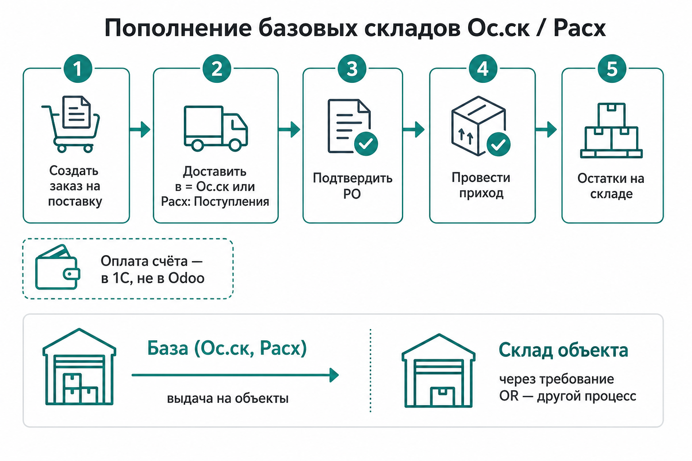
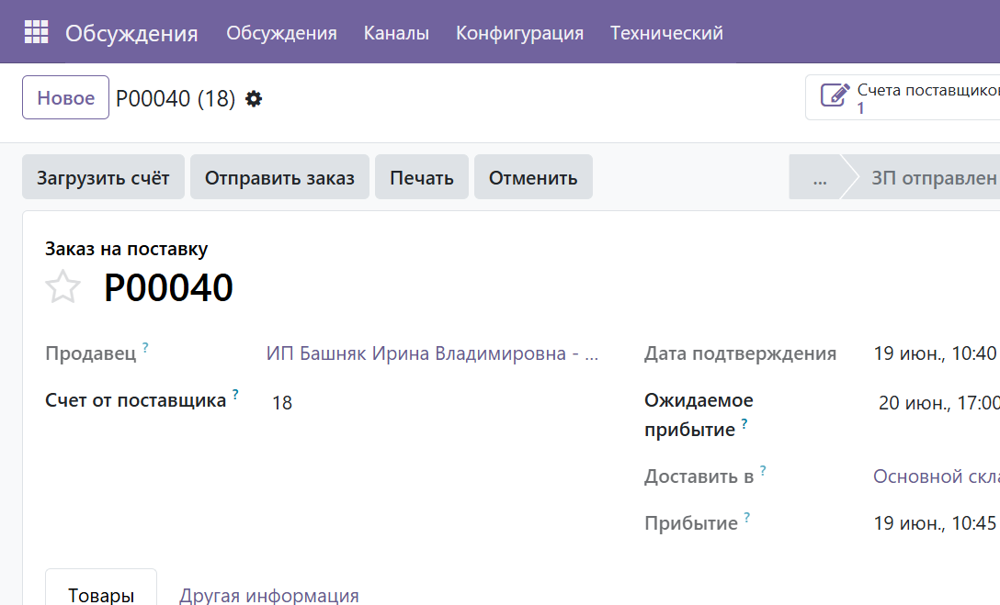
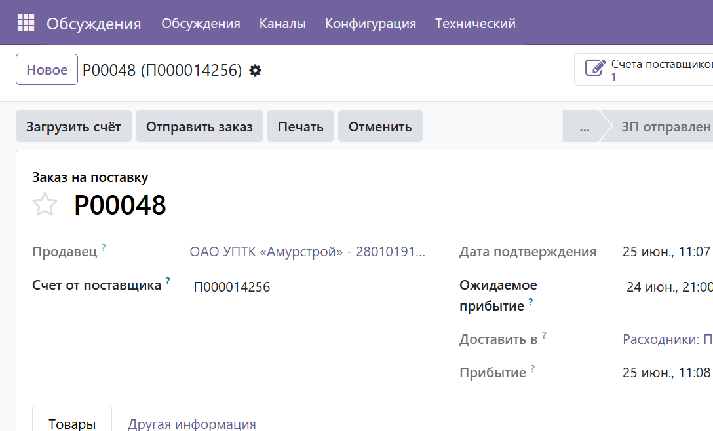
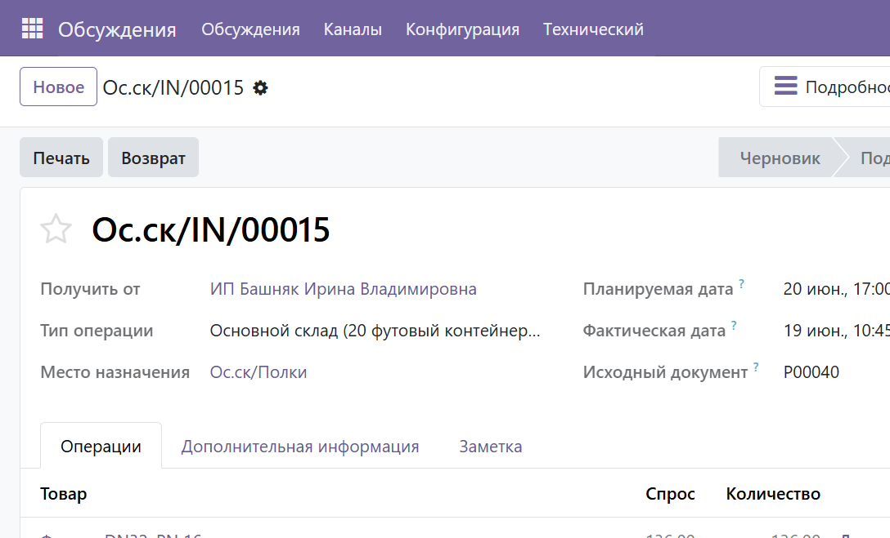

# Инструкция: пополнение базовых складов Ос.ск и Расходники

**Версия:** 1.0  
**Дата:** 2026-08-06  
**Роль:** Снабженец / кладовщик  
**Скриншоты:** `docs/screenshots/base-warehouse-replenish/`  
**Примеры:** `P00040` → `Ос.ск/IN/00015`; `P00048` → `Расх/IN/00001`

---

## 1. Зачем эта инструкция

Склады **Ос.ск** (Основной склад) и **Расх** (Расходники) — это **база**.  
С них выдают материалы на объекты. Их **не** пополняют через требование прораба (`object.request`).

Требование OR → приёмка на **склад объекта** (`O010`, `O011` …).  
Пополнение базы → обычная **закупка** с приёмкой на Ос.ск или Расх.

---

## 2. Какие склады куда

| Код | Название | Куда падает приход | Когда использовать |
|-----|----------|--------------------|--------------------|
| **Ос.ск** | Основной склад (20 футовый контейнер) | `Ос.ск/Полки` | Основная номенклатура, крепёж, арматура и т.п. |
| **Расх** | Расходники | `Расх/Наличие` (полки 1–3) | Мелкий расход, крепёж/расходники под учёт на «Расходниках» |
| Офис, метал, БАЗА… | Прочие базы | свои локации | По той же схеме: тип приёмки этого склада |

Типы операций поступления:

- **Ос.ск:** `Основной склад …: Поступления`
- **Расх:** `Расходники: Поступления`

---

## 3. Пошаговый процесс

### Шаг 1. Создать заказ на поставку

1. Меню **Закупки → Заказы на поставку → Новое**  
   (или создать PO из счёта / через AI-ассистента — суть та же).
2. Указать **Продавец** (поставщик).
3. В поле **Доставить в** выбрать тип приёмки нужного склада:
   - для основного склада — **…Ос.ск…: Поступления** (в UI часто видно как «Основной склад»);
   - для расходников — **Расходники: Поступления**.

**Пример Ос.ск** (`P00040`):

**Пример Расх** (`P00048`):

4. Добавить строки: товар, количество, цена (по счёту).
5. В **Счет от поставщика** (`partner_ref`) — номер счёта для 1С (например `18`, `П000014256`).

### Шаг 2. Подтвердить заказ

Нажать подтверждение заказа (статус → заказ на покупку / ЗП отправлен).  
Odoo создаст связанное **Поступление** (`…/IN/…`).

### Шаг 3. Провести приход

1. Открыть smart button **Поступления** на PO  
   или **Склад → Операции → Поступления**.
2. Проверить:
   - **Тип операции** — Поступления Ос.ск или Расх;
   - **Место назначения** — `Ос.ск/Полки` или `Расх/Наличие/Полка N`;
   - количества.
3. **Проверить → Провести** (Validate).

**Пример проведённого прихода на Ос.ск** (`Ос.ск/IN/00015` из `P00040`):

После Validate появляются **остатки** (`stock.quant`) на локации склада.

### Шаг 4. Оплата

Счёт и оплата — **в 1С**. В Odoo vendor bill / платёж для этого процесса **не обязательны**.  
Достаточно номера счёта в `partner_ref` на PO.

---

## 4. Частые ошибки

| Ошибка | Почему плохо | Как правильно |
|--------|--------------|---------------|
| В **Доставить в** оставили склад **объекта** | Товар приедет на объект, а не на базу | Выбрать **Ос.ск: Поступления** или **Расх: Поступления** |
| Взяли приёмку **Офис**, а нужен Ос.ск | Остатки «не там» | Сверить код склада в типе операции |
| Провели приход сменой статуса через API без Validate | Quants = 0 | Только штатное **Провести** |
| Инвентаризация вместо прихода закупки | Ломает учёт | Только incoming picking от PO |
| Ждут пополнения Ос.ск через OR | OR не для базы | OR → объект; база → этот процесс |

---

## 5. Как база связана с объектами

После пополнения Ос.ск / Расх материал уходит на объект так:

1. Прораб создаёт **требование** (`object.request`).
2. Снабженец: **Рассчитать наличие** → **Авто-разбивка** → **Создать выдачу**  
   (источник — Ос.ск / Расх / Офис / метал).
3. Либо закупка **сразу на объект** из OR («Подготовить закупку») — без захода на базу.

Подробнее про объекты:  
[`instruction-warehouse-supply-cycle.md`](instruction-warehouse-supply-cycle.md),  
[`instruction-purchase-split-vendors.md`](instruction-purchase-split-vendors.md).

---

## 6. Чек-лист

- [ ] Нужен именно **база** (Ос.ск / Расх), а не склад объекта
- [ ] В PO **Доставить в** = Поступления нужного склада
- [ ] Товары со `is_storable` («На складе»)
- [ ] Номер счёта в `partner_ref`
- [ ] Приход **проведён** (Validate)
- [ ] Остатки видны на `Ос.ск/Полки` или `Расх/Наличие/…`
- [ ] Оплата учтена в **1С**

---

## 7. Справочник (prod)

| Сущность | Ос.ск | Расх |
|----------|-------|------|
| Код склада | `Ос.ск` | `Расх` |
| Локация запаса | `Ос.ск/Полки` | `Расх/Наличие` (+ полки 1–3) |
| Тип поступления | id 17 | id 180 |
| Пример PO | P00040 | P00048 |
| Пример прихода | Ос.ск/IN/00015 → `Ос.ск/Полки` | Расх/IN/00001 → `Расх/Наличие/Полка 2` |
