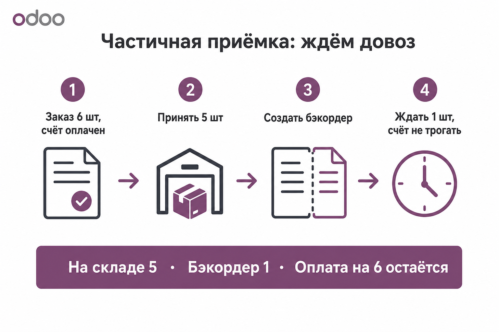
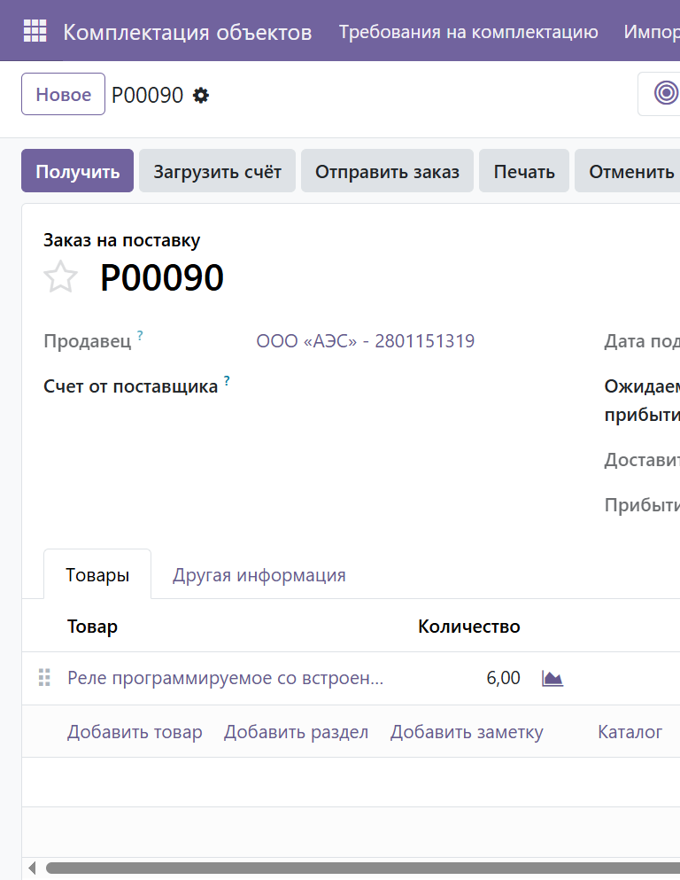
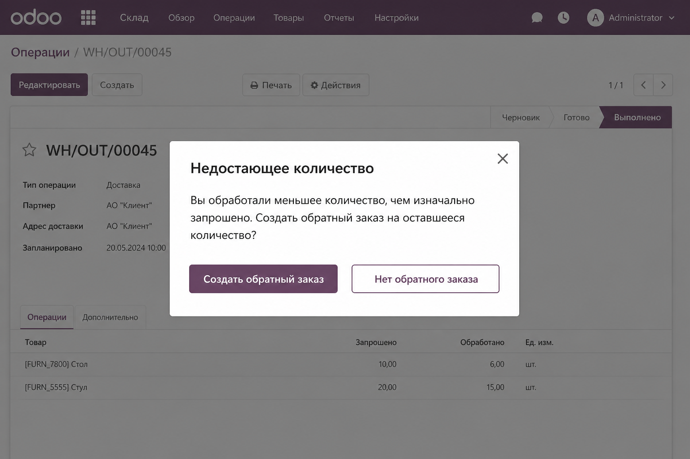
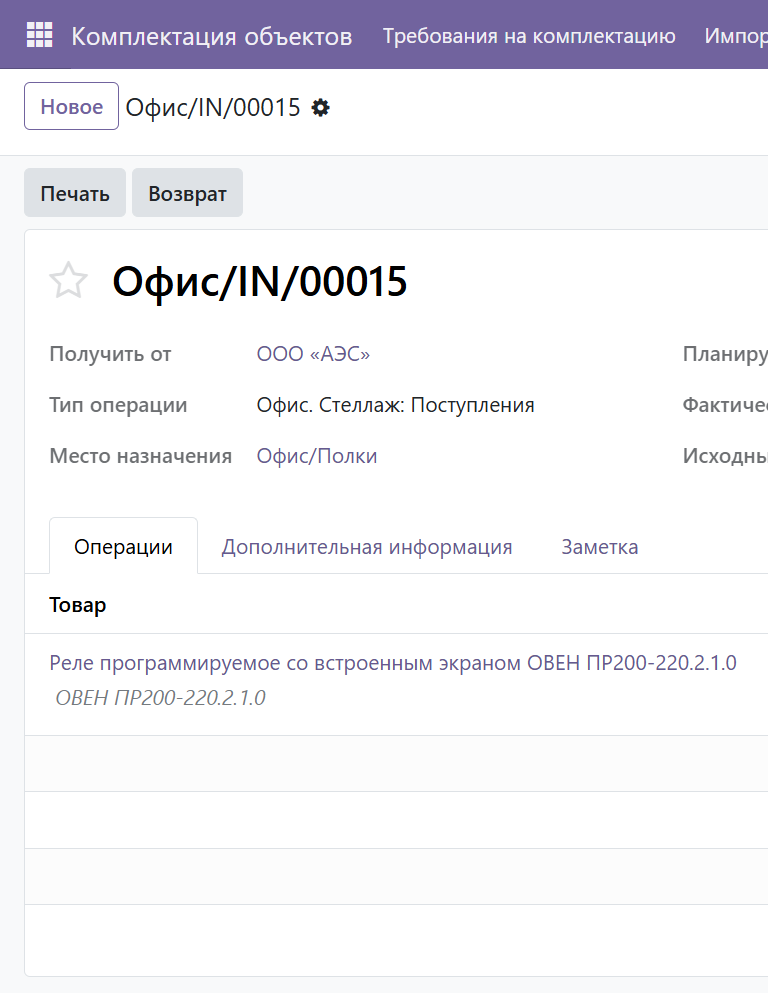
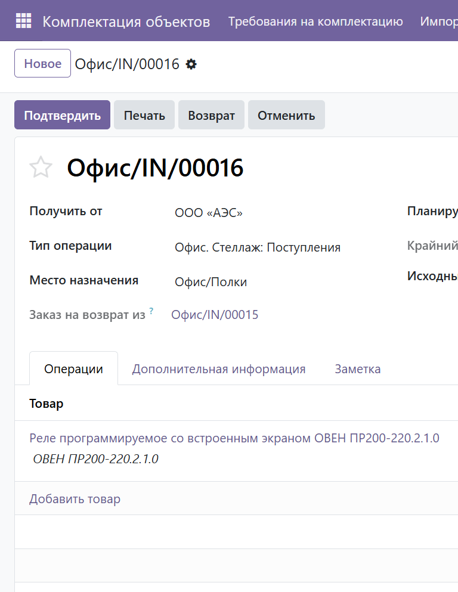
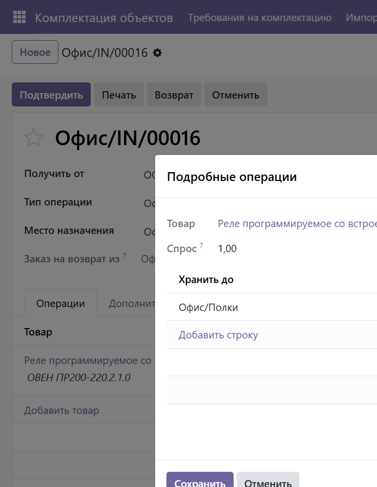

# Инструкция: частичная приёмка и бэкордер («ждём довоз»)

**Версия:** 1.0  
**Дата:** 2026-08-11  
**Роль:** Снабженец / кладовщик  
**Скриншоты:** `docs/screenshots/partial-receipt-backorder/`  
**Пример:** `P00090` → `Офис/IN/00015` (принято 5) → `Офис/IN/00016` (бэкордер 1)

---

## 1. Когда применять

Заказали **N** шт., счёт оплачен на **N**, а поставщик привёз только **M** (меньше N), и **оставшееся ждёте** (довоз).

| Что уже есть | Что делать |
|--------------|------------|
| PO подтверждён, счёт проведён/оплачен на N | **не** править счёт и **не** делать кредит-ноту |
| Приехало M | Принять **M**, создать **бэкордер** на N−M |
| Довезли остаток | Провести бэкордер (принять N−M) |

Если довоза **не будет** — другой сценарий: принять M → в мастере выбрать **«Нет обратного заказа»** → оформить **кредит-ноту** на недовезённое (эта инструкция про «ждём»).

---

## 2. Где открыть поступление

1. Открой заказ на поставку (пример: **P00090**).
2. Smart button **«Поступления»** (или **Склад → Операции → Поступления**).
3. Открой приход в статусе готовности к приёмке (пример: `Офис/IN/00015`).

На PO видно заказанное количество (у нас **6**). Кнопка **«Получить»** ведёт в связанное поступление.

---

## 3. Принять фактически привезённое

1. В поступлении на вкладке **«Операции»** поставь количество **как привезли** (пример: **5**, а не 6).
2. Нажми **Проверить** / **Провести** (Validate).

Odoo спросит, что делать с недостающим количеством:

3. Выбери **«Создать обратный заказ»** (Create Backorder).  
   Не выбирай «Нет обратного заказа», если довоз ещё ожидается.

### Результат

- Исходное поступление переходит в **Готово**, на склад ложится **M** шт.
- Появляется новое поступление-бэкордер на **N−M** (пример: `Офис/IN/00016` на **1** шт.).
- В chatter исходного прихода: количество **6 → 5** и ссылка на обратный заказ.

На бэкордере:

- **Исходный документ** = тот же PO (`P00090`);
- связь с родительским приходом (`Офис/IN/00015`);
- **Спрос** = оставшееся количество (**1**).

---

## 4. Когда довезли остаток

1. Открой бэкордер (`Офис/IN/00016`).
2. Проверь количество (**1**).
3. **Подтвердить** → **Провести**.

Новый счёт **не нужен**: он уже был на полные 6 шт. После приёмки бэкордера на PO: получено = заказано = 6.

---

## 5. Счёт и оплата при «ждём довоз»

| Документ | Действие |
|----------|----------|
| Vendor bill на N | Оставить как есть (уже оплачен — ок) |
| Кредит-нота | **Не** создавать, пока ждёте довоз |
| PO | Не отменять; qty_received растёт по мере приёмок |

Если позже выяснится, что 6-й **не приедет** — тогда отменить бэкордер и сделать кредит-ноту на 1 шт. (отдельный сценарий).

---

## 6. Частые ошибки

| Ошибка | Почему плохо | Как правильно |
|--------|--------------|---------------|
| Приняли все N, хотя привезли M | Остатки завышены | Принять только факт (M) |
| Выбрали «Нет обратного заказа», но довоз ждут | Потеряли документ на остаток | **Создать обратный заказ** |
| Сразу делают кредит-ноту при ожидаемом довозе | Двойная корректировка, когда товар приедет | Кредит-нота только если довоза не будет |
| Создают второй PO на недовезённое | Дубль заказа и риск двойной оплаты | Ждать бэкордер того же PO |

---

## 7. Чек-лист (ждём довоз)

- [ ] В приходе количество = **факт** (M), не заказ (N)
- [ ] Validate → **Создать обратный заказ**
- [ ] На складе видно M; бэкордер на N−M открыт
- [ ] Счёт/оплату на N **не** трогали
- [ ] После довоза провели только бэкордер

---

## 8. Справочник (пример prod)

| Сущность | Значение |
|----------|----------|
| PO | `P00090` |
| Поставщик | ООО «АЭС» |
| Товар | Реле ОВЕН ПР200-220.2.1.0 |
| Заказано / в счёте | 6 |
| Принято сразу | 5 → `Офис/IN/00015` (Готово) |
| Бэкордер | 1 → `Офис/IN/00016` |
| Склад | `Офис/Полки` |

---

## Связанные документы

- Пополнение базы Ос.ск / Расх: [`instruction-base-warehouse-replenish.md`](instruction-base-warehouse-replenish.md)
- Закупка по требованию (часть строк): [`instruction-purchase-split-vendors.md`](instruction-purchase-split-vendors.md)
- Полный цикл снабжения объекта: [`instruction-warehouse-supply-cycle.md`](instruction-warehouse-supply-cycle.md)
