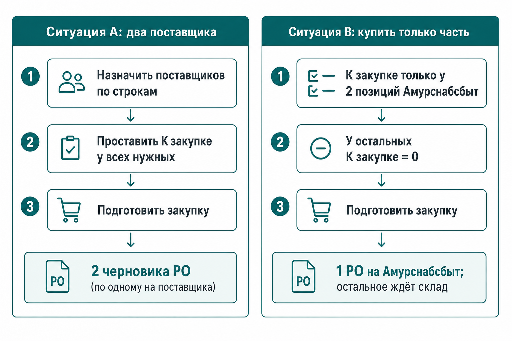
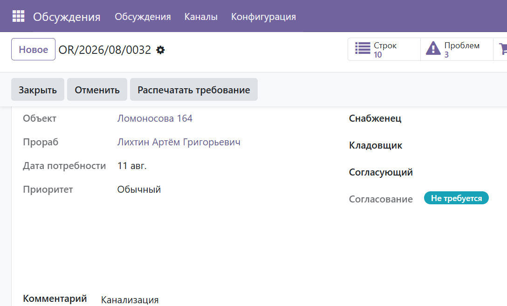
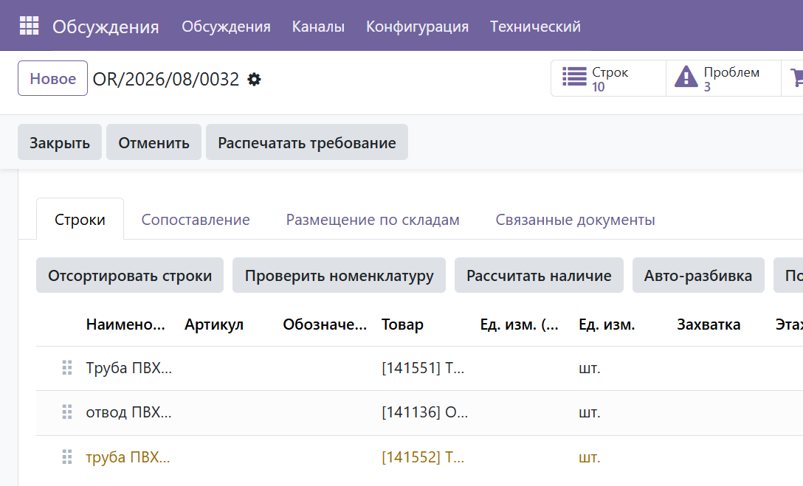
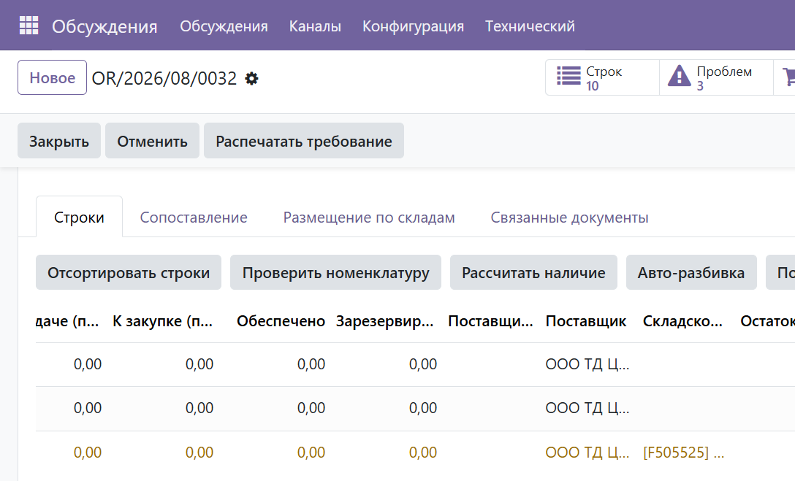
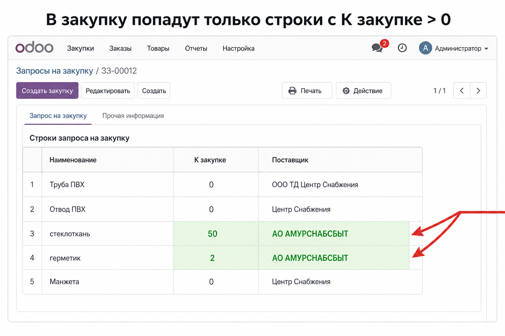
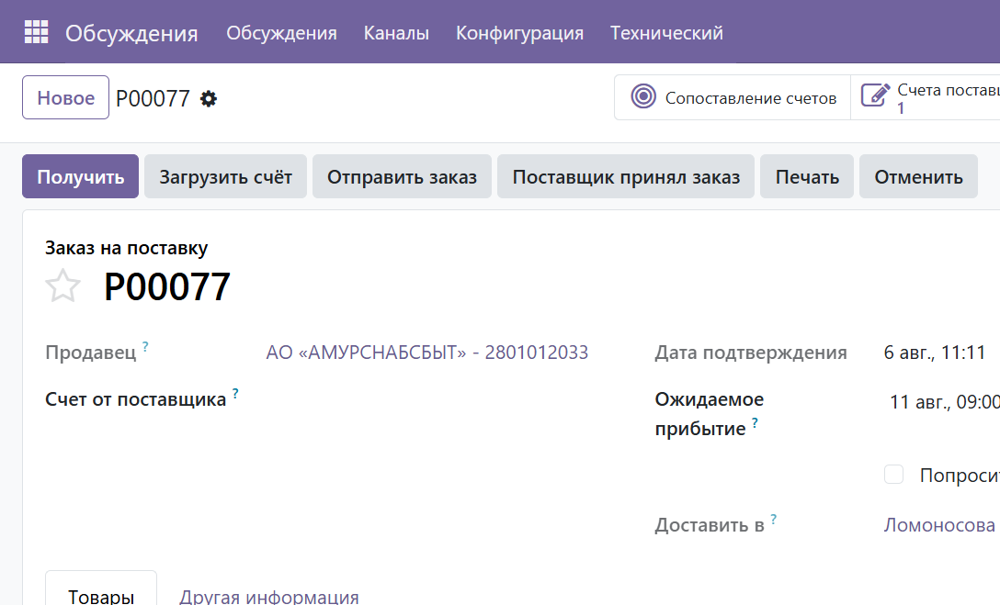

# Мини-инструкция: закупка по требованию — два поставщика и «купить только часть»

**Версия:** 1.0  
**Дата:** 2026-08-06  
**Пример:** `OR/2026/08/0032` (объект Ломоносова 164)  
**Роль:** Снабженец  
**Скриншоты:** `docs/screenshots/purchase-split-vendors/`

---

## Главное правило

Кнопка **«Подготовить закупку»** берёт только строки, у которых одновременно:

1. заполнен **Товар**;
2. указан **Поставщик**;
3. **К закупке (план) > 0**.

Система сама группирует эти строки **по поставщику** → отдельный черновик `purchase.order` на каждого.

---

## Где работать в UI

Открой требование → вкладка **«Строки»**.

На панели строк:

- **Рассчитать наличие** / **Авто-разбивка** — если нужно разложить «со склада / в закупку»;
- **Подготовить закупку** — создать черновики PO.

Прокрути таблицу вправо до колонок **К закупке (план)** и **Поставщик**:

---

## Ситуация A — купить у двух поставщиков сразу

**Пример:** стеклоткань + герметик → **Амурснабсбыт**; остальное → **Центр Снабжения**.

### Шаги

1. На вкладке **Строки** назначь поставщиков:
   - вручную в колонке **Поставщик**;
   - или отметь несколько строк → **Действие → Назначить поставщика → Применить**.
2. Заполни **К закупке** у **всех** позиций, которые покупаешь сейчас  
   (вручную, **Закупить всё**, или **Авто-разбивка** после расчёта наличия).
3. Нажми **Подготовить закупку** → **Создать закупки**.

### Результат

- один черновик на **АО «АМУРСНАБСБЫТ»**;
- второй черновик на **ООО ТД Центр Снабжения**.

---

## Ситуация B — купить только часть, остальное отложить

**Пример:** сейчас только стеклоткань и герметик у Амурснабсбыт; ПВХ-трубы ждём на складе.

### Шаги

1. У нужных позиций (стеклоткань, герметик):
   - **Поставщик** = Амурснабсбыт;
   - **К закупке** = нужное количество.
2. У остальных строк оставь **К закупке = 0**  
   (поставщика можно уже проставить «на потом» — в текущую закупку они не попадут).
3. Нажми **Подготовить закупку**.

### Результат (факт по OR/2026/08/0032)

Создан заказ **P00077** на **АО «АМУРСНАБСБЫТ»** (стеклоткань 50 м + герметик 2 шт.).  
Остальные строки остались в требовании с `К закупке = 0`.

### Что делать с отложенными строками позже

| Когда | Действие |
|-------|----------|
| Появилось на складе | **Рассчитать наличие** → **К выдаче** → **Создать выдачу** |
| Решили докупить | Проставить **К закупке** только по ним → снова **Подготовить закупку** |

По строкам, у которых уже есть связанный PO, повторно тот же PO не создастся.

---

## Чек-лист перед «Подготовить закупку»

- [ ] У строк к покупке заполнены **Товар** и **Поставщик**
- [ ] **К закупке > 0** только у того, что покупаем **сейчас**
- [ ] У отложенных позиций **К закупке = 0**
- [ ] Склад приёмки в мастере — склад объекта (обычно подставляется сам)

---

## Связанные документы

- Полный цикл снабжения объекта: [`instruction-warehouse-supply-cycle.md`](instruction-warehouse-supply-cycle.md)
- Пополнение базы Ос.ск / Расх: [`instruction-base-warehouse-replenish.md`](instruction-base-warehouse-replenish.md)
- Функциональная спецификация: [`functionalspecobjectrequest.md`](functionalspecobjectrequest.md) (раздел «Подготовить закупку»)
