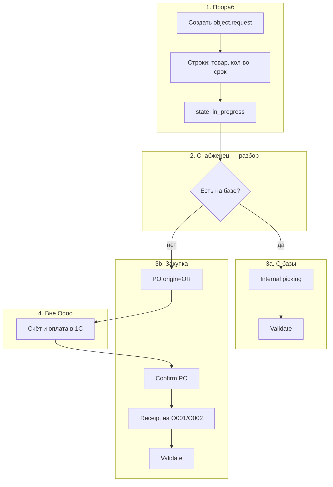
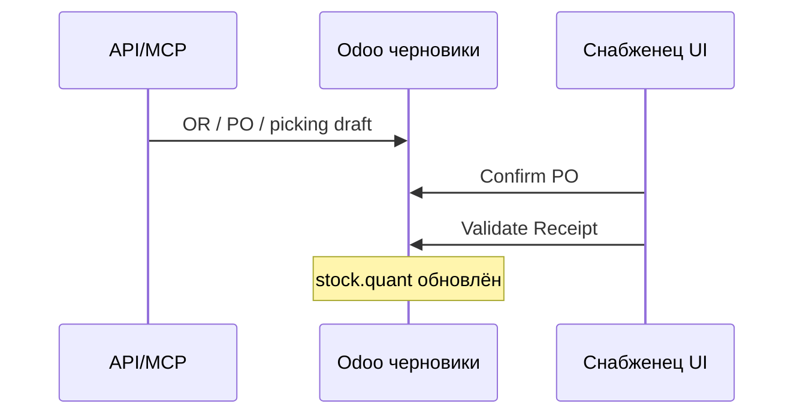

# Инструкция: цикл снабжения «требование прораба → пополнение склада объекта»

**Версия:** 1.0
**Дата:** 2026-05-21
**Инстанс:** Odoo 19 (склад), оплата счетов — **1С**, не Odoo
**Связанный техдолг:** [TD-002](technical-debt.md#td-002-единицы-измерения-труб-метр--m-и-приход-на-склад-в-метрах-при-закупке-в-кгтоннах), [TD-003](technical-debt.md#td-003-api--validate--связка-orposklad-объекта)

---

## 1. Назначение документа

Эта инструкция описывает **целевой рабочий процесс** пополнения складов объектов (`O001`/`O002`) в Odoo:

1. **Прораб** формирует потребность (требование на снабжение).
2. **Снабженец** на основании требования обеспечивает объект: **перемещением с базы** или **закупкой у поставщика**.
3. **Оплата счетов** и бухгалтерия — **в 1С**, в Odoo **не оформляются** vendor bill и платежи.
4. Изменение остатков на складе — **только** через **приход** (`incoming`) или **внутреннее перемещение** (`internal`) с **проведением** документа, **без инвентаризации**.

Документ также фиксирует **границы возможностей MCP/API** и известные ограничения (на примере счёта УТ-1132 и прихода на склад `O002`).

---

## 2. Решаемая проблема

### 2.1. Было / боль

| Проблема | Последствие |
|----------|-------------|
| Потребность объекта не связана с закупкой и приходом | Непонятно, **зачем** закупили и **куда** должно попасть |
| Приход оформляют «как получится» (не тот склад, не те UoM) | Остатки на объекте не сходятся с фактом |
| Попытка провести приход через API сменой `state` | Документ «done», **quants = 0** (кейс ОбМ-4/IN/00001) |
| Использование **инвентаризации** для закупки | Смешение процессов: инвентаризация — для **физической сверки**, не для прихода от поставщика |
| Счета в **кг**, учёт в **метрах** | Ошибки количества без правила пересчёта (см. TD-002) |
| Оплата в 1С, склад в Odoo | Дублирование счетов в Odoo не нужно, но **номер счёта** должен жить в заказе/примечании |

### 2.2. Цель процесса

- Единая цепочка: **`object.request` (OR) → `purchase.order` (PO) / `stock.picking` (INT) → проведённый приход на `O001`/`O002`**
- Прозрачность: по номеру OR видно, что закупили и что приехало на объект
- Корректные **остатки** (`stock.quant`) без инвентаризации
- API/агент готовит черновики; **проведение** — штатными методами Odoo (см. TD-003)

---

## 3. Область применения и границы

### 3.1. В scope (делаем в Odoo)

| Область | Документы / модели |
|---------|-------------------|
| Потребность | `object.request`, `object.request.line` |
| Закупка (логистика) | `purchase.order`, `purchase.order.line` |
| Склад | `stock.picking`, `stock.move`, `stock.move.line`, `stock.quant` |
| Номенклатура | `product.template` / `product.product` |
| Справочники | `stock.warehouse`, `stock.picking.type`, `res.partner` (поставщик) |

### 3.2. Вне scope (не делаем в Odoo)

| Область | Где ведётся |
|---------|-------------|
| Счёт поставщика (Vendor Bill) | **1С** |
| Оплата, банк, НДС | **1С** |
| Инвентаризация как способ «прихода» закупки | **Запрещено** в этом процессе |
| Полная бухгалтерская картина закупки | **1С** |

### 3.3. Связь с 1С (минимум)

В Odoo достаточно **ссылки на внешний документ**:

- в PO: `partner_ref` = номер счёта (например `УТ-1132`);
- в `origin` / примечании: дата счёта, сумма (опционально);
- факт оплаты в Odoo **не отражается** — снабженец ориентируется на 1С и условия поставщика.

---

## 4. Роли и ответственность

| Роль | Задачи в Odoo | Не делает |
|------|---------------|-----------|
| **Прораб** | Создаёт **OR**, указывает объект/проект, срок, позиции и количества; отправляет в работу (`in_progress`) | PO, приходы, оплата |
| **Снабженец** | Разбор OR; сопоставление с номенклатурой; PO и/или внутренние перемещения; **проведение** pickings; контроль склада назначения | Vendor bill, платежи (1С) |
| **Кладовщик / прораб на объекте** (если выделен) | Приёмка факта, сверка метража с накладной | Создание OR (если не прораб) |
| **API / агент (MCP)** | Черновики OR/PO/picking; поиск остатков; подстановка данных из счёта; расчёт метража (после TD-002) | Проведение без доработки validate (TD-003) |
| **Бухгалтерия** | — | Всё в **1С** |

### 4.1. Права доступа (рекомендация)

- Прораб: создание/редактирование **своих** OR, без проведения pickings.
- Снабженец: OR (чтение всех), PO, pickings, validate.
- MCP-пользователь: узкие группы + allowlist моделей (TD-001).

---

## 5. Инструменты и сущности Odoo

### 5.1. Требование прораба — `object.request`

Уже используется в базе (примеры: `OR/2026/05/0002`, `OR/2026/05/0007`).

**Ключевые поля (по факту инстанса):**

| Поле | Смысл |
|------|--------|
| `name` | Номер OR (OR/2026/05/0002) |
| `state` | `draft` → `in_progress` → … / `cancelled` |
| `foreman_user_id` | Прораб |
| `project_id` | Объект / проект |
| `need_date` | Срок потребности |
| `qty_total_requested` | Суммарно запрошено |
| `qty_total_to_buy` | К закупке |
| `qty_total_to_issue` | К выдаче со склада |
| `matching_state` | Сопоставление с номенклатурой |

**Строки:** `object.request.line` — `name_raw`, `qty_requested`, `line_state`, `preferred_vendor_id`, сопоставление с `product_id` (через логику модуля).

### 5.2. Склады объектов — `stock.warehouse`

| Склад | Код | Назначение |
|-------|-----|------------|
| Ломоносова 164 | O001 | Production-объект |
| **Б. Хмельницкого, 112** | **O002** | Production-объект |
| Офис, Ос.ск, БАЗА, … | … | База / пополнение |

**Локация запасов объекта:** обычно `O###/Наличие` или `O###/Склад объекта` — смотреть в карточке склада (`lot_stock_id`).

Legacy-коды временно поддерживаются только как aliases для AI Assistant: `ОбМ-2` → `O001`, `ОбМ-4` → `O002`. Новые операции и документы должны использовать `O001`/`O002`.

### 5.3. Заказ поставщику — `purchase.order`

- **Поставщик:** `partner_id` (например ООО «ПроМеталл», id 19).
- **Склад назначения:** через `picking_type_id` типа **«O001/O002: Поступления»** — **не** «Офис: Receipts».
- **Связь с OR:** `origin` = `OR/2026/05/0002`.
- **Ссылка на счёт для 1С:** `partner_ref` = `УТ-1132`.
- **Без** создания vendor bill в Odoo.

### 5.4. Складские операции — `stock.picking`

| Тип | `picking_type_id` | Когда |
|-----|-------------------|--------|
| **Incoming** | O001/O002: Поступления | Закупка: Vendors → объект |
| **Internal** | O001/O002 или база: Внутренние переводы | С базы на объект |

**Проведение** (`button_validate`) создаёт **остатки** (`stock.quant`). Другие способы для этого процесса **не используются**.

### 5.5. Номенклатура труб

- Категория: **металлопрокат / Трубы** (id 14).
- Единица учёта: **метр** (унификация с «m» — TD-002).
- Обязательно: **`is_storable = true`** («На складе»), иначе quants не создаются.

---

## 6. Целевой процесс (пошагово)

### Шаг 1. Прораб — требование (OR)

1. Меню модуля требований → **Создать**.
2. Указать **проект/объект**, **срок** (`need_date`).
3. Добавить **строки**: наименование (или выбор номенклатуры после сопоставления), **количество**, по возможности **ед. изм. = метр** для труб.
4. Указать **предпочитаемого поставщика** (если известен).
5. Перевести в **`in_progress`** (отправка снабженцу).

**Критерий готовности:** OR имеет номер, строки, срок; статус не `draft`.

---

### Шаг 2. Снабженец — разбор OR

1. Открыть OR по номеру или фильтру «в работе».
2. По каждой строке определить:
   - **qty_to_issue** — можно закрыть **перемещением** с базы (Офис, Ос.ск, БАЗА, …);
   - **qty_to_buy** — нужен **заказ поставщику**.
3. Сопоставить строки с **карточками товара** (`matching_state` = matched).
4. Проверить **остатки**: Склад → Отчёты → Запасы (или MCP `search_records` на `stock.quant`).

**Ошибка, которой избегать:** закупка на **Офис**, когда нужен склад объекта `O001` или `O002`.

---

### Шаг 3a. Пополнение с базы (внутреннее перемещение)

1. **Склад → Операции → Внутренние перемещения** (или тип **O001/O002: Внутренние переводы**).
2. **Из:** локация базы с остатком. **В:** `O001/Склад объекта`, `O002/Наличие` или актуальная `lot_stock_id` объекта.
3. Строки: товар, **количество в метрах**.
4. **Проверить → Провести** (Validate).

**Связь с OR:** указать в `origin` номер OR (если поле доступно) или в примечании picking.

---

### Шаг 3b. Закупка у поставщика

#### 3b.1. Заказ поставщику (PO)

1. **Закупки → Заказы → Создать** (или создать из OR, если модуль поддерживает).
2. **Поставщик**, **origin** = номер OR.
3. **Тип операции / склад:** выбрать склад **объекта** (например **Б. Хмельницкого, 112**) — Odoo подставит **O002: Поступления**.
4. Строки: номенклатура, **количество в метрах**, цена (из счёта или договора).
5. **partner_ref** = номер счёта поставщика (для связи с 1С).
6. **Подтвердить** заказ (Confirm) — **только через UI** или `button_confirm` (TD-003).

#### 3b.2. Оплата в 1С (вне Odoo)

1. Бухгалтерия выставляет/регистрирует счёт в **1С**.
2. Оплата — в **1С**.
3. Снабженец контролирует статус оплаты **в 1С**, не в Odoo.

#### 3b.3. Приход на объект

1. Из PO открыть **Приход** / **Receipt** объекта.
2. Проверить **назначение:** Vendors → **O001/O002/…**
3. Ввести **фактическое количество в метрах** (пересчёт из счёта в кг — см. TD-002 и раздел 8).
4. **Проверить → Провести** (Validate).

**После Validate:** остатки видны на объекте; `qty_received` на строках PO обновляется штатно.

---

## 7. Пересчёт количества (счёт поставщика → метры на складе)

Пока **TD-002** не закрыт, пересчёт **вручную** по правилу:

| Если в счёте | Формула для Odoo (метры) |
|--------------|---------------------------|
| **Штуки** = хлысты длины L | `шт × L` (например 15 шт × 12 м = 180 м) |
| **Вес, кг** | `кг ÷ (кг/м по сортаменту или паспорту)` |
| **Тонны** | `т × 1000 ÷ (кг/м)` |

**Пример (счёт УТ-1132, хлысты полной длины):**

| Позиция | шт × L | Метров |
|---------|--------|--------|
| э/с 89×3,5 L12 | 1,5 × 12 | 18 |
| э/с 76×3,5 L12 | 15 × 12 | 180 |
| вгп 50×3,5 L6 | 13 × 6 | 78 |
| вгп 40×3,5 L6 | 51 × 6 | 306 |
| вгп 20×2,8 L6 | 30 × 6 | 180 |
| вгп 15×2,8 L6 | 56 × 6 | 336 |
| **Итого** | | **1098 м** |

---

## 8. MCP / API: что можно и что нельзя

Инструменты MCP (`user-odoo`): `search_records`, `get_record`, `create_record`, `update_record`, `delete_record`, `list_models`.

### 8.1. Матрица возможностей

| Операция | MCP/API | AI v3 tools | Проведение остатков | Комментарий |
|----------|---------|-------------|---------------------|-------------|
| Создать / изменить **OR** | ✅ | ✅ draft only | — | `create_object_request_draft`, подтверждение в чате |
| Поиск остатков `stock.quant` | ✅ | ✅ read only | — | `search_stock_quants` для решения «с базы / закупка» |
| Создать **PO** + строки | ✅ | ✅ draft only | — | `create_purchase_order_draft`, склад объекта через `picking_type_id` |
| **Confirm** PO (`button_confirm`) | ❌* | ❌* | — | *Без доработки TD-003, только вручную в UI |
| Создать **incoming / internal** picking | ✅ | ✅ internal draft | — | AI v3 создаёт internal picking draft; receipt validate не делает |
| Заполнить количества в move / move.line | ✅ частично | ❌ | — | Не входит в v3 action tools |
| **Validate** picking (`button_validate`) | ❌* | ❌* | **Да, только так** | *Прямой `state=done` **не создаёт quants** |
| Vendor bill, оплата | ➖ не используем | ➖ не используем | — | 1С |
| **Инвентаризация** (`stock.quant` inventory) | ⚠️ технически возможно | ❌ | Обходной путь | **Запрещено** этим процессом |
| Удаление ошибочных quants | ❌ | ❌ | — | Права MCP-пользователя / вне v3 |

### 8.2. Урок исторического кейса ОбМ-4/IN/00001

| Действие через API | Результат |
|--------------------|-----------|
| `create` picking + moves | OK |
| `update` picking `state=done` | Статус «done», **остатков 0** |
| Товар без `is_storable` | Quants **не создаются** |
| Обход через инвентаризацию | Остатки появились, но **не тот процесс** |

**Вывод:** для целевого цикла нужны **`button_confirm`** и **`button_validate`** (TD-003), либо **ручное Validate в UI** после подготовки черновика агентом.

### 8.3. Рекомендуемая модель «гибрид»

---

## 9. Чеклисты

### 9.1. Прораб — перед отправкой OR

- [ ] Объект/проект указан
- [ ] Срок (`need_date`) реалистичен
- [ ] Позиции и количества заполнены
- [ ] Для труб по возможности — **метры** или указана длина хлыста в описании

### 9.2. Снабженец — перед Confirm PO

- [ ] `origin` = номер OR
- [ ] `partner_ref` = номер счёта (для 1С)
- [ ] **Склад / picking type** = **объект** (`O001`/`O002`), не офис по умолчанию
- [ ] Номенклатура с **`is_storable`**
- [ ] Количество в **метрах** (пересчёт из счёта выполнен)

### 9.3. Снабженец — перед Validate прихода

- [ ] Локация назначения = **O001/O002/…**
- [ ] Количество = факт / расчёт по счёту
- [ ] Документ не дублирует отменённый/битый приход
- [ ] **Не** используется инвентаризация вместо прихода

---

## 10. Частые ошибки

| Ошибка | Как должно быть |
|--------|-----------------|
| PO на «Офис», а нужен объект | В PO выбрать склад **Ломоносова 164** (`O001`) или **Б. Хмельницкого, 112** (`O002`) |
| Ед. «шт» вместо «метр» | Для труб — **метр**, пересчёт из счёта |
| Товар «расходник» без «На складе» | `is_storable = true` |
| Приход через API `state=done` | Validate в UI или TD-003 |
| Vendor bill в Odoo при оплате в 1С | Только `partner_ref` + PDF в 1С |
| Инвентаризация вместо Receipt | Только **Incoming** / **Internal** |

---

## 11. Связанные документы и задачи

| Документ | Содержание |
|----------|------------|
| [technical-debt.md — TD-002](technical-debt.md#td-002-единицы-измерения-труб-метр--m-и-приход-на-склад-в-метрах-при-закупке-в-кгтоннах) | UoM метр/m, пересчёт кг→м |
| [technical-debt.md — TD-003](technical-debt.md#td-003-api--validate--связка-orposklad-объекта) | API validate, OR→PO→склад |
| [technical-debt.md — TD-001](technical-debt.md#td-001-ограничение-доступа-mcp-к-моделям-odoo-least-privilege) | Безопасность MCP |
| `.cursor/rules/agent-intent-odoo-mcp.mdc` | Изменения в Odoo только по команде |
| `.cursor/skills/odoo-supplier-from-invoice/SKILL.md` | Разбор счёта, поставщик |

---

## 12. История изменений инструкции

| Дата | Версия | Изменение |
|------|--------|-----------|
| 2026-05-21 | 1.0 | Первая версия: цикл OR→PO/INT→Validate; границы 1С; API; кейс УТ-1132 / ОбМ-4 |
