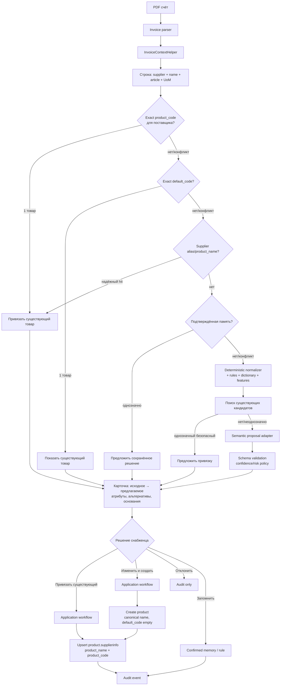
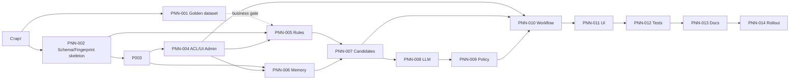

# План: AI-нормализация названий товаров из счетов

**Создан:** 2026-08-08
**Оркестрация:** `orch-2026-08-08-11-04-product-name-normalization`
**Статус:** 🟡 Готов к PNN-001 и техническому каркасу; переход к зависимым задачам — после утверждения golden dataset и category-specific naming convention
**Приоритет:** High
**Затрагиваемые модули:** `ai_assistant`, `custom_product_search`, `object_request`
**Оценка:** 14 основных задач, ориентировочно 8–12 рабочих дней с тестированием и поэтапным rollout

## Зафиксированные решения MVP

Эти решения являются входными ограничениями реализации. Агент не должен повторно выбирать архитектуру или заменять их альтернативами без отдельного согласования с Сергеем.

1. **Семантика известных токенов:**
   - `KGUG` = переход наружной канализации ПВХ на чугун; словарная запись `KGUG` описывает только тип/материал/назначение и **не подразумевает цвет**;
   - supplier alias сохраняется без изменений: `Переход KGUG 160`;
   - канонический пример для строки `Переход KGUG 160` (без токена `ОРАНЖ` в исходной строке счёта): `Переход канализационный наружный ПВХ–чугун Ду160` — без цвета, потому что цвет в этой конкретной строке не указан;
   - `FLEXTRON` трактуется как `brand`;
   - `ОРАНЖ` нормализуется как цвет `оранжевый` **только когда этот токен явно присутствует в конкретной обрабатываемой строке**; атрибут `color` не выводится из серии/словарной статьи по умолчанию.
2. **Naming convention MVP:** `[Тип изделия] [назначение/система] [исполнение] [материал] [ключевые размеры/параметры] [, цвет]`.
   Упаковка, поставщик, vendor code, цена и маркетинговые слова в canonical name не входят.
3. **Бренд:** по умолчанию хранится отдельно в `brand` и не входит в canonical name. Исключение — бренд/серия меняет техническую идентичность или без него невозможно однозначно различить товар; такое включение требует rule/подтверждения.
4. **Канонический `product_type`:** `reducer`. Внешнее/legacy-значение `transition` допускается только на входе адаптера и обязательно map-ится в `reducer`; в schema/storage/LLM output `transition` запрещён.
5. **Schema:** versioned allowlist `product-normalization/1.0`; единственный ключ диаметра — `nominal_diameter_mm`, для переходных размеров — `inlet_nominal_diameter_mm` и `outlet_nominal_diameter_mm`.
6. **Разделение кодов:** vendor article хранится в `product.supplierinfo.product_code`; новый `product.default_code` остаётся пустым, пока внутренний код не назначен отдельным процессом.
7. **Цена:** invoice price никогда не записывается в `product.list_price`. Для нового товара после подтверждения она записывается в `product.supplierinfo.price` с подтверждёнными валютой, налоговой семантикой и UoM. Изменение цены существующей supplierinfo выполняется только отдельным confirm flow `TD-009`.
8. **Компания:** все rules/memory/proposals/audit принадлежат обязательной `company_id`. «Global rule» означает global scope только внутри одной компании. Seed создаётся отдельно для каждой компании; `company_id=False` запрещён. Новые `product.supplierinfo` из invoice workflow также всегда создаются с текущей `company_id`. Историческая supplierinfo с `company_id=False` считается общей legacy-записью: она доступна только как read-only кандидат, не обновляется автоматически и не используется как цель price/alias upsert; после подтверждения workflow создаёт отдельную company-specific supplierinfo либо переводит несовместимое соответствие в manual conflict.
9. **Права:** новая группа имеет точный XML ID `ai_assistant.group_product_normalization_manager`. Supply user подтверждает только доступные ему proposals через узкий workflow; manager управляет rules/memory/conflicts; system admin имеет полный доступ.
10. **Audit:** отдельная append-only модель `ai.product.normalization.audit`; срок хранения по умолчанию 3 года, параметризуется, сокращение retention требует согласования.
11. **Persistence:** persistent proposal и audit сохраняют предложение/решение. Исходный PDF, invoice session, `created_by_line` и PO flow остаются TTL-memory; после рестарта PDF загружается повторно, а memory fingerprint переиспользует подтверждённое решение. Persistent invoice session — отдельный follow-up, не MVP.
12. **Безопасное отключение:** режим `off` не возвращает legacy raw-create path. Для несопоставленной invoice line создание через AI блокируется; пользователь переходит в обычную карточку Odoo или вводит явное canonical name через защищённый workflow.
13. **Граница исполнения:** только `InvoiceProductNormalizationWorkflow` выдаёт opaque proposal token/ID; invoice write-tool повторно загружает proposal и проверяет state, ACL, fingerprint, duplicate guard и idempotency. Raw `name/default_code/list_price` не являются разрешением на invoice creation.

## 1. Цель и формулировка проблемы

### Цель

Сделать безопасный, объяснимый и обучаемый pipeline, который по строке поставщика:

- сначала ищет уже существующий товар по надёжным ключам;
- отделяет поставщицкое наименование и артикул от канонического имени карточки;
- предлагает смысловое нормализованное имя и структурные характеристики;
- показывает уверенность, неоднозначность, альтернативы и краткое основание;
- требует ручного подтверждения в рискованных случаях;
- после подтверждения создаёт либо связывает `product.product`, создаёт/обновляет `product.supplierinfo` и при явном выборе пользователя сохраняет решение в память/правило.

### Текущая архитектурная ошибка

Сейчас `InvoiceWorkflow.build_product_draft_args()`:

- напрямую копирует `line.name` в `product.name`;
- напрямую копирует `line.article` в `product.default_code`.

Из-за этого поставщицкие обозначения, упаковка, маркетинговые токены и артикулы конкретного поставщика загрязняют канонический справочник. Для подтверждённого примера `Переход KGUG 160` исходная строка остаётся supplier alias, а canonical name формируется как `Переход канализационный наружный ПВХ–чугун Ду160` (цвет не добавляется, так как строка не содержит токен `ОРАНЖ`).

Целевая семантика:

- `product.product` / `product.template`: каноническое, понятное пользователю имя и только внутренний `default_code`, если он действительно назначен компанией;
- `product.supplierinfo.product_name`: исходное наименование у конкретного поставщика;
- `product.supplierinfo.product_code`: артикул конкретного поставщика;
- отдельная память: подтверждённое соответствие входного контекста каноническому товару/имени;
- отдельные правила/словарь: проверенные значения марок, серий, сокращений и преобразований.

### Критерии успеха MVP

1. Ни одна несопоставленная строка счёта не создаёт товар с raw vendor name и vendor article в `default_code` ни в одном rollout mode.
2. До LLM выполняются exact-поиск, память, детерминированный разбор и поиск существующих кандидатов.
3. LLM возвращает только структурированную гипотезу и не имеет пути прямой записи в Odoo.
4. Неоднозначные и низкоуверенные предложения требуют подтверждения пользователя с правом снабжения.
5. После подтверждения создаётся/обновляется связка товара с поставщиком через `product.supplierinfo`.
6. Повторная обработка того же счёта/строки идемпотентна и не создаёт дубли.
7. Все решения имеют источник, пользователя, время, входной fingerprint и краткое основание в audit.

## 2. Границы MVP

### Входит в MVP

- PDF-счета, уже распарсенные текущим `ai_assistant`.
- Одна строка счёта за один шаг текущего `InvoiceWorkflow`.
- Поиск по `product.supplierinfo.product_code`, `product.default_code`, supplier alias/name, памяти и существующему нормализованному поиску.
- Детерминированная очистка регистра, пробелов, `ё/е`, размеров, упаковки, известных служебных токенов.
- Управляемый словарь марок/серий/обозначений и правила преобразования.
- Структурированная LLM-гипотеза при недостаточности детерминированных данных.
- Preview-карточка, редактирование, выбор альтернативы или существующего товара.
- Явное подтверждение создания товара и отдельный opt-in «Запомнить решение».
- Создание/обновление `product.supplierinfo` для поставщика счёта.
- Аудит, ACL, конфигурационные feature flags, метрики и staged rollout.

### Не входит в MVP

- Массовое автоматическое переименование существующего справочника.
- Автоматическая дедупликация/слияние существующих `product.template`.
- Обогащение из внешних каталогов производителей или веб-поиск.
- Обучение или fine-tuning собственной ML/LLM-модели.
- Автоприменение свободных LLM-предложений без подтверждения.
- Универсальная классификация всех товарных отраслей с первого релиза.
- Автоматическое назначение внутреннего `default_code`.
- Persistent invoice/PO session и восстановление исходного PDF/`created_by_line` после рестарта.
- Изменение Odoo core.
- Перенос всей логики `object_request` в новый общий доменный модуль в рамках MVP.

## 3. Архитектурные решения

### 3.1. Размещение ответственности

1. **`custom_product_search`** остаётся владельцем чистой, не зависящей от LLM текстовой нормализации для поиска:
   - расширить только общие pure-функции, если они пригодны и поиску, и новому pipeline;
   - не добавлять в этот модуль LLM, запись памяти или invoice workflow.
2. **`object_request`** остаётся владельцем существующего parser технических признаков:
   - использовать `object.request.product.feature.parser` через тонкий адаптер, не копировать regex для DN/PN/материала/ГОСТ;
   - не расширять его ответственностью создания товаров из счетов.
3. **`ai_assistant`** становится владельцем invoice-specific application workflow, моделей правил/памяти/предложений и LLM adapter:
   - persistent-модели и UI находятся здесь;
   - сервисы нормализации не импортируют controller/UI;
   - LLM adapter не вызывает `.create()`/`.write()` бизнес-моделей.

Это минимизирует изменения и использует текущую зависимость `ai_assistant → object_request, custom_product_search`. Отдельный общий addon нормализации можно выделить позже, если pipeline понадобится другим модулям без `ai_assistant`.

### 3.2. Слои

- **Domain:** нормализованный вход, атрибуты, confidence/risk policy, контракт результата.
- **Repository:** ORM-доступ к правилам, памяти, предложениям, товарам и `supplierinfo`.
- **Infrastructure:** `OpenRouterClient`/ProxyAPI adapter.
- **Application:** последовательность поиска, proposal, confirmation, создание/привязка, audit.
- **Presentation:** chat card и административные tree/form views.

### 3.3. Поток данных



### 3.4. Архитектурные инварианты

- LLM adapter — pure-ish infrastructure boundary: входной dict → валидированный dict; без ORM-записей.
- Application workflow — единственное место, которое создаёт товар, `supplierinfo`, память и audit в одной транзакции.
- Invoice write-path допускается только по opaque proposal token/ID; raw tool args не авторизуют создание.
- Исходные `supplier_name` и `supplier_code` не теряются и не подменяются каноническими значениями.
- Confidence LLM не равен разрешению на действие: итоговое действие определяет серверная policy.
- Результат из памяти также проходит проверку существования/активности товара и vendor scope.
- Любой conflict exact-ключей переводит строку в ручной review, а не выбирает первый найденный товар.
- Memory fingerprint и proposal `idempotency_key` — разные ключи с разным lifecycle.
- Invoice price не попадает в `product.list_price`.
- Во всех режимах `off|shadow|suggest|remember|safe_auto` запрещён небезопасный legacy fallback.

## 4. Предлагаемая доменная модель Odoo

### 4.1. `ai.product.normalization.rule`

Управляемые детерминированные правила и словарь обозначений.

Поля:

- `company_id`: Many2one `res.company`, required, index; rule всегда принадлежит одной компании.
- `name`: человекочитаемое название правила, required.
- `active`: Boolean, index.
- `sequence`: Integer, index; порядок применения.
- `rule_type`: Selection:
  - `token_dictionary` — известная марка/серия/аббревиатура;
  - `regex_replace` — контролируемая замена;
  - `discard_token` — служебный/упаковочный токен;
  - `attribute_extract` — извлечение признака;
  - `canonical_template` — шаблон канонического имени.
- `scope`: Selection `global`, `supplier`, `category`, `supplier_category`.
- `partner_id`: Many2one `res.partner`, index; обязателен для supplier scope.
- `categ_id`: Many2one `product.category`, index; обязателен для category scope.
- `match_expression`: Text, required; литерал или ограниченный regex определяется `rule_type`.
- `normalized_value`: Text; раскрытие/замена/каноническое значение.
- `schema_version`: Char, required, default `product-normalization/1.0`.
- `product_type`: Selection из schema allowlist; для перехода используется только `reducer`.
- `attribute_key`: Selection из schema allowlist; например `nominal_diameter_mm`, `material`, `connection_type`.
- `brand`: Char; нормализованное значение бренда в MVP, без отдельной brand-модели.
- `confidence`: Float 0..1; доверие к правилу.
- `auto_apply_allowed`: Boolean, default False; включается только после проверки и только для детерминированного правила.
- `requires_confirmation`: Boolean, default True.
- `source_memory_id`: Many2one на память, если правило создано из подтверждения.
- `confirmed_by`: Many2one `res.users`, readonly.
- `confirmed_at`: Datetime, readonly.
- `usage_count`, `last_used_at`: audit/метрики.
- `note`: Text; краткое основание и ограничения.
- стандартные `create_uid/create_date/write_uid/write_date`.

Ограничения:

- CHECK `confidence >= 0 AND confidence <= 1`.
- CHECK соответствия scope и `partner_id`/`categ_id`; `company_id` обязателен для любого scope.
- UNIQUE по активному логическому ключу невозможно надёжно выразить обычным `_sql_constraints` с `active`; создать частичный уникальный индекс в versioned migration:
  `(company_id, schema_version, rule_type, scope, COALESCE(partner_id, 0), COALESCE(categ_id, 0), lower(match_expression)) WHERE active`.
- `global` означает «для всех поставщиков/категорий этой company», не system-wide; seed создаётся отдельными записями на каждую компанию.
- Regex проходит серверную компиляцию при create/write; запретить чрезмерную длину и потенциально опасные конструкции, установить лимиты входа.
- Запретить hard delete для обычного manager flow: архивирование через `active=False`.

### 4.2. `ai.product.normalization.memory`

Подтверждённое решение для конкретного входного контекста.

Поля:

- `active`: Boolean, index.
- `schema_version`: Char, required, default `product-normalization/1.0`.
- `input_fingerprint`: Char(64), required, index; SHA-256 стабильного нормализованного payload.
- `fingerprint_version`: Char, required, default `memory-fingerprint/1`.
- `supplier_id`: Many2one `res.partner`, required, index.
- `supplier_name_normalized`: Char, required, index.
- `supplier_code_normalized`: Char, index.
- `canonical_name`: Char, required, index.
- `product_id`: Many2one `product.product`, optional, index, `ondelete='restrict'`.
- `product_type`: Char/Selection.
- `attributes_json`: Json.
- `brand`: Char.
- `series`: Char.
- `decision_type`: Selection `create_new`, `link_existing`, `name_only`.
- `source`: Selection `manual`, `deterministic`, `llm_confirmed`, `imported`.
- `confidence_at_confirmation`: Float.
- `confirmed_by`: Many2one `res.users`, required, readonly.
- `confirmed_at`: Datetime, required, readonly.
- `source_proposal_id`: Many2one на предложение.
- `usage_count`, `last_used_at`.
- `superseded_by_id`: Many2one self; корректировка не стирает историю.
- `note`: Text, краткое основание без chain-of-thought.
- `company_id`: Many2one `res.company`, required, index.

Ограничения и индексы:

- UNIQUE `(company_id, supplier_id, input_fingerprint)` для активной текущей записи — частичный индекс `WHERE active AND superseded_by_id IS NULL`.
- Дополнительный btree index `(company_id, supplier_id, supplier_code_normalized, active)`.
- Дополнительный btree index `(company_id, supplier_id, supplier_name_normalized, active)`.
- Запрещать две активные memory-записи одного fingerprint, указывающие на разные товары.
- При корректировке создавать новую запись и связывать `superseded_by_id`, не переписывать подтверждённую историю.

### 4.3. `ai.product.normalization.proposal`

Persistent-модель хранит предложение и решение для audit/метрик. Она **не** восстанавливает исходный PDF, всю invoice session, `created_by_line` или PO flow после TTL/рестарта.

Поля:

- `state`: Selection `draft`, `awaiting_confirmation`, `confirmed`, `rejected`, `expired`, `applied`, index.
- `schema_version`: Char, required, default `product-normalization/1.0`.
- `input_fingerprint`: Char(64), required, index.
- `idempotency_key`: Char(64), required, index; стабильный lifecycle key одной upload-session (не меняется между попытками).
- `attempt_no`: Integer, required, default 1, index; растёт при новой попытке того же lifecycle после `rejected`/`expired`.
- `extraction_token_hash`: Char; хранить hash, не сырой bearer-like token.
- `invoice_line_key`: Char, index.
- `company_id`, `supplier_id`, `user_id`: Many2one, все required и indexed.
- `source_name`: Text, required.
- `source_code`: Char.
- `source_uom`: Char.
- `canonical_name`: Char.
- `product_type`: Char/Selection.
- `attributes_json`: Json.
- `brand`, `series`: Char.
- `discarded_tokens_json`: Json.
- `confidence`: Float.
- `ambiguity_flags_json`: Json.
- `alternatives_json`: Json, с лимитом количества/размера.
- `rationale`: Text; только краткое основание.
- `proposal_source`: Selection `exact_code`, `supplier_alias`, `memory`, `deterministic`, `existing_candidate`, `llm`.
- `model_used`: Char.
- `prompt_version`: Char.
- `rule_ids`: Many2many `ai.product.normalization.rule`.
- `existing_product_id`: Many2one `product.product`.
- `confirmed_product_id`: Many2one `product.product`.
- `confirmed_name`: Char.
- `remember_decision`: Boolean.
- `confirmed_by`, `confirmed_at`, `applied_at`.
- `error_code`, `error_message_sanitized`.
- `expires_at`: Datetime, index.

Ограничения:

- `idempotency_key = SHA-256(canonical JSON)` для ordered payload:
  `proposal-key/1`, `company_id`, `user_id`, `supplier_id`, `extraction_token_hash`, `invoice_line_key`, `input_fingerprint`. Значение стабильно для всех попыток одного lifecycle.
- **Полный (не partial) UNIQUE**, не зависящий от `state`: `UNIQUE(idempotency_key, attempt_no)`. Отказ от partial-индекса устраняет race: как только строка переходит в состояние вне списка активных (например, `applied`), partial-предикат перестаёт покрывать её и ключ «освобождается», позволяя второй конкурентной транзакции вставить дублирующую строку до того, как её `search` увидит уже применённую запись. Полный индекс действует всегда, независимо от `state`.
- Proposal scoped одной upload-session: новый extraction token при повторной загрузке создаёт новый `idempotency_key`/lifecycle; межзагрузочное переиспользование обеспечивает memory fingerprint, а не proposal.
- `get_or_create` внутри `pg_advisory_xact_lock` по hash `idempotency_key`:
  1. `search` по `idempotency_key`, `ORDER BY attempt_no DESC LIMIT 1` — без ограничения по `state`.
  2. Если найдена строка в `applied` — вернуть прежний результат без создания новой строки.
  3. Если найдена строка в `draft|awaiting_confirmation|confirmed` — вернуть эту активную запись (не создавать новую попытку).
  4. Если строк нет, либо последняя попытка в `rejected|expired` — вычислить `attempt_no = COALESCE(MAX(attempt_no), 0) + 1` для этого `idempotency_key` и `insert` новую строку с этим `attempt_no`.
  5. При unique violation (гонка двух транзакций на один `(idempotency_key, attempt_no)`) — rollback к savepoint и повторить `search` с шага 1; полный индекс гарантирует, что повторный `search` всегда увидит конкурирующую строку независимо от её текущего `state`.
- CHECK confidence 0..1.
- Не хранить полный prompt, сырой PDF, секреты API и unrestricted raw response.
- Cron архивирует/помечает expired старые незавершённые предложения.

### 4.4. Использование `product.supplierinfo`

Наследовать `product.supplierinfo`, не добавляя отдельную alias-модель. Использовать стандартные поля и добавить технические stored/indexed поля:

- `partner_id` — поставщик счёта;
- `company_id` — для новых записей из workflow всегда текущая company; `False` допускается только у исторических общих legacy-записей;
- `product_tmpl_id` и при необходимости `product_id`;
- `product_name` — исходное `line.name`;
- `product_code` — исходное `line.article`;
- `x_vendor_code_normalized`: stored/indexed Char;
- `x_vendor_name_normalized`: stored/indexed Char;
- `price`, `currency_id`, `product_uom_id` — для нового supplierinfo заполняются после проверки валюты, НДС, UoM и округления; `min_qty` не выводится из количества одной строки счёта.

Lock key и search domain **различаются** и не должны совпадать один в один: lock key определяет, какие конкурентные попытки обязаны серилизоваться друг относительно друга, а search domain — какие существующие строки считаются «той же» supplierinfo.

**Lock key v1** (используется только для вычисления `pg_advisory_xact_lock`, не как SQL-фильтр; `company_id` здесь всегда текущая company workflow, никогда не `False`):

- если `x_vendor_code_normalized` непустой — `lock_key = company_id + partner_id + x_vendor_code_normalized` (код есть → блокировка не зависит от целевого товара/имени; все конкурирующие попытки с одинаковым кодом одного поставщика обязаны попасть в один lock и увидеть друг друга);
- если код пустой — fallback `lock_key = company_id + partner_id + COALESCE(product_id, 0) + product_tmpl_id + x_vendor_name_normalized` (без кода нет надёжного разделителя, кроме конкретного товара, поэтому lock ограничен парой товар+имя, чтобы не сериализовать несвязанные товары одного поставщика).

**Search domain внутри lock** (после захвата lock, без `limit=1`):

- сначала искать company-specific записи по текущей `company_id`; если код непустой — по `company_id + partner_id + x_vendor_code_normalized`, **без** фильтра по `product_id`/`product_tmpl_id`; если код пустой — по fallback-ключу, включающему `product_id`/`product_tmpl_id` и `x_vendor_name_normalized`;
- отдельным read-only поиском получить legacy shared candidates с `company_id=False` по тому же code-based либо name-based критерию; они не входят в автоматический update target.

Concurrency protocol:

1. Вычислить lock key по правилу выше (code-based, если код есть; иначе name+product fallback) и его стабильный 64-bit hash.
2. В текущей PostgreSQL-транзакции взять `pg_advisory_xact_lock` по этому hash.
3. Выполнить ORM search по search domain **внутри lock**, без `limit=1`.
4. Если найдена одна однозначная company-specific строка и её `product_id`/`product_tmpl_id` совпадает с текущим — safe update по policy; наличие совместимого shared candidate не меняет выбранную company-specific цель, но отражается в audit.
5. Если company-specific строк нет, но есть ровно один shared candidate с тем же товаром — использовать его только как read-only existing-product candidate; после подтверждения создать новую company-specific supplierinfo, не изменяя shared запись.
6. Если company-specific и shared candidates отсутствуют — create company-specific supplierinfo с текущими `company_id`, `product_id`/`product_tmpl_id`.
7. Если любой exact-code candidate указывает на другой товар, найдено несколько несовместимых company-specific/shared записей либо shared scope неоднозначен — conflict: не выбирать первую запись и не перезаписывать автоматически; строка уходит в manual review/conflict report.
8. Для существующей company-specific supplierinfo расхождение `price/currency/UoM/tax semantics` запускает отдельный confirm flow `TD-009`; без подтверждения цену не менять. Shared supplierinfo никогда не является целью `TD-009`.

Перед созданием:

- проверить точное совпадение по search domain выше;
- проверить конфликт того же vendor code с другим товаром, включая `company_id=False` legacy candidates (шаг 7 протокола);
- при конфликте не перезаписывать запись автоматически;
- обновлять alias-поля идемпотентно; цену — только по зафиксированной policy и `TD-009`.
- migration backfill заполняет normalized fields и строит conflict report по историческим дублям (несколько разных товаров с одинаковым нормализованным vendor code у одного поставщика), отдельно маркируя `company_id=False` shared candidates; не сливает, не переназначает и не присваивает им компанию автоматически. Архивирование возможно только после ручного решения manager.

### 4.5. ACL, record rules и меню

Зафиксированные права:

- `group_ai_assistant_user`: не получает прямой доступ к моделям правил/памяти/предложений.
- `group_ai_assistant_supply`:
  - proposal: read своих proposals в доступной компании; confirm/edit/link/create только через узкие server actions; no direct create/unlink;
  - memory/rules/conflicts: read только в объёме, необходимом preview; без прямого create/write/unlink.
- новая группа `ai_assistant.group_product_normalization_manager`:
  - rules/memory/conflicts: read/write/create/archive;
  - proposal/audit: read;
  - proposal/audit unlink запрещён.
- `base.group_system`: полный технический доступ.

Текущая `group_ai_assistant_supply` наследует широкую `product.group_product_manager`. Реализация обязана иметь explicit server checks и тесты и не считать это inheritance достаточной авторизацией. Пересмотр/удаление inheritance — отдельный security follow-up, чтобы не менять существующие права снабжения скрыто в этом MVP.

Record rules:

- multi-company domain по `company_id in company_ids`;
- предложения пользователя доступны ему и normalization manager;
- memory/rules supplier-scoped доступны только в разрешённых компаниях;
- серверные методы повторно проверяют группы, не полагаются только на скрытые кнопки.

Меню:

`AI Assistant → Нормализация номенклатуры`

- `Правила и словарь`;
- `Подтверждённая память`;
- `Предложения` (read-only для supply, диагностическое);
- `Метрики/аудит` (admin/manager).

### 4.6. `ai.product.normalization.audit`

Отдельная immutable append-only модель:

- `company_id`: required/indexed;
- `proposal_id`: Many2one, indexed;
- `action`: Selection (`proposed`, `confirmed_create`, `confirmed_link`, `edited`, `rejected`, `remembered`, `rule_created`, `supplierinfo_conflict`, `price_change_confirmed`, `error`);
- `user_id`, `event_at`: required/indexed;
- `before_json`, `after_json`: Json с redaction/size limit;
- `product_id`, `supplierinfo_id`: optional indexed refs;
- `source`, `model_used`, `prompt_version`, `schema_version`;
- `invoice_ref`: безопасная ссылка (`invoice_number`/hash filename), без PDF bytes, extraction token, API secrets и полного prompt;
- `error_code`, `note_sanitized`.

Обычным пользователям и manager запрещены `write`/`unlink`; записи создаёт только application workflow. System admin имеет технический доступ, но эксплуатационный регламент запрещает редактирование истории. Retention по умолчанию 3 года через параметр `ai_assistant.product_normalization_audit_retention_days=1095`; cron удаляет только записи старше retention с отдельным системным логом.

### 4.7. Memory fingerprint v1

Ordered payload до canonical JSON:

```json
{
  "schema_version": "memory-fingerprint/1",
  "company_id": 1,
  "supplier_id": 42,
  "supplier_article_normalized": "141551",
  "supplier_name_normalized": "переход kgug 160",
  "uom_normalized": "units"
}
```

Алгоритм:

1. Для supplier article/name применить Unicode NFKC, `casefold()`, затем `ё→е`, NBSP→space, collapse whitespace, trim.
2. Между цифрами привести `x|х|×` к `x`; decimal comma между цифрами привести к точке.
3. UoM map-ить через versioned стандартную таблицу (`шт|штука|pcs→units`, `м|метр→m`, `кг|kg→kg`, `л|l→l`); неизвестное значение нормализовать текстово и пометить flag.
4. Отсутствующий article записать пустой строкой, не `null`.
5. Исключить цену, quantity, номер/дату счёта, filename и line key: память должна работать между счетами.
6. Сериализовать UTF-8 canonical JSON с `sort_keys=True`, `separators=(',', ':')`, `ensure_ascii=False`.
7. `input_fingerprint = SHA-256(serialized_bytes).hexdigest()`.

Повторная загрузка того же PDF с теми же company/supplier/article/name/UoM обязана дать тот же memory fingerprint. Lifecycle конкретной upload-session использует отдельный proposal `idempotency_key` из раздела 4.3.

## 5. Разделение ответственности сервисов

### 5.1. `ProductNameDeterministicNormalizer`

Предлагаемый файл: `custom_addons/ai_assistant/services/product_normalization/deterministic_normalizer.py`.

Ответственность:

- базовая нормализация строки;
- выделение упаковки `(20шт)`, количества и UoM без потери исходника;
- применение уже загруженных rule DTO;
- вызов адаптера к `object.request.product.feature.parser` и обязательный map legacy keys/types в schema v1;
- формирование canonical tokens, discarded tokens, attributes;
- вычисление memory fingerprint только через общий `FingerprintV1` helper;
- никаких ORM-записей и LLM-вызовов.

### 5.2. `ProductNormalizationRuleRepository/Service`

Файлы:

- `models/product_normalization_rule.py`;
- `services/product_normalization/rule_repository.py`.

Ответственность:

- выбрать применимые правила по company/supplier/category/sequence;
- разрешить конфликты scope: supplier_category → supplier → category → global;
- вернуть immutable DTO;
- атомарно увеличивать usage counters после успешного применения;
- валидировать создаваемые правила;
- не создавать товар и не вызывать LLM.

### 5.3. `ProductNormalizationMemoryRepository`

Файлы:

- `models/product_normalization_memory.py`;
- `services/product_normalization/memory_repository.py`.

Ответственность:

- вычислить и искать fingerprint;
- находить точный supplier-scoped memory hit;
- обнаруживать конфликтующие/устаревшие записи;
- создавать новую версию только после подтверждения application workflow;
- не применять решение самостоятельно.

### 5.4. `SemanticProductNameProposalService` и LLM adapter

Файлы:

- `services/product_normalization/semantic_proposal_service.py`;
- `services/product_normalization/llm_adapter.py`;
- `services/product_normalization/schema.py`.

Ответственность:

- собрать минимальный контекст: исходная строка, supplier, deterministic result, словарь, shortlist существующих товаров;
- вызвать `OpenRouterClient`;
- разобрать JSON;
- whitelist/shape/type/length validation;
- не доверять confidence и flags без серверной переоценки;
- не выполнять ORM create/write.

### 5.5. `ProductNormalizationConfidencePolicy`

Файл: `services/product_normalization/confidence_policy.py`.

Ответственность:

- объединить источник, rule confidence, completeness, conflicts и LLM confidence;
- выставить `requires_confirmation`, `auto_applicable`, `risk_level`;
- critical ambiguity flags всегда блокируют auto-apply;
- LLM-source в MVP всегда требует подтверждения независимо от confidence;
- только точные supplier-scoped memory/exact matches и позже allowlisted deterministic rules могут быть auto-applicable.

### 5.6. `InvoiceProductNormalizationWorkflow`

Файл: `services/product_normalization/application_workflow.py`.

Ответственность:

- реализовать приоритетный pipeline;
- создавать/обновлять proposal;
- строить payload preview card;
- принимать подтверждение/редактирование;
- повторно валидировать состояние, права и fingerprint;
- выдавать/проверять opaque proposal token/ID и proposal `idempotency_key`;
- в транзакции привязать существующий товар либо создать новый;
- upsert `product.supplierinfo` под transaction advisory lock;
- сохранить memory только при `remember_decision=True`; rule — только по отдельному manager action;
- append-only записать `ai.product.normalization.audit`;
- вернуть результат в `InvoiceWorkflow`.

`InvoiceWorkflow` должен оркестрировать состояние счёта, но не содержать правила нормализации.

## 6. Контракт структурированного результата

### 6.0. Versioned schema и allowlist

Schema ID: `product-normalization/1.0`. Любая proposal/memory/rule/audit запись хранит `schema_version`. Изменение allowlist или семантики полей требует новой версии и явного migration/adapter; тихое изменение v1 запрещено.

`product_type` allowlist v1:

`unknown`, `reducer`, `pipe`, `elbow`, `tee`, `coupling`, `flange`, `gasket`, `valve`, `tap`, `adapter`, `fastener`, `cable`, `equipment`, `consumable`.

Ключи `attributes` v1:

`nominal_diameter_mm`, `inlet_nominal_diameter_mm`, `outlet_nominal_diameter_mm`, `pressure_nominal_bar`, `length_mm`, `width_mm`, `height_mm`, `thread`, `material`, `connection_type`, `standard`, `color`, `package_qty`, `uom`.

Mapping существующего `object.request.product.feature.parser`:

| Feature parser / legacy | Normalization schema v1 | Правило |
|---|---|---|
| `family=transition` или `family=reducer` | `product_type=reducer` | `transition` только входной alias, наружу не возвращается |
| `family=pipe` | `product_type=pipe` | прямой map |
| `family=elbow` | `product_type=elbow` | прямой map |
| `family=tee` | `product_type=tee` | прямой map |
| `family=flange` | `product_type=flange` | прямой map |
| неизвестное family | `product_type=unknown` | ambiguity flag `product_type_unknown` |
| `diameter`, `diameter_nominal`, `or_diameter_nominal` | `nominal_diameter_mm` | scalar integer/decimal mm |
| два размера `160x110` | `inlet_nominal_diameter_mm=160`, `outlet_nominal_diameter_mm=110` | направление подтверждается rule/context; при неизвестном направлении flag |
| `pn`, `pressure_nominal`, `or_pressure_nominal` | `pressure_nominal_bar` | единая конверсия PN/Ру/МПа в bar |
| `material`, `or_material` | `material` | controlled vocabulary |
| `standard`, `or_standard` | `standard` | нормализованный ГОСТ/ТУ |
| `connection_type`, `or_connection_type` | `connection_type` | controlled vocabulary |

Ни один service после adapter boundary не использует legacy `transition`, `diameter` или `diameter_nominal`.

### 6.1. JSON-контракт

Пример 1 — вход `Переход KGUG 160` (без токена `ОРАНЖ`, цвет не выводится из серии):

```json
{
  "schema_version": "product-normalization/1.0",
  "canonical_name": "Переход канализационный наружный ПВХ–чугун Ду160",
  "product_type": "reducer",
  "attributes": {
    "nominal_diameter_mm": 160,
    "material": "ПВХ–чугун",
    "connection_type": "переход",
    "standard": null,
    "color": null,
    "package_qty": null,
    "uom": "units"
  },
  "brand": null,
  "series": "KGUG",
  "discarded_tokens": [],
  "confidence": 0.98,
  "ambiguity_flags": [],
  "alternatives": [],
  "rationale": "Применено подтверждённое правило KGUG: наружная канализация, переход ПВХ–чугун; Ду160 распознан из строки. Цвет не указан в исходной строке.",
  "source": "deterministic",
  "requires_confirmation": true
}
```

Пример 2 — вход `Переход ПП наружный эксц Ду-160х110 (40 шт) ОРАНЖ` (токен `ОРАНЖ` присутствует явно, поэтому `color` заполняется):

```json
{
  "schema_version": "product-normalization/1.0",
  "canonical_name": "Переход канализационный наружный ПП эксцентрический Ду160х110, оранжевый",
  "product_type": "reducer",
  "attributes": {
    "inlet_nominal_diameter_mm": 160,
    "outlet_nominal_diameter_mm": 110,
    "material": "ПП",
    "connection_type": "переход эксцентрический",
    "standard": null,
    "color": "оранжевый",
    "package_qty": 40,
    "uom": "units"
  },
  "brand": null,
  "series": null,
  "discarded_tokens": [{"token": "(40 шт)", "reason": "packaging"}],
  "confidence": 0.95,
  "ambiguity_flags": [],
  "alternatives": [],
  "rationale": "Материал ПП, тип эксцентрический переход, размеры 160х110 и цвет `ОРАНЖ` распознаны непосредственно из строки.",
  "source": "deterministic",
  "requires_confirmation": true
}
```

### 6.2. Правила контракта

- `canonical_name`: 3–256 символов, без упаковочного количества и vendor-only мусора.
- `product_type`: значение из versioned allowlist; неизвестное — `unknown`; `transition` отклоняется schema validator.
- `attributes`: фиксированный allowlist ключей; неизвестные ключи отбрасываются.
- `brand`, `series`: nullable strings с лимитом длины; не подмешиваются в имя автоматически.
- `discarded_tokens`: только токен и reason code.
- `confidence`: число 0..1, затем серверная policy может только понизить итоговое доверие.
- `ambiguity_flags`: allowlist (`unknown_designation`, `multiple_product_types`, `size_conflict`, `brand_uncertain`, `supplier_context_missing`, и т. п.).
- `alternatives`: максимум 3, каждая проходит ту же базовую валидацию.
- `rationale`: максимум 500 символов, краткое наблюдаемое основание; запрещено запрашивать/хранить chain-of-thought.
- `source` не принимается на веру из LLM, выставляется сервером.
- Результат не содержит `product_id` для произвольного создания. Выбор существующего товара возможен только из server-generated shortlist.

### 6.3. Naming renderer

Canonical name строится серверным deterministic renderer, а не принимается как непрозрачная строка LLM:

`[Тип изделия] [назначение/система] [исполнение] [материал] [ключевые размеры/параметры] [, цвет]`.

- LLM предлагает структурные поля; renderer формирует имя и проверяет порядок.
- Бренд/series не включаются по умолчанию.
- Упаковка, supplier name, vendor code, цена и маркетинговые слова удаляются только с reason code.
- Ручное редактирование повторно разбирается/валидируется и сохраняется в audit.

## 7. Приоритеты pipeline

Строгий порядок, который должен быть покрыт тестами:

1. **Exact `product.supplierinfo.product_code` + `partner_id`**
   Если найден ровно один активный товар — безопасный кандидат. Если несколько — conflict/manual.
2. **Exact internal `product.default_code`**
   Использовать как кандидат, но не считать vendor article внутренним кодом. Конфликт нескольких карточек — manual.
3. **Supplier alias / `product.supplierinfo.product_name`**
   Сначала в рамках поставщика, нормализованное точное совпадение; fuzzy alias не авто-применять.
4. **Подтверждённая память**
   Exact fingerprint для company + supplier; проверить активность товара и отсутствие superseded/conflict.
5. **Deterministic normalization**
   Pure cleanup + dictionary/rules + feature parser.
6. **Существующие кандидаты**
   `custom_product_search.ai_search_products()` + структурные признаки; deduplicate; не принимать единственный слабый hit как match.
7. **LLM proposal**
   Только если предыдущие этапы не дали безопасного решения; структурированный JSON.
8. **Confirmation**
   Показать исходное/предлагаемое, confidence, flags, alternatives, existing candidates.
9. **Apply**
   Привязать существующий либо создать товар; затем upsert `product.supplierinfo`.
10. **Remember**
    Только после успешного apply и явного opt-in; сохранить memory, а правило — только если пользователь выбрал «Запомнить правило» и имеет право.

## 8. Безопасность, целостность и аудит

1. LLM никогда не создаёт товар и не вызывает write tool.
2. Любой LLM proposal в MVP требует подтверждения.
3. Низкая уверенность, critical flags или более одной реалистичной альтернативы требуют ручного выбора/редактирования.
4. Vendor article никогда не записывается этим workflow в `default_code`; поле нового товара остаётся пустым.
5. `product.supplierinfo.product_name/product_code` всегда scoped поставщиком.
6. Повторный confirm одного proposal возвращает существующий результат, а не создаёт второй товар.
7. Перед create повторно запускать duplicate guard по:
   - exact canonical normalized name;
   - extracted feature key;
   - supplierinfo alias/code;
   - shortlist похожих товаров.
8. Если в момент подтверждения появился новый конфликт, остановить транзакцию и показать обновлённые кандидаты.
9. Не использовать `sudo()` для поиска товаров/подтверждения; точечный `sudo()` допустим только для чтения разрешённых config parameters.
10. Все server actions повторно проверяют `group_ai_assistant_supply` или `ai_assistant.group_product_normalization_manager`, proposal ownership и allowed companies.
11. Логи не содержат API key, полного PDF, необработанного prompt или персональных данных сверх необходимого supplier context.
12. `ai.product.normalization.audit` append-only хранит actor, proposal, source, before/after, product/supplierinfo IDs, model/prompt/schema version, invoice ref, outcome/error code.
13. Regex rules ограничиваются длиной/типами; invalid/catastrophic expressions отклоняются.
14. LLM timeout, malformed JSON, schema mismatch или provider outage дают graceful fallback в ручной ввод.
15. Multi-company данные изолируются record rules и `company_id`.
16. Supplierinfo upsert выполняется только под transaction advisory lock и никогда не использует silent `limit=1`.
17. Invoice creation разрешён только по opaque proposal token/ID.
18. Invoice price не записывается в `product.list_price`; update существующей supplierinfo price требует `TD-009`.

## 9. UI/UX

### 9.1. Preview-карточка в AI-чате

Обязательные блоки:

- **Исходное у поставщика:** `Переход KGUG 160`, артикул, поставщик, UoM/упаковка.
- **Предлагаемое каноническое имя:** редактируемое поле.
- **Тип и характеристики:** семейство, DN/размер, материал, соединение, стандарт, бренд/серия.
- **Уверенность:** процент + уровень риска (`Высокая`, `Средняя`, `Низкая`), без ложной точности.
- **Почему:** краткий `rationale`, какие правила/словарные значения сработали.
- **Неоднозначности:** заметные warning chips.
- **Альтернативы:** до 3 вариантов с различающимися предположениями.
- **Существующие товары:** shortlist с действием «Привязать к этому товару».
- **Vendor alias:** явно показать, что исходные name/code будут сохранены в `supplierinfo`.

Действия:

- `Подтвердить и создать товар`;
- `Привязать к существующему`;
- `Изменить предложение`;
- `Выбрать альтернативу`;
- `Отклонить / пропустить`;
- checkbox `Запомнить это решение`;
- отдельный checkbox/action `Создать правило из решения` только для уполномоченных пользователей.

### 9.2. Защита UX

- Confirm disabled, пока canonical name невалидно или critical ambiguity не разрешена пользователем.
- При выборе существующего товара canonical name не меняет существующую карточку.
- Перед final confirm показывать: `default_code останется пустым`, supplier alias/code будут сохранены отдельно.
- При conflict `product_code` показывать поставщика и все связанные товары; запретить silent overwrite.
- После применения result card содержит ссылки на товар и supplierinfo и источник решения.
- После перезагрузки браузера в пределах живой TTL-session можно открыть persistent proposal. После backend restart/TTL proposal и audit остаются видимы, но для продолжения invoice/PO flow пользователь повторно загружает PDF.

### 9.3. Административный UI

- Tree/form/search views правил, памяти и предложений.
- Фильтры: поставщик, source, state, ambiguity, confidence, creator, date.
- Архивирование правил/памяти вместо удаления.
- Smart buttons: использование правила, связанные предложения, связанный товар.

## 10. Миграция текущего поведения и обратная совместимость

### 10.1. Совместимый переход

1. Ввести feature flags, initial default `off`, затем rollout по этапам:
   - `ai_assistant.product_normalization_mode = off|shadow|suggest|remember|safe_auto`;
   - `ai_assistant.product_normalization_llm_enabled`;
   - `ai_assistant.product_normalization_prompt_version`;
   - `ai_assistant.product_normalization_max_candidates`;
   - `ai_assistant.product_normalization_proposal_ttl_days`.
2. Сохранить совместимый response envelope `InvoiceWorkflow.next_product_draft()`, но вместо raw create args возвращать proposal/card payload.
3. Удалить из `build_product_draft_args()` перенос `line.article → default_code` и `line.price → list_price`; метод больше не строит invoice product write payload.
4. `attach_to_product_draft()` не обогащает invoice raw args ценой/кодом; он маршрутизирует к созданию/reuse proposal.
5. `off` и `shadow` блокируют AI-создание товара для unmatched line безопасным сообщением; legacy fallback отсутствует.
6. В `suggest|remember` создание товара требует preview/confirmation.
7. В `safe_auto` без preview применяются только allowlisted deterministic rules; LLM/fuzzy запрещены.
8. Созданные ранее товары не переименовываются автоматически.

### 10.2. Полный перечень старого invoice write-path и единая точка допуска

Необходимо проаудировать и закрыть все входы:

1. `InvoiceWorkflow.next_product_draft()`;
2. `InvoiceWorkflow.attach_to_product_draft()`;
3. `InvoiceWorkflow.build_product_draft_args()`;
4. `CreateProductDraftTool` / registry name `create_product_draft`;
5. confirm endpoint/controller, который исполняет pending action;
6. `invoice_next_product` и связанные chat button actions;
7. любые direct button/controller вызовы, создающие product из invoice context;
8. prompt instructions, предлагающие raw `create_product_draft`.

Единственная точка допуска:

- application workflow создаёт/reuse proposal и выдаёт opaque proposal token/ID;
- controller/write-tool принимает token/ID, а не доверенные `name/default_code/list_price`;
- write-tool повторно загружает proposal и проверяет `state`, ownership/ACL/company, memory fingerprint, proposal `idempotency_key`, expiry и duplicate guard;
- canonical name/attributes берутся из подтверждённого proposal;
- price идёт только в supplierinfo по policy;
- успешный apply атомарно переводит proposal в `applied` и пишет immutable audit;
- прямой raw call `create_product_draft` с invoice context отклоняется.

### 10.3. Работа с ранее созданными карточками

- Создать read-only аудит-кандидаты: `default_code`, совпадающий с supplierinfo/vendor article, и подозрительные имена с упаковкой/маркетинговыми токенами.
- Не исправлять автоматически.
- При необходимости оформить отдельный follow-up план ручной очистки и безопасного переноса vendor aliases в `product.supplierinfo`.

### 10.4. Версионирование и migration

- Поднять версию `ai_assistant` в `__manifest__.py`.
- Migration создаёт config defaults и индексы; не переписывает существующие product records.
- XML/CSV добавляются в manifest в безопасном порядке: groups → ACL/rules → views/menu/data.
- Versioned migration идемпотентно создаёт индексы с проверкой их существования.
- Backfill normalized supplierinfo fields строит conflict report; исторические дубли не сливаются автоматически.

### 10.5. Узкая persistence guarantee

- Persistent: proposal, подтверждённые значения, memory, rule, immutable audit.
- TTL-memory: PDF bytes, extraction data/session, `created_by_line`, purchase flow и ссылки временного workflow.
- После backend restart/TTL пользователь повторно загружает PDF. Новый upload-session создаёт новый proposal `idempotency_key`, но тот же memory fingerprint позволяет переиспользовать подтверждённое решение.
- Persistent invoice session/PO workflow, хранение PDF и восстановление `created_by_line` — отдельная follow-up задача вне MVP.

### 10.6. Политика цены

- `line.price` никогда не записывается в `product.list_price` или `standard_price`.
- Для нового supplierinfo после product confirmation записать `price` как tax-excluded purchase price за одну `product_uom_id` в валюте счёта:
  - определить `currency_id` из счёта;
  - если цена включает НДС, пересчитать её в tax-excluded только при известной ставке; неизвестная ставка блокирует price write;
  - конвертировать invoice UoM в `product_uom_id` только при совместимых категориях UoM;
  - округлить по точности валюты после UoM/tax conversion.
- Если обязательная семантика не определена — alias/code сохранить, price оставить без изменения и показать warning.
- Для существующей supplierinfo любое отличающееся значение открывает отдельный confirm flow `TD-009` с before/after; без confirm цену не менять.
- `quantity` строки не интерпретируется как `min_qty`.

## 11. План задач

Execution gate:

- PNN-001 и не зависящий от business-data технический каркас PNN-002/PNN-003 можно начинать сразу.
- Реализацию category-specific rules, confidence thresholds, LLM prompt validation dataset и rollout нельзя завершать до утверждения golden dataset и category-specific naming convention.
- Каждый основной пункт и подзадача сохраняют checkbox; агент отмечает `[x]` только после выполнения критериев готовности.

## PNN-001 — Исследование данных и фиксация доменного словаря

- [ ] **Задача выполнена**
- **Приоритет:** Critical
- **Сложность:** Moderate
- **Зависимости:** нет
- **Ожидаемые файлы:**
  - `docs/plans/2026-08-08-ai-product-name-normalization.md` (уточнения);
  - тестовые fixtures в `custom_addons/ai_assistant/tests/fixtures/` при реализации;
  - `custom_addons/ai_assistant/data/product_normalization_seed.xml`.
- **Подзадачи:**
  - [ ] Выгрузить репрезентативные строки счетов без секретов/цен, минимум 100–300 строк.
  - [ ] Разметить canonical name, product type, attributes, brand/series, packaging, ambiguous.
  - [x] Зафиксировать значения `KGUG`, `FLEXTRON`, `ОРАНЖ` и основной naming convention MVP.
  - [ ] Утвердить category-specific дополнения naming convention по 5–10 пилотным семействам без изменения базового шаблона.
  - [x] Зафиксировать schema v1 allowlist product types/attributes и parser mapping.
  - [ ] Утвердить golden dataset владельцем бизнес-данных.
- **Критерии готовности:**
  - есть утверждённый golden dataset;
  - неразрешённые обозначения явно отмечены unknown, а не угаданы;
  - базовый формат канонического имени соблюдён, category-specific дополнения утверждены.

## PNN-002 — Доменный контракт и pure-нормализация

- [ ] **Задача выполнена**
- **Приоритет:** Critical
- **Сложность:** Moderate
- **Зависимости:** hard dependency отсутствует для schema/fingerprint/adapter skeleton; завершение category-specific renderer/rules gated PNN-001
- **Ожидаемые файлы:**
  - `custom_addons/ai_assistant/services/product_normalization/__init__.py`;
  - `schema.py`;
  - `deterministic_normalizer.py`;
  - `custom_addons/custom_product_search/models/product_search_utils.py`.
  - `custom_addons/ai_assistant/tests/test_product_name_normalizer.py`.
- **Подзадачи:**
  - [ ] Ввести typed/dict contract `product-normalization/1.0` с versioned allowlists.
  - [ ] Реализовать canonical text cleanup и токенизацию: NFKC, casefold, ё/е, spaces, dimensions, decimals.
  - [ ] Извлекать упаковку `(20шт)` в attributes/discarded tokens.
  - [ ] Подключить feature parser через adapter mapping из раздела 6.0; после boundary запретить legacy keys.
  - [ ] Реализовать naming renderer по зафиксированному шаблону.
  - [ ] Реализовать versioned UoM normalization table.
  - [ ] Реализовать единый `FingerprintV1` helper по разделу 4.7.
  - [ ] Не удалять неизвестные токены без reason code.
  - [ ] Ограничить длины и размер входа.
- **Критерии готовности:**
  - pure unit tests не требуют сети/БД там, где это возможно;
  - нормализация детерминирована;
  - исходная строка остаётся неизменной;
  - упаковка не попадает в canonical name.

## PNN-003 — Модели правил, памяти и предложений

- [ ] **Задача выполнена**
- **Приоритет:** Critical
- **Сложность:** Complex
- **Зависимости:** technical schema contract из PNN-002; business seed и category-specific constraints gated PNN-001
- **Ожидаемые файлы:**
  - `custom_addons/ai_assistant/models/product_normalization_rule.py`;
  - `product_normalization_memory.py`;
  - `product_normalization_proposal.py`;
  - `product_normalization_audit.py`;
  - `product_supplierinfo.py`;
  - `models/__init__.py`;
  - `__manifest__.py`;
  - `migrations/<new-version>/post-migrate.py` или `hooks.py`.
- **Подзадачи:**
  - [ ] Реализовать поля, constraints и archive semantics.
  - [ ] Добавить обязательную `company_id` во все normalization models и company-scoped partial indexes.
  - [ ] Добавить proposal `idempotency_key` + `attempt_no` и полный (не partial) `UNIQUE(idempotency_key, attempt_no)`, не зависящий от `state`.
  - [ ] Реализовать memory fingerprint canonical payload строго по `memory-fingerprint/1`.
  - [ ] Наследовать supplierinfo: stored/indexed normalized vendor code/name.
  - [ ] Зафиксировать company-specific create и read-only обработку legacy supplierinfo с `company_id=False` без автоматического update/reassignment.
  - [ ] Реализовать отдельную immutable audit model и retention config 1095 дней.
  - [ ] Валидировать scope и regex rules.
  - [ ] Ввести superseding memory без потери истории.
  - [ ] Ограничить размер JSON/rationale/alternatives.
- **Критерии готовности:**
  - module upgrade проходит;
  - SQL constraints ловят дубли/invalid confidence;
  - multi-company поля обязательны;
  - повторная migration безопасна.

## PNN-004 — ACL, record rules, меню и аудит

- [ ] **Задача выполнена**
- **Приоритет:** Critical
- **Сложность:** Moderate
- **Зависимости:** PNN-003
- **Ожидаемые файлы:**
  - `security/security_groups.xml`;
  - `security/ir.model.access.csv`;
  - новый `security/product_normalization_rules.xml`;
  - `views/product_normalization_views.xml`;
  - `models/product_normalization_audit.py`;
  - `__manifest__.py`;
  - `tests/test_product_normalization_security.py`.
- **Подзадачи:**
  - [ ] Добавить группу `ai_assistant.group_product_normalization_manager`.
  - [ ] Реализовать ACL least privilege.
  - [ ] Добавить company/user record rules.
  - [ ] Защитить server actions explicit group/ownership/company checks независимо от `product.group_product_manager`.
  - [ ] Запретить обычным пользователям/manager `write` и `unlink` immutable audit.
  - [ ] Добавить security regression note/test для текущего inheritance supply → product manager.
  - [ ] Добавить admin views/menu.
- **Критерии готовности:**
  - supply user не может hard-delete правило/память;
  - обычный AI user не видит admin-модели;
  - manager управляет правилами;
  - cross-company чтение/изменение заблокировано.

## PNN-005 — Rule repository/service и стартовый словарь

- [ ] **Задача выполнена**
- **Приоритет:** High
- **Сложность:** Complex
- **Зависимости:** PNN-002, PNN-003, PNN-004
- **Ожидаемые файлы:**
  - `services/product_normalization/rule_repository.py`;
  - `data/product_normalization_seed.xml` или CSV;
  - `tests/test_product_normalization_rules.py`.
- **Подзадачи:**
  - [ ] Реализовать порядок scope/sequence.
  - [ ] Гарантировать обязательный company scope; создать seed отдельно на каждую компанию.
  - [ ] Обнаруживать конфликтующие правила и снижать confidence.
  - [ ] Seed подтверждённых значений: KGUG → reducer наружной канализации ПВХ–чугун (без цвета в самом правиле); FLEXTRON → brand; ОРАНЖ → цвет `оранжевый`, применяется только когда токен присутствует в конкретной строке.
  - [ ] Не включать brand в canonical name без identity-changing rule.
  - [ ] Реализовать usage metrics после успешного apply.
- **Критерии готовности:**
  - одинаковый набор правил даёт стабильный результат;
  - supplier-scoped rule не влияет на другого поставщика;
  - конфликт правил переводит proposal в confirmation.

## PNN-006 — Memory repository и обучение на подтверждениях

- [ ] **Задача выполнена**
- **Приоритет:** High
- **Сложность:** Moderate
- **Зависимости:** PNN-003, PNN-004
- **Ожидаемые файлы:**
  - `services/product_normalization/memory_repository.py`;
  - `tests/test_product_normalization_memory.py`.
- **Подзадачи:**
  - [ ] Реализовать exact fingerprint lookup по `memory-fingerprint/1`.
  - [ ] Проверить, что повторная загрузка того же PDF даёт тот же fingerprint при новом proposal key.
  - [ ] Проверять product active/existence/company.
  - [ ] Реализовать idempotent remember.
  - [ ] При конфликте создавать review, не перезаписывать память.
  - [ ] Реализовать supersede flow.
- **Критерии готовности:**
  - повторное подтверждение не создаёт дубликат;
  - один vendor token у разных поставщиков не пересекается;
  - устаревшая memory не применяется молча.

## PNN-007 — Поиск кандидатов и duplicate guard

- [ ] **Задача выполнена**
- **Приоритет:** Critical
- **Сложность:** Complex
- **Зависимости:** PNN-002, PNN-005, PNN-006
- **Ожидаемые файлы:**
  - `services/product_normalization/candidate_service.py`;
  - `custom_addons/custom_product_search/models/product_product.py`.
  - `tests/test_product_normalization_candidates.py`.
- **Подзадачи:**
  - [ ] Реализовать строгий приоритет exact code/alias/memory.
  - [ ] Различать conflict и not found.
  - [ ] Использовать `ai_search_products` с ACL текущего пользователя.
  - [ ] Добавить feature-aware scoring и отрыв от второго кандидата.
  - [ ] Реализовать pre-create и pre-confirm duplicate guard.
  - [ ] Реализовать раздельные lock key (code-based, без товара, если код есть; иначе fallback по товару+имени) и search domain по разделу 4.4.
  - [ ] Реализовать transaction advisory lock по lock key и повторный search внутри lock без `limit=1`.
  - [ ] Искать `company_id=False` supplierinfo отдельным read-only legacy domain; при однозначном совпадении создавать company-specific запись после confirm, при несовместимости возвращать conflict.
  - [ ] Построить conflict report исторических дублей без автоматического merge.
  - [ ] Ограничить shortlist и исключить N+1.
- **Критерии готовности:**
  - exact supplier code в рамках supplier имеет высший приоритет;
  - одинаковый code у разных поставщиков не смешивается;
  - конфликт не выбирает первый record;
  - создание дубля блокируется.

## PNN-008 — LLM adapter и semantic proposal

- [ ] **Задача выполнена**
- **Приоритет:** High
- **Сложность:** Complex
- **Зависимости:** PNN-001, PNN-002, PNN-005, PNN-007
- **Ожидаемые файлы:**
  - `services/product_normalization/llm_adapter.py`;
  - `semantic_proposal_service.py`;
  - `schema.py`;
  - `tests/test_product_normalization_llm.py`.
- **Подзадачи:**
  - [ ] Создать prompt v1 с запретом chain-of-thought и требованиями JSON-only.
  - [ ] Передавать только необходимый supplier/product context и shortlist.
  - [ ] Валидировать JSON, типы, allowlists и длины.
  - [ ] Не принимать произвольный product ID вне shortlist.
  - [ ] Реализовать timeout/error/malformed fallback.
  - [ ] Сохранять model/prompt version и token metrics без raw secrets.
  - [ ] Запретить в LLM output `transition` и legacy diameter keys; принимать только schema v1.
- **Критерии готовности:**
  - ни один тест LLM не делает реальный сетевой вызов;
  - malformed/hostile JSON не проходит;
  - LLM service не имеет вызовов `.create()`/`.write()`;
  - proposal всегда требует confirmation в MVP.

## PNN-009 — Confidence/risk policy

- [ ] **Задача выполнена**
- **Приоритет:** Critical
- **Сложность:** Moderate
- **Зависимости:** PNN-002, PNN-005, PNN-006, PNN-008
- **Ожидаемые файлы:**
  - `services/product_normalization/confidence_policy.py`;
  - `tests/test_product_normalization_policy.py`.
- **Подзадачи:**
  - [ ] Определить source-based ceiling.
  - [ ] Ввести critical ambiguity flags.
  - [ ] Ввести completeness penalties.
  - [ ] Отдельно считать confidence и permission to auto-apply.
  - [ ] Запретить safe_auto для LLM и fuzzy matches.
  - [ ] Зафиксировать mode-aware policy для `off|shadow|suggest|remember|safe_auto`.
- **Критерии готовности:**
  - high LLM confidence не снимает ручное подтверждение;
  - conflict/ambiguity всегда блокирует auto;
  - только allowlisted deterministic rule может стать safe_auto после rollout.

## PNN-010 — Application workflow: confirm, create/link, supplierinfo

- [ ] **Задача выполнена**
- **Приоритет:** Critical
- **Сложность:** Complex
- **Зависимости:** PNN-003–PNN-009
- **Ожидаемые файлы:**
  - `services/product_normalization/application_workflow.py`;
  - `services/invoice_workflow.py`;
  - `services/invoice_context_helper.py`;
  - `services/invoice_extraction_store.py`;
  - `services/action_tools/product_normalization_tools.py` (новый узкий confirm/apply tool);
  - `services/action_tools/write_tools.py` (закрытие legacy invoice raw-create);
  - `tests/test_invoice_product_normalization_workflow.py`;
  - обновления `tests/test_invoice_workflow.py`, `test_chat_controller.py`, `test_write_tools.py`.
- **Подзадачи:**
  - [ ] Аудировать и закрыть все invoice product-create входы из раздела 10.2.
  - [ ] Встроить pipeline перед любым invoice `create_product_draft`.
  - [ ] Создавать/reuse proposal через transaction-safe `get_or_create`.
  - [ ] Выдавать opaque proposal token/ID; raw invoice args отклонять.
  - [ ] Реализовать confirm/edit/link/reject actions.
  - [ ] Создавать product с canonical name и пустым `default_code`.
  - [ ] Удалить перенос invoice article в `default_code` и price в `list_price` из `build_product_draft_args`/`attach_to_product_draft`.
  - [ ] Upsert supplierinfo alias/code/price под advisory lock.
  - [ ] Реализовать `TD-009` confirm flow для изменения цены существующей supplierinfo.
  - [ ] Валидировать НДС, валюту, UoM и округление; не выводить `min_qty` из invoice qty.
  - [ ] Повторно проверять supplier, fingerprint, права и дубли.
  - [ ] Записывать created product в текущую invoice session.
  - [ ] Сохранять memory/rule только после успешного apply.
  - [ ] Обеспечить идемпотентность повторного confirm.
  - [ ] Писать append-only audit для proposal/apply/remember/conflict/price update.
- **Критерии готовности:**
  - `Переход KGUG 160` не создаётся напрямую без proposal;
  - vendor article не оказывается в `default_code`;
  - supplierinfo содержит исходное vendor name/code;
  - invoice price отсутствует в `product.list_price` и корректно обработана supplierinfo policy;
  - link existing не меняет имя существующего товара;
  - повторный confirm не создаёт дубликаты.

## PNN-011 — Chat UI/UX preview и administrative views

- [ ] **Задача выполнена**
- **Приоритет:** High
- **Сложность:** Complex
- **Зависимости:** PNN-004, PNN-010
- **Ожидаемые файлы:**
  - `static/src/xml/ai_chat_widget.xml`;
  - `static/src/js/ai_chat_actions.js`;
  - `static/src/js/ai_chat_service.js`;
  - `static/src/scss/ai_chat_widget.scss`;
  - `controllers/chat_controller.py`;
  - `views/product_normalization_views.xml`;
  - frontend/controller tests.
- **Подзадачи:**
  - [ ] Добавить тип normalization preview card.
  - [ ] Реализовать редактируемое canonical name и attributes.
  - [ ] Показать confidence/risk/alternatives/rationale.
  - [ ] Добавить existing-product chooser.
  - [ ] Добавить remember decision/rule controls с ACL.
  - [ ] Обработать stale proposal и server conflict.
  - [ ] Показать узкую persistence guarantee: после restart/TTL требуется повторная загрузка PDF.
  - [ ] В `off|shadow` показать безопасный blocked/manual message без legacy create.
  - [ ] Обеспечить клавиатурную доступность и безопасный escaping.
- **Критерии готовности:**
  - пользователь видит `исходное → предлагаемое`;
  - все опасные действия требуют явного confirm;
  - HTML/script из supplier name не исполняется;
  - stale/conflict состояние объясняется, данные не теряются.

## PNN-012 — Полная тестовая матрица и регрессия

- [ ] **Задача выполнена**
- **Приоритет:** Critical
- **Сложность:** Complex
- **Зависимости:** PNN-002–PNN-011
- **Ожидаемые файлы:**
  - новые `tests/test_product_normalization_*.py`;
  - обновлённый `tests/__init__.py`;
  - существующие invoice/E2E tests;
  - при необходимости performance script/fixture.
- **Подзадачи:**
  - [ ] Unit tests pure normalizer/schema/policy.
  - [ ] ORM integration rules/memory/proposal/supplierinfo.
  - [ ] E2E invoice → preview → confirm → product + supplierinfo → PO.
  - [ ] Security/multi-company/ACL tests.
  - [ ] Concurrency tests proposal get-or-create и supplierinfo advisory-lock upsert.
  - [ ] Fingerprint stability/property tests и separation от proposal key.
  - [ ] Price/НДС/валюта/UoM/TD-009 tests.
  - [ ] Mode matrix tests для `off|shadow|suggest|remember|safe_auto`.
  - [ ] Immutable audit/retention tests.
  - [ ] Restart/TTL test узкой persistence guarantee.
  - [ ] Performance/N+1/batch tests.
  - [ ] Regression текущего product matching и invoice workflow.
- **Критерии готовности:**
  - все новые и затронутые тесты зелёные;
  - flake8 зелёный;
  - нет реальных LLM-вызовов;
  - golden dataset достигает согласованных метрик.

## PNN-013 — Документация и эксплуатационные инструкции

- [ ] **Задача выполнена**
- **Приоритет:** High
- **Сложность:** Moderate
- **Зависимости:** PNN-012
- **Ожидаемые файлы:**
  - `docs/project.md`;
  - `docs/changelog.md`;
  - `docs/tasktracker.md`;
  - документация API/оператора в `docs/`;
  - docstrings публичных методов.
- **Подзадачи:**
  - [ ] Обновить архитектуру и Mermaid flow.
  - [ ] Описать JSON contract, модели, ACL и feature flags.
  - [ ] Добавить пользовательскую инструкцию подтверждения/правил.
  - [ ] Добавить troubleshooting/LLM outage/rollback.
  - [ ] Описать schema v1, fingerprint v1, proposal key, advisory lock, price policy и persistence boundary.
  - [ ] Зафиксировать отдельный security follow-up по inheritance supply → product manager.
  - [ ] Отметить выполненные пункты tasktracker.
- **Критерии готовности:**
  - документация совпадает с реализованным поведением;
  - changelog содержит user-visible/security/config изменения;
  - deployment оператор понимает переключение режимов.

## PNN-014 — Deployment, rollout, метрики и rollback

- [ ] **Задача выполнена**
- **Приоритет:** Critical
- **Сложность:** Moderate
- **Зависимости:** PNN-012, PNN-013
- **Ожидаемые файлы:**
  - `__manifest__.py`;
  - migration;
  - config/settings views;
  - deployment/runbook docs.
- **Подзадачи:**
  - [ ] Снять backup БД и проверить restore.
  - [ ] Обновить модуль в staging.
  - [ ] Провести shadow benchmark.
  - [ ] Переключить suggestions-only ограниченной группе.
  - [ ] Включить remember confirmed после проверки ACL/audit.
  - [ ] Отдельно одобрить safe_auto allowlist.
  - [ ] Проверить rollback feature flag и module rollback.
  - [ ] Проверить режим `off`: unmatched invoice creation blocked, legacy path отсутствует.
  - [ ] Проверить audit retention job и supplierinfo conflict report.
- **Критерии готовности:**
  - rollback проверен до production;
  - метрики доступны;
  - stop criteria определены;
  - safe_auto не включён глобально.

## 12. Граф зависимостей и порядок выполнения



Параллельно после PNN-003:

- PNN-004, PNN-005, PNN-006 могут частично выполняться параллельно;
- frontend skeleton PNN-011 можно начать после утверждения card contract, но интеграцию завершать после PNN-010;
- fixtures/golden tests PNN-012 нужно накапливать с PNN-001, а не оставлять на конец.

Критический путь:

Технический трек `PNN-002 → PNN-003 → PNN-004/006` и data track `PNN-001` идут параллельно и сходятся перед завершением `PNN-005/007/008`. Далее: `PNN-009 → PNN-010 → PNN-011 → PNN-012 → PNN-013 → PNN-014`.

## 13. Тестовая матрица

### 13.1. Unit

| Сценарий | Ожидание |
|---|---|
| `Переход KGUG 160` (без токена `ОРАНЖ`) | `product_type=reducer`, `nominal_diameter_mm=160`, canonical `Переход канализационный наружный ПВХ–чугун Ду160` **без цвета**, supplier alias неизменён |
| `Переход KGUG 160 ОРАНЖ` (токен `ОРАНЖ` явно в строке) | тот же `product_type`/`nominal_diameter_mm`, но `color=оранжевый` и canonical name с `, оранжевый` — цвет берётся из отдельного токена, а не из словарной статьи KGUG |
| Legacy parser `family=transition`, `diameter_nominal=160` | adapter возвращает только `product_type=reducer`, `nominal_diameter_mm=160`; legacy keys отсутствуют |
| `Переход KGUG 160x110` | `inlet_nominal_diameter_mm=160`, `outlet_nominal_diameter_mm=110`; при неясном направлении ставится ambiguity flag |
| `Переход KGUG 160` с supplier-scoped подтверждённым правилом | правило применяется только этому supplier и company; canonical name соответствует правилу; правило не добавляет цвет, если его нет в правиле явно |
| `141551 FLEXTRON` | `141551` не становится `default_code`; `FLEXTRON` хранится как brand и не включается в canonical name без identity-changing rule |
| `ОРАНЖ` присутствует в строке | нормализуется в attribute `color=оранжевый` и выводится через `, оранжевый` |
| `ОРАНЖ` отсутствует в строке | `color=null`; цвет не добавляется по умолчанию ни для одного `product_type`/`series` |
| `Тройник ... (20шт)` | `(20шт)` удаляется из canonical name, `package_qty=20`, исходник сохраняется в supplierinfo |
| Размеры `160`, `DN160`, `Ду 160` | приводятся к `nominal_diameter_mm` и canonical `Ду160` |
| Fingerprint одинакового input при разных invoice number/date/qty/price/line key | одинаковый SHA-256 |
| Fingerprint при другом supplier/company/UoM | различный SHA-256 |
| NFKC/casefold/ё/NBSP/х/×/decimal variants | одинаковый нормализованный payload там, где семантика одинакова |
| Невалидный JSON LLM | error result, manual fallback, no DB writes |
| LLM возвращает лишние поля/длинный rationale | поля отбрасываются/результат отклоняется по schema |
| LLM возвращает `transition`/`diameter_nominal` | schema validation отклоняет legacy contract |
| LLM confidence 0.99 + ambiguity | confirmation остаётся обязательным |
| Конфликт двух правил | confidence снижен, auto запрещён |

### 13.2. Integration ORM

| Сценарий | Ожидание |
|---|---|
| Exact `(partner, product_code)` | один существующий товар, LLM не вызывается |
| Один `product_code` у двух поставщиков | каждый supplier получает свой товар |
| Один `product_code` у одного supplier связан с двумя товарами | conflict/manual, никакого выбора первого |
| Exact vendor code найден только в shared supplierinfo (`company_id=False`) с тем же товаром | shared запись не изменяется; после confirm создаётся company-specific supplierinfo для текущей company |
| Shared supplierinfo (`company_id=False`) с тем же vendor code указывает на другой товар | manual conflict; shared запись не обновляется и не переназначается |
| Есть company-specific и совместимая shared supplierinfo одного товара | company-specific запись имеет приоритет для upsert; shared остаётся read-only, решение отражается в audit |
| Exact `default_code` | existing candidate; vendor code не копируется в новый default_code |
| Exact `supplierinfo.product_name` | supplier-scoped alias candidate |
| Exact memory fingerprint | memory proposal, проверка active product |
| Memory у другого supplier | не применяется |
| Superseded memory | применяется только новая активная версия |
| Proposal repeat в одной upload-session | transaction-safe `get_or_create` по `(idempotency_key, attempt_no)` возвращает одну active/applied запись, не создаёт вторую строку |
| Race: конкурентный `get_or_create` того же `idempotency_key` | полный `UNIQUE(idempotency_key, attempt_no)` (без partial-предиката по `state`) гарантирует одну победившую вставку; вторая транзакция получает unique violation и находит выигравшую запись повторным `search` |
| Повторная загрузка PDF | новый proposal key, тот же memory fingerprint |
| Create new | canonical product создан, `default_code` пуст, supplierinfo содержит raw name/code |
| Invoice price для нового товара | `product.list_price` не меняется; supplierinfo price записана только с валидными currency/tax/UoM |
| Изменение цены существующей supplierinfo | без `TD-009` confirm цена не меняется; с confirm audit содержит before/after |
| Link existing | существующий product не переименован, supplierinfo upsert |
| Повторный confirm | те же product/supplierinfo IDs, дубликатов нет |
| Race двух proposal create | advisory lock + полный `UNIQUE(idempotency_key, attempt_no)` + savepoint/re-read возвращают одну active/applied proposal |
| Race двух supplierinfo upsert | advisory lock + повторный search создают одну запись либо явный conflict |
| Исторические supplierinfo дубли | migration строит conflict report, не merge/archive автоматически |

### 13.3. E2E

1. Загрузить PDF → supplier matched → строка не найдена → preview normalization.
2. Выбрать alternative/edit → confirm create → проверить product + supplierinfo.
3. Следующая строка использует созданный supplier alias и не вызывает LLM.
4. Завершить все строки → создать PO → PO line ссылается на канонический товар, а line description в MVP сохраняет исходное vendor name.
5. Перезагрузить страницу при живой TTL-session → открыть proposal → подтвердить.
6. Перезапустить backend/истечь TTL → proposal/audit видны, но workflow просит повторно загрузить PDF; memory переиспользует решение.
7. LLM недоступен → пользователь вручную вводит canonical name/выбирает existing product.
8. Проверить каждый mode из таблицы rollout, включая blocked behavior в `off|shadow`.

### 13.4. Security

- Пользователь без `group_ai_assistant_supply`/manager не подтверждает create/link/remember.
- Supply user не создаёт company-global auto-apply rule; это доступно только `ai_assistant.group_product_normalization_manager`.
- Supply user с унаследованной `product.group_product_manager` всё равно блокируется explicit server checks при недопустимом proposal/action.
- Cross-company proposal/memory/rule недоступны.
- Подмена `proposal_id`, `product_id`, `supplier_id`, line key или fingerprint отклоняется.
- XSS-строки в vendor name/rationale экранируются.
- Prompt injection в supplier line не меняет schema/policy и не вызывает tool.
- API keys/raw prompts/PDF bytes отсутствуют в audit.
- `sudo()` не обходит ACL product search.
- Audit append-only: обычный user, supply и manager не могут write/unlink.

### 13.5. Performance

- До 100 строк счёта: не более согласованного числа запросов на строку, без N+1 seller/rule reads.
- Exact hit не вызывает LLM.
- Rules загружаются батчем/кэшируются на время request с корректной invalidation стратегией.
- Candidate shortlist ограничен, например 10 для deterministic и 5 для LLM.
- Proposal JSON и alternatives имеют size limits.
- Целевой p95 без LLM: ≤ 500 мс на строку в staging; с LLM измеряется отдельно.

### 13.6. Regression

- Текущие тесты `test_invoice_context_helper.py`, `test_invoice_workflow.py`, `test_chat_controller.py`, `test_write_tools.py` обновлены и зелёные.
- Все invoice create entry points требуют opaque proposal token/ID; raw `name/default_code/list_price` path регрессионно заблокирован.
- `custom_product_search` name search не деградирует.
- `object_request` matching memory/LLM matching продолжает работать.
- Существующие product creation actions вне invoice workflow не ломаются; при необходимости их contract остаётся прежним, но invoice path использует новый узкий workflow.
- PO creation/attachment/receipt idempotency сохраняется.

## 14. Rollout

### 14.1. Точная матрица режимов

Safety invariant для всех режимов: unmatched invoice line не создаёт товар с raw vendor name и vendor article в `default_code`.

| Mode | Proposal/метрики | UI preview | LLM | Rules | Memory | Product/supplierinfo writes |
|---|---|---|---|---|---|---|
| `off` | нет нового proposal; можно писать минимальный blocked audit | безопасное сообщение + ручная карточка/явный canonical workflow | нет | не применяются | exact memory не применяется автоматически | invoice AI-create заблокирован; legacy raw-create отсутствует |
| `shadow` | proposal и метрики сохраняются | предложение пользователю не показывается; unmatched creation blocked message | допускается по отдельному flag/выборке | read/evaluate без apply | read для метрик, без apply/write | нет product/supplierinfo/memory/rule writes |
| `suggest` | да | preview обязателен | да | read/evaluate | read, без remember write | create/link/supplierinfo только после confirm; memory не пишется |
| `remember` | да | preview обязателен | да | read; manager может создавать rule отдельным confirm | read + opt-in confirmed write | create/link/supplierinfo после confirm; memory только opt-in |
| `safe_auto` | да | preview для LLM/fuzzy/ambiguous; allowlisted deterministic может применяться без preview | LLM только suggestions, никогда auto | auto только manager-approved `auto_apply_allowed` в той же company | exact active non-conflicting memory допустима policy | auto writes только exact/memory/allowlisted deterministic; LLM/fuzzy запрещены |

`ai_assistant.product_normalization_llm_enabled=False` отключает LLM во всех режимах, не ослабляя safety invariant.

### Этап 0 — Baseline

- Снять метрики текущего поведения: количество созданных товаров, доля дублей, доля vendor article в `default_code`, ручные исправления.
- Подготовить golden dataset.

### Этап 1 — Shadow mode

- Pipeline считает proposal/метрики, но не меняет пользовательский выбор и не показывает preview.
- Для unmatched line создание блокируется безопасным сообщением; опасный legacy flow не выполняется.
- Сравнивать canonical proposal с экспертной разметкой.
- LLM можно включать только на ограниченной выборке для контроля стоимости.

Переход дальше:

- schema-valid rate ≥ 99%;
- zero unauthorized writes;
- deterministic precision по auto-safe кандидатам ≥ 99%;
- нет блокирующей деградации времени обработки.

### Этап 2 — Suggestions-only

- Preview показывается снабженцам.
- Любое создание/привязка требует подтверждения.
- «Запомнить» отключено в режиме `suggest`.

Переход дальше:

- acceptance rate предложений измерена минимум на 100–200 строках;
- incorrect confirmed-before-edit rate ниже согласованного порога, ориентир < 2%;
- нет повторных дублей из race/idempotency;
- пользователи понимают различие canonical name и supplier alias.

### Этап 3 — Remember confirmed

- Явный checkbox сохраняет supplier-scoped memory.
- Rule creation доступен только manager.
- Отслеживаются false-memory/conflict rate и supersede events.

Переход дальше:

- memory hit precision ≥ 99.5%;
- конфликт supplier scope = 0 неразрешённых silent conflicts;
- audit completeness = 100%.

### Этап 4 — Optional safe auto-apply

- Только exact supplier code, non-conflicting exact memory и allowlisted deterministic rules.
- LLM/fuzzy/ambiguous никогда не auto.
- Включать по supplier/category/rule, не глобально.

## 15. Метрики качества

Основные:

- `proposal_count` по source/state;
- `exact_hit_rate`, `memory_hit_rate`, `deterministic_resolution_rate`, `llm_call_rate`;
- `schema_valid_rate`, `llm_error_rate`, `llm_timeout_rate`;
- `proposal_accept_rate`, `edit_before_confirm_rate`, `reject_rate`;
- `existing_link_rate` против `new_product_create_rate`;
- `duplicate_block_rate`, `supplierinfo_conflict_rate`;
- `memory_reuse_rate`, `memory_supersede_rate`;
- `vendor_article_written_to_default_code` — должно быть 0 в новом workflow;
- `confirmation_bypass_count` — должно быть 0 для LLM/ambiguous;
- p50/p95 latency и LLM cost/tokens на строку.

Качественные:

- precision canonical names на golden dataset;
- точность product type и ключевых attributes;
- доля строк, где rationale достаточно для решения пользователя;
- количество ручных исправлений после создания.

## 16. Критерии остановки и rollback

Немедленно отключить LLM и/или вернуть предыдущий rollout mode, если:

- обнаружена запись товара без требуемого подтверждения;
- vendor article снова попадает в `default_code`;
- cross-company/ACL leakage;
- duplicate create rate превышает baseline;
- supplierinfo конфликт перезаписывается автоматически;
- schema-valid rate < 95% в течение устойчивого окна;
- p95 или стоимость превышают согласованный бюджет;
- acceptance quality на pilot заметно ниже согласованного порога;
- audit неполон и невозможно восстановить источник решения.

Rollback:

1. Переключить config mode на `off` без удаления данных: unmatched invoice AI-create блокируется, legacy path не включается.
2. Отключить `product_normalization_llm_enabled`.
3. Не удалять созданные memory/rules; архивировать ошибочные записи с audit note.
4. Если нужен code rollback — откатить addon image/version и выполнить совместимую migration; новые таблицы можно оставить неиспользуемыми до отдельной безопасной cleanup migration.
5. Товары, созданные в rollout, не удалять автоматически; сформировать отчёт и исправлять вручную.

## 17. Deployment checklist

1. Backup PostgreSQL и проверка restore.
2. Staging module upgrade.
3. Запуск:
   - unit/integration/security/regression tests;
   - flake8;
   - smoke PDF workflow.
4. Проверка ACL под обычным user, supply, normalization manager, system admin.
5. Проверка config defaults: mode `off`, LLM disabled; дальнейшее включение только по rollout.
6. Проверка cron expiration proposals.
7. Проверка индексов и query plan на supplierinfo/memory lookup.
8. Production upgrade в окно обслуживания.
9. Shadow observation минимум согласованный период.
10. Поэтапное включение групп пользователей.

## 18. Открытые вопросы к Сергею

### 18.1. Blocking gates

Блокируют завершение PNN-001 и переход к category-specific rules/LLM quality gate/rollout, но не блокируют технический каркас schema/models/fingerprint:

1. Утвердить golden dataset: объём, владелец разметки и критерий приёмки.
2. Выбрать 5–10 приоритетных товарных семейств MVP и утвердить category-specific дополнения к базовой naming convention.
3. Утвердить production quality thresholds и максимальный бюджет/latency LLM на строку; конкретная модель ProxyAPI фиксируется перед shadow.

### 18.2. Non-blocking / принятые defaults до отдельного решения

1. Память scoped по `company_id + supplier_id`, не по складу/подразделению.
2. Одинаковый vendor article у разных поставщиков является допустимым независимым scope.
3. При конфликте vendor article с internal `default_code` exact supplierinfo имеет приоритет как supplier-scoped match; conflicting internal candidate показывается, auto запрещён.
4. Исходное vendor name сохраняется в supplierinfo и остаётся описанием строки PO в MVP; это не меняет canonical product name.
5. `141551` в примере считается supplier article, `FLEXTRON` — brand.
6. Упаковочные формы кроме `(20шт)` собираются в PNN-001 и расширяют versioned parser без изменения schema semantics.
7. Persistent proposal/rationale допустимы; immutable audit retention default 3 года, configurable. Сокращение требует согласования.
8. Отдельная очередь неподтверждённых proposals вне чата не обязательна для MVP; admin list view достаточно.
9. `object.request.matching.memory` и новая normalization memory остаются раздельными в MVP.
10. Пересмотр inheritance `group_ai_assistant_supply → product.group_product_manager` — отдельный security follow-up.
11. Persistent invoice session/PO flow — отдельный follow-up.

## 19. Definition of Done всей инициативы

- Все PNN-001…PNN-014 завершены и отмечены.
- Golden dataset и category-specific naming convention утверждены до зависимых quality/rollout задач.
- Новая строка счёта проходит заданный приоритетный pipeline.
- LLM не имеет write path.
- Canonical product name и supplier alias/code разделены.
- Schema `product-normalization/1.0` и parser mapping единообразны; legacy keys не выходят за adapter.
- Memory fingerprint v1 и proposal `idempotency_key` реализованы раздельно и подтверждены тестами.
- Все invoice create entry points закрыты opaque proposal token/ID; raw legacy path отсутствует.
- Supplierinfo upsert защищён advisory lock; historical conflicts не сливаются автоматически.
- Новые supplierinfo company-specific; legacy `company_id=False` обрабатываются только как read-only candidates и не изменяются автоматически.
- Invoice price не записывается в `product.list_price`; supplierinfo price/`TD-009` покрыты тестами.
- Идемпотентность и duplicate guard подтверждены concurrency-тестами.
- ACL/multi-company/audit тесты зелёные.
- `ai.product.normalization.audit` append-only, retention настроен на 1095 дней.
- Узкая persistence guarantee подтверждена restart/TTL-тестом и документацией.
- Все пять rollout modes соответствуют таблице, safety invariant выполняется.
- Shadow и suggestions rollout пройдены с целевыми метриками.
- `docs/project.md`, `docs/changelog.md`, `docs/tasktracker.md` и API/операторская документация обновлены после реализации.
- Rollback проверен.

## 20. Review closure

- [x] **Статус и решения:** точный readiness status, ранний раздел defaults, blocking/non-blocking вопросы — разделы «Зафиксированные решения MVP», 18.
- [x] **Единый доменный словарь:** `reducer`, versioned allowlist, schema attributes и parser mapping — раздел 6.0.
- [x] **Fingerprint v1:** ordered payload, нормализация, canonical JSON и SHA-256 — раздел 4.7.
- [x] **Proposal idempotency:** отдельный session-scoped `idempotency_key` + `attempt_no`, полный (не partial) `UNIQUE(idempotency_key, attempt_no)` без race и transaction-safe get-or-create — раздел 4.3.
- [x] **Supplierinfo concurrency:** normalized stored fields, раздельные lock key (code-based, без товара) и search domain, advisory lock, повторный search, conflict migration — раздел 4.4.
- [x] **Shared supplierinfo:** новые записи всегда company-specific; legacy `company_id=False` — read-only candidate с отдельным search/confirm/conflict поведением — раздел 4.4 и тестовая матрица.
- [x] **Multi-company rules:** required `company_id`, company-global semantics и company-scoped unique key — раздел 4.1.
- [x] **Старый write-path:** перечислены все входы, opaque proposal boundary, удалены article/default_code и price/list_price — раздел 10.2.
- [x] **Persistence guarantee:** proposal/audit persistent, invoice/PO session TTL, повторная загрузка PDF — раздел 10.5.
- [x] **Rollout modes:** точная матрица `off|shadow|suggest|remember|safe_auto` и единый safety invariant — раздел 14.1.
- [x] **Цена:** supplierinfo-only policy, tax/currency/UoM/rounding и `TD-009` — раздел 10.6.
- [x] **ACL и audit:** точная manager group, explicit checks, зафиксированный inheritance risk, immutable audit и retention — разделы 4.5–4.6.
- [x] **Исполнимость:** PNN-001…PNN-014, тесты, rollout, rollback и DoD обновлены без оставления архитектурных альтернатив — разделы 11–19.
