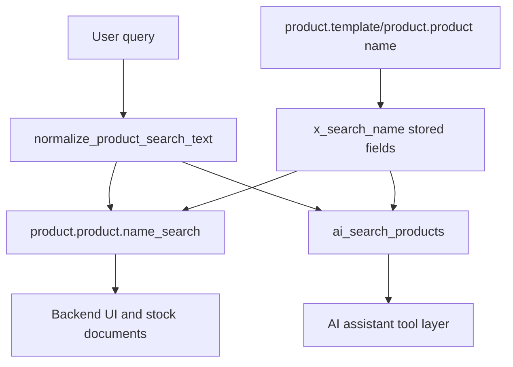
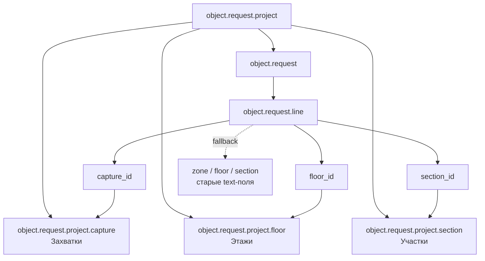
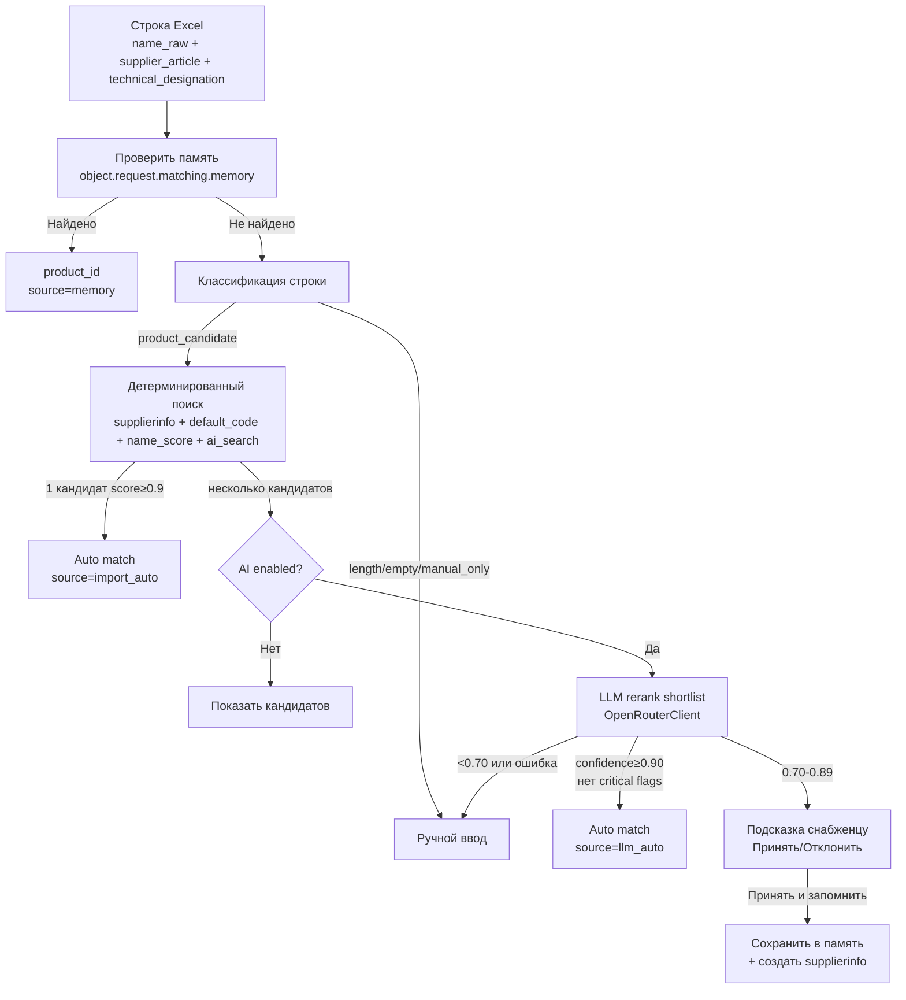
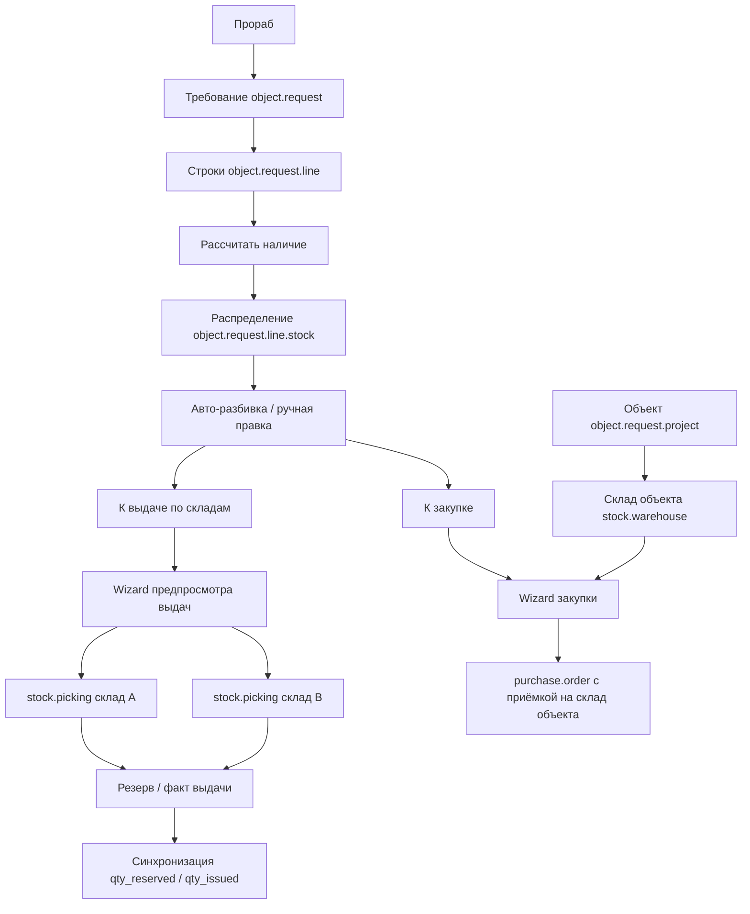
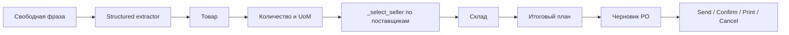
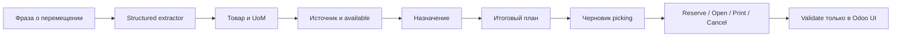
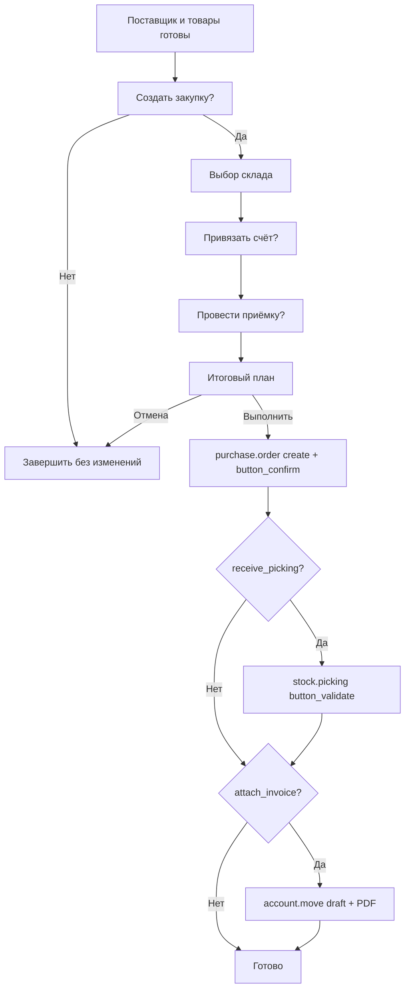
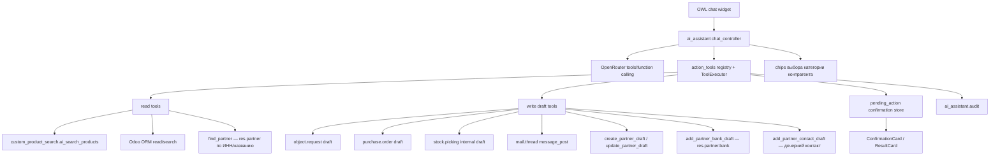

# Project Architecture

## Назначение

Проект содержит локальную разработку Odoo 19 ERP с кастомными addon в `custom_addons/`. Ядро Odoo в `odoo/` не изменяется.

## Основные компоненты

- `odoo/` — исходники Odoo 19, используются как upstream core.
- `custom_addons/ai_assistant/` — встроенный AI-ассистент через OpenAI-совместимый
  LLM API. **С 2026-07-18 провайдер — ProxyAPI** (`proxyapi.ru`, российский
  прокси-сервис с оплатой в ₽ по счёту для юрлица); ранее — OpenRouter,
  отключён из-за гео-блокировки API с egress IP прод-VPS (детали —
  `docs/deep-research-report.md`, `docs/changelog.md` [2026-07-18]). Клиент
  в коде (`services/openrouter_client.py`, класс `OpenRouterClient`) не
  переименован — переключение провайдера чисто конфигурационное
  (`ai_assistant.openrouter_base_url`, `ai_assistant.text_model`,
  `ai_assistant.vision_model`), так как ProxyAPI совместим по формату API и
  именам моделей.
- `custom_addons/object_request/` — модуль требований на комплектацию объектов.
- `custom_addons/object_request_calendar/` — автоматические календарные встречи
  по связанным требованиям после оплаты счетов поставщиков.
- `custom_addons/custom_product_search/` — нормализованный поиск товаров для backend UI, складских документов и AI-сервисного слоя.
- `docs/` — проектная документация, changelog и tasktracker.

## custom_product_search

Модуль расширяет стандартные модели `product.template` и `product.product`:

- добавляет stored computed indexed поле `x_search_name`;
- нормализует названия товаров: регистр, `ё`, NBSP, повторные пробелы, `ду 50`/`dn 50`;
- расширяет `product.product.name_search()` с актуальной сигнатурой Odoo 19;
- добавляет `post_init_hook` для `pg_trgm` и GIN trigram-индексов;
- предоставляет `ai_search_products(query, limit=20, warehouse_id=None, only_available=False)`.



## object_request

Модуль ведёт требования на комплектацию объектов. Склад не выбирается в шапке требования: при создании объекта автоматически создаётся связанный `stock.warehouse`, который используется как склад приёмки закупок. Выдача планируется на уровне строки требования через распределение `object.request.line.stock` по всем активным складам компании.

Фактическое обеспечение строки считается единообразно для двух источников:
завершённые выдачи `stock.picking` по требованию и завершённые входящие
движения связанной `purchase.order.line` на склад объекта. Поле `qty_issued`
остаётся совместимым агрегатом «Обеспечено», а диагностические поля
`qty_issued_from_stock` и `qty_received_purchase` показывают вклад склада и
закупки. Плановые поля `qty_to_issue` и `qty_to_buy` отражают только
оставшийся потребность; статус `fully_supplied` ставится только при
`qty_issued >= qty_requested`. В статусе `in_progress` нельзя добавлять и
удалять строки или менять `qty_requested` — состав фиксируется при переводе
в работу; снабженец по-прежнему правит сопоставление, `qty_to_issue` и
`qty_to_buy`.

Снабженец может вручную отметить строку **«Счёт запрошен»**
(`supplier_invoice_requested`), если выбран поставщик; товар в каталоге
не обязателен. Тогда `line_state` становится `awaiting_supplier_invoice`
(синий `decoration-info`), пока строка не отменена и не полностью
обеспечена. Статус информационный: закупку и выдачу не блокирует.
Галочку меняет только снабженец; замена уже заданного товара или
поставщика снимает отметку.

Форма требования держит основной рабочий поток на вкладке **«Строки»**:
сортировка, проверка номенклатуры, расчёт наличия, авто-разбивка и подготовка
закупки находятся в одной панели над таблицей строк. Статистика строк и статус
сопоставления показаны в шапке документа; отдельная вкладка «Обработка» не
используется.

При фокусе на пустом поле **«Поставщик»** (`preferred_vendor_id`) autocomplete
ставит в начало до 8 последних поставщиков компании по строкам требований.
Поиск по имени и domain `supplier_rank > 0` не меняются; остальные Many2one
на `res.partner` этот порядок не получают. В выпадающих списках **«Товар»** и
**«Поставщик»** пункты показываются целиком (перенос строки, без ellipsis);
при наведении видна полная подпись, включая суффикс поставщика.

### Календарные встречи после оплаты поставщику

Модуль `object_request_calendar` связывает бухгалтерский и закупочный контуры
с календарём: `account.move` (vendor bill) → строки закупки →
`purchase.order` → `object.request` → `calendar.event`. При фактическом
переходе bill в `payment_state = paid` для каждого уникального требования
создаётся отдельная встреча.

Встреча получает первый свободный рабочий слот снабженца, начиная с
`object.request.need_date`. Учитываются активные busy-события организатора и
не отклонивших приглашение участников; all-day событие блокирует весь день.
Время 09:00–16:00 рассчитывается в timezone партнёра компании и сохраняется в
UTC. Связи `calendar.event.object_request_id` и `source_bill_id`, advisory lock
и SQL UNIQUE обеспечивают трассировку и идемпотентность.

### Проектные справочники размещения строк

Размещение строк требования теперь нормализовано через независимые справочники
объекта. Ранее текстовый концепт `Зона` переименован на пользовательском уровне
в `Захватка`; старые текстовые поля сохранены только как переходный fallback для
уже существующих данных и печатных форм.



Ключевые правила:

- `object.request.project` содержит редактируемые вкладки `Захватки`, `Этажи`,
  `Участки`; значения справочников независимы для каждого объекта.
- `object.request.line` хранит новые связи `capture_id`, `floor_id`,
  `section_id`; старые `zone`, `floor`, `section` остаются переходными полями
  для данных, которые ещё не были нормализованы.
- Миграция `19.0.1.5.0` создаёт справочники по старым текстовым значениям в
  разрезе объекта и назначает Many2one-поля строкам требования.
- Печатные формы требований и выдач выводят названия Many2one-записей, а при их
  отсутствии используют старые текстовые поля как fallback.
- Действие «Отсортировать строки» упорядочивает строки по
  `Захватка → Этаж → Участок → Поставщик`, чтобы структура документа совпадала с
  логикой строительного объекта.

## LLM-Assisted Product Matching v2

Сопоставление товаров при импорте Excel-строк поддерживает трёхэтапный pipeline с использованием памяти, детерминированного поиска и LLM-ранжирования.



### Сервисы сопоставления

**`object.request.matching.candidate.service`** (AbstractModel)
- Формирует shortlist кандидатов из `product.supplierinfo`, `default_code`, token-scoring и `ai_search_products()`
- Использует `technical_designation` как контекст для combined search/scoring/LLM, но не как ключ exact matching
- Дедуплицирует по `product_id` и отдаёт лимиты: 15 для детерминированного поиска / 8 для LLM / 3 для preview импорта
- Обогащает кандидатов результатом `object.request.substitution.policy`:
  `substitution_decision`, `substitution_reason`,
  `substitution_requires_confirmation`; запрещённые замены не получают
  складской бонус и не используются как причина остановки закупки.
- Передаёт в candidate payload структурные признаки строки и товара:
  `requested_features`, `candidate_features`, DN/Ду, PN, материал, ГОСТ и
  тип соединения. Эти поля используются локальным AI shortlist и LLM rerank.
- При переданном контексте требования добавляет складские остатки в candidate
  payload и reason; строка требования сохраняет краткое объяснение в
  `matching_note` формата «Есть остаток на Ос.ск: ...».

**`object.request.substitution.policy`** (AbstractModel)
- Возвращает единый кодовый контракт правил замены:
  `allowed_with_confirmation`, `blocked`, `unknown_requires_review`.
- Для фланцев нормализует `Ду/DN/65мм` в единый диаметр и приводит
  `1,0МПа`, `PN 10`, `PN10`, `Ру10` к `PN10`, а `1,6МПа`, `PN 16`,
  `PN16`, `Ру16` к `PN16`.
- Базовые правила: семейство товара и диаметр должны совпадать строго;
  `PN10` можно заменить на `PN16`, обратная замена запрещена; явный конфликт
  материала, ГОСТ, исполнения или типа соединения блокирует замену.
- Если ключевые дополнительные признаки распознаны не полностью, кандидат
  может быть рекомендован только с ручным подтверждением снабженца.
- Автоматическая выдача или автоприменение аналога без подтверждения
  пользователя запрещены: такие кандидаты не проходят
  `auto_match_candidate()`, а при подготовке AI-кандидатов их confidence
  ограничивается ниже порога массового автоприменения.

**`object.request.llm.matching.service`** (AbstractModel)
- Принимает shortlist кандидатов, формирует prompt через `OpenRouterClient`,
  валидирует JSON-ответ.
- Prompt включает `requested_features`, `candidate_features`, остатки по
  складам выдачи и policy-решение замены, чтобы LLM предпочитал технически
  подходящий складской товар кандидату без остатка.
- Возвращает структурированный результат: `{decision, product_id, confidence, reason, risk_flags}`
- Критические флаги (`size_conflict` и т.д.) снижают confidence до ≤ 0.85
- Пост-валидация ответа дополнительно ограничивает confidence для
  `blocked`-кандидатов, конфликтов DN/PN/семейства и выбора без остатка при
  наличии равноценного складского кандидата. Замены, требующие подтверждения,
  не проходят порог массового автоприменения.

**`object.request.matching.memory`** (Model)
- Хранит подтверждённые сопоставления с полями: `name_normalized`, `designation_normalized`, `product_id`, `confirmed_by`, `source_request_id`, `confidence`, `active`
- SQL constraint `UNIQUE(name_normalized, product_id)` предотвращает дубликаты
- Используется перед LLM и детерминированным поиском: сначала ищется точное совпадение `name_normalized + designation_normalized`, затем безопасный fallback к записям без designation; при попадании возвращает `source="memory"`, `can_call_llm=False`
- Содержит идемпотентный backfill `backfill_flange_pn16_memory()`: для
  активных фланцев `PN10` / `1,0МПа` создаёт стартовую память на единственный
  безопасный фланец `PN16` того же диаметра. Если PN16-кандидатов несколько
  или policy находит конфликт, запись не создаётся.

**`object.request.product.substitute.rule`** (Model)
- Управляемый каталог допустимых аналогов с полями `product_id`,
  `substitute_product_id`, `direction`, `confirmation_policy`, `reason`,
  `note`, `company_id`, `confirmed_by`, `confirmed_date`, `usage_count`,
  `last_used_date`, `active`.
- Правило может быть `one_way` или `two_way`; двунаправленное правило работает
  в обе стороны, но обратный дубль активного `two_way` запрещён.
- Создание и изменение правила доступны снабженцу или системному
  администратору. Прораб и кладовщик могут только читать правила.
- Перед сохранением правило проверяется через
  `object.request.substitution.policy`; если базовая политика возвращает
  `blocked`, правило создать нельзя. Для `two_way` проверяются оба
  направления.
- Правила не удаляются через UI/API модели: вместо удаления используется
  `active=False`.
- В строке требования разрешённый аналог с остатком показывается отдельно от
  остатка основного товара: `substitute_product_id`,
  `substitute_stock_qty`, `substitute_stock_warehouse_names`,
  `substitute_warning_text`. `allowed_substitute_ids` используется только как
  отображение найденных правил, а не как источник истины.
- Действие **«Использовать аналог»** требует явного решения снабженца. При
  применении система записывает аналог в `product_id`, очищает предупреждение,
  пересчитывает наличие/выдачу и пишет решение в chatter требования. Отдельное
  поле фактического аналога не хранится: история замены фиксируется в
  `matching_note`, chatter и счётчиках правила.

**`object.request.product.feature.parser`** (AbstractModel)
- Единый parser технических признаков для этапов подбора, правил замен и
  аудита номенклатуры.
- Целевая схема признаков хранится на `product.template` в stored-полях:
  `or_product_family`, `or_diameter_nominal`, `or_pressure_nominal`,
  `or_material`, `or_standard`, `or_connection_type`, `or_feature_key`,
  `or_feature_parse_warning`.
- На `product.product` добавлены stored related-поля с теми же признаками,
  чтобы candidate service и отчёты могли искать по вариантам товара.
- Пилотные семейства: фланцы, прокладки, переходы, отводы, краны/клапаны,
  трубы. Для них parser распознаёт `Ду/DN/мм`, `PN/Ру/МПа`, материал,
  ГОСТ и тип соединения без автоматического переименования товаров.
- `object.request.matching.candidate.service` использует эти признаки как
  отдельный источник `feature`: кандидаты ищутся по
  `family + diameter + pressure>=requested`, а конфликт семейства или DN
  отсекается до ранжирования. Конфликт PN не скрывается полностью: policy
  оставляет такой кандидат как `blocked`, чтобы пользователь видел причину.
- `object.request.product.feature.audit.line` формирует отчёт ручной чистки
  справочника: потенциальные дубли по `family + DN + PN`, позиции пилотных
  семейств без DN/Ду и группы с конфликтующими PN для одного `family + DN`.
  Отчёт доступен из меню **Аудит номенклатуры** и через shell-скрипт
  `custom_addons/object_request/scripts/product_feature_audit.py`.

### Пороги уверенности

| Порог | Действие | Источник совпадения |
|---|---|---|
| ≥ 0.90 (LLM) + нет critical flags | Авто-применение | `llm_auto` |
| 0.70–0.89 (LLM) | Предложить снабженцу | — (подтверждение обязательно) |
| &lt; 0.70 (LLM) | Ручной ввод | — (AI не применяется) |
| &gt; 0.9 (детерминированный) | Авто-применение | `import_auto` |
| память | Авто-применение | `memory` |

Складской кандидат без конфликтов может поднять confidence до `0.90`.
Если выбранный AI/LLM-кандидат без остатка, но есть равноценный кандидат с
остатком на складе выдачи, confidence ограничивается до `≤0.85` и решение
остаётся ручным.

### Конфигурация через ir.config_parameter

| Параметр | Дефолт | Назначение |
|---|---|---|
| `object_request.ai_matching_enabled` | `True` | Включить/отключить LLM для сопоставления |
| `object_request.ai_matching_auto_threshold` | `0.90` | Минимальный confidence для автоприменения LLM |
| `object_request.ai_matching_suggest_threshold` | `0.70` | Минимальный confidence для подсказки снабженцу |
| `object_request.ai_matching_batch_size` | `50` | Максимум строк за один LLM-вызов (rate limiting) |

### Ограничения безопасности

- **LLM выбирает только из shortlist** — не может назначить произвольный товар
- **Batch size ограничивает стоимость API** — rate limiting в `action_prepare_ai_candidates`
- **AI может быть отключён** — `ai_matching_enabled=False` полностью блокирует LLM, работает только детерминированный поиск
- **Все AI-действия доступны только для `group_supply_manager`** — без специальной роли LLM не вызывается
- **Подтверждение замен доступно только `group_supply_manager`** — запись
  `allowed_substitute_ids` и действия принятия кандидатов защищены проверками
  роли снабженца; системный администратор сохраняет доступ для обслуживания.
- **Логирование в chatter** — `_post_ai_candidates_note()` записывает статистику AI в документ требования
- **Валидация параметров LLM-сервиса** — неверная конфигурация не вызывает исключение, используется graceful fallback



Ключевые правила:

- `object.request` не хранит `warehouse_id`, `check_warehouse_ids`, `stock_check_confirmed`.
- `action_check_stock` создаёт/обновляет `object.request.line.stock` по всем активным складам компании.
- `action_auto_split` использует положительный остаток склада объекта первым, затем остальные склады по доступному остатку; дефицит переносится в закупку.
- `object.request.issue.preview.wizard` создаёт по одному `stock.picking` на каждый включённый склад.
- `object.request.purchase.wizard` по умолчанию принимает закупку на `project.warehouse_id.in_type_id`.
- Перед созданием PO `object.request.purchase.wizard` проверяет строки
  `qty_to_buy`: если выбранный товар без остатка, но найден похожий складской
  кандидат, wizard блокирует закупку и предлагает **«Заменить на этот товар»**,
  **«Оставить закупку»** или **«Отмена»**. Замена пересчитывает наличие и
  переводит доступное количество в выдачу; осознанный обход пишется в chatter.
- Если для строки найден разрешённый аналог из
  `object.request.product.substitute.rule` с остатком на складах выдачи,
  закупочный wizard показывает его отдельной формулировкой как
  **разрешённый аналог**, также требует решения пользователя и логирует обход
  в chatter.
- Excel-импорт `object.request.import.wizard` определяет колонки по заголовкам,
  а не по фиксированным позициям. Поддержаны стандартный формат
  `Артикул / Наименование / Ед. / Кол-во` и формат УУТЭ
  `Наименование / Обозначение / Единица измерения / Количество`. Реальный
  артикул поставщика сохраняется только в `supplier_article`; колонка
  `Обозначение` хранится отдельно в `technical_designation`.
- Сопоставление товаров при Excel-импорте выполняется консервативно:
  нормализуются регистр, `ё/е`, NBSP, `Ду/Ру`, размеры `х/x/×` и
  десятичная запятая/точка; затем проверяются supplierinfo, артикул товара,
  точное имя и token-scoring по названию.
- `technical_designation` участвует в combined query, локальном scoring и
  LLM-shortlist как технический контекст строки, но значения вида `L=0.13`,
  `21.3`, `Ду 80`, `ГОСТ` или модельные обозначения не используются как ключи
  `product.supplierinfo.product_code` и `product.default_code`.
- `product.supplierinfo` используется как явная память подтверждённых
  сопоставлений. Записи создаются только кнопкой «Запомнить сопоставление» на
  строке требования; ручной выбор товара без этой кнопки не пополняет память.
- При наличии поставщика импорт сначала ищет supplierinfo по паре
  `product_code + partner_id`, затем по одному `product_code`. Если один
  артикул без поставщика указывает на разные товары, авто-сопоставление
  запрещается, строка остаётся `matching_required`, а товары-кандидаты
  передаются в preview как подсказка.
- Для token-scoring название разбивается на значимые токены; служебные слова и
  слишком короткие токены игнорируются. Кандидат принимается только при
  `score >= 0.7` и отрыве от второго кандидата не менее `0.15`; однословные
  запросы без артикула требуют точного совпадения имени.
- Для пилотных технических категорий shortlist дополнительно использует
  структурные признаки товара. Например `Фланец ст. Ду 65мм 1,0МПа` и
  `Фланец DN65 PN16` имеют общий `family=flange`, `DN=65`, а `PN16`
  распознаётся как допустимое повышение давления по policy.
- В UI строки требования снабженец может выполнить **«Проверить складской
  кандидат»**, затем **«Выбрать кандидата»**. Выбор явно записывает найденный
  товар в `product_id`, очищает предупреждение и фиксирует решение в
  `matching_note`. При ручном изменении `product_id` onchange сразу обновляет
  предупреждение о похожем товаре с остатком.
- Production-объекты снабжения: `O001` — Ломоносова 164 (warehouse id `10`) и `O002` — Б. Хмельницкого, 112 (warehouse id `16`).
- Новые объектные склады создаются только через `Комплектация объектов → Объекты`; ручное создание `stock.warehouse` для объектов запрещено регламентом.
- Legacy-запросы `ОбМ-2` и `ОбМ-4` временно поддерживаются AI Assistant как aliases на `O001` и `O002`.

## Переопределения UI при обновлении Odoo

Часть англоязычных подписей стандартного интерфейса переопределена в
`custom_addons/` (ядро `odoo/` не меняется). **После обновления версии Odoo**
нужно проверить, что upstream-файлы не изменились настолько, что xpath или
OWL-наследование перестали применяться.

| Подпись в UI | Модуль | Файл проекта | Upstream (Odoo 19) |
|--------------|--------|--------------|---------------------|
| На складе / Доступно | `stock_qty_labels_ru` | `views/product_qty_labels_views.xml` | `stock/views/*`, kanban, forecast |
| Отправить запрос | `object_request` | `views/purchase_order_inherit_views.xml` | `purchase/views/purchase_views.xml` — `action_rfq_send`, `invisible="state != 'draft'"` / `state != 'sent'` |
| Получатели заявки (RFQ) | `object_request` | `data/purchase_mail_template.xml`, `models/purchase_order_ext.py` | `purchase.email_template_edi_purchase`: поставщик + партнёр компании (`675001@mail.ru`); без кнопки портала / P00xxx / срока в шапке |
| Отправить заказ | `object_request` | `views/purchase_order_inherit_views.xml` | `purchase/views/purchase_views.xml` — `action_rfq_send`, `invisible="state != 'purchase'"` |
| Поставщик принял заказ | `object_request` | `views/purchase_order_inherit_views.xml` | `purchase/views/purchase_views.xml` — `action_acknowledge` |
| Получить | `object_request` | `views/purchase_order_inherit_views.xml` (inherit `purchase_stock`) | `purchase_stock/views/purchase_views.xml` — `action_view_picking` |
| Объект / Склад в списке закупок | `object_request` | `views/purchase_order_inherit_views.xml` | `purchase/views/purchase_views.xml` — `purchase_order_tree`, `purchase_order_kpis_tree`, `purchase_order_view_tree`, `purchase_history_tree` |
| Загрузить счёт | `object_request` | `static/src/components/purchase_file_uploader/purchase_file_uploader.xml` | `purchase/static/src/components/purchase_file_uploader/` — `Upload Bill` |

**Чеклист после `-u` или смены образа Odoo:**

1. Открыть форму закупки (RFQ и подтверждённый PO) — проверить подписи и подсказки кнопок (наведение мыши).
2. На подтверждённом PO проверить «Загрузить счёт», «Получить», «Поставщик принял заказ».
3. Открыть список товаров на складе — проверить «На складе» / «Доступно».
4. Открыть список заказов на закупку и смарт-кнопку «Закупки» на товаре — колонки «Объект» и «Склад».
5. При ошибках загрузки assets — обновить xpath в указанных файлах по актуальному upstream.

Команда upgrade после деплоя:

```bash
docker compose exec odoo odoo -c /etc/odoo/odoo.conf -d ${POSTGRES_DB} -u object_request,stock_qty_labels_ru --stop-after-init
docker compose restart odoo
```

## Правила безопасности

- Кастомные addon не меняют Odoo core.
- Поиск товаров выполняется через стандартные ORM `search`, `search_fetch`, `read`.
- `ai_search_products()` не использует `sudo()` для поиска и чтения результатов, чтобы сохранить ACL и record rules текущего пользователя.
- Секреты OpenRouter и конфиги с паролями не фиксируются в документации и git.

## ai_assistant v3 actions

AI Assistant v3 добавляет ограниченный tool layer для снабжения. Tools работают
через allowlist, denylist, JSON schema validation, frontend confirmation cards,
rate limits и audit. AI создаёт только черновики и заметки; Confirm/Validate
остаются ручными действиями пользователя в Odoo UI.

Новые многошаговые рабочие диалоги проектируются по общему правилу
[`ai-assistant-workflow-dialogs.mdc`](../.cursor/rules/ai-assistant-workflow-dialogs.mdc):
structured LLM-extraction, детерминированная state-machine, server-authoritative
сессия и ID, явное подтверждение, единый контракт карточек и обязательная
матрица backend/frontend-тестов.

### Пополнение товара через чат

`ReplenishmentIntentExtractor` выполняет отдельный structured LLM-вызов без
tools и возвращает только текстовые поля запроса. `ReplenishmentWorkflow`
детерминированно резолвит товар, количество/UoM, применимое предложение
`product.supplierinfo` и склад. Для каждого поставщика предложение выбирается
штатным `_select_seller()`, количество округляется в purchase UoM, а скидки и
валюты проверяются до итоговой карточки.

Состояние хранится в process-local `ReplenishmentSessionStore` с TTL. До создания
PO frontend использует active token; после выполнения token остаётся только в
ResultCard для четырёх whitelist-действий `/ai_assistant/po_action`. Цель действия
всегда берётся из server-side session, а не из присланного frontend `po_id`.



### Перемещение товара между складами через чат

Сценарий moving использует ту же гибридную границу ответственности: structured
LLM-extractor распознаёт дословные параметры исходной фразы, а
детерминированный workflow резолвит товар и склады, конвертирует UoM, считает
доступный остаток и управляет переходами. LLM не получает record ID и не
создаёт складские документы через общий ToolRegistry.

Диалог построен по принципу button-first. Каждый нетерминальный ответ показывает
короткое пояснение и полный набор допустимых кнопок текущего состояния.
Свободный текст заполняет только ожидаемое поле; непонятный ответ не изменяет
server-side session и повторно показывает текущий вопрос с теми же кнопками.
Создание документа запускает только action `moving_execute_plan`, а не текстовое
«да» или «создавай».

Перед Execute backend повторно проверяет ACL, текущую компанию, товар, UoM,
локации и доступный остаток в `lot_stock_id` источника вместе с его внутренними
дочерними локациями. Результат — один draft `stock.picking` внутреннего типа.
Из ResultCard разрешены только явные server-authoritative действия Reserve,
Open, Print и Cancel. Validate, фактическое количество, партии/серийные номера и
backorder остаются в стандартном интерфейсе Odoo.



Workflow включается отдельным параметром `ai_assistant.moving_enabled` поверх
глобальных `ai_assistant.enabled` и `ai_assistant.actions_enabled` и требует
группы «AI Assistant / Снабжение» и Stock User. Текущее TTL-хранилище сессий и
execute-lock является process-local; переход на DB/Redis и распределённый
execute-once отслеживается в [TD-011](technical-debt.md#td-011-production-hardening-многошаговых-workflow-ai-ассистента).

### Закупка по загруженному счёту

После загрузки PDF-счёта чат ведёт отдельную детерминированную state machine в
`InvoiceWorkflow`, а не свободный LLM-диалог. Состояние хранится в
`InvoiceExtractionStore.session.purchase_flow`, поэтому после перезагрузки
страницы frontend восстанавливает `extraction_token` и состояние сценария из
session storage, а источником истины остаётся backend session.

Сценарий запускается только когда поставщик найден или создан, и каждая строка
счёта сопоставлена с карточкой товара. Далее пользователь отвечает кнопками:

1. `invoice_po_start` — создать закупку или завершить сценарий без изменений.
2. `invoice_po_select_warehouse` — выбрать склад кнопкой или текстом через
   `FindWarehouseTool`; неоднозначный поиск возвращает варианты.
3. `invoice_po_set_attach_invoice` — сохранить решение по PDF-вложению.
4. `invoice_po_set_receive_picking` — сохранить решение по приёмке.
5. `invoice_po_execute_plan` — выполнить итоговый план.

До финального `Выполнить` не создаются `purchase.order`, `account.move`,
`ir.attachment` и не проводится `stock.picking`. Финальный запуск выполняет
выбранные действия в порядке: создать PO из `_build_po_args()` через
валидированный `CreatePurchaseOrderDraftTool`, вызвать
`purchase.order.button_confirm()`, провести входящую приёмку через
`stock.picking.button_validate()` при `receive_picking=True`, затем при
`attach_invoice=True` создать черновик vendor bill
(`purchase.order.action_create_invoice` или bill по заказанному количеству,
если qty_to_invoice ещё 0) и прикрепить исходный PDF к PO и к
`account.move`. Счёт не проводится. Повторный запуск использует сохранённые
`po_id` / `bill_id` и поиск attachment, поэтому не создаёт дубликаты.



Сценарий контрагентов расширяет тот же tool layer:

- `create_partner_draft` создаёт нового `res.partner` только после поиска
  дубликата по ИНН и выбора категории.
- `update_partner_draft` дополняет существующего контрагента только по пустым
  полям, не меняет ИНН, добавляет тег категории и повышает ранги.
- `add_partner_bank_draft` и `add_partner_contact_draft` работают через
  плоские валидируемые параметры; denylist executor для сырых `bank_ids`,
  `child_ids`, `category_id` не ослаблен.
- Категории `Поставщик`, `Заказчик`, `Покупатель`, `Подрядчик` централизованы
  в validators и синхронизированы с workflow `.cursor/skills/odoo-add-partner`.


