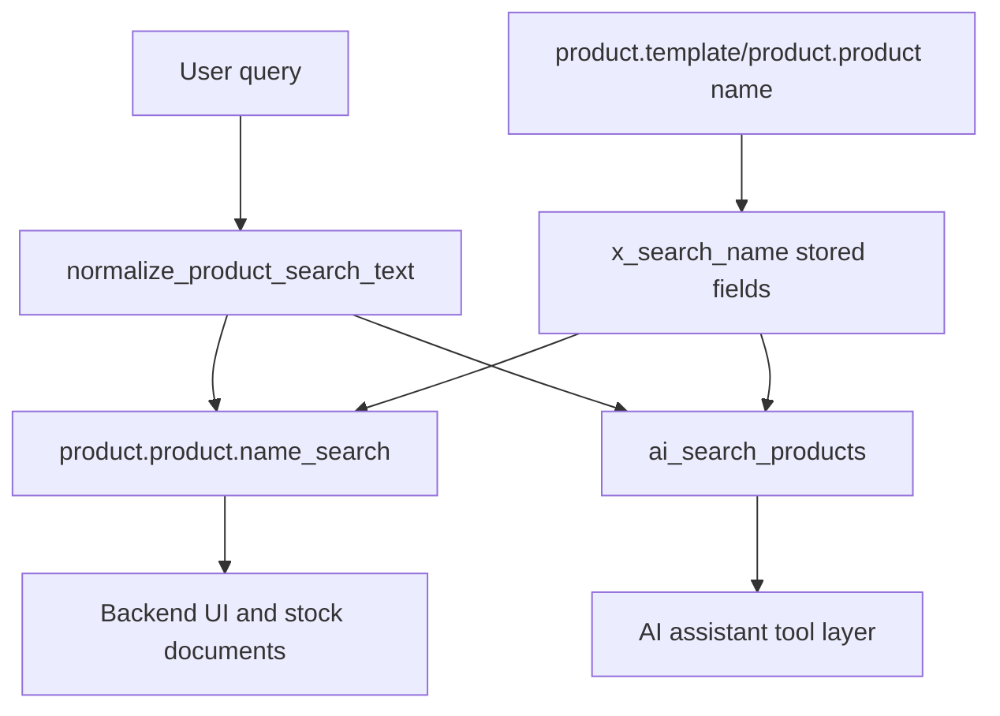
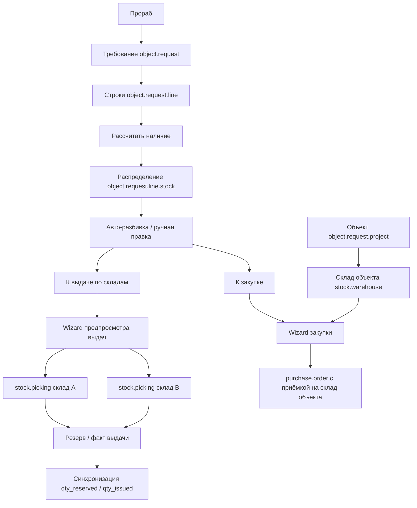

# Project Architecture

## Назначение

Проект содержит локальную разработку Odoo 19 ERP с кастомными addon в `custom_addons/`. Ядро Odoo в `odoo/` не изменяется.

## Основные компоненты

- `odoo/` — исходники Odoo 19, используются как upstream core.
- `custom_addons/ai_assistant/` — встроенный AI-ассистент через OpenRouter API.
- `custom_addons/object_request/` — модуль требований на комплектацию объектов.
- `custom_addons/custom_product_search/` — нормализованный поиск товаров для backend UI, складских документов и AI-сервисного слоя.
- `docs/` — проектная документация, changelog и tasktracker.

## custom_product_search

Модуль расширяет стандартные модели `product.template` и `product.product`:

- добавляет stored computed indexed поле `x_search_name`;
- нормализует названия товаров: регистр, `ё`, NBSP, повторные пробелы, `ду 50`/`dn 50`;
- расширяет `product.product.name_search()` с актуальной сигнатурой Odoo 19;
- добавляет `post_init_hook` для `pg_trgm` и GIN trigram-индексов;
- предоставляет `ai_search_products(query, limit=20, warehouse_id=None, only_available=False)`.

## object_request

Модуль ведёт требования на комплектацию объектов. Склад не выбирается в шапке требования: при создании объекта автоматически создаётся связанный `stock.warehouse`, который используется как склад приёмки закупок. Выдача планируется на уровне строки требования через распределение `object.request.line.stock` по всем активным складам компании.

Ключевые правила:

- `object.request` не хранит `warehouse_id`, `check_warehouse_ids`, `stock_check_confirmed`.
- `action_check_stock` создаёт/обновляет `object.request.line.stock` по всем активным складам компании.
- `action_auto_split` использует положительный остаток склада объекта первым, затем остальные склады по доступному остатку; дефицит переносится в закупку.
- `object.request.issue.preview.wizard` создаёт по одному `stock.picking` на каждый включённый склад.
- `object.request.purchase.wizard` по умолчанию принимает закупку на `project.warehouse_id.in_type_id`.

## Правила безопасности

- Кастомные addon не меняют Odoo core.
- Поиск товаров выполняется через стандартные ORM `search`, `search_fetch`, `read`.
- `ai_search_products()` не использует `sudo()` для поиска и чтения результатов, чтобы сохранить ACL и record rules текущего пользователя.
- Секреты OpenRouter и конфиги с паролями не фиксируются в документации и git.
