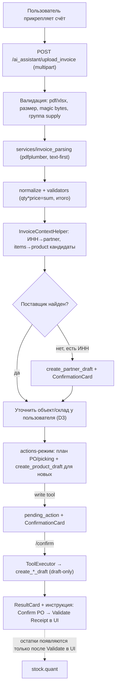

# Roadmap: AI-ассистент v3 — Приёмка товаров из счёта (Invoice → Склад)

**Дата создания:** 2026-05-30
**Базовый модуль:** `custom_addons/ai_assistant/`
**Связанные документы:**
- [`tasktracker_ai_assistant_v3.md`](tasktracker_ai_assistant_v3.md) — задачи AIA-054…060 (этап V3-10)
- [`instruction-warehouse-supply-cycle.md`](instruction-warehouse-supply-cycle.md) — целевой цикл OR → PO/INT → Validate
- [`roadmap_ai_assistant_v3_actions.md`](roadmap_ai_assistant_v3_actions.md) — границы actions-режима (§1.3)
- `.cursor/skills/odoo-supplier-from-invoice/SKILL.md` — разбор счёта, поставщик

---

## 1. Цель

Дать чат-ассистенту сквозную возможность **добавления товаров на склад из счёта поставщика**:

1. Пользователь **прикрепляет файл счёта** (PDF/XLSX) прямо в чат.
2. Ассистент **извлекает и нормализует** данные счёта (порт логики `invoice-extractor` внутрь Odoo).
3. Ассистент **выполняет разрешённые команды через API** — готовит черновики (`product.product`, `purchase.order`/`stock.picking`) с подтверждением.
4. Ассистент **даёт пошаговые инструкции в UI** для завершения (Confirm PO → Validate Receipt), которые остаются за человеком.

Остатки (`stock.quant`) появляются **только** после штатного Validate в UI — денилист actions-режима не меняется.

---

## 2. Принятые решения

| # | Решение | Выбор | Следствие |
|---|---------|-------|-----------|
| D1 | Где парсить счёт | **Внутри Odoo** (порт логики, без внешней сети) | Нет HTTP-зависимости; pdfplumber как external dependency |
| D2 | Позиции без совпадения | **Авто-черновик товара** `create_product_draft` + подтверждение | Новый write-tool в supply-группе |
| D3 | Склад приёмки | **Всегда уточнять** объект/склад у пользователя | Промпт не подставляет склад по умолчанию |
| D4 | Фиксация плана | Документировать (этот файл + трекер) | — |

---

## 3. Что уже есть (переиспользуем)

- **Режимы** `consult`/`actions` в `prompt_builder.py`; `_ACTIONS_RULES_BLOCK`.
- **Write-tools** draft-only: `create_purchase_order_draft`, `create_internal_picking_draft`, `create_object_request_draft`, `post_chatter_note`.
- **Read-tools**: `search_products`, `find_partner`, `find_warehouse`, `find_picking_type`, `search_stock_quants`, `read_object_request`.
- **Цикл tool-calling** в `chat_controller.py::_get_tools_response` (до 5 итераций), `pending_action` → `ConfirmationCard` → `/ai_assistant/confirm` → `ToolExecutor`.
- **Денилист/guard** в `ToolExecutor`: запрет `button_confirm`/`button_validate`/`state`, rate-limit, idempotency, audit.
- **Приём изображений** (скриншоты base64 ≤500 КБ, vision) — частичная инфраструктура вложений.
- **Валидаторы**: `validate_partner_is_supplier`, `validate_picking_type_is_object`, `validate_product_is_storable`, `validate_uom_is_meter`.
- **Контекст-хелперы** (`NavigationHelper`, `WarehouseStockLinkHelper`) — образец инъекции данных в сообщения LLM.

## 4. Что добавляем (gap)

| Требование | Новый компонент |
|---|---|
| 1. Загрузка файла | Кнопка-скрепка в `ai_chat_widget.xml` + `/ai_assistant/upload_invoice` (multipart) |
| 2. Извлечение | `services/invoice_parsing/` (порт `extractor`/`invoice_utils`/`normalizer`/`validators`) |
| 3. Команды | `create_partner_draft` для неизвестного поставщика, `create_product_draft` для новых товаров, `InvoiceContextHelper` (инъекция данных в промпт) |
| 4. Инструкции UI | Обогащение `ResultCard.next_hint` + правило в `_ACTIONS_RULES_BLOCK` |

---

## 5. Целевой поток

---

## 6. Этапы и задачи (V3-10)

Детальные карточки задач — в [`tasktracker_ai_assistant_v3.md`](tasktracker_ai_assistant_v3.md), этап **V3-10**.

| ID | Задача | Приоритет | Зависит от |
|---|---|---|---|
| AIA-054 | External dependency `pdfplumber` + установка в образ | Критический | — |
| AIA-055 | Порт парсера счетов в `services/invoice_parsing/` | Критический | AIA-054 |
| AIA-056 | Эндпоинт `/ai_assistant/upload_invoice` + кнопка-скрепка в виджете | Критический | AIA-055 |
| AIA-057 | `InvoiceContextHelper` + инъекция данных счёта в промпт | Критический | AIA-055, AIA-056 |
| AIA-058 | Write-tool `create_product_draft` (D2) | Высокий | AIA-031, AIA-032 |
| AIA-059 | Обогащение `ResultCard` инструкциями UI (Confirm → Validate) | Средний | AIA-057, AIA-058 |
| AIA-060 | E2E-тест «НФ-504 → PO draft» | Высокий | AIA-055..058 |
| AIA-061 | Создание неизвестного поставщика из счёта (`create_partner_draft`) | Высокий | AIA-056..060 |

---

## 7. Запрещено (границы)

- Не вызывать `button_confirm`, `button_validate`, не писать `state`, не использовать инвентаризацию (денилист `ToolExecutor` не ослабляется).
- Не создавать vendor bill / оплаты в Odoo (бухгалтерия — в 1С).
- Не подставлять склад приёмки «по умолчанию» — всегда уточнять объект (D3).
- Не логировать содержимое счёта (PII): только метаданные (число строк, сумма).
- Загрузка файлов — только для группы `ai_assistant.group_ai_assistant_supply`.

## 8. Риски

| Риск | Митигизация |
|---|---|
| `pdfplumber` отсутствует в образе Odoo | external_dependencies + Dockerfile/инструкция установки (AIA-054) |
| Скан-PDF без текстового слоя | v1 — text-first; vision-fallback через существующий `OpenRouterClient` — [`TD-005`](technical-debt.md#td-005-vision-fallback-парсинга-счетов-через-существующий-openrouterclient) |
| Неверное сопоставление позиций | Авто-товар только с подтверждением; позиции-кандидаты показываются пользователю |
| Дубли товаров при создании | idempotency_key + проверка по имени/категории перед созданием |
| Неизвестный поставщик блокирует PO | `create_partner_draft` с обязательным ИНН, проверкой дубля по `vat` и ConfirmationCard до товаров/PO |
| Размер/тип файла | Валидация на эндпоинте (расширение, magic bytes, лимит) |

---

## 9. Критерии приёмки (по требованиям пользователя)

1. **Загрузка**: счёт НФ-504 (PDF) прикрепляется в чат, ассистент показывает сводку (14 позиций, 72 096,22 ₽).
2. **Извлечение**: поставщик распознан по ИНН; если его нет в Odoo, сначала предлагается `create_partner_draft`; позиции сопоставлены с номенклатурой, мусорные строки отфильтрованы.
3. **Команды**: создан черновик поставщика при необходимости, затем черновик `purchase.order` (после уточнения склада и подтверждения), недостающий товар — через `create_product_draft`.
4. **Инструкции**: ResultCard содержит шаги Confirm PO → открыть Приход → Provести (Validate) + напоминание про оплату в 1С.
