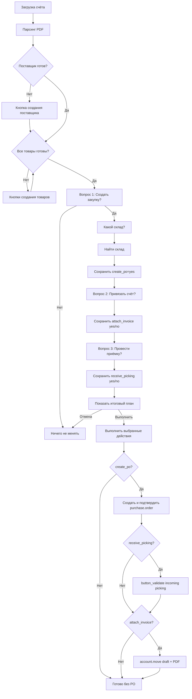

# Task Tracker: AI-ассистент v3 — интерактивная закупка по счёту

**Дата создания:** 2026-06-25
**Статус:** Выполнено
**Модуль:** `custom_addons/ai_assistant`
**Основной сценарий:** загрузка счёта в чат → проверка поставщика и товаров → сбор решений по трём вопросам → выбор склада при необходимости → выполнение только выбранных действий.

---

## Цель

Реализовать в чате AI-ассистента пошаговый сценарий после загрузки счёта: ассистент определяет поставщика, проверяет наличие карточек товаров, создаёт недостающие карточки по существующему workflow, а затем предлагает пользователю продолжить до закупки через кнопки подтверждения.

Все действия, которые меняют данные Odoo, должны выполняться только после явного подтверждения пользователя. AI-ассистент сначала задаёт все вопросы по сценарию, сохраняет ответы, показывает итоговый план, а затем выполняет только действия, на которые пользователь ответил «Да».

## Пользовательский сценарий

1. Пользователь загружает счёт в чат.
2. AI-ассистент распознаёт счёт, определяет поставщика и проверяет товары.
3. Если поставщик отсутствует, ассистент предлагает создать поставщика.
4. Если товаров нет в номенклатуре, ассистент предлагает создать карточки товаров.
5. После готовности поставщика и всех товаров ассистент задаёт первый вопрос **«Создать закупку?»** с кнопками **«Да»** / **«Нет»**.
6. Если ответ **«Нет»**, ассистент завершает сценарий и больше ничего не спрашивает и не выполняет.
7. Если ответ **«Да»**, ассистент спрашивает **«Какой склад?»** и показывает быстрые варианты складов, если они известны.
8. После определения склада ассистент фиксирует решение: **«Создать закупку на склад ...»**.
9. Затем ассистент спрашивает **«Привязать счёт?»** с кнопками **«Да»** / **«Нет»** и сохраняет ответ.
10. Затем ассистент спрашивает **«Провести приёмку на склад?»** с кнопками **«Да»** / **«Нет»** и сохраняет ответ.
11. После всех трёх вопросов ассистент показывает итоговый план выбранных действий и кнопку **«Выполнить»**.
12. После нажатия **«Выполнить»** ассистент выполняет только пункты с ответом «Да» в безопасном порядке: создать/подтвердить закупку → провести приёмку (если «Да») → создать vendor bill и прикрепить PDF (если «Да» на «Привязать счёт?»).

## Правила отказа

- **Нет на «Создать закупку?»**: сценарий сразу завершается; ассистент не задаёт вопросы про склад, привязку счёта и приёмку, и ничего не меняет в Odoo.
- **Нет на «Привязать счёт?»**: ассистент сохраняет решение и после финального запуска не создаёт `account.move` и не прикрепляет PDF.
- **Нет на «Провести приёмку на склад?»**: ассистент сохраняет решение и после финального запуска оставляет входящую приёмку непроведённой.
- **Нет на итоговое «Выполнить?» / отмена:** ассистент ничего не меняет в Odoo, даже если ранее были ответы «Да».

## Архитектурное решение

Сценарий нужно реализовать как явную state machine для invoice workflow, а не как свободный текстовый диалог LLM. LLM может помогать с интерпретацией запроса, но сбор решений, итоговый план и порядок write-операций должны быть детерминированными.



## Контекст для реализации

- `custom_addons/ai_assistant/controllers/chat_controller.py` — endpoints `/ai_assistant/upload_invoice`, `/ai_assistant/chat`, dispatch invoice workflow, pending confirmations.
- `custom_addons/ai_assistant/services/invoice_workflow.py` — текущая логика сессии счёта, поставщика, товаров и подготовки `po_args`.
- `custom_addons/ai_assistant/services/invoice_extraction_store.py` — хранение распознанного счёта и session state.
- `custom_addons/ai_assistant/services/action_tools/write_tools.py` — текущий `create_purchase_order_draft` и write tools.
- `custom_addons/ai_assistant/services/action_tools/validators.py` — проверки поставщика, склада, товаров и picking type.
- `custom_addons/ai_assistant/static/src/js/ai_chat_boot.js` — состояние чата, suggestions, cards, отправка workflow actions.
- `custom_addons/ai_assistant/static/src/js/ai_chat_service.js` — вызовы `/ai_assistant/upload_invoice`, `/ai_assistant/chat`, `/ai_assistant/confirm`.
- `custom_addons/ai_assistant/static/src/xml/ai_chat_widget.xml` — отображение кнопок, confirmation cards и result cards.
- `custom_addons/ai_assistant/tests/test_invoice_workflow.py` — unit-тесты invoice workflow.
- `custom_addons/ai_assistant/tests/test_chat_controller.py` — controller-тесты invoice workflow и cards.
- `docs/instruction-warehouse-supply-cycle.md` — регламент: подтверждение закупки и приёмка только через стандартные методы Odoo.

## Запрещено

- Нельзя создавать, подтверждать закупку, прикреплять счёт или проводить приёмку до того, как пользователь ответил на все три вопроса и подтвердил итоговый план выполнения.
- Нельзя проводить приёмку прямой записью `state = done`; только `button_validate` и штатные wizard Odoo.
- Нельзя использовать `sudo()` для обхода прав пользователя в write-сценарии.
- Нельзя логировать содержимое счёта, банковские реквизиты, токены сессии или полный OCR-текст.
- Нельзя автоматически выбирать склад, если найдено несколько совпадений.
- Нельзя создавать закупку, если поставщик или хотя бы одна позиция товара не готовы.

---

## Задача: AIA-057 — Описать state machine закупки по счёту

- **Статус:** Выполнена
- **Приоритет:** Критический
- **Описание:** Добавить в `InvoiceWorkflow` явные состояния сценария после готовности поставщика и товаров: сбор решения о закупке, немедленное завершение при `create_po=no`, выбор склада при `create_po=yes`, сбор решения о вложении, сбор решения о приёмке, итоговый план, выполнение, завершение.
- **Шаги выполнения:**
 - [x] Зафиксировать список состояний в константах `InvoiceWorkflow`.
 - [x] Добавить структуру session state в `InvoiceExtractionStore`: `purchase_flow`.
 - [x] Сохранять выбранный склад, будущий/созданный `po_id`, решения `create_po`, `attach_invoice` и `receive_picking`.
 - [x] Добавить helper `current_purchase_flow_state(uid, extraction_token)`.
 - [x] Добавить helper сброса purchase flow при очистке сессии или новом счёте.
- **Зависимости:** Нет.
- **DoD:** Состояние сценария можно восстановить после перезагрузки страницы чата.

## Задача: AIA-058 — Кнопка «Создать закупку?» после готовности счёта

- **Статус:** Выполнена
- **Приоритет:** Критический
- **Описание:** После создания/нахождения поставщика и всех карточек товаров показывать пользователю первый вопрос **«Создать закупку?»** и сохранять только решение, без write-операций.
- **Шаги выполнения:**
 - [x] Заменить текущую подсказку `Создать закупку на склад` на новый первый шаг `Создать закупку?`.
 - [x] Добавить action `invoice_po_start`.
 - [x] При `invoice_po_start = yes` сохранить `create_po=True` и перевести flow в состояние `awaiting_warehouse`.
 - [x] При `invoice_po_start = no` сохранить `create_po=False`, завершить purchase flow и не показывать вопросы про склад, привязку счёта и приёмку.
 - [x] Добавить controller-тест, что кнопка появляется только когда поставщик и товары готовы.
- **Зависимости:** AIA-057.
- **DoD:** После загрузки счёта и готовности данных в чате появляется кнопка **«Создать закупку?»**, но закупка ещё не создаётся.

## Задача: AIA-059 — Выбор склада через чат

- **Статус:** Выполнена
- **Приоритет:** Критический
- **Описание:** Реализовать шаг **«Какой склад?»** с поиском склада по коду/названию и быстрыми кнопками для известных складов.
- **Шаги выполнения:**
 - [x] Использовать существующий `FindWarehouseTool` для поиска склада по тексту пользователя.
 - [x] Добавить action `invoice_po_select_warehouse`.
 - [x] Если склад не найден, повторить вопрос с понятной ошибкой.
 - [x] Если найдено несколько складов, показать варианты кнопками и не выбирать автоматически.
 - [x] Если найден один склад, сохранить `warehouse_id`, `warehouse_name`, `picking_type_id`.
 - [x] Добавить тесты для точного совпадения, отсутствия склада и нескольких совпадений.
- **Зависимости:** AIA-057, AIA-058.
- **DoD:** Пользователь может выбрать склад кнопкой или текстом; неоднозначный выбор не приводит к созданию PO.

## Задача: AIA-060 — Сбор решений без немедленного выполнения

- **Статус:** Выполнена
- **Приоритет:** Критический
- **Описание:** После определения склада последовательно задать вопросы **«Привязать счёт?»** и **«Провести приёмку на склад?»**, сохранить ответы и не выполнять write-операции до финального подтверждения итогового плана.
- **Шаги выполнения:**
 - [x] Добавить actions `invoice_po_set_attach_invoice` и `invoice_po_set_receive_picking`.
 - [x] Сохранять ответы `attach_invoice=True/False` и `receive_picking=True/False` в `purchase_flow`.
 - [x] Не запускать этот этап, если на вопрос **«Создать закупку?»** пользователь ответил **«Нет»**.
 - [x] После третьего вопроса формировать краткий итоговый план: поставщик, склад, номер счёта, строки, сумма, выбранные действия.
 - [x] Показать кнопку **«Выполнить»** и кнопку отмены.
- **Зависимости:** AIA-059.
- **DoD:** До нажатия итоговой кнопки **«Выполнить»** в Odoo не создаются PO, attachment или приёмка.

## Задача: AIA-061 — Выполнение выбранных действий единым запуском

- **Статус:** Выполнена
- **Приоритет:** Критический
- **Описание:** После итогового подтверждения выполнить только выбранные пользователем действия в безопасном порядке: создать/подтвердить PO, привязать счёт, провести приёмку.
- **Шаги выполнения:**
 - [x] Добавить action `invoice_po_execute_plan`.
 - [x] Решить, расширять ли `CreatePurchaseOrderDraftTool` параметром `confirm=true` или добавить отдельный tool/service `create_and_confirm_purchase_order`.
 - [x] Если `create_po=True`, создать строки PO из `InvoiceWorkflow._build_po_args`.
 - [x] Если `create_po=True`, вызвать `purchase.order.button_confirm()` после создания PO.
 - [x] Если `attach_invoice=True`, создать вложение счёта к созданной или выбранной PO.
 - [x] Если `receive_picking=True`, найти incoming picking и провести его через `button_validate`.
 - [x] Проверять, что приёмка невозможна без подтверждённой PO, и возвращать понятную ошибку до write-операций.
 - [x] Записать в chatter итоговый план и фактически выполненные шаги.
 - [x] Вернуть result card со ссылками на PO, attachment и picking, если они были созданы/проведены.
- **Зависимости:** AIA-060.
- **DoD:** После финального запуска выполнены только действия с ответом «Да»; действия с ответом «Нет» не выполнялись.

## Задача: AIA-062 — Вопрос «Привязать счёт?»

- **Статус:** Выполнена (2026-08-19: bill + PDF)
- **Приоритет:** Высокий
- **Описание:** Подготовить техническую операцию привязки счёта, которая вызывается только на этапе `invoice_po_execute_plan`, если пользователь заранее ответил «Да» на вопрос **«Привязать счёт?»**.
- **Шаги выполнения:**
 - [x] Сохранять в invoice session исходное имя файла и безопасный доступ к bytes/attachment source.
 - [x] Не создавать attachment в момент ответа на вопрос; только сохранить решение `attach_invoice=True`.
 - [x] На этапе выполнения создать `ir.attachment` с `res_model='purchase.order'`, `res_id=po_id`, `mimetype='application/pdf'`.
 - [x] При повторном запуске искать существующее вложение по `res_model`, `res_id`, `name`, чтобы не плодить дубликаты.
 - [x] Создавать черновик vendor bill (`account.move`, `in_invoice`) штатным `action_create_invoice` (или по заказанному qty, если приёмки ещё нет); PDF копировать на bill и публиковать в chatter; номер/дату счёта писать в `ref` / `invoice_date`. Счёт не проводить (`action_post` нет).
- **Зависимости:** AIA-061.
- **DoD:** После «Да» и **«Выполнить»** есть draft vendor bill, связанный с PO, и PDF виден во вложениях счёта (и копия на PO).

## Задача: AIA-063 — Вопрос «Провести приёмку на склад?»

- **Статус:** Выполнена
- **Приоритет:** Критический
- **Описание:** Подготовить техническую операцию приёмки, которая вызывается только на этапе `invoice_po_execute_plan`, если пользователь заранее ответил «Да» на вопрос **«Провести приёмку на склад?»**.
- **Шаги выполнения:**
 - [x] Не проводить приёмку в момент ответа на вопрос; только сохранить решение `receive_picking=True`.
 - [x] На этапе выполнения найти incoming picking по `purchase_id`.
 - [x] Заполнить `quantity` по `product_uom_qty` для всех stock moves.
 - [x] Вызвать `stock.picking.button_validate()`.
 - [x] Обработать штатный wizard immediate transfer/backorder, если Odoo его вернёт.
 - [x] Вернуть result card со ссылками на PO и picking.
- **Зависимости:** AIA-061, AIA-062.
- **DoD:** Приёмка проводится только после ответа «Да» и финального нажатия **«Выполнить»**; итоговый picking имеет `state='done'`.

## Задача: AIA-064 — UI-кнопки Да/Нет и варианты складов

- **Статус:** Выполнена
- **Приоритет:** Высокий
- **Описание:** Доработать фронтенд чата, чтобы сценарий поддерживал простые inline-кнопки **«Да»**, **«Нет»**, **«Создать закупку?»**, варианты складов и финальную кнопку **«Выполнить»**.
- **Шаги выполнения:**
 - [x] Расширить формат `suggestions`: `label`, `action`, `payload`.
 - [x] Обновить `onMessageSuggestion()` для передачи action payload в `/ai_assistant/chat`.
 - [x] Сохранять `extractionToken` и purchase flow state в session storage.
 - [x] Обновить тексты кнопок: `Создать закупку?`, `Да`, `Нет`, `Какой склад?`, `Выполнить`.
 - [x] Добавить визуальное отображение выбранного склада в сообщении ассистента.
- **Зависимости:** AIA-058, AIA-059, AIA-060, AIA-062, AIA-063.
- **DoD:** Пользователь может пройти весь сценарий только кликами, кроме случаев ручного уточнения склада.

## Задача: AIA-065 — Безопасность, права и идемпотентность

- **Статус:** Выполнена
- **Приоритет:** Критический
- **Описание:** Защитить сценарий от несанкционированных write-операций, повторных подтверждений, устаревших кнопок и выполнения неполного плана.
- **Шаги выполнения:**
 - [x] Все write actions разрешить только группе `ai_assistant.group_ai_assistant_supply`.
 - [x] Проверять принадлежность `extraction_token` текущему пользователю.
 - [x] Запрещать `invoice_po_execute_plan`, пока не собраны все обязательные решения.
 - [x] Хранить `po_id` в session state после создания и не создавать второй PO при повторном клике.
 - [x] Для вложения использовать idempotency по `po_id + filename`.
 - [x] Для приёмки проверять `state != done` перед `button_validate`.
 - [x] Для устаревших кнопок возвращать понятное сообщение: «Сценарий уже завершён / действие уже выполнено».
 - [x] Добавить audit/chatter note на PO по каждому выполненному шагу.
- **Зависимости:** AIA-061, AIA-062, AIA-063.
- **DoD:** Повторный клик по любой кнопке не создаёт дубликаты PO, вложений или приёмок.

## Задача: AIA-066 — Тесты полного сценария

- **Статус:** Выполнена
- **Приоритет:** Критический
- **Описание:** Покрыть unit, controller и e2e-сценарии для всех веток «Да/Нет».
- **Шаги выполнения:**
 - [x] Unit: `InvoiceWorkflow` возвращает правильные состояния и suggestions.
 - [x] Controller: после upload invoice появляется `Создать закупку?`.
 - [x] Controller: `Нет` на первом шаге не создаёт PO, не задаёт следующих вопросов и завершает purchase flow.
 - [x] Controller: выбор склада создаёт confirmation prompt.
 - [x] Controller: ответы на три вопроса только сохраняют решения и не создают PO/attachment/picking.
 - [x] Controller: финальное `Выполнить` с `create_po=True`, `attach_invoice=True`, `receive_picking=True` создаёт PO, attachment и проводит picking.
 - [x] Controller: финальное `Выполнить` с `attach_invoice=False` не создаёт attachment.
 - [x] Controller: финальное `Выполнить` с `receive_picking=False` оставляет picking непроведённым.
 - [x] Controller: отмена итогового плана ничего не меняет в Odoo.
 - [x] E2E: неизвестный поставщик → создать поставщика → создать товары → собрать 3 ответа → выполнить выбранные действия.
- **Зависимости:** AIA-057 — AIA-065.
- **DoD:** Тесты проходят локально в контейнере Odoo; покрыты все ветки отказа.

## Задача: AIA-067 — Документация и changelog после реализации

- **Статус:** Выполнена
- **Приоритет:** Средний
- **Описание:** Обновить проектную документацию после изменения пользовательского сценария AI-ассистента.
- **Шаги выполнения:**
 - [x] Обновить `docs/project.md`: описать state machine закупки по счёту и связь с `purchase.order` / `stock.picking`.
 - [x] Обновить `docs/changelog.md` в формате проекта.
 - [x] При необходимости обновить `docs/instruction-warehouse-supply-cycle.md`, если сценарий закрепляется как регламент.
 - [x] Отметить выполненные пункты в этом tasktracker сразу после реализации.
- **Зависимости:** AIA-066.
- **DoD:** Документация отражает фактическое поведение кнопочного сценария.

---

## Критерии готовности

- После загрузки счёта чат сам предлагает следующий безопасный шаг.
- Закупка создаётся только после ответа «Да» на закупку, выбора склада и финального нажатия **«Выполнить»**.
- Счёт прикрепляется только после ответа «Да» на привязку и финального нажатия **«Выполнить»**.
- Приёмка проводится только после ответа «Да» на приёмку и финального нажатия **«Выполнить»**.
- Ответ «Нет» на опциональном шаге не ломает сценарий и не выполняет отклонённую операцию.
- Повторный клик или перезагрузка страницы не создают дубликаты.
- Все write-операции проверяют права пользователя.
- Все ошибки склада, поставщика, товаров и приёмки объясняются пользователю на русском.

## Риски и контроль

- **Риск:** пользователь случайно дважды нажмёт кнопку подтверждения.
  **Контроль:** idempotency key и проверка уже созданного `po_id` / attachment / done picking.

- **Риск:** склад выбран неоднозначно.
  **Контроль:** при нескольких совпадениях показывать варианты и не создавать PO.

- **Риск:** приёмка требует wizard Odoo или создаёт backorder.
  **Контроль:** обрабатывать штатные wizard; если нужен выбор пользователя по backorder, остановить сценарий и показать понятный вопрос.

- **Риск:** счёт распознан с ошибками в количестве или товарах.
  **Контроль:** не предлагать PO, пока все товары не сопоставлены/созданы; показывать preview перед созданием.

- **Риск:** вложение счёта может содержать чувствительные данные.
  **Контроль:** хранить файл только как attachment к PO, не логировать содержимое и OCR-текст.

## Команды проверки

```bash
docker exec odoo19-local odoo --test-enable -u ai_assistant -d odoo19_local --stop-after-init
docker exec odoo19-local python -m flake8 /mnt/extra-addons/ai_assistant
```
