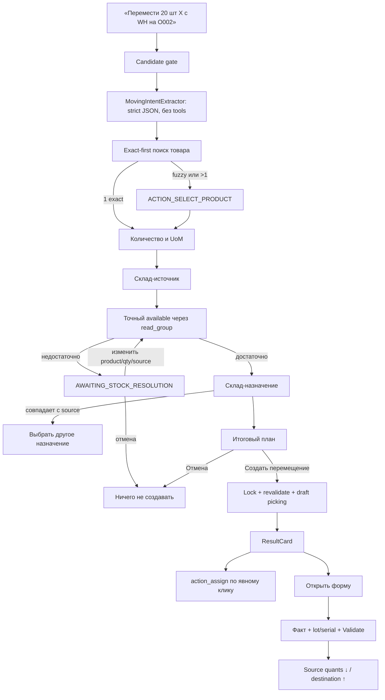

# Tasktracker: перемещение товара между складами через чат AI-ассистента (`assistent-moving`)

**Создано:** 2026-08-11  
**Уточнено:** 2026-08-11  
**Статус:** Реализовано локально; backend/HttpCase/full regression зелёные, до production rollout остаются QUnit/tour и ручной UI-smoke  
**Модули:** `custom_addons/ai_assistant`, `custom_addons/custom_product_search`, `stock`; интеграция с `object_request` отложена за пределы MVP  
**Общее правило:** [`.cursor/rules/ai-assistant-workflow-dialogs.mdc`](../.cursor/rules/ai-assistant-workflow-dialogs.mdc)  
**Архитектурный образец:** [`tasktrecker-assistent-replenishment.md`](tasktrecker-assistent-replenishment.md)

---

## Короткое описание фичи

Пользователь пишет, например: «Перемести 20 шт пены противопожарной с
Основного склада на O002». LLM извлекает только дословные текстовые параметры.
Детерминированный workflow находит товар, склад-источник и склад-назначение,
проверяет доступный остаток, уточняет количество/UoM и показывает итоговый план.
Только после кнопки **«Создать перемещение»** backend создаёт один черновик
`stock.picking` типа `internal`.

Ассистент не проводит документ автоматически. Пользователь открывает picking,
проверяет резерв и фактическое количество, указывает партии/серийные номера и
нажимает стандартную кнопку Odoo **«Провести» (Validate)**. Только после
Validate изменяются остатки обоих складов.

---

## Проверенная последовательность действий в Odoo 19

1. Открыть **Склад → Операции → Внутренние перемещения**.
2. Создать `stock.picking` с типом операции `code='internal'`.
3. Выбрать **Из** — внутреннюю локацию склада-источника, **В** — внутреннюю
   локацию склада-назначения. Локации текущей компании должны различаться.
4. Добавить `stock.move`: складской товар, требуемое количество и совместимую
   UoM; при необходимости указать scheduled date. `origin` для MVP генерируется
   самим workflow.
5. Сохранить черновик.
6. Нажать **«Отметить к выполнению»** (`action_confirm`).
7. Нажать **«Проверить наличие»** (`action_assign`) — Odoo резервирует quants
   источника.
8. Проверить фактическое количество; для tracking-товаров заполнить lot/serial
   в детальных операциях.
9. Нажать **«Провести»** (`button_validate`). При частичном количестве обработать
   стандартный backorder wizard.
10. Убедиться, что `state='done'`: остаток источника уменьшился, назначения —
    увеличился на фактически проведённое количество.

По исходникам Odoo 19 подтверждено:

- `action_assign()` при необходимости сам вызывает Confirm и резервирует товар;
- `button_validate()` из draft вызывает Confirm, выполняет sanity checks и
  pre-validation wizards, затем `_action_done()`;
- прямая запись `state='done'` не проводит движения и запрещена;
- `int_type_id` каждого склада по умолчанию имеет обе локации равными его
  `lot_stock_id`, поэтому для межскладского transfer source/destination задаются
  явно.

Для проекта выбирается `destination_warehouse.int_type_id`,
`location_id=source_warehouse.lot_stock_id`,
`location_dest_id=destination_warehouse.lot_stock_id`. Пользователь выбирает
только эти корневые складские локации; остаток и штатное резервирование Odoo
учитывают их внутренние дочерние локации. Это соответствует уже работающему
сценарию «база → объект».

---

## Текущее состояние

На 2026-08-11 локальная реализация добавлена в `ai_assistant`: intent extractor,
server-side state machine, session/token contract, точная проверка остатков,
создание draft picking, post-actions, controller routing и generic ResultCard.
Feature flag `ai_assistant.moving_enabled` по умолчанию выключен.

Проверено на test DB `odoo19_local` после module upgrade:

- moving backend/HttpCase: 21 test methods, без ошибок;
- полный suite `ai_assistant`: 501 tests / 425 post-tests, 0 failed, 0 errors;
- Ruff, Python compileall, `node --check`, XML parse и `git diff --check` зелёные.

Остаются до rollout: QUnit/tour для браузерного token/RPC/ResultCard-контракта и
ручной UI-smoke на двух складах. Межворкерная атомарность остаётся в TD-011.

Уже есть:

- `search_products` с exact-first и morphology fallback;
- `search_stock_quants`, `find_warehouse`, `find_picking_type`;
- `create_internal_picking_draft`, ConfirmationCard/ResultCard и denylist;
- Supply ACL, idempotency key и создание picking только в `draft`.

Исходные пробелы, закрываемые этой реализацией:

- нет отдельного moving intent/state-machine и token contract;
- `search_stock_quants(limit=50)` нельзя использовать для точного решения;
- существующий write tool разрешает назначение только на склад объекта;
- нет revalidation остатка, server allowlist source/destination и post-actions;
- не было HttpCase/QUnit полного диалога; HttpCase добавлен, QUnit/tour остаётся
  rollout-задачей.

---

## Принятые решения

| # | Вопрос | Решение |
|---|---|---|
| M-D1 | Scope | Прямое перемещение одного складского товара между `lot_stock_id` двух активных складов текущей компании; подлокации не выбираются, но внутренние descendants учитываются в available/reservation |
| M-D2 | Результат ассистента | Только draft после явного подтверждения; quants до Validate не меняются |
| M-D3 | Validate в чате | Запрещён; чат только открывает стандартную форму для ручного факта/tracking/backorder |
| M-D4 | Резервирование | Отдельная post-result кнопка вызывает `action_assign()` по явному клику |
| M-D5 | Источник | Если не указан — варианты только со `available>0`; явно указанный source с нулевым/недостаточным available переводит flow в `AWAITING_STOCK_RESOLUTION` |
| M-D6 | Назначение | Обязательно указать/выбрать; не может совпадать с источником |
| M-D7 | Недостача | Не создавать demand сверх available; отдельное состояние разрешает изменить product/qty/source или отменить |
| M-D8 | UoM | Только совместимая UoM; конвертация в stock UoM без округления, непредставимое количество требует явного исправления — автоматические `UP`/`DOWN` запрещены |
| M-D9 | Exact/Fuzzy | Exact: полный code, полный нормализованный name или точный allowlisted alias; prefix/substring/`ilike` — fuzzy; любой fuzzy выбирается вручную |
| M-D10 | Picking type | `destination_warehouse.int_type_id`, source/destination задаются явно |
| M-D11 | Origin | Пользовательский `origin_query` исключён из MVP; всегда `Перемещение (AI): SRC → DST` |
| M-D12 | Multi-line | MVP — один товар на сессию; массив строк — следующее расширение |
| M-D13 | Tracking | Draft с предупреждением разрешён; lot/serial и Validate — только UI |
| M-D14 | Execute | Lock `(uid, token)`, execute-once в пределах одного worker и повторная проверка ACL/config/available; межворкерная атомарность отложена в TD-011 |
| M-D15 | Write boundary | Не ослаблять object-only tool; создать workflow-service вне ToolRegistry |
| M-D16 | Routing | Явный namespaced action → foreground active workflow → новый moving intent → новый replenishment intent → обычный чат; конфликт нескольких workflow не разрешать угадыванием |
| M-D17 | Full phrase | `begin()` применяет однозначные извлечённые поля последовательно и останавливается только на первом missing/fuzzy/ambiguous/invalid/shortage |
| M-D18 | Scheduled date | Исходный текст хранится verbatim; backend детерминированно парсит его в timezone пользователя, сохраняет UTC и не принимает прошедшее время |
| M-D19 | ResultCard | Общий workflow-контракт без `replenishmentToken`/`po_id`: workflow type/token + generic record; target post-action всегда из server session |
| M-D20 | Dialogue UX | Button-first: workflow не обязан понимать произвольные реплики; каждый нетерминальный ответ возвращает краткое пояснение и полный набор допустимых кнопок, а нераспознанный текст не меняет сессию |

---

## Целевой flow



---

## Intent contract

```json
{
  "intent": true,
  "product_query": "пена противопожарная",
  "quantity": 20,
  "uom_text": "шт",
  "source_warehouse_query": "Основной склад",
  "destination_warehouse_query": "O002",
  "scheduled_date_text": null,
  "correction": false,
  "selection_ordinal": null,
  "confidence": 0.96
}
```

- Все query-поля — дословные фрагменты сообщения; никаких ID/остатков/цен.
- Trigger: `перемести`, `переместить`, `перемещение`, `перенеси`, `перенести`,
  `переведи со склада ... на склад ...`.
- `переведи текст` не запускает workflow: candidate gate требует глагол движения
  и складской контекст (`склад`, `с/со ... на ...` или warehouse code).
- `origin_query` отсутствует: произвольный пользовательский текст не записывается
  в `stock.picking.origin`.
- `scheduled_date_text` — дословный фрагмент сообщения, а не придуманная LLM
  дата; нормализацию и timezone выполняет backend.
- При ошибке LLM fallback извлекает только очевидные verbatim-фрагменты и не
  выдумывает отсутствующие поля.

---

## State-machine

```text
AWAITING_PRODUCT
AWAITING_QTY
AWAITING_SOURCE
AWAITING_STOCK_RESOLUTION
AWAITING_DESTINATION
AWAITING_PLAN
EXECUTED
CANCELLED
```

Actions:

```text
moving_select_product
moving_select_source
moving_select_destination
moving_change_product
moving_change_qty
moving_change_source
moving_change_destination
moving_change_scheduled_date
moving_execute_plan
moving_cancel
```

| State | Ввод/action | Проверка | Следующий state |
|---|---|---|---|
| `AWAITING_PRODUCT` | текст/select product | exact/fuzzy + server allowlist | `AWAITING_QTY` |
| `AWAITING_QTY` | qty + UoM | qty>0, compatible UoM, representable in stock UoM | `AWAITING_SOURCE` |
| `AWAITING_SOURCE` | текст/select source | exact/fuzzy, allowlist, current company, internal, available | `AWAITING_DESTINATION` или `AWAITING_STOCK_RESOLUTION` |
| `AWAITING_STOCK_RESOLUTION` | change product/qty/source | повторная UoM/available validation | `AWAITING_STOCK_RESOLUTION`, `AWAITING_DESTINATION` или сразу `AWAITING_PLAN` |
| `AWAITING_DESTINATION` | текст/select destination | allowlist, destination != source | `AWAITING_PLAN` |
| `AWAITING_PLAN` | `moving_change_*` | очистить зависимые snapshot | нужный `AWAITING_*` |
| `AWAITING_PLAN` | Execute | lock + revalidation | `EXECUTED` |
| Любой `AWAITING_*` | Cancel | без записей Odoo | `CANCELLED` |

Action не своего state возвращает контролируемый ответ без mutation.
После исправления shortage уже извлечённый exact destination повторно
валидируется и может привести сразу к `AWAITING_PLAN`; промежуточные вопросы
для валидных полей не показываются.

### Button-first контракт диалога

Workflow поддерживает ограниченный управляемый диалог, а не обязан понимать
любую свободную реплику пользователя:

- LLM извлекает поля из исходной полной фразы и из простого ответа на текущий
  вопрос; он не определяет допустимый переход и не выполняет action;
- state-machine является единственным источником допустимых действий;
- каждый нетерминальный ответ содержит короткое объяснение текущего состояния и
  полный набор доступных в нём buttons/chips, включая безопасный возврат или
  отмену там, где они предусмотрены;
- кнопки дублируют доступные пользователю ветки UI и передают только
  namespaced action с минимальным payload; backend повторно проверяет state,
  session allowlist, ACL и актуальные данные;
- непонятный текст или ответ не на текущий вопрос не изменяет session snapshot:
  workflow кратко повторяет, что требуется, и возвращает тот же набор кнопок;
- свободный текст может заполнить только ожидаемое текущим состоянием поле.
  Изменение уже пройденного поля выполняется кнопкой `moving_change_*`, после
  чего пользователь отвечает на соответствующем шаге;
- порядковый ответ вроде «второй» разрешён только относительно текущего
  `last_options`; неоднозначный ordinal ничего не выбирает;
- текстовые «да», «создавай», «подтверждаю» не заменяют
  `moving_execute_plan`; создание picking возможно только по явному action
  кнопки **«Создать перемещение»**;
- post-result reserve/open/print/cancel также запускаются только кнопками.

Минимальные варианты развития по состояниям:

| Состояние/ситуация | Основные кнопки |
|---|---|
| `AWAITING_PRODUCT`, найдены кандидаты | варианты товара, `Отмена` |
| `AWAITING_QTY` | `Изменить товар`, `Отмена`; количество вводится сообщением |
| `AWAITING_SOURCE` | варианты source, `Изменить товар`, `Изменить количество`, `Отмена` |
| `AWAITING_STOCK_RESOLUTION` | `Изменить товар`, `Изменить количество`, `Другой склад`, `Отмена` |
| `AWAITING_DESTINATION` | варианты destination, `Изменить источник`, `Изменить количество`, `Отмена` |
| `AWAITING_PLAN` | `Создать перемещение`, все применимые `Изменить ...`, `Отмена` |
| `EXECUTED` ResultCard | `Зарезервировать`, `Открыть`, `Печать`, `Отменить` с server-side disabled |

Если вариантов товара или склада слишком много, chips могут содержать
ограниченную страницу кандидатов и кнопку продолжения поиска/уточнения, но
frontend не должен предлагать ID или действие, отсутствующее в server response.

### Инвалидация при `moving_change_*`

| Изменение | Инвалидировать | Сохранить и повторно проверить |
|---|---|---|
| Product | resolved product/UoM, `move_qty`, availability, plan | raw qty/UoM, source и destination как пользовательские hints |
| Qty/UoM | requested/resolved qty, `move_qty`, availability, plan | product, source, destination |
| Source | source location, availability, plan | product/qty; destination, если он не совпал с новым source |
| Destination | destination location, picking type, plan | product/qty/source/availability |
| Scheduled date | parsed UTC date, plan | product/qty/source/destination |

Ни один сохранённый hint не считается валидным без повторной server-side
проверки. `begin()` и correction-flow последовательно применяют все уже
извлечённые поля и останавливаются только на первом реально требующем ответа
шаге.

---

## Backend и UI-контракт

Session `(uid, moving_token)`, TTL 30 минут:

```text
state, product_id, requested_qty/uom, move_qty/uom,
source warehouse/location, destination warehouse/location/picking type,
availability_snapshot, generated_origin, scheduled_date_text/scheduled_date_utc,
last_options,
picking_id, executed, extracted_raw
```

Ответ:

```text
{answer, suggestions, cards,
 meta: {moving_token, moving_state, moving_terminal}}
```

Итоговый план показывает товар/артикул, requested и move qty/UoM,
on_hand/reserved/available, полные source/destination, internal picking type,
дату/origin, tracking/UoM warnings и кнопки Execute/Change/Cancel.

ResultCard:

```text
workflow: {type: 'moving', token: moving_token}
record: {model: 'stock.picking', id, name, url}
details: state, source, destination, quantity
actions: [{action: reserve|open|print|cancel, label, disabled, confirm}]
```

Общий frontend callback получает `{workflow, record, action}`, а не
`replenishmentToken`/`po_id`. Карточка обновляется по
`workflow.type + workflow.token + record.model + record.id`.
`open` только открывает форму через `actionService.doAction()` и не подразумевает
Validate. `record.id` из браузера advisory; target берётся из session.

---

## Warehouse resolver: exact/fuzzy

Текущий `FindWarehouseTool` использует общий `ilike` и не возвращает
`match_type`, поэтому moving получает отдельный resolver с результатом
`{record, match_type, matched_by}`.

Приоритет поиска:

1. Полный warehouse `code`, регистронезависимо — `exact_code`.
2. Точный ключ allowlisted alias с последующим exact code lookup —
   `exact_alias`; единственный результат можно выбрать автоматически.
3. Полный `name` после нормализации регистра, NBSP и повторных пробелов —
   `exact_name`; дубли требуют ручного выбора.
4. Prefix/частичный `ilike` по code/name — `fuzzy`; даже единственный результат
   показывается chip и требует выбора.

`O`, `ОбМ-`, частичное имя/адрес считаются fuzzy/list queries. При пустом source
показываются активные склады текущей компании с `available > 0`, отсортированные
по available убыванию, затем по code/name. При пустом destination показываются
все валидные склады текущей компании, кроме source; наличие в destination не
требуется.

Явно указанный exact/fuzzy source с `available=0` остаётся валидным выбранным
складом, но приводит к `AWAITING_STOCK_RESOLUTION`, а не маскируется как
«склад не найден».

---

## UoM и количество move

Stock demand нельзя автоматически округлять вверх: это способно превысить и
доступный остаток, и запрошенное пользователем количество. Округление `UP`,
используемое в закупке упаковками поставщика, к внутреннему перемещению не
переносится.

Алгоритм:

```text
raw_move_qty = requested_uom._compute_quantity(
    requested_qty, stock_uom, round=False
)
```

1. Проверить совместимость UoM и `requested_qty > 0`.
2. Проверить, что `raw_move_qty` представимо с `stock_uom.rounding`.
3. Если нет — не применять автоматически ни `UP`, ни `DOWN`; вернуть
   `AWAITING_QTY` с допустимыми ближайшими вариантами, выбор делает пользователь.
4. После явного выбора сохранить `move_qty` в stock UoM.
5. Shortage сравнивать в stock UoM через
   `float_compare(move_qty, available, precision_rounding=stock_uom.rounding)`.
6. Перед Execute повторить конвертацию, representability и comparison.

План показывает исходное requested quantity/UoM и эквивалентное move
quantity/stock UoM. Они могут иметь разные числа только из-за точной конвертации
единиц; незаметного изменения фактического количества нет.

---

## Точный available

Не использовать `search_stock_quants(limit=50)`. Новый read service вызывает:

```text
stock.quant._read_group(
  [
    ('product_id', '=', product_id),
    ('location_id', 'child_of', source_warehouse.lot_stock_id.id),
    ('location_id.usage', '=', 'internal'),
    ('company_id', '=', env.company.id),
  ],
  [],
  ['quantity:sum', 'reserved_quantity:sum'],
)
available = quantity - reserved_quantity
```

`location_id child_of lot_stock_id` намеренно включает внутренние дочерние
локации: endpoints перемещения остаются ровно warehouse `lot_stock_id`, но
Odoo резервирует доступные quants в их internal descendants. Пользователь не
может выбрать sublocation в MVP.

Перед Execute расчёт повторяется. Если available уменьшился ниже move qty,
picking не создаётся: план обновляется и требует нового подтверждения.

---

## Маршрутизация workflow

Backend и frontend хранят `activeWorkflowKind` для foreground-диалога отдельно
от post-result токенов карточек. Точный порядок `/ai_assistant/chat`:

1. Один явный namespaced action (`moving_*`, `replenishment_*`, `invoice_*`).
2. Продолжение единственного foreground active workflow.
3. Candidate gates новых сценариев.
4. Новый moving intent.
5. Новый replenishment intent.
6. Обычный consult/actions chat.

Если запрос содержит actions разных namespace или несколько active tokens без
однозначного `activeWorkflowKind`, backend возвращает стабильный
`workflow_conflict`, предлагает выбрать/отменить сценарий и ничего не меняет.
Moving не стартует поверх незавершённого foreground invoice/replenishment.
Токены завершённых ResultCard не участвуют в маршрутизации обычного текста.

Если moving и replenishment candidate gates одновременно совпали, extractor не
угадывает намерение: пользователь получает две явные кнопки выбора сценария.
Существующий неявный приоритет replenishment над invoice в controller должен
быть заменён этой схемой и покрыт HttpCase.

---

## Scheduled date и origin

- `scheduled_date_text` хранит дословный пользовательский фрагмент.
- Backend поддерживает `ДД.ММ.ГГГГ [ЧЧ:ММ]`,
  `YYYY-MM-DD [HH:MM]`, `сегодня` и `завтра`; иначе просит уточнение.
- Значение интерпретируется в `env.user.tz`; дата без времени означает 09:00
  локального времени; в ORM передаётся UTC.
- Прошедшее время запрещено. `null` оставляет стандартную дату Odoo.
- `origin` всегда генерируется как `Перемещение (AI): SRC → DST`.
- Lookup `object_request`, произвольный `origin_query` и запись пользовательского
  текста в `origin` не входят в MVP.

---

## Post-result actions

Все действия выполняет `MovingPickingActionsService` вне ToolRegistry. Backend
каждый раз берёт picking из server session, заново читает state/ACL/company и
возвращает полную обновлённую ResultCard; frontend не вычисляет allowlist.

| Action | Допустимые picking states | Результат |
|---|---|---|
| `reserve` | `draft` или `waiting`/`confirmed`/`assigned` при `show_check_availability=True` | `action_assign()`, затем обновлённая card |
| `open` | любой существующий | `ir.actions.act_window` через `actionService.doAction()` |
| `print` | любой существующий | `env.ref('stock.action_report_picking').report_action(picking)` |
| `cancel` | `draft`, `waiting`, `confirmed`, `assigned` | подтверждение пользователя, `action_cancel()`, снятие резерва, обновлённая card |

`partially_available` является состоянием `stock.move`, но вычисляемый
`stock.picking.state` при частичном резерве может быть `assigned`. Поэтому
доступность повторного Reserve определяется серверным
`show_check_availability`, а не одним значением picking state. В `done`/`cancel`
Reserve и Cancel disabled. Print/Open могут оставаться доступными для просмотра
существующей записи.

---

## Безопасность

- `group_ai_assistant_supply` + `stock.group_stock_user` на start/routes/actions.
- Без `sudo()` для warehouse/location/product/quant/picking/move.
- Все ID принимаются только из session allowlist.
- Склады активны, current-company; локации internal, distinct и принадлежат
  соответствующим warehouse view locations.
- Product active, `is_storable=True`; UoM совместима.
- `destination.int_type_id.code == 'internal'`.
- `button_validate`, `_action_done`, прямая запись state/done qty/lot не
  регистрируются как LLM tools.
- Reserve/cancel/print — явный клик, session target, state allowlist.
- Execute идемпотентен; audit не хранит token и полный пользовательский текст.

---

## План реализации

### MOV-001 — `MovingIntentExtractor`
- **Статус:** Реализована локально
- Strict schema, verbatim check, candidate gate, fallback, trigger/timeout tests.

### MOV-002 — `MovingSessionStore`
- **Статус:** Реализована локально
- TTL, uid/token isolation, lock, execute-once, active/post-result lifecycle.

### MOV-003 — `MovingWorkflow`
- **Статус:** Реализована локально
- State/action table, `AWAITING_STOCK_RESOLUTION`, allowlists, wrong-action no
  mutation, sequential begin, button-first responses, повтор допустимых кнопок
  после unexpected text, correction/back и матрица invalidation.

### MOV-004 — Product и quantity/UoM
- **Статус:** Реализована локально
- Переиспользовать exact-before-morphology; fuzzy всегда chip.
- Проверить storable, qty>0, compatible UoM, conversion `round=False`,
  representability; никакого автоматического `UP`/`DOWN`.

### MOV-005 — Source resolver и availability
- **Статус:** Реализована локально
- Отдельный exact/fuzzy resolver с `match_type`, aliases, варианты с
  available>0, явный zero-stock shortage, `_read_group` без limit.

### MOV-006 — Destination resolver
- **Статус:** Реализована локально
- Current-company warehouses, exclude source, validate lot/int type.

### MOV-007 — Plan/correction flow
- **Статус:** Реализована локально
- Итоговая карточка, requested/move UoM, date/origin, Execute/Change/Cancel,
  invalidation snapshot.

### MOV-008 — Workflow-specific draft service
- **Статус:** Реализована локально
- Вне ToolRegistry; один draft picking/move, chatter/audit, assert fields.
- Existing object-only `CreateInternalPickingDraftTool` не ослаблять.

### MOV-009 — `MovingPickingActionsService`
- **Статус:** Реализована локально
- `reserve=action_assign`, open form, `stock.action_report_picking`, точная
  state matrix, cancel confirmation и card refresh после каждого action.
- Target исключительно из server session; Validate отсутствует.

### MOV-010 — Controller routing
- **Статус:** Реализована локально
- Namespaced action, `activeWorkflowKind`, `workflow_conflict`, moving перед
  replenishment для новых intents, feature flags, Supply/Stock ACL,
  ResponseGuard и стабильные errors.

### MOV-011 — Frontend token/RPC
- **Статус:** Реализована локально; QUnit/tour остаётся до rollout
- Versioned `activeMovingToken` + `activeWorkflowKind`, ResultCard token,
  terminal cleanup, foreground conflict UI и nested errors.

### MOV-012 — Chips/ResultCard/action service
- **Статус:** Реализована локально; QUnit/tour остаётся до rollout
- Обобщить PO-specific `replenishmentToken`/`po_id`/`onPoAction` до
  `{workflow, record, action}`; generic card replacement, namespaced actions,
  полный server-driven набор кнопок для каждого состояния, backend disabled,
  busy/double-click guard и keyboard accessibility.

### MOV-013 — Документация и rollout
- **Статус:** Частично: документация, version bump и test-DB upgrade выполнены;
  production rollout и ручной UI-smoke не выполнялись
- `ai_assistant.moving_enabled`, user guide/project/changelog/tasktracker/TD,
  version bump, module upgrade и smoke.

---

## Acceptance-тесты

### Backend

- [x] Trigger-формы; «переведи текст» не запускает flow.
- [x] Verbatim extractor, invalid JSON/timeout fallback, отсутствие tools/IDs.
- [ ] Все state-переходы, correction и wrong action без mutation.
- [ ] Каждый нетерминальный ответ содержит краткое пояснение и все допустимые
  для текущего состояния buttons/chips; frontend не изобретает действия.
- [x] Нераспознанный текст и ответ не на текущий вопрос не меняют session
  snapshot, повторяют текущий вопрос и возвращают тот же набор кнопок.
- [ ] Свободный текст заполняет только ожидаемое поле; изменение предыдущего
  поля начинается через соответствующий `moving_change_*`.
- [x] «Да»/«создавай»/«подтверждаю» не выполняют Execute; picking создаётся
  только по `moving_execute_plan` из `AWAITING_PLAN`.
- [x] Product 0/1/many/fuzzy; один fuzzy требует выбора.
- [x] Warehouse exact code/name/alias, prefix/substring fuzzy,
  0/1/many/forged ID/same source-destination.
- [ ] Multi-company и отсутствие Supply/Stock User — отказ.
- [ ] >50 quants, reserved subtraction и current-company domain.
- [ ] Explicit source с available=0 и shortage переводят в
  `AWAITING_STOCK_RESOLUTION`; Cancel доступен из любого `AWAITING_*`.
- [x] Stale available блокирует Execute и требует reconfirmation.
- [x] UoM compatible conversion `round=False`, непредставимое количество не
  округляется автоматически; incompatible rejection.
- [ ] `child_of lot_stock_id` включает internal descendants, но sublocation
  нельзя подменить через payload.
- [x] Date parsing/timezone/UTC/past rejection; origin всегда generated.
- [x] Tracking warning; backend Validate не вызывается.
- [x] Реальный draft: type/source/destination/origin/date/move корректны,
  quants до Validate не изменились.
- [x] Повторный/конкурентный Execute в одном worker создаёт один picking;
  межворкерное ограничение отражено в TD-011.
- [x] Reserve использует session target; forged picking ID игнорируется.
- [ ] Reserve/Cancel/print/open state matrix; при частичном резерве и picking
  `assigned` повторный Reserve доступен по `show_check_availability`; стандартная
  печать picking, card refresh и ACL.
- [ ] Интеграционный ручной Confirm → Assign → Validate меняет quants обоих
  складов; partial flow возвращает стандартный backorder contract.
- [x] Create/reserve/cancel не доступны LLM ToolRegistry; denylist сохранён.

### HttpCase/QUnit

- [x] Полная фраза → plan → Execute → один draft picking.
- [x] Полная фраза проходит все exact-поля без промежуточных вопросов.
- [ ] Отсутствующие product/qty/source/destination спрашиваются по одному.
- [ ] На каждом экране доступны предусмотренные button-first ветки изменения и
  отмены; после неправильного текста кнопки не исчезают.
- [ ] Feature off/no groups/intent false/expired token не меняют Odoo.
- [ ] LLM timeout проходит flow через fallback; foreground workflow имеет
  приоритет, несколько tokens/actions возвращают `workflow_conflict`.
- [x] Одновременные moving/replenishment gates показывают выбор workflow.
- [ ] Chips передают token/action/payload; reload восстанавливает active token.
- [ ] Terminal очищает active token, ResultCard post-actions продолжают работать.
- [ ] Один fuzzy отображается кнопкой; busy блокирует двойной Execute.
- [ ] Generic ResultCard не зависит от `replenishmentToken`/`po_id`;
  Open/print вызывают `actionService.doAction()`, action errors видны в card.

---

## Definition of Done

- [ ] Реализованы MOV-001…MOV-013 (production rollout и QUnit/tour не выполнены).
- [x] Fuzzy product/warehouse не выбирается автоматически.
- [ ] Каждый нетерминальный шаг остаётся проходимым кнопками без необходимости
  формулировать произвольную команду естественным языком.
- [x] Stock demand не округляется автоматически вверх или вниз.
- [x] Без итоговой кнопки picking не создаётся.
- [x] Execute идемпотентен и повторно проверяет available.
- [x] Ассистент создаёт draft; Validate выполняется в стандартном UI.
- [x] Quants меняются только после штатного `button_validate()`.
- [ ] Backend, HttpCase, QUnit/tour и полный suite зелёные.
- [x] Обновлены user guide/project/changelog/tasktracker/technical debt.
- [ ] Module upgrade и ручной smoke на двух тестовых складах пройдены.

## Ограничения MVP

- Multi-line transfer, sublocations, transit и multi-step routes.
- Автовыбор source по FEFO/lot/package.
- Lot/serial и фактическое количество через чат.
- Validate из чата — отдельная high-risk задача после аудита tracking,
  packages, partial/backorder и cross-worker idempotency.
- Общий DB/Redis session store для нескольких workers — TD-011.
