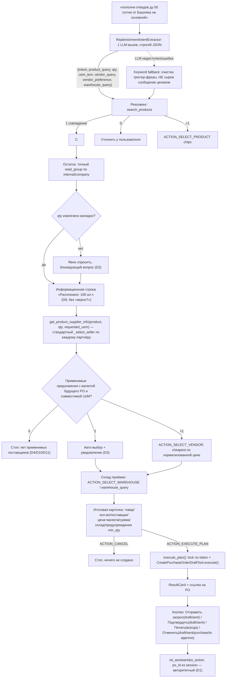

# Tasktracker: пополнение товара через чат AI-ассистента (`assistent-replenishment`)

**Создано:** 2026-08-11 · **Обновлено:** 2026-08-11 (round 3 — закрыты token lifetime, валюта PO, UoM и стартовая маршрутизация)
**Статус:** Готово к реализации: контракты backend/frontend и критические бизнес-правила согласованы; реализация не начата (AR-001…AR-027 не начаты)
**Модуль:** `custom_addons/ai_assistant` (+ незначительные точки расширения `custom_product_search`, без изменений в `object_request`)
**Связанные документы:**
- [`tasktrecker-creat-partner-v2.md`](tasktrecker-creat-partner-v2.md) — образец формата и решений (ConfirmationCard, chips, denylist)
- [`.cursor/skills/purchase-from-invoice/SKILL.md`](../.cursor/skills/purchase-from-invoice/SKILL.md) — аналогичный сценарий «закупка», но вне Odoo-чата (MCP-агент Cursor)
- [`.cursor/rules/odoo-product-catalog.mdc`](../.cursor/rules/odoo-product-catalog.mdc) — правило «не создавать vendor-строку автоматически»
- `services/invoice_workflow.py` — эталонная реализация state-machine, на которую ориентируется этот сценарий
- `static/src/js/ai_chat_boot.js`, `ai_chat_service.js` — эталон текущего frontend-контракта `extractionToken`/`workflowAction`, который в этом раунде проверен построчно

---

## Контекст и проблема

Пользователь в чате ассистента пишет, например: «сделай пополнение отвода стального Ду50» или «пополни отводы ду 50 100 шт от Башняк». Сейчас в `ai_assistant`:

- есть все «кирпичи» для чтения (поиск товара, остатки, поставщики через `find_partner`) и для создания черновика `purchase.order` (`create_purchase_order_draft`);
- **нет** сервиса, отдающего список `product.supplierinfo` товара с наименованием/ценой у каждого поставщика;
- **нет** детерминированного многошагового сценария (товар → поставщик → остаток → количество → склад → итог → создание) — только два механизма: одноразовый `ConfirmationCard` (create/cancel) и жёстко закодированный workflow для счетов (`invoice_workflow.py`);
- **нет** интерактивных кнопок в чате для действий после создания черновика (Отправить запрос / Подтвердить заказ / Печать / Отменить) — `ResultCard.steps` сейчас только текст-инструкция без onClick;
- денylist executor (`button_confirm`, `button_validate`, `action_done`, `action_post`) принципиально не даёт LLM вызывать их как tools — это сохраняем без изменений.

Прецедент детерминированного сценария с явным подтверждением и последующим `button_confirm`/`button_validate` уже есть — `InvoiceWorkflow.execute_purchase_plan` (`services/invoice_workflow.py:392`). Новый сценарий использует тот же подход.

**Round 3 (это обновление):** после второго технического ревью закрыты четыре остаточных блокера: срок жизни токена после создания PO, валюта будущего PO, безопасная конвертация UoM и стартовая backend-маршрутизация. Дополнительно исправлены ответ `/po_action`, порядок выбора поставщика с учётом `min_qty`, сигнатура `_read_group`, стандартные действия Odoo, `partner_ref` и повторный поиск товара.

---

## Принятые решения

| # | Вопрос | Решение | Следствие |
|---|--------|---------|-----------|
| D1 | На каких PO работают кнопки Confirm/Send/Print/Cancel | **Только на PO, созданном в этой же сессии ассистента** (`replenishment_token` → `po_id` во flow) | После Execute токен удаляется только из активной маршрутизации чата, но сохраняется в `ResultCard` для post-PO кнопок до истечения backend TTL (AR-015/016) |
| D2 | Количество, если не указано пользователем | **Всегда явно спрашивать**, без авто-расчёта по остаткам/расходу | `qty` — обязательный явный шаг workflow, если не извлечён из исходной фразы (AR-006) |
| D3 | Единственный поставщик | **Авто-выбор с текстовым уведомлением**, финальное подтверждение всё равно на итоговом экране плана | Шаг «выбор поставщика» не блокирует диалог при 1 варианте |
| D4 | Нет ни одного `product.supplierinfo` у товара | **Останавливаемся** с сообщением «нет поставщиков, добавьте vendor-строку вручную» | Никакого inline-создания supplierinfo в этом сценарии |
| D5 | Кнопка «Отправить запрос» | **Открывает стандартный composer Odoo** (mail wizard) — отправляет пользователь вручную | Активна только в `draft`/`sent` (см. фикс противоречия ниже, AR-011/AR-014) |
| D6 | Права на Confirm/Cancel/Send/Print | **Та же группа `ai_assistant.group_ai_assistant_supply`**, что и на создание черновика | Проверка ACL Odoo (`purchase.group_purchase_user`) остаётся действующей через `implied_ids` |
| D7 | Как распознавать товар/количество/поставщика/склад из фразы | **Гибрид**: LLM-вызов со строгой JSON-схемой (`ReplenishmentIntentExtractor`) извлекает только текст; резолвинг в ID/цены и весь workflow — код; keyword fallback при недоступности LLM | Требует нового метода `OpenRouterClient.send_structured_chat` (блокер 4, AR-017) |
| **D8** | **(NEW)** Читает ли LLM цену поставщика через consult-режим просто так | **Нет.** `get_product_supplier_info` получает `required_groups=['ai_assistant.group_ai_assistant_supply']` явно | Иначе любой пользователь с `group_ai_assistant_user` (без Supply) увидел бы закупочные цены даже в consult-режиме — см. блокер «ACL read tool», AR-001 |
| **D9** | **(NEW)** Что считается подтверждением количества | Число, названное пользователем в исходной фразе, **уже считается подтверждённым** (показываем информационную строку, не вопрос); повторное явное «да/нет» не запрашивается — итоговая карточка плана (AR-009) в любом случае даёт финальный шанс отменить | Убирает противоречие блокера 1: не может быть одновременно «требует подтверждения» и «не блокирует» |
| **D10** | Валюта supplierinfo | Валюта предложения должна совпадать не с валютой компании, а с ожидаемой валютой PO конкретного поставщика: `partner.with_company(env.company).property_purchase_currency_id or env.company.currency_id` | Исключает создание USD-заказа с числом цены из RUB-supplierinfo; несовпадающее предложение не выбирается |
| **D11** | UoM запроса и supplierinfo различаются | Если категории UoM совпадают — количество конвертирует стандартный `uom._compute_quantity(..., round=False)`, цена для сравнения — `_compute_price()`; если категории разные — предложение блокируется как некорректное | Нельзя превратить «100 шт.» в «100 упаковок» простым предупреждением |

---

## Целевой поток



---

## Этап AR-1. Backend: данные поставщика товара

### Задача: AR-001 — `GetProductSupplierInfoTool` (read tool `get_product_supplier_info`)

- **Статус:** Не начата
- **Приоритет:** Критический
- **Описание:** Получить по одному применимому предложению на каждого поставщика для конкретных товара, количества и UoM. Переиспользует стандартную бизнес-логику Odoo `_get_filtered_sellers`, а не самостоятельно повторяет фильтрацию `min_qty`/дат/варианта/UoM. Доступ — **только Supply** (D8).
- **Шаги выполнения:**
  - [ ] Параметры: `product_id`, `quantity`, `uom_id` (required), `date` (optional; default today)
  - [ ] Получить кандидатов партнёров из `product._prepare_sellers()`, затем для каждого уникального партнёра вызвать `product._get_filtered_sellers(partner_id=partner, quantity=quantity, date=date, uom_id=requested_uom)`; этим Odoo сам учитывает общие/variant-specific строки, даты и `min_qty`
  - [ ] После фильтра валюты/UoM выбрать лучшее предложение партнёра по `normalized_price`, `sequence`, `id`. Не использовать один общий `_select_seller()` без partner-loop: он возвращает только одного продавца, а сценарий обязан показать варианты
  - [ ] Если `requested_uom.category_id != seller.product_uom_id.category_id` — исключить предложение с причиной `incompatible_uom`
  - [ ] Рассчитать `purchase_qty = requested_uom._compute_quantity(quantity, seller.product_uom_id, round=False)` и `normalized_price = seller.product_uom_id._compute_price(seller.price, requested_uom)`; исходные `seller.price`/`seller.product_uom_id` не изменять
  - [ ] Для каждого seller вычислить `po_currency = seller.partner_id.with_company(env.company).property_purchase_currency_id or env.company.currency_id`; если `seller.currency_id != po_currency` — исключить предложение с причиной `currency_mismatch` (D10)
  - [ ] Выдача применимых предложений: `supplierinfo_id`, `partner_id`, `product_name`, `product_code`, `price`, `currency_id` (id/name/symbol), `product_uom_id`, `purchase_qty`, `normalized_price`, `min_qty`, `delay`
  - [ ] Сортировка: `normalized_price`, затем `sequence`, `id`; `vendor_preference='cheapest'` выбирает первый результат только после получения qty
  - [ ] **`required_groups = ['ai_assistant.group_ai_assistant_supply']`** (не как у `SearchStockQuantsTool`!) — см. D8 и обоснование ниже
  - [ ] Регистрация в `default_registry`
- **📁 Контекст:** `services/action_tools/read_tools.py` (образец структуры: `SearchStockQuantsTool`)
- **⚠️ Важно (исправление ошибочного утверждения из round 1):** `_get_ai_response` вызывает `_get_tools_response(..., allow_write=False, mode_label='consult', ...)` **даже в обычном consult-режиме** (`chat_controller.py:501-516`), а `_get_tools_response` строит `tools = default_registry.to_openrouter_tools(request.env, read_only=not allow_write)` (`chat_controller.py:673-676`) — то есть read tools **без** `required_groups` доступны ЛЮБОМУ пользователю с `group_ai_assistant_user`, даже без Supply. Для `search_products`/`search_stock_quants` это осознанно ок (не коммерческая тайна), но закупочные цены поставщика — нет, поэтому здесь `required_groups` обязателен.
- **Зависимости:** —
- **DoD:** Пользователь без Supply получает `access_denied`; ценовые ступени `min_qty` выбираются стандартным `_select_seller`; предложение в валюте, отличной от валюты будущего PO данного партнёра, и предложение с несовместимой категорией UoM не попадают в выбираемые варианты.

---

## Этап AR-2. Backend: сессия, константы действий и state-machine

### Задача: AR-002 — `ReplenishmentSessionStore`

- **Статус:** Не начата
- **Приоритет:** Критический
- **Описание:** In-memory TTL-хранилище состояния сценария, ключ `(uid, replenishment_token)`.
- **Шаги выполнения:**
  - [ ] `put(uid, extracted=None) -> token`, `get_session`, `ensure_session`, `find_latest_token`, `pop` — product_id в момент старта может быть ещё неизвестен
  - [ ] TTL ~30 минут, `_purge_expired()`
  - [ ] Структура сессии: `product_id`, `vendor` (supplierinfo dict), `qty`, `qty_source` (`'extracted'|'asked'`), `warehouse`, `state`, `po_id`, `executed`, `extracted_raw` (для отладки/аудита)
  - [ ] **Фикс «flow.executed не защищает от параллельных кликов»:** `get_lock(uid, token) -> threading.Lock` — отдельный лок на сессию (не сериализуется, живёт только в памяти процесса); `execute_plan()` (AR-010) оборачивается в `with store.get_lock(...)`
- **📁 Контекст:** `services/pending_action.py`, `services/invoice_extraction_store.py`
- **🚫 Ограничение (явно документируем, не «чиним» в этой задаче):** лок и TTL-store работают только в пределах **одного** процесса/worker'а Odoo. При нескольких `--workers` в проде запрос может попасть на другой worker и не увидеть сессию/лок — это **уже существующее** ограничение архитектуры (`PendingActionStore`, `InvoiceExtractionStore` имеют то же свойство), не регресс, вносимый этой задачей. Полноценное решение (Redis/DB-backed store) — отдельная задача уровня всего модуля `ai_assistant`, вне скоупа AR.
- **Зависимости:** —
- **DoD:** Сессия переживает несколько ходов чата в пределах TTL и одного worker'а; два одновременных запроса `ACTION_EXECUTE_PLAN` в одном worker'е создают ровно один PO.

---

### Задача: AR-003 — Константы действий и таблица состояний

- **Статус:** Не начата
- **Приоритет:** Критический
- **Описание:** Фикс блокера «нет `ACTION_SELECT_PRODUCT`» — полный набор действий и допустимых переходов, задокументированный **до** написания кода диспетчера (AR-020), чтобы не потерять ни один клик.
- **Шаги выполнения:**
  - [ ] Константы (namespace `replenishment_*`, чтобы не путать с `invoice_*` на фронте — см. AR-015):
    ```
    ACTION_SELECT_PRODUCT   = 'replenishment_select_product'
    ACTION_SELECT_VENDOR    = 'replenishment_select_vendor'
    ACTION_SELECT_WAREHOUSE = 'replenishment_select_warehouse'
    ACTION_EXECUTE_PLAN     = 'replenishment_execute_plan'
    ACTION_CANCEL           = 'replenishment_cancel'
    ```
  - [ ] Таблица состояний:

    | Состояние | Ожидается | Допустимые действия | Переход |
    |---|---|---|---|
    | `AWAITING_PRODUCT` | клик `ACTION_SELECT_PRODUCT{product_id}` или текст → extractor | `ACTION_SELECT_PRODUCT`, свободный текст | → `AWAITING_QTY` |
    | `AWAITING_QTY` | число (chip нет, только текст через extractor/прямой ввод) | свободный текст | → `AWAITING_VENDOR` |
    | `AWAITING_VENDOR` | клик `ACTION_SELECT_VENDOR{supplierinfo_id}` или `vendor_query`/`vendor_preference` | `ACTION_SELECT_VENDOR`, свободный текст | → `AWAITING_WAREHOUSE` |
    | `AWAITING_WAREHOUSE` | клик `ACTION_SELECT_WAREHOUSE{warehouse_id}` или `warehouse_query` | `ACTION_SELECT_WAREHOUSE`, свободный текст | → `AWAITING_PLAN` |
    | `AWAITING_PLAN` | клик `ACTION_EXECUTE_PLAN`/`ACTION_CANCEL` | `ACTION_EXECUTE_PLAN`, `ACTION_CANCEL` | → `EXECUTED`/`CANCELLED` |
    | `EXECUTED` | (кнопки PO вне этой машины, см. AR-011/012) | — | терминальное |
    | `CANCELLED` | — | — | терминальное |
  - [ ] Действие, не соответствующее текущему состоянию сессии (например, `ACTION_SELECT_VENDOR` при состоянии `AWAITING_WAREHOUSE`) → `_unexpected_flow_response`-подобный ответ (по образцу `InvoiceWorkflow._unexpected_flow_response`), не exception
- **Зависимости:** —
- **DoD:** Таблица состояний однозначно покрывает все 5 действий; для каждого состояния явно перечислено, что «неожиданно».

---

### Задача: AR-004 — `ReplenishmentWorkflow`: определение товара

- **Статус:** Не начата
- **Приоритет:** Критический
- **Описание:** Резолвинг товара по `product_query` от extractor (AR-018) или fallback (AR-019); множественные совпадения — через `ACTION_SELECT_PRODUCT` (фикс блокера 2).
- **Шаги выполнения:**
  - [ ] Вызов `SearchProductsTool.execute` с `query=product_query`
  - [ ] 1 совпадение → сохранить `product_id` в сессию, показать остаток (AR-005), `state='AWAITING_QTY'`, продолжить на AR-006
  - [ ] 0 совпадений → сохранить `state='AWAITING_PRODUCT'`, сообщение «товар не найден — уточните наименование»; следующий свободный текст повторно запускает поиск в рамках той же сессии
  - [ ] >1 совпадение → `state='AWAITING_PRODUCT'`, chips: `label=display_name`, `action=ACTION_SELECT_PRODUCT`, `payload={product_id}`
- **Зависимости:** AR-003, AR-018 (или AR-019 как fallback)
- **DoD:** «пополни отводов ду 50 100 шт от Башняк» резолвится в конкретный товар без лишних вопросов при однозначном совпадении; при 3 похожих товарах показаны 3 chips с `ACTION_SELECT_PRODUCT`, клик по любому продвигает сессию.

---

### Задача: AR-005 — `ReplenishmentWorkflow`: остаток на складе (информативно)

- **Статус:** Не начата
- **Приоритет:** Критический
- **Описание:** Показать точный остаток после выбора товара; не использовать ограниченную выборку из 50 quants.
- **Шаги выполнения:**
  - [ ] Домен: `[('product_id', '=', product_id), ('location_id.usage', '=', 'internal'), ('company_id', '=', env.company.id)]`
  - [ ] Точный общий остаток: `env['stock.quant']._read_group(domain, [], ['quantity:sum', 'reserved_quantity:sum'])` — правильный порядок аргументов Odoo 19: `domain, groupby, aggregates`
  - [ ] Точная разбивка по складам: тот же `_read_group` с `groupby=['warehouse_id']`; не использовать `SearchStockQuantsTool(limit=50)` как источник totals
  - [ ] Показать `on_hand = quantity`, `reserved = reserved_quantity`, `available = quantity - reserved_quantity`
  - [ ] Остаток не блокирует пополнение (D2)
- **Зависимости:** AR-004
- **DoD:** Товар с >50 quants показывает корректные totals только по внутренним локациям текущей компании.

---

### Задача: AR-006 — `ReplenishmentWorkflow`: количество (D2, D9, D11)

- **Статус:** Не начата
- **Приоритет:** Критический
- **Описание:** Получить подтверждённое количество в явно определённой UoM запроса до расчёта применимых supplierinfo.
- **Шаги выполнения:**
  - [ ] Если `quantity` есть в извлечении (AR-018/AR-019) и `> 0` → `qty_source='extracted'`, показать **информационную** (не вопросительную) строку: «Распознано количество: 100 шт.» — **без** «верно?» и без ожидания ответа да/нет
  - [ ] Если `quantity` отсутствует/`null`/`<= 0` → `qty_source='asked'`, **блокирующий** вопрос: «Сколько нужно пополнить?»; сценарий не продвигается, пока не придёт положительное число
  - [ ] Ответ на блокирующий вопрос — либо прямое число (парсинг), либо через точечный вызов extractor на этот шаг (AR-018, узкая JSON-схема `{quantity}`)
  - [ ] Если `uom_text` отсутствует — `requested_uom = product.uom_id`; если указан — резолвить только UoM из той же категории, иначе блокирующе уточнить единицу
  - [ ] После валидного qty сохранить `state='AWAITING_VENDOR'` и перейти к AR-007
- **🚫 Запрещено:** задавать «верно?» для уже извлечённого числа; продолжать с нераспознанной или несовместимой UoM.
- **Зависимости:** AR-005, AR-018
- **DoD:** «100 шт.» сохраняется как `quantity=100`, `requested_uom=шт`; явная UoM другой категории блокирует дальнейший переход.

---

### Задача: AR-007 — `ReplenishmentWorkflow`: применимые предложения и выбор поставщика (D3, D10, D11)

- **Статус:** Не начата
- **Приоритет:** Критический
- **Описание:** Выбор происходит только после qty, потому что `product.supplierinfo.min_qty` задаёт ценовые ступени, а цены разных UoM нельзя сравнивать без нормализации.
- **Шаги выполнения:**
  - [ ] Вызвать AR-001 с `product_id`, `quantity`, `requested_uom`
  - [ ] 0 применимых предложений → стоп с причинами D4/D10/D11
  - [ ] 1 предложение → авто-выбор + уведомление (D3)
  - [ ] `vendor_query` однозначно матчится с партнёром → выбрать его применимое предложение
  - [ ] `vendor_preference='cheapest'` → выбрать минимум по `normalized_price` после применения `min_qty` и UoM-конвертации
  - [ ] Иначе chips: `"<партнёр> — <product_name> — <normalized_price> <currency.symbol>/<requested_uom>"`, `ACTION_SELECT_VENDOR`
  - [ ] Сохранить исходные `purchase_qty`, `product_uom_id`, `price`, `currency_id` выбранного seller — именно эти значения идут в PO
- **Зависимости:** AR-001, AR-006, AR-018
- **DoD:** Для 100 шт. и supplierinfo «упаковка 10 шт.» строка плана показывает 100 шт. пользователю, а purchase-параметры — 10 упаковок; предложение с UoM другой категории не выбирается.

---

### Задача: AR-008 — `ReplenishmentWorkflow`: склад приёмки

- **Статус:** Не начата
- **Приоритет:** Критический
- **Описание:** Выбор склада — по образцу `InvoiceWorkflow.ask_warehouse`/`select_warehouse`, с предзаполнением из `warehouse_query`.
- **Шаги выполнения:**
  - [ ] Переиспользовать `FindWarehouseTool` + логику `ask_warehouse`/`select_warehouse`/`_warehouse_ambiguous_response` (копируем паттерн, не наследуем — разные домены)
  - [ ] Если `warehouse_query` однозначно резолвится — пропустить вопрос
  - [ ] picking_type_id только `code == 'incoming'`
  - [ ] chips: `action=ACTION_SELECT_WAREHOUSE`, `payload={warehouse_id}`
- **📁 Контекст:** `services/invoice_workflow.py:241-333`
- **Зависимости:** AR-003, AR-007, AR-018
- **DoD:** Ambiguous склад → chips; несуществующий код → понятная ошибка.

---

### Задача: AR-009 — `ReplenishmentWorkflow`: итоговая карточка плана

- **Статус:** Не начата
- **Приоритет:** Критический
- **Описание:** Финальное явное подтверждение — единственная точка, где действительно спрашивается «да/нет» по всей сделке целиком.
- **Шаги выполнения:**
  - [ ] Текст плана: товар, запрошенное количество и UoM, поставщик + его наименование, нормализованная цена за запрошенную UoM, сумма, фактические purchase qty/UoM/price seller, валюта будущего PO, склад/место приёмки
  - [ ] `min_qty` уже применён стандартным `_select_seller`; несовместимые UoM/валюта уже исключены и не могут дойти до итоговой карточки
  - [ ] Chips: `ACTION_EXECUTE_PLAN` / `ACTION_CANCEL`
  - [ ] Карточка показывается **всегда**, даже если все поля извлечены LLM с первого сообщения
- **📁 Контекст:** `services/invoice_workflow.py:360-377` (`purchase_plan_response`)
- **Зависимости:** AR-007, AR-008
- **DoD:** Нельзя создать PO, минуя карточку; пользователь видит одновременно запрошенные 100 шт. и фактические 10 упаковок, если UoM предложения требует конвертации.

---

### Задача: AR-010 — `ReplenishmentWorkflow.execute_plan()`

- **Статус:** Не начата
- **Приоритет:** Критический
- **Описание:** Создание черновика через существующий tool; `partner_ref` не подменяется искусственным значением.
- **Шаги выполнения:**
  - [ ] `origin` = `'Пополнение (AI): %s' % product.display_name` (обрезать до 60 символов)
  - [ ] Доработать `CreatePurchaseOrderDraftTool`: убрать `partner_ref` из `required`; добавлять его в `po_vals` только при непустом значении. Invoice-workflow продолжит передавать номер реального счёта, replenishment его не передаёт
  - [ ] `lines=[{product_id, product_qty=selected_offer.purchase_qty, product_uom=selected_offer.product_uom_id, price_unit=selected_offer.price}]`; валюта seller уже совпадает с ожидаемой валютой PO (D10)
  - [ ] Обернуть в `with store.get_lock(uid, token):` (AR-002) — под локом повторно проверить `flow.get('executed')` перед созданием
  - [ ] Вызвать `CreatePurchaseOrderDraftTool().execute(env, args)` **напрямую**, не через `ToolExecutor`/`ToolRegistry`
  - [ ] Идемпотентность: если `flow.executed` — вернуть уже созданный `po_id`, не создавать дубликат
  - [ ] `flow['po_id'] = po.id`, `flow['executed'] = True` — под тем же локом
- **Зависимости:** AR-002, AR-009
- **DoD:** Два одновременных клика «Выполнить» в одном worker'е создают ровно один PO (проверяется тестом с искусственной задержкой между проверкой и записью флага).

---

## Этап AR-3. Backend: пост-черновичные действия (D1, D5, D6)

### Задача: AR-011 — `PurchaseOrderActionsService`

- **Статус:** Не начата
- **Приоритет:** Критический
- **Описание:** 4 явных метода, **вне `ToolRegistry`**. Таблица допустимых состояний зафиксирована здесь и **не противоречит** AR-014 (кнопки на фронте вычисляют `disabled` по этой же таблице).

  | Действие | Допустимые `state` PO | Возвращает |
  |---|---|---|
  | `send_rfq_action` | `draft`, `sent` | `ir.actions.act_window` (composer `mail.compose.message`) |
  | `confirm_order` | `draft`, `sent` | обновлённая карточка (после — `state='purchase'`) |
  | `cancel_order` | `draft`, `sent`, `purchase`, `to approve` (не `done`/`cancel`) | обновлённая карточка |
  | `print_action` | любое, кроме отсутствия записи | `ir.actions.report` (report action, **не** `act_window` — фикс блокера типа действия) |

- **Шаги выполнения:**
  - [ ] `confirm_order(env, po_id)`: `validate_state_in(po, ['draft', 'sent'])` → `po.button_confirm()`; chatter-заметка
  - [ ] `cancel_order(env, po_id)`: `validate_state_in(po, ['draft', 'sent', 'purchase', 'to approve'])` → `po.button_cancel()`; chatter-заметка
  - [ ] `send_rfq_action(env, po_id)`: `validate_state_in(po, ['draft', 'sent'])` → вернуть `po.with_context(send_rfq=True).action_rfq_send()`; не конструировать composer action вручную
  - [ ] `print_action(env, po_id)`: вернуть `env.ref('purchase.action_report_purchase_order').report_action(po)`; не конструировать report action вручную
  - [ ] Каждый метод: без `sudo()`, ACL проверяется штатным `env.user`
- **📁 Контекст:** `services/action_tools/validators.py:64` (`validate_state_in`)
- **🚫 Запрещено:** регистрировать эти методы как AI tools в `default_registry`; вызывать `sudo()`; расширять `send_rfq_action` на состояния после Confirm (кнопка должна становиться `disabled`, а не менять смысл действия — см. AR-014).
- **Зависимости:** AR-010
- **DoD:** Confirm на уже подтверждённом PO → понятная ошибка, не exception 500; `print_action` и `send_rfq_action` возвращают действия разных `type`, и оба варианта корректно обрабатываются контроллером/фронтом как есть (без приведения к одному типу).

---

### Задача: AR-012 — Проверка «PO принадлежит текущей сессии» (D1)

- **Статус:** Не начата
- **Приоритет:** Критический
- **Описание:** `po_id` из сессии — единственный источник истины; `po_id` от фронтенда — advisory only (фикс блокера «po_id одновременно из сессии и от frontend»).
- **Шаги выполнения:**
  - [ ] Реальный `po_id` действия всегда берётся из `session['po_id']` по `replenishment_token`
  - [ ] Если фронтенд прислал `po_id`, отличный от `session['po_id']` — залогировать предупреждение (возможный рассинхрон UI), **не отклонять запрос из-за этого**, выполнить действие над `session['po_id']` и вернуть его в ответе, чтобы фронтенд мог себя пересинхронизировать
  - [ ] Если `replenishment_token` не найден/истёк или `session['po_id']` пуст — отказ «Действие недоступно: сессия истекла»
- **🚫 Запрещено:** использовать `po_id` от фронтенда как цель действия.
- **Зависимости:** AR-002, AR-010, AR-011
- **DoD:** Подмена `po_id` в запросе кнопки не меняет, над каким PO выполняется действие — оно всегда над `session['po_id']`.

---

### Задача: AR-013 — Контроллер-роут `/ai_assistant/po_action`

- **Статус:** Не начата
- **Приоритет:** Критический
- **Описание:** Отдельный от `/ai_assistant/chat`/`/ai_assistant/confirm` JSON-RPC роут — фиксированный whitelist из 4 действий, не пересекается с `replenishment_action` на `/ai_assistant/chat` (тот — только для до-драфтового state machine, AR-020).
- **Шаги выполнения:**
  - [ ] `@http.route('/ai_assistant/po_action', type='jsonrpc', auth='user')`
  - [ ] Параметры: `replenishment_token`, `action` (enum: `send_rfq`, `confirm`, `print`, `cancel`), `po_id` (advisory, см. AR-012)
  - [ ] Проверка группы `ai_assistant.group_ai_assistant_supply` (D6)
  - [ ] Диспетчеризация на `PurchaseOrderActionsService` + AR-012
  - [ ] Ответ: `{ok, po: {id, state, actions: [...]}, card: <обновлённая ResultCard>, action_to_run}`. `actions[].disabled` формирует backend из таблицы AR-011; frontend не вычисляет допустимость повторно
- **Зависимости:** AR-011, AR-012
- **DoD:** Пользователь без группы «Снабжение» получает отказ на уровне контроллера.

---

## Этап AR-4. Frontend: кнопки в чате и session-контракт

### Задача: AR-014 — Кнопки действий в `ResultCard`

- **Статус:** Не начата
- **Приоритет:** Высокий
- **Описание:** Реальные кликабельные кнопки; `disabled` строго по таблице состояний из AR-011 (фикс противоречия «Send RFQ активен после Confirm»).
- **Шаги выполнения:**
  - [ ] Контракт ResultCard: `replenishmentToken` (токен именно этого PO) + `actions: [{label, action, po_id, disabled}]`; токен сохраняется внутри карточки/истории до backend TTL и не зависит от активной маршрутизации чата
  - [ ] Кнопки и их `disabled`-условие (вычисляется на **backend** по текущему `state` PO, фронт не дублирует бизнес-правило):
    - «Отправить запрос» — `disabled` если `state not in ('draft', 'sent')`
    - «Подтвердить заказ» — `disabled` если `state not in ('draft', 'sent')`
    - «Печать» — никогда не `disabled` (кроме отсутствия записи)
    - «Отменить» — `disabled` если `state in ('done', 'cancel')`
  - [ ] Шаблон `ai_chat_widget.xml` — блок кнопок по образцу `ConfirmationCard`-разметки
- **Зависимости:** AR-013
- **DoD:** После создания черновика видны 4 кнопки, «Отправить запрос»/«Подтвердить заказ» активны; после Confirm — **обе** становятся disabled (не только «Подтвердить», в отличие от round-1 версии документа), «Печать»/«Отменить» остаются активны.

---

### Задача: AR-015 — Frontend session/token-контракт для `replenishment_*` (НОВАЯ, критическая)

- **Статус:** Не начата
- **Приоритет:** Критический
- **Описание:** Разделить токен активной маршрутизации обычных сообщений и токен post-PO кнопок. Сейчас `onMessageSuggestion` (`ai_chat_boot.js:119-134`) любой `suggestion.action` отправляет в invoice-workflow.
- **Шаги выполнения:**
  - [ ] Новое поле состояния **`activeReplenishmentToken`** в `AiChatWidget.setup()` и sessionStorage. Оно используется только для маршрутизации обычных сообщений и до-PO chips
  - [ ] `onMessageSuggestion` (`:119-134`) — branch по префиксу: `suggestion.action.startsWith('replenishment_')` → новый `_runReplenishmentWorkflowAction`; `suggestion.action.startsWith('invoice_')` → существующий `_runInvoiceWorkflowAction`; иначе — текущее поведение (fill + send)
  - [ ] Новый `_runReplenishmentWorkflowAction` использует `activeReplenishmentToken`; сервис шлёт `replenishment_token`/`replenishment_action`/`replenishment_payload` в `/ai_assistant/chat`
  - [ ] `_fetchAnswer` передаёт только `activeReplenishmentToken`, пока workflow не терминальный
  - [ ] `_applyResponseMeta`: `meta.replenishment_token` устанавливает active token; `meta.replenishment_terminal=true` очищает **только active token**
  - [ ] После `ACTION_EXECUTE_PLAN`: active token очищается, но backend token остаётся в `ResultCard.replenishmentToken`; PO-кнопка берёт токен из своей карточки, поэтому работает до TTL
  - [ ] После `ACTION_CANCEL` без созданного PO: active token очищается полностью; карточки post-PO нет
  - [ ] `_saveSessionState` сохраняет active token/flow; сами ResultCard с post-PO token уже сохраняются как часть `messages`
  - [ ] `clearSession()` сбрасывает active token/flow и историю карточек
  - [ ] Кнопки `ResultCard.actions` (AR-014) вызывают **отдельный** обработчик (`callPoAction`, AR-016), не `onMessageSuggestion` — они технически не «suggestion», а действия над уже созданным PO
- **🚫 Запрещено:** заводить одно общее поле `activeToken` для invoice и replenishment сразу — сценарии независимы, пользователь может, например, парсить счёт и одновременно оформлять пополнение по другому товару.
- **Зависимости:** AR-003
- **DoD:** После Execute новое обычное сообщение не продолжает старый workflow, но все четыре кнопки созданного PO продолжают работать по токену из ResultCard; после Cancel без PO токен полностью недоступен.

---

### Задача: AR-016 — Проводка клика PO-кнопки → RPC → `actionService.doAction()`

- **Статус:** Не начата
- **Приоритет:** Высокий
- **Описание:** Клик кнопки из AR-014 вызывает `/ai_assistant/po_action`; полученный action-dict (любого `type`) передаётся в стандартный Odoo `actionService`, а не открывается вручную отдельным окном (фикс блокера «composer/report нужно запускать через actionService.doAction()»).
- **Шаги выполнения:**
  - [ ] `ai_chat_service.js`: `callPoAction(card.replenishmentToken, action, poId)` → POST `/ai_assistant/po_action`; active token из OWL state для этого не используется
  - [ ] `ai_chat_boot.js`: `useService("action")` (стандартный Odoo web hook), по ответу — если `action_to_run` не `null`, вызвать `this.actionService.doAction(action_to_run)`; независимо от того, `ir.actions.report` это или `ir.actions.act_window`
  - [ ] Заменить карточку ответом `card` из AR-013 (или обновить `po.state` и `actions` из `po.actions`); disabled не рассчитывать на фронте
- **📁 Контекст:** аналог `onConfirmPending`/`_confirmPending` (`ai_chat_boot.js:238`) по структуре запроса
- **Зависимости:** AR-014, AR-015
- **DoD:** Клик «Печать» открывает PDF через штатный Odoo report-механизм; клик «Отправить запрос» открывает штатный composer; оба — без специального разбора типа действия во frontend-коде.

---

## Этап AR-5. Intent-детекция: гибрид LLM-extractor + keyword fallback (D7)

### Задача: AR-017 — `OpenRouterClient.send_structured_chat()` (НОВАЯ, критическая)

- **Статус:** Не начата
- **Приоритет:** Критический
- **Описание:** Фикс блокера 4. Текущий `OpenRouterClient` (`services/openrouter_client.py:63` `send_chat`, `:107` `send_chat_with_tools`) не умеет structured output — нужен третий метод.
- **Шаги выполнения:**
  - [ ] `send_structured_chat(self, messages, json_schema, max_tokens=500, timeout=None)` — по аналогии с `send_chat` (`:63-105`), но с `payload['response_format'] = {'type': 'json_schema', 'json_schema': {...}}` (OpenRouter/OpenAI-совместимый формат)
  - [ ] Отдельный, короче обычного, `timeout` (аргумент, не завязан на `self._timeout`) — извлечение сущностей не должно ждать 30 секунд
  - [ ] Локальная валидация результата по той же `json_schema` (переиспользовать `jsonschema.Draft202012Validator`, уже используется в `services/action_tools/base.py:25-33`)
  - [ ] Обработка markdown fence (модель иногда оборачивает JSON в ```` ```json ... ``` ````) — снимать перед `json.loads`
  - [ ] Если модель вернула невалидный JSON или не поддерживает `response_format` (ошибка от API) — поднять `ValueError`/специальное исключение, которое AR-018 ловит и уходит в fallback (AR-019), не падает 500
- **📁 Контекст:** `services/action_tools/base.py:23-33` (валидатор), `openrouter_client.py:63-105` (структура метода-образца)
- **Зависимости:** —
- **DoD:** Валидный JSON по схеме извлекается и проходит локальную проверку; невалидный ответ/неподдерживаемая модель → контролируемое исключение, не исключение уровня `requests`/парсинга «в лоб».

---

### Задача: AR-018 — `ReplenishmentIntentExtractor` (LLM, структурированное извлечение)

- **Статус:** Не начата
- **Приоритет:** Критический
- **Описание:** Использует AR-017. Схема расширена полями для «тот, что дешевле»/уточнений (фикс блокера 6).
- **Шаги выполнения:**
  - [ ] JSON Schema результата:
    ```
    {
      "intent": "boolean",
      "product_query": "string|null",
      "quantity": "number|null",
      "uom_text": "string|null",
      "vendor_query": "string|null",
      "vendor_preference": "string|null (enum: cheapest|null)",
      "warehouse_query": "string|null",
      "correction": "boolean (default false)",
      "selection_ordinal": "integer|null",
      "confidence": "number (0..1)"
    }
    ```
  - [ ] `vendor_preference='cheapest'` — код сам находит минимальную нормализованную цену среди применимых supplierinfo (AR-007); LLM цену не видит и не сравнивает
  - [ ] `selection_ordinal` — для ответов вида «второй вариант» при активных chips (сопоставляется с порядком последнего показанного списка chips в сессии)
  - [ ] `correction=true` — сигнал, что сообщение уточняет/меняет уже данный на этом же шаге ответ, а не новый intent с нуля
  - [ ] При `intent=false` или `confidence` ниже порога — не запускать `ReplenishmentWorkflow`
  - [ ] Ошибка `send_structured_chat` (AR-017) → fallback на AR-019
  - [ ] Тот же extractor, с более узкой схемой (`{quantity}` / `{warehouse_query}` и т.п.), переиспользуется на точечных шагах внутри workflow (AR-006, AR-008)
- **🚫 Запрещено:** передавать extractor'у доступ к action tools; доверять `quantity`/ценам без последующей валидации в коде (D9, AR-006).
- **Зависимости:** AR-017
- **DoD:** «пополни отводов ду 50 сотню от Башняка на основной» → корректный JSON; «тот, что дешевле» на шаге выбора поставщика → `vendor_preference='cheapest'`, без чисел/цен в ответе LLM.

---

### Задача: AR-019 — Keyword fallback (если LLM-вызов недоступен)

- **Статус:** Не начата
- **Приоритет:** Высокий
- **Описание:** Фикс блокера 5 — сырое сообщение целиком **не** используется как `product_query`.
- **Шаги выполнения:**
  - [ ] Ключевые слова по образцу `_PO_INTENT_KEYWORDS`/`_message_intends_po` (`chat_controller.py:1369-1382`)
  - [ ] При совпадении — **удалить** из сообщения саму триггер-фразу и типовые вводные («сделай», «пожалуйста» и т.п.) кодом (простой `str.replace`/regex по списку известных фраз), оставшийся текст — кандидат в `product_query`
  - [ ] Если после очистки остаток пуст или короче 2 символов — **не гадать**: явно спросить «Какой товар нужно пополнить?» и следующий ответ пользователя (весь, без regex) использовать как `product_query` напрямую — это прямой ответ на прямой вопрос, а не свободный текст с посторонним intent
  - [ ] Остальные поля (`quantity`, `vendor_query`, `warehouse_query`) в fallback-режиме всегда `null` → соответствующие шаги (AR-006/AR-007/AR-008) задают явные вопросы
- **🚫 Запрещено:** пускать создание PO через свободный tool-calling LLM без прохождения state-machine; передавать необработанное сырое сообщение как поисковый запрос.
- **Зависимости:** AR-004
- **DoD:** «сделай пополнение отвода Ду50» в fallback-режиме ищет `product_query="отвода Ду50"` (без служебных слов), не всю фразу целиком.

---

### Задача: AR-020 — Диспетчер `_dispatch_replenishment_workflow`

- **Статус:** Не начата
- **Приоритет:** Критический
- **Описание:** Полный backend-контракт: старт новой сессии из первого обычного сообщения и продолжение активной. Живёт на `/ai_assistant/chat`, отдельно от post-PO `/ai_assistant/po_action`.
- **Шаги выполнения:**
  - [ ] Новые параметры в `chat()`: `replenishment_token`, `replenishment_action`, `replenishment_payload`
  - [ ] **Порядок маршрутизации:** (1) явный `replenishment_token/action` → replenishment dispatcher; (2) явный `invoice_workflow_action` → invoice dispatcher; (3) активный invoice context получает возможность вернуть конкретный workflow-ответ; (4) если invoice dispatcher вернул `None`, разрешить intent-extractor пополнения; (5) `intent=false` → обычный consult/actions цикл. Это позволяет двум типам сессий сосуществовать, но явное действие всегда имеет приоритет
  - [ ] И старт, и продолжение replenishment требуют одновременно: `group_ai_assistant_supply`, `ai_assistant.enabled=true`, `ai_assistant.actions_enabled=true`; проверять в контроллере, не полагаться только на `required_groups` read tool
  - [ ] **Старт:** только когда нет `replenishment_token`; вызвать AR-018. Если `intent=true` и confidence достаточна — создать `ReplenishmentSessionStore.put(uid, ...)`, запустить AR-004 и вернуть токен как `meta.replenishment_token`; если `intent=false` — продолжить существующий `_get_ai_response`
  - [ ] При ошибке extractor использовать AR-019; если fallback также не распознал intent — продолжить обычный цикл
  - [ ] **Продолжение:** по token диспетчеризовать 5 констант AR-003 с проверкой текущего state; свободный текст → узкая схема extractor под текущий шаг
  - [ ] Ответ Execute/Cancel содержит `meta.replenishment_terminal=true`; Execute дополнительно возвращает ResultCard с тем же backend token для post-PO кнопок (AR-015)
- **📁 Контекст:** `chat_controller.py:1149-1324`
- **Зависимости:** AR-003, AR-015, AR-018, AR-019
- **DoD:** Supply-пользователь с включёнными actions стартует сессию первым обычным сообщением и получает `meta.replenishment_token`; обычный пользователь/выключенные actions никогда не запускают extractor/workflow; `intent=false` не меняет существующий чат.

---

## Этап AR-6. Тесты

### Задача: AR-021 — Тесты `send_structured_chat` + `ReplenishmentIntentExtractor`

- **Статус:** Не начата
- **Приоритет:** Критический
- **Шаги выполнения:**
  - [ ] `test_openrouter_client.py`: валидный JSON проходит схему; markdown-fence снимается; невалидный JSON/HTTP-ошибка → контролируемое исключение
  - [ ] `test_replenishment_intent_extractor.py`: типовые фразы (с/без qty/vendor/warehouse), `vendor_preference='cheapest'` без чисел в ответе LLM, `selection_ordinal`, `correction=true`
  - [ ] Отсутствие `tools` в запросе к OpenRouter при вызове extractor (мок аргументов)
  - [ ] Fallback на AR-019 при таймауте/ошибке
- **Зависимости:** AR-017, AR-018

---

### Задача: AR-022 — Тесты read tool и ACL (D8)

- **Статус:** Не начата
- **Приоритет:** Критический
- **Шаги выполнения:**
  - [ ] `test_read_tools.py`: `_get_filtered_sellers` по каждому партнёру — variant/date/min_qty, ожидаемая валюта PO партнёра, совместимая/несовместимая UoM, `purchase_qty` и `normalized_price`
  - [ ] Пользователь с `group_ai_assistant_user`, но без `group_ai_assistant_supply` → `access_denied` при вызове tool (даже в consult-режиме)
- **Зависимости:** AR-001

---

### Задача: AR-023 — Тесты `ReplenishmentWorkflow`

- **Статус:** Не начата
- **Приоритет:** Критический
- **Шаги выполнения:**
  - [ ] `test_replenishment_workflow.py`: переходы state-machine по таблице AR-003, включая `ACTION_SELECT_PRODUCT`
  - [ ] D3 (1 поставщик), D4/D10/D11 (0 применимых / валюта не равна будущей валюте PO / несовместимая UoM — стоп)
  - [ ] D9: qty из фразы → информационная строка без блокирующего вопроса; qty отсутствует → блокирующий вопрос
  - [ ] Точный total остатка при >50 quants; проверка вызова `_read_group(domain, [], aggregates)` и домена `internal` + текущая company
  - [ ] Порядок `product → qty → applicable seller`; ценовая ступень `min_qty` выбирается после qty
  - [ ] UoM: 100 шт. → 10 упаковок (совместимая категория); другая категория блокируется
  - [ ] Конкурентный `execute_plan()` (AR-010) — искусственная гонка, ровно один PO
  - [ ] `origin` заполнен; `partner_ref` отсутствует для replenishment, но сохраняется для invoice workflow
- **Зависимости:** AR-002…AR-010, AR-018, AR-019

---

### Задача: AR-024 — Тесты PO-действий и прав (D1, D6)

- **Статус:** Не начата
- **Приоритет:** Критический
- **Шаги выполнения:**
  - [ ] `test_purchase_order_actions.py`: `confirm_order`/`cancel_order`/`send_rfq_action` на недопустимых состояниях → `ValidationError`
  - [ ] `send_rfq_action` запрещён после Confirm (`state='purchase'`) — явный тест на фикс противоречия
  - [ ] `print_action` возвращает `type='ir.actions.report'`, `send_rfq_action` — `type='ir.actions.act_window'` (разные, оба валидны)
  - [ ] Методы используют `po.action_rfq_send()` и `purchase.action_report_purchase_order.report_action(po)`, не ручные action-dict
  - [ ] Подмена `po_id` от фронтенда не меняет цель действия (AR-012) — действие применяется к `session['po_id']`
  - [ ] `/po_action` возвращает обновлённые `po.actions`/ResultCard; после Confirm Send/Confirm disabled вычислены backend
  - [ ] Пользователь без `group_ai_assistant_supply` — отказ на уровне контроллера
- **Зависимости:** AR-011…AR-013

---

### Задача: AR-025 — Security-тест: изоляция от `ToolRegistry`

- **Статус:** Не начата
- **Приоритет:** Критический
- **Шаги выполнения:**
  - [ ] `test_tool_executor_security.py`: PO-действия (AR-011) не зарегистрированы в `default_registry`
  - [ ] Денylist по-прежнему блокирует новые tools с именами `button_confirm`/`button_validate`/`action_done`/`action_post`
  - [ ] Вызов extractor'а (AR-018) не содержит `tools=[...]` в запросе к OpenRouter
- **Зависимости:** AR-011, AR-018

---

### Задача: AR-026 — E2E сценарий чата

- **Статус:** Не начата
- **Приоритет:** Высокий
- **Шаги выполнения:**
  - [ ] `test_e2e_replenishment.py`: «пополни X 100 шт от Y» → план → «Выполнить» → PO draft → «Подтвердить заказ» → `state='purchase'` → «Подтвердить заказ» и «Отправить запрос» оба disabled, «Печать»/«Отменить» активны
  - [ ] Тот же сценарий с моком «LLM недоступен» — keyword fallback, явные вопросы на каждом шаге, включая явный запрос названия товара (AR-019)
  - [ ] Многотоварный неоднозначный запрос → `ACTION_SELECT_PRODUCT` chips → выбор → продолжение сценария
  - [ ] После Execute `activeReplenishmentToken` очищен, но post-PO кнопки работают по token из ResultCard; после Cancel без PO token удалён полностью
  - [ ] Стартовая маршрутизация: без Supply / actions disabled / `intent=false` workflow не стартует; `intent=true` возвращает `meta.replenishment_token`
  - [ ] «Отмена» на итоговом экране — ничего не создано
  - [ ] Запуск: `docker exec odoo19-local odoo --test-enable -u ai_assistant -d odoo19_local --stop-after-init`
- **Зависимости:** AR-001…AR-025

---

## Этап AR-7. Документация

### Задача: AR-027 — Обновление документации

- **Статус:** Не начата
- **Приоритет:** Средний
- **Шаги выполнения:**
  - [ ] `docs/project.md` — новый workflow, `ReplenishmentIntentExtractor`, `send_structured_chat`
  - [ ] `docs/ai-assistant-user-guide.md` — раздел «Пополнение товара через чат»
  - [ ] `docs/changelog.md` — запись после реализации
  - [ ] `docs/tasktracker.md` — ссылка на этот файл и краткий статус
- **Зависимости:** AR-001…AR-026

---

## Рекомендуемый порядок инкрементов

| Инкремент | Задачи | Зависимости |
|---|---|---|
| 1 | AR-001, AR-002, AR-003 | — |
| 2 | AR-017, AR-018, AR-019 | — (параллельно с 1) |
| 3 | AR-004, AR-005, AR-006, AR-007 | 1, 2 |
| 4 | AR-008, AR-009, AR-010 | 3 |
| 5 | AR-011, AR-012, AR-013 | AR-010 |
| 6 | AR-015 (frontend-контракт!) | AR-003 — можно параллельно с 3–5 |
| 7 | AR-014, AR-016 | AR-013, AR-015 |
| 8 | AR-020 | AR-003, AR-015, AR-018, AR-019 |
| 9 | AR-021…AR-026 | все backend/frontend задачи |
| 10 | AR-027 | все |

**Важное изменение порядка относительно round 1:** AR-015 (frontend token-контракт) поднят в инкремент 6, параллельно backend'у, а не в самый конец — иначе кнопки/chips физически не будут доходить до бэкенда до последнего момента, и интеграционные проблемы всплывут поздно.

## Риски

- **Дублирование логики склада/поставщика**: `ReplenishmentWorkflow` копирует паттерн `ask_warehouse`/`select_warehouse` из `InvoiceWorkflow` вместо наследования — осознанно, чтобы не создавать преждевременную абстракцию на двух примерах.
- **In-memory store не переживает несколько Odoo workers**: унаследованное ограничение всего модуля (`PendingActionStore`, `InvoiceExtractionStore`) — не решается в рамках этой задачи, требует отдельной инициативы (Redis/DB-backed store) на уровне `ai_assistant`.
- **Дополнительная задержка от LLM-extractor**: каждый точечный уточняющий вопрос внутри сценария может стоить лишнего короткого LLM-вызова; при заметном влиянии на UX — ограничить extractor только первым сообщением, уточнения — chips/строгий ввод.
- **Два независимых пути детекции (LLM/keyword)**: увеличивают площадь тестирования (AR-026 явно требует прогонки обоих путей); нужно следить, чтобы количество уточняющих вопросов было единственным различием в поведении.
- **UoM и валюта — блокирующие границы:** совместимая UoM конвертируется стандартными методами Odoo; несовместимая категория UoM или валюта seller, не совпадающая с валютой будущего PO, исключает предложение. Это уменьшает число доступных вариантов, но не допускает неверных количества/цен.
