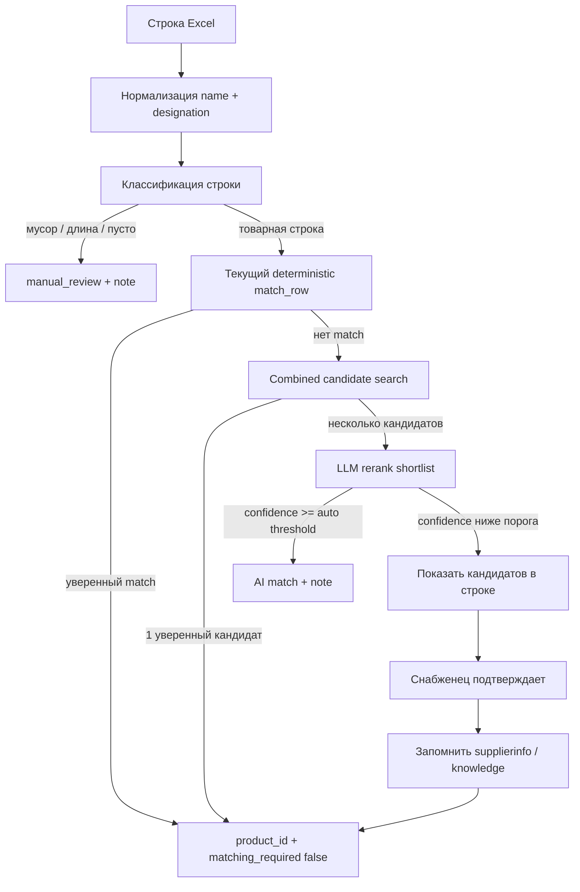

# Tasktracker: LLM-assisted сопоставление строк Excel при импорте требования

---
created: 2026-06-14
status: In Progress
scope: Odoo 19, `object_request`, `custom_product_search`, `ai_assistant`
related:
  - `docs/tasktrecker-comparison.md`
  - `OR/2026/06/0014`
  - `OR/2026/06/0016`
plan:
  - `docs/plans/2026-06-14-llm-matching-stages-7-11.md`
orchestration: orch-v2-stages-7-11
---

> **Этапы 7–11:** детальный план реализации создан в
> [`docs/plans/2026-06-14-llm-matching-stages-7-11.md`](plans/2026-06-14-llm-matching-stages-7-11.md)
> (оркестрация `orch-v2-stages-7-11`, 32 задачи, ID: PRV-*, SEC-*, MEM-*, REG-*, DOC-*)

## Контекст и цель

Предыдущая итерация `tasktrecker-comparison.md` улучшила детерминированный
поиск: нормализацию, поиск обозначения в названии товара, token-scoring и
память сопоставлений через `product.supplierinfo`. После проверки реальных
документов выявлен следующий уровень проблемы: в Excel для УУТЭ смысл строки
задаётся **парой полей**:

- `Наименование` — функциональное описание позиции;
- `Обозначение` — проектный код, ГОСТ, типоразмер, модель или фрагмент
  технического обозначения.

Эти поля нельзя надёжно сопоставлять по отдельности. Человек читает их вместе:

```text
Наименование: Кран муфтовый латунный Ду15 В-В
Обозначение:  11Б27п1
```

Текущий алгоритм сначала ищет `11Б27п1`, затем отдельно скорит
`Кран муфтовый латунный Ду15 В-В`, а не строит единую гипотезу по полной
строке потребности. В результате сложные строки остаются несопоставленными,
а старые ложные совпадения в уже импортированных документах не пересматриваются.

**Цель v2:** построить управляемый контур сопоставления, где:

- `name_raw` и `supplier_article` рассматриваются как единое описание
  потребности;
- детерминированный поиск формирует shortlist кандидатов;
- LLM используется только для ранжирования ограниченного списка кандидатов,
  а не для свободного выбора товара из каталога;
- автоматическая запись выполняется только при высокой уверенности;
- спорные случаи показываются снабженцу с объяснением и кнопкой подтверждения;
- подтверждённые решения пополняют память сопоставлений.

## Текущие наблюдения по production

### `OR/2026/06/0014`

- Файл: `Ленина 231 31-000_05-2025-УУТЭ.xlsx`.
- Строк: 29.
- Сопоставлено: 3.
- Из 3 сопоставлений 2 считаются ложными:
  - `Переход` + `80x50 ГОСТ 17378-2001` → `Переход 108-57 ст.`;
  - `Бобышка` + `Б.П.1.20Х1.5.40.1` → `Бобышка БП-5 М20х1,5 L=40`.
- После ручного запуска `action_rematch_lines` количество сопоставлений не
  изменилось.

Причина: действие пересопоставляет только строки, где
`matching_required = True` или не заполнен `product_id`. Уже сопоставленные
строки, даже если они ложные, не пересматриваются.

### `OR/2026/06/0016`

- Файл: `Группа цикуляционных насосов с регклапан Лазо, 136.xlsx`.
- Строк: 75.
- Сопоставлено: 4.
- Корректно сопоставились только позиции, где обозначение почти дословно
  входит в название товара: термометр, манометр, трёхходовой кран, бобышка.
- Большая часть строк содержит не полноценный артикул, а длину или размер:
  `L=0.13`, `21.3`, `30`, пустое обозначение.

Вывод: v2 должен не только улучшить поиск, но и классифицировать строки:
товарная позиция, размер/длина, крепёж/расходник без обозначения,
неоднозначная строка, кандидат для LLM.

## Границы задачи

### Входит

- Улучшение сопоставления строк `object.request.line` при Excel-импорте.
- Повторное сопоставление существующих документов.
- Объединённый поиск по `name_raw + supplier_article`.
- Shortlist кандидатов через `custom_product_search.ai_search_products`.
- LLM-rerank кандидатов с JSON-ответом и порогами уверенности.
- UI/серверные действия для:
  - пересопоставления всех строк;
  - пересопоставления только несопоставленных строк;
  - применения AI-подсказок;
  - подтверждения спорных кандидатов;
  - запоминания подтверждённого соответствия.
- Тесты, документация, changelog.

### Не входит в первую итерацию

- Полностью автономное создание новых товаров по строкам Excel.
- Полностью автономная замена товара без подтверждения пользователя.
- Обучение LLM на внутренних данных.
- Свободный поиск LLM по всему каталогу без shortlist.
- Автоматическое сопоставление строк вида `L=...` с трубами/металлом без
  отдельной модели интерпретации спецификаций.

## Архитектурное решение

### Общий pipeline



### Принцип безопасности

LLM не получает права создавать или выбирать произвольный товар. Она может
выбрать только один `product_id` из shortlist, подготовленного Odoo:

```json
{
  "line": {
    "name_raw": "Кран муфтовый латунный Ду15 В-В",
    "supplier_article": "11Б27п1"
  },
  "candidates": [
    {"product_id": 101, "display_name": "Кран латунный Ду15 В-В бабочка"},
    {"product_id": 102, "display_name": "Кран шаровый Ду15 В-В рычаг"}
  ]
}
```

Допустимый ответ:

```json
{
  "decision": "match",
  "product_id": 101,
  "confidence": 0.91,
  "reason": "Совпадают тип изделия, Ду15, латунный, В-В; обозначение 11Б27п1 отсутствует в карточке, но не противоречит кандидату."
}
```

Недопустимые ответы:

- `product_id`, которого нет в candidates;
- создание нового товара;
- выбор без `reason`;
- уверенность выше порога при явном конфликте типоразмера.

## Предлагаемые новые компоненты

### 1. `object.request.matching.candidate.service`

Сервисный слой для формирования кандидатов без LLM.

Ответственность:

- собрать `combined_query` из `name_raw` и `supplier_article`;
- нормализовать технические обозначения;
- отфильтровать строки, где LLM не нужен;
- вызвать `product.product.ai_search_products(combined_query, limit=N)`;
- добавить кандидатов из текущего `match_row`;
- посчитать локальный score;
- вернуть структурированный результат.

Предлагаемый контракт:

```python
{
    "line_type": "product|length|empty_article|ambiguous|manual_only",
    "combined_query": "...",
    "candidates": [
        {
            "product": product,
            "source": "supplierinfo|default_code|name_score|ai_search",
            "local_score": 0.82,
            "reason": "..."
        }
    ],
    "can_call_llm": True,
    "note": "..."
}
```

### 2. `object.request.llm.matching.service`

Сервис LLM-реранжирования кандидатов.

Ответственность:

- принимать только shortlist кандидатов;
- формировать компактный prompt;
- вызывать `OpenRouterClient.send_chat`;
- парсить JSON;
- валидировать, что выбранный `product_id` есть в shortlist;
- нормализовать `confidence`;
- возвращать результат без записи в БД.

Предлагаемый контракт:

```python
{
    "decision": "match|candidates|not_found|manual_review",
    "product": product_or_empty,
    "confidence": 0.0,
    "reason": "...",
    "candidate_product_ids": products,
    "raw_response": "...",
}
```

### 3. Поля в `object.request.line`

Предлагаемые поля:

- `ai_match_state`:
  - `not_requested`;
  - `candidate_found`;
  - `auto_matched`;
  - `needs_confirmation`;
  - `rejected`;
  - `error`.
- `ai_match_confidence` — Float.
- `ai_match_reason` — Text.
- `ai_candidate_product_ids` — Many2many `product.product`.
- `ai_suggested_product_id` — Many2one `product.product`.
- `matching_source`:
  - `manual`;
  - `supplierinfo`;
  - `default_code`;
  - `name_score`;
  - `combined_search`;
  - `llm_auto`;
  - `llm_confirmed`.

Минимальный вариант первой реализации: использовать уже существующее
`matching_note` для объяснения и добавить только `ai_candidate_product_ids`,
`ai_suggested_product_id`, `ai_match_confidence`.

### 4. Доработка `object.request.import.preview`

Preview импорта должен показывать не только `matched_product_id`, но и:

- top-3 кандидата;
- источник кандидата;
- confidence;
- краткое объяснение;
- признак «будет применено автоматически» / «нужно подтверждение».

## План работ

### Этап 0. Диагностика и фиксация базовой метрики

- [ ] Зафиксировать текущее состояние `OR/2026/06/0014`:
  - количество строк;
  - текущие `product_id`;
  - ложные сопоставления;
  - несопоставленные строки;
  - результат `action_rematch_lines`.
- [ ] Зафиксировать текущее состояние `OR/2026/06/0016`.
- [ ] Выгрузить набор эталонных строк из обоих документов в тестовые fixtures:
  - `name_raw`;
  - `supplier_article`;
  - ожидаемый `product_id` или причина отказа.
- [ ] Разделить fixtures на категории:
  - точное обозначение в названии товара;
  - короткое обозначение + информативное имя;
  - ГОСТ/типоразмер;
  - длина `L=...`;
  - пустое обозначение;
  - ложное историческое сопоставление.
- [ ] Проверить, какая версия `object_request` реально установлена на prod и
  был ли выполнен `-u object_request` после OBR-027.

### Этап 1. Исправить поведение пересопоставления

Проблема: `action_rematch_lines` не трогает уже сопоставленные строки.

- [x] Добавить отдельное действие `action_rematch_all_lines`.
- [x] В UI добавить кнопку «Пересопоставить все строки» рядом с текущей
  «Пересопоставить».
- [x] Для действия «все строки»:
  - пересматривать и сопоставленные, и несопоставленные строки;
  - не перезаписывать строки, где товар выбран вручную после импорта, если нет
    явного подтверждения; *(MVP: защита через `matching_source = manual`,
    wizard подтверждения ещё не реализован)*
  - очищать ложные старые совпадения, если новый алгоритм возвращает
    `manual_review`. *(MVP: очищается auto-match, если новый алгоритм не нашёл
    товар)*
- [ ] Добавить wizard-подтверждение:
  - сколько строк будет пересмотрено;
  - сколько строк уже имеют товар;
  - список строк-кандидатов на изменение;
  - предпросмотр старого и нового `product_id`, если новый match найден;
  - предупреждение, что результат может изменить `product_id`.
  - Текущее MVP использует только стандартный `confirm` на кнопке без
    детального предпросмотра.
- [x] В `matching_note` писать источник пересмотра:
  - `Пересопоставлено all-lines action, old product: ...`.
- [x] Заменить эвристику защиты ручного сопоставления через текст
  `matching_note` на явное поле `matching_source`.
- [x] Тесты:
  - обычное пересопоставление не трогает уже matched;
  - all-lines пересопоставление трогает matched;
  - ручной match защищён от перезаписи без контекста confirm.

### Этап 2. Единый запрос `name_raw + supplier_article`

Проблема: `match_row` ищет обозначение и имя каскадом, а не как единую
потребность.

- [x] Добавить метод `_combined_match_query(name_raw, supplier_article)`.
- [x] Правила сборки:
  - `name_raw` идёт первым;
  - `supplier_article` добавляется вторым;
  - пустые и мусорные артикулы не добавляются;
  - значения `L=...`, одиночные размеры и пустые обозначения не усиливают
    query;
  - дублирующиеся токены удаляются;
  - исходные поля сохраняются для prompt/объяснения.
- [x] Добавить `_classify_import_line(name_raw, supplier_article)`:
  - `product_candidate`;
  - `length_or_pipe_fragment`;
  - `fastener_without_article`; *(не выделен отдельным subtype в MVP)*
  - `empty_article`;
  - `manual_only`.
- [x] В `match_row` после текущего deterministic поиска добавить combined
  candidate search.
- [x] В качестве первого источника кандидатов использовать:
  `env["product.product"].ai_search_products(combined_query, limit=15)`.
- [x] Не принимать автоматически результат combined search, если:
  - кандидатов больше одного и локальный score близкий;
  - найден только общий класс товара без типоразмера;
  - строка классифицирована как `length_or_pipe_fragment`.
- [x] Тесты:
  - `Кран муфтовый латунный Ду15 В-В` + `11Б27п1` возвращает кандидатов;
  - `Переход` + `80x50 ГОСТ...` не выбирает случайный `Переход 108-57`;
  - `Бобышка` + `Б.П.1.20Х1.5.40.1` выбирает ОВЕН при наличии товара;
  - `L=0.13` не вызывает LLM и не создаёт кандидатов.

### Этап 3. Улучшить `custom_product_search` под технические обозначения

Текущая нормализация `custom_product_search` проще, чем нормализация
`object_request.excel.parser`.

- [x] Синхронизировать нормализацию:
  - `ё/е`;
  - `Ду 80`, `ДУ-80`, `dn 80` → `ду80` / `dn80`;
  - `Ру 16`, `РУ-16` → `ру16`;
  - `х/x/×` в размерах;
  - запятая/точка в десятичных размерах;
  - NBSP и повторные пробелы.
- [x] Вынести общую нормализацию в переиспользуемый helper или согласовать
  правила между модулями без циклической зависимости.
- [ ] Пересчитать `x_search_name` после обновления нормализации на prod.
  - Локальный `-u custom_product_search` выполнялся в тестовом контуре, но
    production recompute ещё не выполнялся.
  - Инструкция явного recompute добавлена в `docs/deploy.md`.
- [ ] Проверить trigram-индексы и производительность поиска.
- [ ] Тесты `custom_product_search`:
  - `М20х1,5` находит `М20×1,5`;
  - `Ду 80` и `ДУ-80` дают одинаковые результаты;
  - `11б27пм(М)2` не ломается токенизацией. *(не добавлен отдельный assert в
    MVP)*

### Этап 4. Shortlist кандидатов для LLM

- [x] Создать сервис `object.request.matching.candidate.service`.
- [x] Источники кандидатов:
  - supplierinfo;
  - default_code;
  - текущий name_score;
  - combined `ai_search_products`;
  - candidate hints из supplierinfo-конфликтов.
- [x] Дедуплицировать кандидатов по `product_id`.
- [x] Для каждого кандидата хранить:
  - `product_id`;
  - `display_name`;
  - `default_code`;
  - `uom_id`;
  - `source`;
  - `local_score`;
  - `matched_tokens`;
  - `missing_tokens`.
- [x] Ввести лимиты:
  - максимум 15 кандидатов на строку для внутреннего анализа;
  - максимум 8 кандидатов в LLM prompt;
  - максимум 3 кандидата в preview по умолчанию.
- [x] Добавить локальное правило авто-match без LLM:
  - один кандидат;
  - score выше `0.9`;
  - нет конфликтующих типоразмеров; *(MVP: через единственного кандидата и
    локальный score, без отдельного парсера размеров)*
  - нет признака `manual_only`.
- [x] Тесты:
  - shortlist стабилен по порядку;
  - нет дублей;
  - кандидаты содержат объяснимые источники;
  - при пустом shortlist LLM не вызывается.

### Этап 5. LLM-rerank кандидатов

- [x] Создать сервис `object.request.llm.matching.service`.
- [x] Использовать существующий `ai_assistant.services.openrouter_client.OpenRouterClient`
  (ленивый импорт внутри метода для избежания циклической зависимости).
- [x] Добавить системный prompt:
  - отвечай только JSON;
  - выбирай только из переданных candidates;
  - учитывай `name_raw` и `supplier_article` вместе;
  - не выбирай товар при конфликте диаметра, резьбы, Ду, Ру, размера, модели;
  - если уверенности нет, верни `manual_review`.
- [x] Схема ответа:

```json
{
  "decision": "match|manual_review|not_found",
  "product_id": 0,
  "confidence": 0.0,
  "reason": "string",
  "risk_flags": ["size_conflict", "generic_name"]
}
```

- [x] Валидировать ответ:
  - JSON парсится;
  - `decision` из allowlist;
  - `product_id` есть в shortlist;
  - `confidence` в диапазоне `0..1`;
  - при `risk_flags` из критического списка авто-match запрещён.
- [x] Пороговые значения:
  - `>= 0.90` — можно применить автоматически, если нет risk flags;
  - `0.70..0.89` — предложить снабженцу как подсказку;
  - `< 0.70` — оставить ручное сопоставление.
- [x] Обрабатывать ошибки:
  - нет API key;
  - timeout;
  - 429;
  - невалидный JSON;
  - модель недоступна.
- [x] Ошибки не должны ломать импорт: строка остаётся `matching_required`,
  причина пишется в `matching_note`. *(graceful fallback через `_error_result`)*
- [x] Тесты:
  - mock OpenRouter возвращает match;
  - mock возвращает несуществующий product_id → отказ;
  - mock возвращает invalid JSON → error state;
  - confidence ниже порога не пишет `product_id`.
  - дополнительно: critical risk_flag, timeout, not_found, markdown JSON, пустой shortlist.
  - `test_obr029_llm_matching.py` — 9 тестов, все зелёные.

### Этап 6. UI и действия пользователя

- [x] На форме `object.request` добавить кнопки:
  - «Пересопоставить несопоставленные»;
  - «Пересопоставить все строки»;
  - «Подобрать AI-кандидатов»;
  - «Применить уверенные AI-сопоставления».
- [x] На строках требования показать:
  - `ai_suggested_product_id`;
  - `ai_match_confidence`;
  - `ai_match_reason`;
  - `ai_candidate_product_ids`;
  - `matching_source`.
- [x] Добавить действие строки:
  - «Принять AI-кандидата»;
  - «Отклонить AI-кандидата»;
  - «Принять и запомнить».
- [ ] Для массового применения:
  - показывать wizard со списком строк и confidence;
  - MVP: используется confirm на кнопке без wizard-предпросмотра.
  - [x] применять только строки выше порога;
  - [x] спорные оставлять без изменения.
- [x] Для «Принять и запомнить»:
  - использовать существующий `action_remember_matching`;
  - если нет поставщика, используется текущая валидация
    `action_remember_matching` с `UserError`.
- [x] Тесты UI/actions:
  - снабженец видит кнопки;
  - прораб не может принять AI-кандидата;
  - массовое применение не трогает low-confidence строки.

### Этап 7. Preview импорта с кандидатами

- [x] Расширить `object.request.import.preview`.
- [x] Добавить поля:
  - `candidate_product_ids`;
  - `ai_suggested_product_id`;
  - `ai_match_confidence`;
  - `ai_match_reason`;
  - `matching_source`.
- [x] В wizard импорта добавить режим:
  - `Без AI` — только deterministic;
  - `AI-подсказки` — LLM формирует кандидатов, но не пишет product;
  - `AI-автоприменение уверенных` — применяет выше порога.
- [x] В validation message показывать:
  - сколько сопоставлено deterministic;
  - сколько предложено AI;
  - сколько будет применено автоматически;
  - сколько требует ручного сопоставления.
- [x] Тесты:
  - preview хранит кандидатов;
  - импорт переносит выбранный `matched_product_id`;
  - режим без AI не вызывает OpenRouter.

### Этап 8. Аудит, безопасность и стоимость

- [x] Логировать AI-сопоставления в chatter документа:
  - сколько строк отправлено;
  - сколько auto-match;
  - сколько manual_review;
  - модель;
  - tokens_used, если доступно.
- [x] Не логировать API key и полный prompt с потенциально чувствительными
  данными.
- [x] Добавить rate limit:
  - максимум строк за один запуск;
  - максимум LLM-вызовов в минуту;
  - batch size.
- [x] Добавить параметр `ir.config_parameter`:
  - `object_request.ai_matching_enabled`;
  - `object_request.ai_matching_auto_threshold`;
  - `object_request.ai_matching_suggest_threshold`;
  - `object_request.ai_matching_batch_size`.
- [x] При выключенном AI модуль должен работать как сейчас.
- [x] Тесты:
  - AI disabled → LLM не вызывается;
  - отсутствие ключа OpenRouter не ломает импорт;
  - ошибки пишутся в note.

### Этап 9. Память сопоставлений и накопление знаний

- [x] После подтверждения AI-кандидата предлагать:
  - «только принять в этой строке»;
  - «принять и запомнить для будущих импортов».
- [x] Для `supplierinfo`:
  - сохранять только реальные артикулы/обозначения;
  - не сохранять `L=...`, пустые значения, короткие размеры;
  - проверять конфликт с другим товаром.
- [x] Рассмотреть отдельную модель знания:
  - `object.request.matching.memory`;
  - поля: normalized name, normalized designation, product_id, confirmed_by,
    source_request_id, confidence, active.
- [x] Использовать memory до LLM:
  - если exact normalized pair уже подтверждена, применять без LLM;
  - если pair конфликтует, показывать candidates.
- [x] Тесты:
  - подтверждение создаёт memory;
  - повторный импорт применяет memory;
  - конфликт memory не авто-сопоставляется.

### Этап 10. Регрессия и контрольные прогоны

- [x] Unit-тесты:
  - `test_obr027_matching.py`; *(регрессия прошла)*
  - новый `test_obr028_combined_matching.py`; *(готово)*
  - новый `test_obr029_llm_matching.py`.
- [x] Wizard tests:
  - `test_obr007_import.py`; *(регрессия прошла)*
  - сценарии preview с AI.
- [x] Security tests:
  - права supply manager;
  - запрет применения AI-кандидата прорабом;
  - отсутствие записи без подтверждения.
- [x] Regression:
  - `test_obr006_wizard.py`;
  - `test_obr018_pilot_scenarios.py`;
  - `test_obr009_mass_actions.py`.
- [x] Команды:

```bash
docker exec odoo19-local odoo --test-enable --test-tags /object_request -u object_request -d odoo19_local --stop-after-init
docker exec odoo19-local odoo --test-enable --test-tags /custom_product_search -u custom_product_search -d odoo19_local --stop-after-init
docker exec odoo19-local python -m flake8 /mnt/extra-addons/object_request /mnt/extra-addons/custom_product_search /mnt/extra-addons/ai_assistant
```

  - Проверено для MVP: `/object_request`, `/custom_product_search`, flake8 по
    `object_request` и `custom_product_search`.

- [x] Контрольный прогон на `OR/2026/06/0014`:
  - до;
  - after deterministic combined;
  - after LLM suggestions;
  - after manual confirmation.
- [x] Контрольный прогон на `OR/2026/06/0016`.

### Этап 11. Документация и деплой

- [x] Обновить `docs/project.md`:
  - pipeline сопоставления v2;
  - LLM как rerank shortlist;
  - пороги confidence;
  - ограничения безопасности.
- [x] Обновить `docs/changelog.md`.
- [x] Обновить `docs/tasktracker.md` ссылкой на этот v2 tracker.
- [x] Подготовить инструкции деплоя:
  - `git pull`;
  - `docker compose restart/build`, если изменились зависимости;
  - `odoo -u custom_product_search,object_request,ai_assistant -d odoo19`;
  - явный пересчёт/проверка stored `x_search_name` после изменения
    нормализации;
  - проверка, что поиск по `Ду/Ру/DN/PN`, `М20х1,5` и `11б27пм(М)2`
    использует обновлённое значение `x_search_name`.
- [ ] После деплоя проверить:
  - параметры OpenRouter;
  - кнопки на форме требования;
  - `OR/2026/06/0014`;
  - `OR/2026/06/0016`.

## Приоритеты реализации

### MVP без LLM

Цель: быстро улучшить качество без внешних вызовов.

- [x] Этап 1: пересопоставить все строки.
- [x] Этап 2: combined query.
- [x] Этап 3: синхронизация нормализации `custom_product_search`.
- [x] Этап 4: shortlist candidates без LLM.

Ожидаемый эффект: часть строк будет получать кандидатов или уверенный match,
а ложные старые сопоставления можно будет пересмотреть.

### MVP с LLM

Цель: использовать LLM только там, где локальный поиск нашёл несколько
похожих кандидатов.

- [x] Этап 5: LLM-rerank.
- [ ] Этап 6: UI подтверждения.
- [ ] Этап 8: аудит и лимиты.

Ожидаемый эффект: сложные строки вида «наименование + короткое обозначение»
будут получать объяснимую подсказку.

### Production-ready

Цель: безопасная эксплуатация на реальных документах.

- [ ] Этап 7: preview импорта.
- [ ] Этап 9: память сопоставлений.
- [x] Этап 10: полный тестовый прогон. *(для затронутых модулей
  `object_request` и `custom_product_search`)*
- [ ] Этап 11: документация и деплой.

## Решения, которые нужно подтвердить перед реализацией

1. **Автоприменение LLM:** разрешаем ли автоматически ставить `product_id`
   при `confidence >= 0.90`, или LLM всегда только предлагает?
2. **Перезапись старых совпадений:** можно ли `action_rematch_all_lines`
   менять уже заполненный `product_id`, если старое сопоставление было
   автоматическим?
3. **Память:** достаточно ли `product.supplierinfo`, или нужна отдельная
   модель `object.request.matching.memory` для пары `name + designation`?
4. **Строки `L=...`:** оставляем полностью ручными или проектируем отдельную
   логику для труб/металла?
5. **Источник LLM:** используем только существующий OpenRouter из
   `ai_assistant` или добавляем настройки отдельно в `object_request`?

## Риски и митигации

| Риск | Вероятность | Влияние | Митигация |
|------|-------------|---------|-----------|
| LLM выберет неверный товар | Средняя | Высокое | shortlist only, validation product_id, confidence threshold, UI confirmation |
| Старые ложные совпадения останутся | Высокая | Среднее | `action_rematch_all_lines`, source tracking, note with old product |
| Рост стоимости OpenRouter | Средняя | Среднее | batch, thresholds, не вызывать LLM без candidates, cache/memory |
| Ошибка OpenRouter сломает импорт | Низкая | Высокое | graceful fallback, error state, no exception propagation to import |
| Слишком много кандидатов по общим словам | Высокая | Среднее | классификация строк, token filters, top-N, local score |
| Утечка данных в prompt | Низкая | Высокое | отправлять только строку потребности и product shortlist, не отправлять цены/контрагентов без необходимости |
| Регрессия обычного импорта | Средняя | Высокое | режим `AI disabled`, сохранение контракта `match_row`, regression tests |

## Метрики готовности

- [ ] `OR/2026/06/0014`: ложные строки 11 и 14 больше не считаются
  корректно сопоставленными без подтверждения.
  - MVP-поведение очистки ложного auto-match покрыто тестом.
- [ ] `OR/2026/06/0014`: термометр, манометр, трёхходовой кран и бобышка
  получают корректный match или AI-кандидата.
  - Combined candidates покрыты тестами, контрольный прогон на документе ещё
    не выполнялся.
- [ ] `OR/2026/06/0016`: строки с `L=...` классифицируются как
  `manual_review` без вызова LLM.
  - Классификация `L=...` покрыта тестом, контрольный прогон на документе ещё
    не выполнялся.
- [ ] Для строк с несколькими кандидатами UI показывает top-3 и объяснение.
- [ ] LLM не может выбрать товар вне shortlist.
- [ ] При выключенном `object_request.ai_matching_enabled` поведение импорта
  остаётся совместимым с текущим.
- [x] Все тесты `object_request`, `custom_product_search`, затронутые тесты
  `ai_assistant` проходят.
- [x] `flake8` проходит по изменённым модулям.
- [ ] `docs/project.md`, `docs/changelog.md`, `docs/tasktracker.md`
  обновлены после реализации.
  - `docs/changelog.md` и `docs/tasktracker.md` обновлены для MVP.

## Предлагаемый порядок коммитов

1. `feat(object_request): add all-lines rematch workflow`
2. `feat(object_request): add combined line candidate search`
3. `refactor(product_search): align technical normalization`
4. `feat(object_request): add llm matching rerank service`
5. `feat(object_request): show ai matching candidates in ui`
6. `test(object_request): cover combined and llm matching scenarios`
7. `docs(object_request): document llm-assisted matching workflow`

## Команды для разработки

```bash
docker compose -f docker-compose.local.yml up -d
docker exec odoo19-local odoo -u custom_product_search,object_request,ai_assistant -d odoo19_local --stop-after-init
docker exec odoo19-local odoo --test-enable --test-tags /object_request -u object_request -d odoo19_local --stop-after-init
docker exec odoo19-local python -m flake8 /mnt/extra-addons/object_request /mnt/extra-addons/custom_product_search /mnt/extra-addons/ai_assistant
```

## Итоговое направление

V2 не должен превращать LLM в «автономного снабженца». Правильная роль LLM:
объяснимый rerank уже найденных Odoo-кандидатов по полной строке Excel
`Наименование + Обозначение`. Автоматизация должна быть консервативной:
лучше оставить строку на ручное подтверждение, чем записать неверный товар
в требование на комплектацию.
