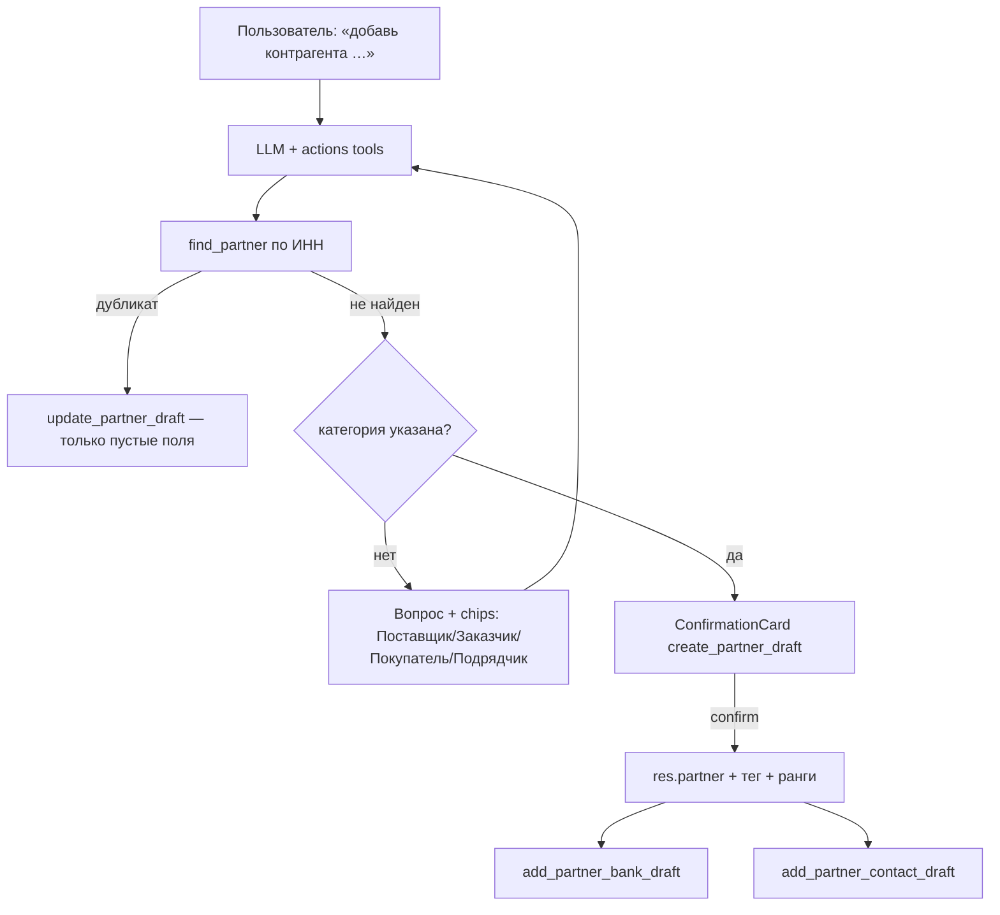

# Tasktracker: контрагенты через чат AI-ассистента v2 (`odoo-add-partner`)

**Создано:** 2026-06-12
**Статус:** CPV-001…CPV-012 выполнены; CPV-013 частично; CPV-014 не начата
**Модуль:** `custom_addons/ai_assistant`
**Связанные документы:**
- [`.cursor/skills/odoo-add-partner/SKILL.md`](../.cursor/skills/odoo-add-partner/SKILL.md) — канонический workflow
- [`tasktrecker-creat-partner.md`](tasktrecker-creat-partner.md) — v1 (`create_partner_draft` из счёта, CPP-001…015)
- [`tasktracker.md`](tasktracker.md) — сводный трекер задач проекта

---

## Контекст и проблема

Пользователь в чате ассистента пишет «добавь контрагента …» или «дополни данные ООО Ромашка: телефон …» —
ассистент должен распознать намерение и вести сценарий по правилам скилла `odoo-add-partner`:
дубликат по ИНН → уточнение категории → ConfirmationCard → создание/обновление `res.partner`
(+ тег, банковские реквизиты, контактные лица).

Текущее состояние (по аудиту архитектуры):

| Компонент | Состояние |
|---|---|
| `FindPartnerTool` (`read_tools.py`) | ✅ `role` (`any/supplier/customer`), обратная совместимость `is_supplier`, выдача `customer_rank`/`category_id`/`city` |
| `CreatePartnerDraftTool` (`write_tools.py`) | ✅ `category` (required enum), `ref`, `state_name`, страна РФ по умолчанию, ранги и тег через `PARTNER_CATEGORIES` |
| `UpdatePartnerDraftTool` | ✅ только пустые поля, `skipped_fields`, запрет смены `vat`, ранги 0→1, теги аддитивно |
| `AddPartnerBankDraftTool` | ✅ поиск/создание `res.bank` по БИК, дубликат счёта, `note` → `comment` |
| `AddPartnerContactDraftTool` | ✅ дочерний `res.partner`, дубликат по name+parent |
| Теги/банки/контакты через denylist | ✅ raw `category_id`/`bank_ids`/`child_ids` не принимаются executor |
| Правила контрагентов в промпте | ✅ блок в `_ACTIONS_RULES_BLOCK` (ИНН-первый поиск, вопрос категории, `[PARTNER_CATEGORY_REQUIRED]`) |
| Chips категорий | ✅ `_partner_category_suggestions` в `chat_controller.py` |
| Knowledge doc `partner_workflow.md` | ✅ создан, подключён в `index.json` (module `contacts`) |
| UI ConfirmationCard/ResultCard | ✅ labels, titles и order для 4 tools в `ai_chat_actions.js` |
| Тесты validators | ✅ `validate_partner_category`, `validate_bic`, `validate_acc_number`, `normalize_phone` |
| Тесты write tools | ✅ create с категорией, update пустых полей, запрет `vat`, bank + contact, idempotency, регистрация |
| Тест промпта (partner rules) | ✅ `test_actions_mode_requires_partner_before_products_and_po` |
| Тест security executor | ✅ `bank_ids`/`child_ids`/`category_id` не в schema новых tools |
| E2E чат-сценарий без счёта | ⚠️ только invoice-интент (`test_invoice_partner_intent_*`); «добавь контрагента» без счёта — нет |
| CPV-014 Документация | ❌ не начата |

---

## Принятые решения

| # | Решение | Выбор | Следствие |
|---|---------|-------|-----------|
| D1 | Denylist executor | **Не ослабляем** | Банки/теги/контакты — отдельные tools с плоскими валидируемыми параметрами, не сырые `bank_ids`/`child_ids`/`category_id` |
| D2 | Категория | Параметр-enum (`Поставщик`/`Заказчик`/`Покупатель`/`Подрядчик`) в create/update tools | Маппинг категория → ранги и тег централизован в `validators.py` |
| D3 | Многошаговость (вопрос о категории) | Текстовый ответ LLM + suggestion chips | Без отдельного state-store: LLM повторно вызывает tool уже с категорией |
| D4 | Update существующего | Только **пустые** поля; `vat` менять запрещено | Правило в коде tool, не в промпте |
| D5 | Подтверждение | Только через **ConfirmationCard** | Как в v1 (D4 CPP) |

---

## Целевой поток (после внедрения)

---

## Этап CPV-1. Backend — validators и tools

### Задача: CPV-001 — Справочник категорий и валидаторы в `validators.py`

- **Статус:** Выполнена
- **Приоритет:** Критический
- **Описание:** Единственный источник истины для категорий контрагентов и новые чистые проверки.
- **Шаги выполнения:**
  - [x] `PARTNER_CATEGORIES = {'Поставщик': {'supplier_rank': 1}, 'Заказчик': {'customer_rank': 1}, 'Покупатель': {'customer_rank': 1}, 'Подрядчик': {'supplier_rank': 1}}`
  - [x] `validate_partner_category(value)` — значение из списка, иначе `ValidationError`
  - [x] `get_or_create_partner_tag(env, category)` — поиск точного тега `res.partner.category`, создание при отсутствии
  - [x] `validate_bic(value)` — 9 цифр
  - [x] `validate_acc_number(value)` — 20 цифр
  - [x] `normalize_phone(value)` — мягкая нормализация `8XXX` → `+7 (XXX)`, без агрессивных правок
- **📁 Контекст:** `services/action_tools/validators.py` — `normalize_vat`, `infer_is_company` (образец)
- **Зависимости:** —
- **DoD:** Валидаторы написаны, без обращения к LLM/HTTP; flake8 чистый.

---

### Задача: CPV-002 — Расширить `CreatePartnerDraftTool` (категория, ref, регион)

- **Статус:** Выполнена
- **Приоритет:** Критический
- **Описание:** Категория — обязательный enum; убрать hardcode «только поставщик».
- **Шаги выполнения:**
  - [x] Новые поля схемы: `ref`, `category` (**required**, enum из 4 значений; несколько категорий — массив), `state_name` (регион, опционально)
  - [x] Ранги и тег выставлять из `category` через `PARTNER_CATEGORIES` (убрать hardcode `supplier_rank=1`)
  - [x] `country_id` = Россия по умолчанию при российском ИНН
  - [x] Описание tool: «Если пользователь не указал категорию — сначала спроси, не вызывай tool»
- **🚫 Запрещено:** ослаблять denylist executor; принимать `category_id` как сырое поле.
- **Зависимости:** CPV-001
- **DoD:** Создание контрагента любой из 4 категорий с корректными рангами и тегом; дубликат по ИНН отклоняется.

---

### Задача: CPV-003 — Новый `UpdatePartnerDraftTool` (`update_partner_draft`)

- **Статус:** Выполнена
- **Приоритет:** Критический
- **Описание:** Безопасное дополнение данных существующего контрагента.
- **Шаги выполнения:**
  - [x] Параметры: `partner_id` (required), опциональные поля как в create + `category`
  - [x] Обновлять только **пустые** поля записи; непустые возвращать как `skipped_fields`
  - [x] `category`: добавлять тег и поднимать ранг (0 → 1), **не обнуляя** прежние ранги и не удаляя теги
  - [x] Запрет смены `vat` (отдельное явное подтверждение — вне scope)
  - [x] Chatter note об изменении (кто, что, источник)
  - [x] `idempotency_key` = sha256(partner_id + sorted(values))
  - [x] Регистрация в `default_registry`, группа `ai_assistant.group_ai_assistant_supply`
- **🚫 Запрещено:** перезапись заполненных полей; `sudo()`; массовый `write`.
- **Зависимости:** CPV-001
- **DoD:** Заполненные поля не затираются; `skipped_fields` возвращается; смена `vat` отклоняется.

---

### Задача: CPV-004 — Новый `AddPartnerBankDraftTool` (`add_partner_bank_draft`)

- **Статус:** Выполнена
- **Приоритет:** Высокий
- **Описание:** Банковские реквизиты через отдельный tool, в обход сырого `bank_ids`.
- **Шаги выполнения:**
  - [x] Параметры: `partner_id`, `acc_number`, `bic`, `bank_name`, `acc_holder_name` (опц.), `note` (опц.)
  - [x] Поиск `res.bank` по БИК → создание при отсутствии → создание `res.partner.bank`
  - [x] Дубликат по `acc_number` у того же партнёра → `ValidationError`
  - [x] ЕКС/л/с/дата действия реквизитов из `note` — дописывать в `comment` партнёра
- **📁 Контекст:** пример данных — карточка Росреестра (казначейский счёт, ЕКС, л/с)
- **Зависимости:** CPV-001
- **DoD:** Счёт создаётся с привязкой к банку по БИК; дубликат счёта отклоняется.

---

### Задача: CPV-005 — Новый `AddPartnerContactDraftTool` (`add_partner_contact_draft`)

- **Статус:** Выполнена
- **Приоритет:** Высокий
- **Описание:** Контактные лица как дочерние `res.partner`, в обход сырого `child_ids`.
- **Шаги выполнения:**
  - [x] Параметры: `partner_id`, `name`, `function`, `phone`, `email` (опц.)
  - [x] Создание дочернего `res.partner` (`type='contact'`, `parent_id=partner_id`)
  - [x] Дубликат по `name` + `parent_id` → `ValidationError`
- **Зависимости:** CPV-001
- **DoD:** Контакт появляется в `child_ids` партнёра; дубликат отклоняется.

---

### Задача: CPV-006 — Доработать `FindPartnerTool` (роль, расширенная выдача)

- **Статус:** Выполнена
- **Приоритет:** Средний
- **Описание:** Поиск не только поставщиков; больше данных для решения о дубликате.
- **Шаги выполнения:**
  - [x] Параметр `role` (`any|supplier|customer`) вместо булевого `is_supplier`
  - [x] Обратная совместимость: `is_supplier` поддержать как alias
  - [x] В выдачу добавить `customer_rank`, `category_id` (имена тегов), `city`
- **Зависимости:** —
- **DoD:** Поиск заказчика по ИНН работает; существующие invoice-тесты зелёные.

---

## Этап CPV-2. Prompt, intent, knowledge

### Задача: CPV-007 — Блок правил контрагентов в `prompt_builder.py`

- **Статус:** Выполнена
- **Приоритет:** Критический
- **Описание:** Секция «Работа с контрагентами» в `_ACTIONS_RULES_BLOCK` (перенос правил скилла).
- **Шаги выполнения:**
  - [x] Перед созданием — всегда `find_partner` по ИНН; без ИНН не создавать (спросить)
  - [x] Найден дубликат → предложить `update_partner_draft`, только пустые поля
  - [x] Категория не указана → вопрос «К какой категории отнести: Поставщик, Заказчик, Покупатель, Подрядчик?», write tool не вызывать до ответа
  - [x] Банковские реквизиты — только через `add_partner_bank_draft` (запрет переноса в comment оставить только для сценария счёта)
  - [x] Контактные лица («по закупкам», «завхоз» и т.п.) — через `add_partner_contact_draft`
  - [x] КПП/ОГРН/ОКПО и пр. — в `comment`; ИНН — только в `vat`
  - [x] Явные опечатки в ФИО исправлять и сообщать; сомнительные телефоны уточнять
- **🚫 Запрещено:** раздувать системный промпт — детали выносить в knowledge doc (CPV-009).
- **Зависимости:** CPV-002, CPV-003
- **DoD:** Правила в actions-промпте; consult-режим не затронут.

---

### Задача: CPV-008 — Suggestion chips для выбора категории

- **Статус:** Выполнена
- **Приоритет:** Высокий
- **Описание:** Кликабельные варианты категории вместо ручного набора текста.
- **Шаги выполнения:**
  - [x] При вопросе о категории добавлять chips `Поставщик / Заказчик / Покупатель / Подрядчик` через `meta.suggestions`
  - [x] Реализация: контроллер детектит маркер вопроса о категории в ответе LLM (или LLM-правило: добавлять строку-маркер в конце)
  - [x] Клик по chip отправляет текст в чат (механизм `msg.suggestions` уже есть)
- **📁 Контекст:** `chat_controller.py`, `ai_chat_widget.xml` — `o_ai_suggested_chip`
- **Зависимости:** CPV-007
- **DoD:** После вопроса о категории в чате видны 4 chips; клик продолжает сценарий.

---

### Задача: CPV-009 — Knowledge doc `partner_workflow.md`

- **Статус:** Выполнена
- **Приоритет:** Средний
- **Описание:** Выжимка workflow для consult-режима (объяснение процесса без права на запись).
- **Шаги выполнения:**
  - [x] Новый `static/knowledge/docs/partner_workflow.md` — краткая выжимка правил скилла
  - [x] Подключить в `index.json` / module mapping (`contacts`)
- **Зависимости:** CPV-007
- **DoD:** В consult-режиме ассистент корректно объясняет порядок добавления контрагента.

---

## Этап CPV-3. Frontend и UX

### Задача: CPV-010 — ConfirmationCard / ResultCard для новых tools

- **Статус:** Выполнена
- **Приоритет:** Высокий
- **Описание:** Русские titles/labels и информативные карточки результата.
- **Шаги выполнения:**
  - [x] Titles: «Создать контрагента», «Обновить контрагента», «Добавить банковские реквизиты», «Добавить контактное лицо»
  - [x] Title для `create_partner_draft` зависит от категории («Создать заказчика» и т.д.)
  - [x] Русские labels полей новых tools в `ConfirmationCard`
  - [x] `ResultCard`: ссылка на карточку партнёра; для update — список обновлённых и пропущенных (`skipped_fields`) полей
- **📁 Контекст:** `static/src/js/ai_chat_actions.js`, `static/src/xml/ai_chat_widget.xml`
- **Зависимости:** CPV-002, CPV-003, CPV-004, CPV-005
- **DoD:** Полный сценарий в UI: вопрос категории → chips → ConfirmationCard → confirm → ResultCard со ссылкой.

---

## Этап CPV-4. Тесты

### Задача: CPV-011 — Unit-тесты validators и tools

- **Статус:** Выполнена
- **Приоритет:** Критический
- **Описание:** Покрытие новых валидаторов и инструментов.
- **Шаги выполнения:**
  - [x] `test_validators.py`: категории/ранги, `validate_bic`, `validate_acc_number`, `get_or_create_partner_tag`, `normalize_phone`
  - [x] `test_write_tools.py`: create с категорией (ранги+тег), update только пустых полей, запрет смены `vat`, bank tool (поиск/создание банка, дубликат счёта), contact tool, idempotency, ACL
  - [x] `test_read_tools.py`: `find_partner` с `role`, обратная совместимость `is_supplier`
- **Зависимости:** CPV-001…006
- **DoD:** Все новые тесты зелёные; существующие не сломаны.

---

### Задача: CPV-012 — Тесты промпта и безопасности executor

- **Статус:** Выполнена
- **Приоритет:** Высокий
- **Описание:** Правила в промпте и неприкосновенность denylist.
- **Шаги выполнения:**
  - [x] `test_prompt_builder.py`: блок правил контрагентов в actions-режиме
  - [x] `test_tool_executor_security.py`: denylist не ослаблен; новые tools проходят только через свои схемы
- **Зависимости:** CPV-007
- **DoD:** Попытка передать сырые `bank_ids`/`child_ids`/`category_id` через executor отклоняется.

---

### Задача: CPV-013 — E2E тест чат-сценария

- **Статус:** Частично выполнена
- **Приоритет:** Высокий
- **Описание:** Полный сценарий без счёта.
- **Шаги выполнения:**
  - [x] Invoice-интент: `test_invoice_partner_intent_returns_partner_confirmation`, `test_invoice_po_intent_requires_partner_first` — есть
  - [ ] `test_chat_controller.py`: интент «добавь контрагента» **без счёта** → вопрос о категории → chips → ConfirmationCard → confirm → ResultCard
  - [ ] Сценарий update: «дополни данные …» → `find_partner` → `update_partner_draft` → `skipped_fields` в ответе
- **Зависимости:** CPV-008, CPV-010, CPV-011
- **DoD:** E2E зелёный; запуск: `docker exec odoo19-local odoo --test-enable -u ai_assistant -d odoo19_local --stop-after-init`

---

## Этап CPV-5. Документация и синхронизация

### Задача: CPV-014 — Документация и синхронизация со скиллом

- **Статус:** Завершена
- **Приоритет:** Средний
- **Описание:** Актуализация проектной документации после реализации.
- **Шаги выполнения:**
  - [x] `docs/changelog.md` — запись о новых tools и workflow (добавлена ранее при завершении CPV-001…013)
  - [x] `docs/tasktracker.md` — этапы задачи отмечены завершёнными (CPV-1…CPV-5 `[x]`)
  - [x] `docs/project.md` — mermaid-диаграмма tools дополнена: `find_partner`, `create/update_partner_draft`, `add_partner_bank_draft`, `add_partner_contact_draft`, chips выбора категории
  - [x] `docs/ai-assistant-user-guide.md` — раздел «Контрагенты через чат» под 2.4 (добавлен ранее)
  - [x] Сверка скилла и `_ACTIONS_RULES_BLOCK`: расхождений нет; скилл — канонический источник (ИНН → категория → create/update; банк/контакт только через отдельные tools; update только пустые поля; ИНН не меняется)
- **Зависимости:** CPV-001…013
- **DoD:** Документация актуальна; правила скилла и промпта не расходятся.

---

## Рекомендуемый порядок инкрементов

| Инкремент | Задачи | Зависимости |
|---|---|---|
| 1 | CPV-001, CPV-006 | — |
| 2 | CPV-002, CPV-003 | CPV-001 |
| 3 | CPV-004, CPV-005 | CPV-001 |
| 4 | CPV-007, CPV-008, CPV-009 | CPV-002, CPV-003 |
| 5 | CPV-010 | CPV-002…005 |
| 6 | CPV-011, CPV-012, CPV-013 | CPV-001…010 |
| 7 | CPV-014 | все |

## Риски

- **Denylist executor**: новые tools не должны принимать сырые `bank_ids`/`child_ids`/`category_id` — только плоские валидируемые параметры (риск обхода безопасности при небрежной схеме).
- **Категория от LLM**: модель может «угадать» категорию вместо вопроса — закрепить в описании tool (required enum) и в правилах промпта; покрыть E2E-тестом (CPV-013).
- **Update затирает данные**: правило «только пустые поля» реализуется в tool (CPV-003), а не в промпте — промпт не граница безопасности.
- **Рост системного промпта**: блок правил держать компактным, детали — в knowledge doc (CPV-009).
