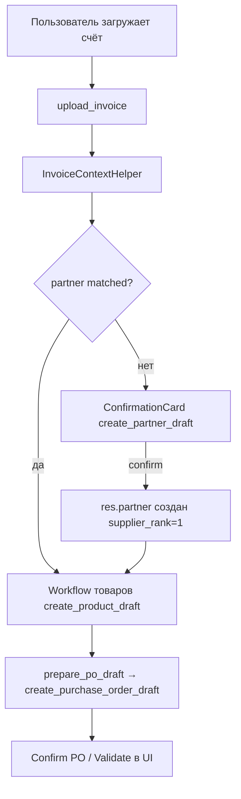

# Tasktracker: создание контрагента из счёта в AI-ассистенте (`create_partner_draft`)

**Создано:** 2026-06-11  
**Статус:** CPP-001 → CPP-004, CPP-006 → CPP-015 выполнены  
**Модуль:** `custom_addons/ai_assistant`  
**Связанные документы:**
- [`ai-assistant-user-guide.md`](ai-assistant-user-guide.md) — п. **П4** (перспектива)
- [`roadmap_ai_assistant_v3_invoice.md`](roadmap_ai_assistant_v3_invoice.md) — этап V3-10 (счёт → склад)
- [`tasktracker_ai_assistant_v3.md`](tasktracker_ai_assistant_v3.md) — AIA-054…060 (образец invoice workflow)
- [`.cursor/skills/odoo-supplier-from-invoice/SKILL.md`](../.cursor/skills/odoo-supplier-from-invoice/SKILL.md) — бизнес-правила полей `res.partner` (для MCP; переносим логику, не HTTP)

---

## Контекст и проблема

После загрузки счёта (`/ai_assistant/upload_invoice`) ассистент:

- распознаёт поставщика (`supplier.name`, `supplier.inn`, `supplier.kpp`, `supplier.address`);
- ищет его через `find_partner` / `InvoiceContextHelper`;
- при `partner.status == not_found` **не может** создать `res.partner`;
- при попытке PO выдаёт: *«Поставщик счёта не найден в Odoo. Создайте контрагента.»*

Для товаров уже есть зеркальный сценарий: `needs_create_product_draft` → `create_product_draft` → workflow в чате.  
Для контрагента — **пробела нет**.

**Цель:** закрыть пробел — пошаговое создание поставщика из данных счёта с подтверждением в UI чата, в том же стиле безопасности, что V3 actions.

---

## Принятые решения (черновик)

| # | Решение | Выбор | Следствие |
|---|---------|-------|-----------|
| D1 | Scope v1 | Только **создание** нового `res.partner` | Обновление существующего — фаза 2 (CPP-2xx) |
| D2 | Обязательное поле | **ИНН (`vat`)** обязателен | Без ИНН — отказ с понятным сообщением (нет проверки дубликата) |
| D3 | Порядок workflow | **Сначала поставщик → потом товары → потом PO** | Аналог жёсткого порядка товар→PO в invoice workflow |
| D4 | Подтверждение | Только через **ConfirmationCard** | Текстовое «да» не создаёт запись |
| D5 | Банковские реквизиты | **Не сохраняем** в `res.partner` v1 | Как в MCP-скилле; опционально `comment` с КПП |
| D6 | `is_company` | Эвристика по префиксу (ООО/ИП/…) | Портировать правила из odoo-supplier-from-invoice SKILL |
| D7 | Denylist | Без `unlink`, без массового `write` чужих полей | Только whitelist полей в tool schema |

---

## Целевой поток (после внедрения)



---

## Этап CPP-1. Анализ и проектирование

### Задача: CPP-001 — Аудит текущего invoice pipeline

- **Статус:** Выполнена
- **Приоритет:** Критический
- **Описание:** Зафиксировать точки интеграции и gap относительно `create_product_draft`.
- **Шаги выполнения:**
  - [x] Прочитать `invoice_context_helper.py` — блок `partner` (`matched` / `not_found` / `ambiguous`)
  - [x] Прочитать `invoice_workflow.py` — `_resolve_partner_id`, `prepare_po_draft`, порядок suggestions
  - [x] Прочитать `chat_controller.py` — `_dispatch_invoice_workflow`, `_message_intends_po`
  - [x] Сверить поля `supplier` в `invoice_parsing/extractor.py` с маппингом на `res.partner`
  - [x] Зафиксировать таблицу маппинга полей (см. CPP-002) в этом файле или в комментарии к tool
- **Зависимости:** —
- **DoD:** Таблица полей счёт → Odoo согласована; список файлов для изменения зафиксирован.

**Результат аудита CPP-001:**

| Файл | Фактическое поведение | Gap / точка интеграции |
|------|-----------------------|-------------------------|
| `services/invoice_context_helper.py` | `_match_supplier()` ищет supplier сначала по `supplier.inn`, затем по `supplier.name`; возвращает `matched`, `ambiguous` или `not_found` с `extracted_name` / `extracted_inn`. | Нет `needs_create_partner_draft`, `partner_error`, `partner_draft_args`; `supplier.kpp` и `supplier.address` не попадают в context. |
| `services/invoice_workflow.py` | Workflow умеет только товары и PO: `ACTION_NEXT_PRODUCT`, `ACTION_PREPARE_PO`; `prepare_po_draft()` сначала требует склад и готовность товаров, затем `_build_po_args()`. | `_resolve_partner_id()` признаёт только `partner.status == matched`; созданный в сессии partner не учитывается; при `not_found` выбрасывается `ValidationError` «Создайте контрагента» без UI-пути. |
| `controllers/chat_controller.py` | `_dispatch_invoice_workflow()` перехватывает PO-намерения и создаёт ConfirmationCard для `create_product_draft` / `create_purchase_order_draft`; `/ai_assistant/confirm` после `create_product_draft` пишет `created_by_line` в invoice-сессию. | Нет `_message_intends_partner()`, нет action `invoice_create_partner`, нет обработки `create_partner_draft` после confirm и записи `created_partner_id` в сессию. |
| `services/invoice_parsing/extractor.py` | `supplier` содержит `name`, `inn`, `kpp`, `address`, `bank.name`, `bank.bik`, `bank.account`, `bank.corr_account`; `name` строится через `extract_party_name()`, адрес извлекается простой regex-эвристикой. | Для v1 переносим только `name`, `inn`, `kpp`, `address`; банковские реквизиты намеренно не сохраняем в `res.partner`. |
| `services/action_tools/write_tools.py` | `CreateProductDraftTool` задаёт паттерн write-tool: строгая JSON Schema, `additionalProperties: False`, группа Supply, create без `sudo()`, chatter note, idempotency. | Добавить `CreatePartnerDraftTool` рядом с product-tool и зарегистрировать в `default_registry`. |
| `services/action_tools/validators.py` | Есть `validate_partner_is_supplier()` только для существующего партнёра в PO. | Добавить чистые проверки ИНН, уникальности и аргументов создания партнёра в CPP-004. |

**Файлы для следующих инкрементов:**

- `custom_addons/ai_assistant/services/action_tools/write_tools.py`
- `custom_addons/ai_assistant/services/action_tools/validators.py`
- `custom_addons/ai_assistant/services/action_tools/registry.py` (проверить, отдельная правка вероятно не нужна: регистрация уже через import side-effect)
- `custom_addons/ai_assistant/services/invoice_context_helper.py`
- `custom_addons/ai_assistant/services/invoice_workflow.py`
- `custom_addons/ai_assistant/services/invoice_extraction_store.py`
- `custom_addons/ai_assistant/controllers/chat_controller.py`
- `custom_addons/ai_assistant/services/prompt_builder.py`
- `custom_addons/ai_assistant/tests/test_write_tools.py`
- `custom_addons/ai_assistant/tests/test_validators.py`
- `custom_addons/ai_assistant/tests/test_invoice_context_helper.py`
- `custom_addons/ai_assistant/tests/test_invoice_workflow.py`
- `custom_addons/ai_assistant/tests/test_chat_controller.py`

---

### Задача: CPP-002 — Контракт write-tool `create_partner_draft`

- **Статус:** Выполнена
- **Приоритет:** Критический
- **Описание:** Спроектировать JSON Schema, idempotency, whitelist полей.
- **Шаги выполнения:**
  - [x] Имя tool: `create_partner_draft`
  - [x] **Required:** `name`, `vat` (ИНН, 10 или 12 цифр)
  - [x] **Optional:** `is_company`, `street`, `city`, `zip`, `phone`, `email`, `comment` (КПП/примечание)
  - [x] Всегда выставлять: `supplier_rank = 1`, `customer_rank = 0` (или не трогать customer)
  - [x] `idempotency_key` = SHA256(`vat` нормализованный)
  - [x] Pre-check: дубликат по `vat` → `ValidationError` с id существующей записи
  - [x] Запрет полей: `user_ids`, `category_id`, `property_*`, `child_ids`, `bank_ids`, `state`, `company_id`
  - [x] Группа: `ai_assistant.group_ai_assistant_supply`
- **📁 Контекст:**
  - `services/action_tools/write_tools.py` — `CreateProductDraftTool`
  - `services/action_tools/validators.py` — `validate_partner_is_supplier`
  - `.cursor/skills/odoo-supplier-from-invoice/SKILL.md` — §2, §5а
- **🚫 Запрещено:** создание без ИНН; `sudo()`; обновление существующего партнёра в v1.
- **Зависимости:** CPP-001
- **DoD:** Schema и правила записаны; ревью согласовано.

**Маппинг полей (целевой):**

| Источник (счёт) | Поле Odoo `res.partner` | Примечание |
|-----------------|-------------------------|------------|
| `supplier.name` | `name` | `extract_party_name` |
| `supplier.inn` | `vat` | обязательно |
| `supplier.kpp` | `comment` или `l10n_ru_*` | v1: строка в `comment` «КПП: …» |
| `supplier.address` | `street` / парсинг city, zip | v1: весь адрес в `street`, парсинг — опционально CPP-2xx |
| префикс названия | `is_company` | ООО/АО → True, ИП → False |
| — | `supplier_rank` | `1` |

**Контракт `create_partner_draft` (финальный для CPP-003/004):**

```python
class CreatePartnerDraftTool(AbstractWriteTool):
    name = 'create_partner_draft'
    description = (
        'Создать поставщика res.partner из реквизитов счёта. '
        'Только новая запись, без обновления существующих контрагентов.'
    )
    required_groups = ['ai_assistant.group_ai_assistant_supply']
    parameters_schema = {
        'type': 'object',
        'properties': {
            'name': {'type': 'string', 'minLength': 1},
            'vat': {
                'type': 'string',
                'pattern': r'^\\D*\\d(?:\\D*\\d){9}(?:(?:\\D*\\d){2})?\\D*$',
            },
            'is_company': {'type': ['boolean', 'null']},
            'street': {'type': ['string', 'null']},
            'city': {'type': ['string', 'null']},
            'zip': {'type': ['string', 'null']},
            'phone': {'type': ['string', 'null']},
            'email': {'type': ['string', 'null']},
            'comment': {'type': ['string', 'null']},
        },
        'required': ['name', 'vat'],
        'additionalProperties': False,
    }
```

**Правила выполнения tool:**

| Шаг | Правило |
|-----|---------|
| Валидация прав | `_ensure_tool_required_groups(self, env)`; без `sudo()`. |
| Нормализация ИНН | `normalize_vat()` оставляет только цифры; допустима длина 10 или 12. |
| Обязательность ИНН | Пустой или некорректный `vat` → `ValidationError('Укажите ИНН поставщика: 10 или 12 цифр.')`. |
| Дубликат | `env['res.partner'].search([('vat', '=', vat)], limit=1)` до create; если найден → `ValidationError('Контрагент с таким ИНН уже существует: ID %s, %s.' % (...))`. |
| Whitelist write | В `create(vals)` попадают только `name`, `vat`, `is_company`, `street`, `city`, `zip`, `phone`, `email`, `comment`, `supplier_rank`, `customer_rank`. |
| Запрещённые поля | Schema не принимает лишние поля; отдельно не добавлять в vals `user_ids`, `category_id`, `property_*`, `child_ids`, `bank_ids`, `state`, `company_id`. |
| `is_company` | Если arg не передан, вычислить `infer_is_company(name)`: ООО/АО/ЗАО/ПАО/ОАО/МУП/ГУП → `True`; ИП или ФИО без организационного префикса → `False`. |
| КПП | `supplier.kpp` передавать как `comment='КПП: <kpp>'`; если `comment` уже задан, не дублировать пустой КПП. |
| Адрес | В v1 весь `supplier.address` передавать в `street`; `city`/`zip` только если уже явно распарсены будущим кодом. |
| Ранги | Создавать с `supplier_rank: 1`, `customer_rank: 0`. Если риск регрессии customer-ранга подтвердится на реализации, допустимо не передавать `customer_rank`, но не выставлять его > 0. |
| Chatter | `partner.message_post(body='Создано AI-ассистентом по запросу %s, источник: счёт.' % env.user.name, message_type='notification', subtype_xmlid='mail.mt_note')`. |
| Возврат | `{'partner_id': partner.id, 'name': partner.display_name, 'vat': partner.vat, 'url': '/odoo/res.partner/%s' % partner.id}`. |
| Idempotency | `hashlib.sha256(normalize_vat(args.get('vat')).encode('utf-8')).hexdigest()`. |

**Интеграционный контракт с invoice workflow:**

- `InvoiceContextHelper.build_partner_draft_args(invoice_data)` должен формировать args по таблице маппинга и не включать банковские реквизиты.
- При `partner.status == not_found` и валидном ИНН context должен получить `needs_create_partner_draft: true` и `partner_draft_args`.
- При отсутствии/ошибке ИНН context должен получить `needs_create_partner_draft: false`, `partner_error: 'inn_required'`; tool не вызывается.
- `InvoiceWorkflow` должен хранить созданный partner в invoice session как `created_partner_id`; `_resolve_partner_id()` должен учитывать его после `matched`.
- `chat_controller` должен создавать pending action только через ConfirmationCard; текстовое «да» не должно выполнять `create_partner_draft`.

---

## Этап CPP-2. Backend — tool и валидаторы

### Задача: CPP-003 — `CreatePartnerDraftTool` в `write_tools.py`

- **Статус:** Выполнена
- **Приоритет:** Критический
- **Описание:** Реализовать write-tool по контракту CPP-002.
- **Шаги выполнения:**
  - [x] Класс `CreatePartnerDraftTool(AbstractWriteTool)`
  - [x] `execute()`: валидация ИНН, проверка дубликата, `env['res.partner'].create(vals)`
  - [x] `message_post` на partner: «Создано AI-ассистентом по запросу …, источник: счёт»
  - [x] Возврат: `partner_id`, `name`, `vat`, `url` (`/odoo/res.partner/<id>`)
  - [x] Регистрация в `default_registry`
  - [x] Добавить в denylist executor проверку, что tool не в обход registry
- **Зависимости:** CPP-002
- **DoD:** Tool вызывается через `ToolExecutor` после confirm; ACL соблюдается.

---

### Задача: CPP-004 — Валидаторы партнёра

- **Статус:** Выполнена
- **Приоритет:** Высокий
- **Описание:** Вынести чистые проверки в `validators.py`.
- **Шаги выполнения:**
  - [x] `normalize_vat(inn: str) -> str` — только цифры, длина 10/12
  - [x] `validate_vat_unique(env, vat) -> None | existing_id`
  - [x] `infer_is_company(name: str) -> bool`
  - [x] `validate_partner_create_args(args) -> list[str]` — ошибки для tool
  - [x] Unit-тесты валидаторов (ИП, ООО, дубликат ИНН, пустой ИНН)
- **Зависимости:** CPP-002
- **DoD:** Валидаторы покрыты тестами; flake8 чистый на новых файлах.

---

### Задача: CPP-005 — Парсинг адреса (опционально v1.1)

- **Статус:** Выполнена
- **Приоритет:** Низкий
- **Описание:** Разбить `supplier.address` на `street` / `city` / `zip` простыми эвристиками.
- **Шаги выполнения:**
  - [x] `services/invoice_parsing/address_utils.py` или метод в `invoice_context_helper`
  - [x] Regex индекса `^\d{6}`, «г. …», «ул. …»
  - [x] Fallback: весь текст в `street`
- **Зависимости:** CPP-001
- **DoD:** На 3+ реальных счетах адрес разбирается без регрессий.
- **Примечание:** можно отложить после CPP-010; v1 допускает только `street`.

---

## Этап CPP-3. Invoice workflow и контроллер

### Задача: CPP-006 — Расширить `InvoiceContextHelper`

- **Статус:** Выполнена
- **Приоритет:** Критический
- **Описание:** Флаги и args для создания партнёра из счёта.
- **Шаги выполнения:**
  - [x] В `_match_supplier` добавить `needs_create_partner_draft: true` при `not_found` и непустом ИНН
  - [x] При отсутствии ИНН: `needs_create_partner_draft: false`, `partner_error: 'inn_required'`
  - [x] Метод `build_partner_draft_args(invoice_data) -> dict` для tool
  - [x] Обновить `build_context_message` — правило: сначала partner, потом товары
- **Зависимости:** CPP-002, CPP-004
- **DoD:** INVOICE_CONTEXT содержит `needs_create_partner_draft` и готовые args.

---

### Задача: CPP-007 — Расширить `InvoiceWorkflow`

- **Статус:** Выполнена
- **Приоритет:** Критический
- **Описание:** Пошаговый сценарий: поставщик → товары → PO.
- **Шаги выполнения:**
  - [x] Константа `ACTION_CREATE_PARTNER = 'invoice_create_partner'`
  - [x] `partner_ready(uid, token) -> bool` — matched или создан в сессии
  - [x] `record_partner_created(uid, token, partner_id)` в session store
  - [x] `next_partner_draft(uid, token)` — args для ConfirmationCard
  - [x] `suggestions_after_upload` / обновить chips: «Создать поставщика из счёта»
  - [x] `prepare_po_draft`: если partner не ready → статус `partner_incomplete` + suggestion
  - [x] Убрать голый `ValidationError` без UI-пути — заменить на guided flow
- **Зависимости:** CPP-006
- **DoD:** Полный happy-path: not_found → confirm partner → товары → PO.

---

### Задача: CPP-008 — `chat_controller`: перехват намерений

- **Статус:** Выполнена
- **Приоритет:** Высокий
- **Описание:** Роутинг фраз и workflow actions до LLM (как для товаров/PO).
- **Шаги выполнения:**
  - [x] `_message_intends_partner(message)` — «добавь поставщика», «создай контрагента», «занеси в базу»
  - [x] В `_dispatch_invoice_workflow`: обработка `invoice_workflow_action == ACTION_CREATE_PARTNER`
  - [x] Перехват: если partner не ready и пользователь просит PO/склад — сначала partner card
  - [x] В `/ai_assistant/confirm`: после `create_partner_draft` — обновить session, вернуть suggestions (следующий шаг: товар или PO)
  - [x] Передавать `extraction_token` в metadata pending action
- **📁 Контекст:** `chat_controller.py` — образец `create_product_draft` + confirm handler
- **Зависимости:** CPP-007
- **DoD:** Фраза «добавь поставщика в базу» после upload не уходит в пустой LLM-ответ.

---

### Задача: CPP-009 — Промпт и правила actions

- **Статус:** Выполнена
- **Приоритет:** Средний
- **Описание:** Обновить `_ACTIONS_RULES_BLOCK` в `prompt_builder.py`.
- **Шаги выполнения:**
  - [x] Правило §8: при `needs_create_partner_draft` — только `create_partner_draft`, не PO
  - [x] Запрет вызывать `create_purchase_order_draft` пока `partner_id` не resolved
  - [x] Упоминание: банковские реквизиты из счёта не переносить
  - [x] Тесты `test_prompt_builder.py` — новые правила в system prompt
- **Зависимости:** CPP-006
- **DoD:** Промпт отражает порядок partner → product → PO.

---

## Этап CPP-4. Frontend и UX

### Задача: CPP-010 — Chips, ConfirmationCard, ResultCard

- **Статус:** Выполнена
- **Приоритет:** Высокий
- **Описание:** UI чата для создания партнёра.
- **Шаги выполнения:**
  - [x] Chip после upload: «Создать поставщика: ООО …» (если `not_found`)
  - [x] ConfirmationCard: поля name, ИНН, is_company, адрес (read-only preview из счёта)
  - [x] ResultCard: ссылка на карточку контрагента + `next_hint` («Теперь создайте товары…»)
  - [x] `_next_steps('create_partner_draft')` в `chat_controller` (если используется)
  - [x] Проверить рендер многострочной сводки (warnings + partner hint)
- **📁 Контекст:** `static/src/js/ai_chat_boot.js`, `ai_chat_widget.xml`
- **Зависимости:** CPP-008
- **DoD:** Пользователь проходит сценарий только кнопками чата.

---

## Этап CPP-5. Тесты и приёмка

### Задача: CPP-011 — Unit-тесты write-tool и валидаторов

- **Статус:** Выполнена
- **Приоритет:** Высокий
- **Шаги выполнения:**
  - [x] `tests/test_write_tools.py` — happy-case `create_partner_draft`
  - [x] Отказ: дубликат ИНН, пустой ИНН, не-supply группа
  - [x] `tests/test_invoice_context_helper.py` — `needs_create_partner_draft`
  - [x] `tests/test_invoice_workflow.py` — partner before PO
- **Зависимости:** CPP-003, CPP-007
- **DoD:** `docker exec odoo19-local odoo --test-enable --test-tags /ai_assistant -d odoo19_local --stop-after-init` — 0 failed.

---

### Задача: CPP-012 — E2E: счёт с неизвестным поставщиком → partner → PO draft

- **Статус:** Выполнена
- **Приоритет:** Высокий
- **Описание:** Сквозной тест по образцу `test_e2e_nf504_invoice_to_po.py`.
- **Шаги выполнения:**
  - [x] Фикстура: нормализованный счёт с `supplier.inn` без записи в `res.partner`
  - [x] Цепочка: `InvoiceContextHelper` → `create_partner_draft` → `create_product_draft` (если нужно) → `create_purchase_order_draft`
  - [x] Assert: `partner_id` на PO, `supplier_rank > 0`, state=draft
- **Зависимости:** CPP-011
- **DoD:** E2E зелёный на локальной БД.

---

### Задача: CPP-013 — Ручной пилот на prod/stage

- **Статус:** Выполнена локально; prod smoke — в CPP-015
- **Приоритет:** Средний
- **Шаги выполнения:**
  - [x] Сценарий: счёт «Метиз Комплект» / ДВ Партнёр — поставщик не в базе
  - [x] Загрузка → создание partner → товары → PO draft
  - [x] Зафиксировать результат в `docs/pilot_results_v3.md` (раздел Partner draft)
- **Зависимости:** CPP-012, деплой на stage/prod
- **DoD:** Чеклист пилота подписан; нет обхода confirm.

---

## Этап CPP-6. Документация и деплой

### Задача: CPP-014 — Обновить пользовательскую и техдокументацию

- **Статус:** Выполнена
- **Шаги выполнения:**
  - [x] `docs/ai-assistant-user-guide.md` — перенести П4 из «перспектива» в «реализовано»
  - [x] `docs/roadmap_ai_assistant_v3_invoice.md` — §gap + целевой поток
  - [x] `docs/changelog.md` — запись о `create_partner_draft`
  - [x] `docs/tasktracker_ai_assistant_v3.md` — строка AIA-061 (ссылка на этот файл)
  - [x] Отметить `[x]` в этом tasktracker по завершении каждой задачи
- **Зависимости:** CPP-012
- **DoD:** Документация соответствует коду.

---

### Задача: CPP-015 — Деплой prod

- **Статус:** Выполнена
- **Шаги выполнения:**
  - [x] `git push` → на VPS `git pull`
  - [x] `docker exec odoo odoo -c /etc/odoo/odoo.conf -d odoo19 -u ai_assistant --stop-after-init`
  - [x] `docker compose restart odoo`
  - [x] Smoke: upload счёта + «добавь поставщика в базу»
- **Зависимости:** CPP-013, CPP-014
- **DoD:** Prod smoke OK.

---

## Фаза 2 (backlog) — обновление существующего контрагента

| ID | Задача | Описание |
|----|--------|----------|
| CPP-201 | `update_partner_draft` | Дополнить пустые поля у matched partner (телефон, адрес) с confirm |
| CPP-202 | ambiguous partner | UI выбора из candidates при нескольких совпадениях по имени |
| CPP-203 | Банк / `res.partner.bank` | Отдельный tool или ручной ввод (вне v1 по D5) |

---

## Критерии готовности (релиз v1)

- [x] После загрузки счёта с неизвестным ИНН ассистент предлагает создать поставщика **до** товаров и PO.
- [x] `create_partner_draft` работает только с ConfirmationCard и группой Supply.
- [x] Дубликат по ИНН блокируется с сообщением и ссылкой на существующую запись.
- [x] PO draft создаётся с `partner_id` нового поставщика.
- [x] Denylist не нарушен (`res.users`, `button_*`, vendor bill).
- [x] Тесты `/ai_assistant` зелёные; flake8 на изменённых файлах.
- [x] `docs/changelog.md` и user guide обновлены.

---

## Риски и контроль

| Риск | Контроль |
|------|----------|
| ИНН не извлечён из PDF | Явный `partner_error`; не создавать «пустого» контрагента |
| Одинаковый ИНН, разное название | Только exact match по `vat`; fuzzy — фаза 2 |
| LLM обходит workflow | Перехват в `_dispatch_invoice_workflow` до LLM (как для PO) |
| `l10n_ru` поля КПП | v1 — `comment`; уточнить модуль локализации позже |
| Права на `res.partner` | Группа supply + тест отказа для обычного пользователя |

---

## Рекомендуемый порядок инкрементов

```text
Инкремент 1 (контракт):     CPP-001 → CPP-002
Инкремент 2 (tool):         CPP-003 → CPP-004 → CPP-011 (частично)
Инкремент 3 (workflow):     CPP-006 → CPP-007 → CPP-008 → CPP-009
Инкремент 4 (UI):           CPP-010
Инкремент 5 (E2E + релиз):  CPP-012 → CPP-013 → CPP-014 → CPP-015
Опционально:                CPP-005 (адрес)
```

---

## Команды проверки

```bash
# Локально
docker exec odoo19-local python -m flake8 \
  /mnt/extra-addons/ai_assistant/services/action_tools/write_tools.py \
  /mnt/extra-addons/ai_assistant/services/invoice_workflow.py \
  /mnt/extra-addons/ai_assistant/controllers/chat_controller.py

docker exec odoo19-local odoo --test-enable --test-tags /ai_assistant \
  -d odoo19_local --stop-after-init --http-port=8071

# Prod (после CPP-015)
ssh ubuntu@<vps> 'cd /opt/project_odoo && git pull && \
  docker exec odoo odoo -c /etc/odoo/odoo.conf -d odoo19 -u ai_assistant --stop-after-init && \
  docker compose restart odoo'
```

---

## Сводная таблица задач

| ID | Название | Этап | Приоритет | Статус | Зависит от |
|----|----------|------|-----------|--------|------------|
| CPP-001 | Аудит invoice pipeline | CPP-1 | Критический | ✅ | — |
| CPP-002 | Контракт create_partner_draft | CPP-1 | Критический | ✅ | CPP-001 |
| CPP-003 | Write-tool | CPP-2 | Критический | ✅ | CPP-002 |
| CPP-004 | Валидаторы | CPP-2 | Высокий | ✅ | CPP-002 |
| CPP-005 | Парсинг адреса | CPP-2 | Низкий | ✅ | CPP-001 |
| CPP-006 | InvoiceContextHelper | CPP-3 | Критический | ✅ | CPP-002, CPP-004 |
| CPP-007 | InvoiceWorkflow | CPP-3 | Критический | ✅ | CPP-006 |
| CPP-008 | chat_controller | CPP-3 | Высокий | ✅ | CPP-007 |
| CPP-009 | prompt_builder | CPP-3 | Средний | ✅ | CPP-006 |
| CPP-010 | Frontend UX | CPP-4 | Высокий | ✅ | CPP-008 |
| CPP-011 | Unit-тесты | CPP-5 | Высокий | ✅ | CPP-003, CPP-007 |
| CPP-012 | E2E тест | CPP-5 | Высокий | ✅ | CPP-011 |
| CPP-013 | Пилот prod/stage | CPP-5 | Средний | ✅ | CPP-012 |
| CPP-014 | Документация | CPP-6 | Средний | ✅ | CPP-012 |
| CPP-015 | Деплой prod | CPP-6 | Средний | ✅ | CPP-013, CPP-014 |
